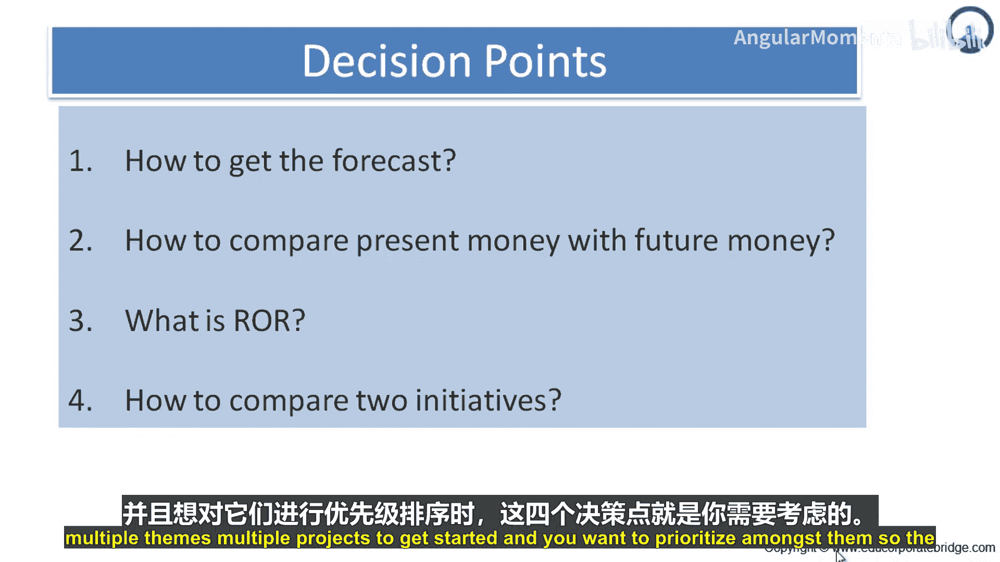
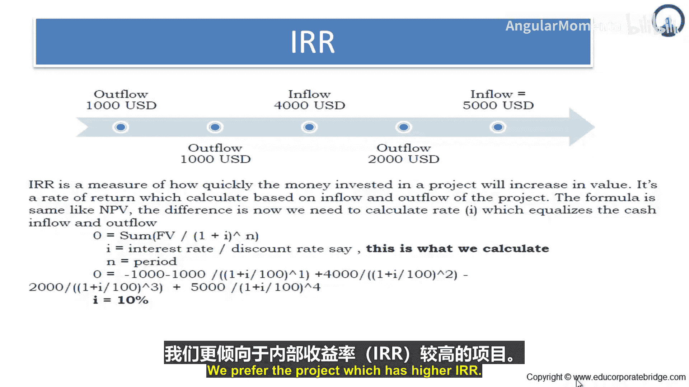
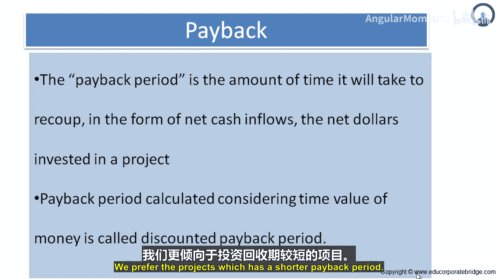
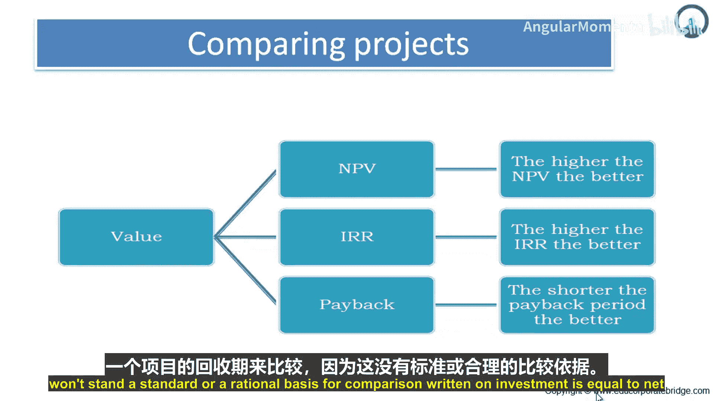
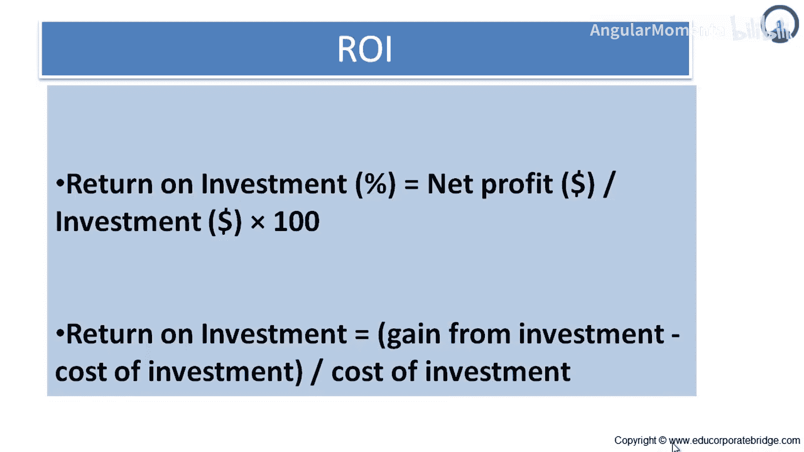

# 042：内部收益率、净现值与投资回收期 💰

在本节课中，我们将学习在多个项目或主题中进行优先级排序时，用于评估和比较投资价值的三个核心财务决策工具：净现值、内部收益率和投资回收期。理解这些概念能帮助我们更理性地决定将资源投入何处。

## 货币的时间价值 ⏳

上一节我们介绍了项目优先级决策的四个关键点，本节中我们来看看第一个基础概念：货币的时间价值。要决定未来一笔钱在今天的价值，我们需要思考：今天需要在银行存入多少钱，才能在将来增长到那个目标金额。

今天需要投资的金额，以便在未来获得一个已知的数额，这被称为**现值**。

*   **简单案例**：如果我的资金能获得10%的收益，并且我希望一年后拥有1000元，那么我今天需要投资910元。换句话说，在10%的利率下，910元就是一年后1000元的现值。
*   如果我的资金能获得20%的收益，那么我今天只需要投资约830元。

将未来金额折算回现值的过程被称为**贴现**。显然，用于贴现未来金额的利率对于确定未来金额的现值至关重要。组织用来贴现未来资金的利率被称为其**机会成本**，它反映了为进行此项投资而放弃的其他投资的回报率。

无论是个人还是组织，我们都有多种投资机会。组织可以将资金投入银行、股票、房地产，或者投资于各种项目。如果一个组织过去项目的典型回报率是20%，那么新项目就应该以同样的20%为标准进行评估。该组织20%的机会成本意味着，投资新项目就等于放弃了其他能带来20%回报的投资机会。

## 净现值 📊

理解了现值，我们就可以引入净现值了。净现值衡量的是一个项目预期能带来多少以今日现值计算的回报。它是项目所有现金流入和流出以现值形式计算的总和。

要确定净现值，需要将一系列未来价值的每个项目的现值相加。其公式如下：

**公式：**
`NPV = Σ [F / (1 + i)^n]`
其中：
*   `F` = 未来价值
*   `i` = 利率（贴现率）
*   `n` = 期数

例如，如果未来一笔钱是4000卢比，在10%的利率下，其净现值约为3309卢比。

使用净现值来比较和确定优先级，其优势在于计算简单且易于理解。然而，净现值的一个主要缺点是：比较两个不同现金流项目的价值可能会产生误导。

假设我们需要在两个项目间选择：
*   项目A需要巨额前期投资，净现值为10万。
*   项目B只需要少量前期投资，净现值也为10万。

显然，我们更倾向于投资那个占用现金更少但净现值相同的项目。因此，我们真正需要的是能以百分比形式表达项目回报率的方法，以便直接比较。我们通常偏好净现值更高的项目。

## 内部收益率 📈

内部收益率衡量的是投入项目的资金价值增长的速度。它计算的是使项目现金流入现值总和等于现金流出现值总和的贴现率。

其计算公式与净现值相同，区别在于我们需要计算的是那个使现金流入和流出相等的利率 `i`。

**公式（求解 `i` ）：**
`0 = Σ [F / (1 + IRR)^n]`
其中 `IRR` 即为内部收益率。

内部收益率提供了以百分比形式表达项目回报率的方法。如果说净现值衡量的是项目预期能带来多少绝对金额的回报，那么内部收益率衡量的就是投资增值的速度。通过内部收益率，我们可以更直接地比较不同项目。我们通常偏好内部收益率更高的项目。

## 投资回收期 ⏱️

除了将现金流视为一个现值总额或一个利率，我们还可以从另一个角度看待它：收回初始投资所需的时间。这被称为**投资回收期**。

投资回收期是指以项目产生的净现金流入形式，收回净投资额所需的时间长度。考虑货币时间价值的投资回收期计算，被称为**贴现投资回收期**。

我们通常偏好投资回收期更短的项目。

## 项目比较与总结 ✅

综上所述，在基于价值比较项目时，我们有三个参数：

以下是三个核心评估指标的比较准则：

*   **净现值**：选择净现值最高的项目更好。
*   **内部收益率**：选择内部收益率更高的项目更好。
*   **投资回收期**：选择投资回收期更短的项目更好。

**重要提示**：比较项目时应使用相同的参数。不要用一个项目的净现值去和另一个项目的投资回收期比较，因为这缺乏统一或理性的比较基础。

此外，**投资回报率**也是一个相关指标，其公式为：
`ROI = (净利润 / 投资成本) × 100%`
它指示了你的投资以何种速度回收成本并转化为现金。

本节课中，我们一起学习了净现值、内部收益率和投资回收期这三个关键财务工具。它们从不同角度（总回报额、回报速度、回本时间）帮助我们量化项目价值，是在资源有限情况下进行科学优先级排序的重要依据。