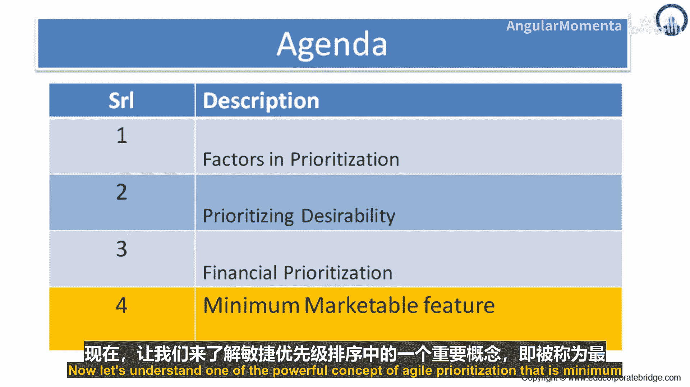
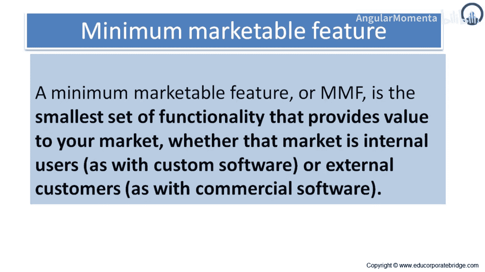

敏捷实践：从思维模式出发的应用、评估与优化：04_02_01：最小可市场化特性 (MMF) 🎯

在本节中，我们将学习敏捷优先级排序中的一个强大概念——**最小可市场化特性**。我们将了解它的定义、核心属性以及它在产品开发中的实际应用。

---

### 概述

最小可市场化特性是敏捷开发中的一个关键概念，它帮助我们聚焦于为用户提供价值的最小功能单元。理解并应用这一概念，能有效提升产品交付的效率与市场响应速度。

---

### 什么是 MMF？

现在，我们来理解敏捷优先级排序中的一个强大概念，即**最小可市场化特性**。

一个最小可市场化特性，是能够为你的市场提供价值的最小功能集合。无论这个市场是使用定制软件的内部用户，还是使用商业软件的外部客户，它都是为了让客户感知到价值而必须实现的最小功能集。

MMF 由三个核心属性定义：**最小**、**可市场化**和**特性**。

*   **特性**：指用户或市场自身能感知为有价值的东西。
*   **可市场化**：意味着它能为客户提供显著价值。这种价值可能包括：**收入增长**、**成本节约**、**竞争优势**、**品牌形象提升**或**客户体验增强**。

一个**发布版本**，就是一系列可以在同一时间框架内一起交付的 MMF 的集合。

---

### 如何确定 MMF 的边界？

上一节我们定义了 MMF，本节中我们来看看如何在实际操作中确定一个功能是否达到了 MMF 的标准。

首先，理解“最小”这个概念。如果拆分一个功能会导致其故事无法向客户进行市场推广，那么就不应该进行拆分。为了帮助做出这个决策，可以始终问一个问题：**“这个功能是否值得在向客户介绍新版本功能的假想邮件中，拥有自己的一个要点？”** 如果答案是否定的，那么就不要拆分它。

MMF 仅规定了在我们开始着手开发时，期望的功能规模。

---

### MMF 的演进过程

了解了 MMF 的判定标准后，我们来看看它在产品待办事项列表中的动态演进过程。

通常，MMF 是一系列更大特性的“后代”。随着这些特性在待办事项列表中优先级上升、重要性增加，我们将其分解以提供更多细节。

例如，一个名为“地理标记照片”的特性，是“照片分享”特性的后代。而“照片分享”又是“iPhone 客户端”特性的后代。“iPhone 客户端”则是最初“移动端支持”特性的后代。像“移动端支持”、“iPhone 客户端”和“照片分享”这些高层级特性可能已不在待办事项列表中，但它们的数十个“后代”特性（即具体的 MMF）仍在。这就是一个特性的演进过程，其中增加更多细节是自然有机的。

---

### 总结

本节课中，我们一起学习了**最小可市场化特性**。我们明确了 MMF 是能为市场提供价值的最小功能单元，它具备“最小”、“可市场化”和“特性”三个属性。我们学会了通过“是否值得单独宣传”来判定功能拆分的边界，并理解了 MMF 如何从宏观特性中逐步细化、演进而来。掌握 MMF 有助于团队聚焦核心价值，实现快速、有效的产品迭代。