敏捷实践：04_02_02：最小可市场化特性（MMF）详解 🎯

在本节课中，我们将要学习敏捷开发中的一个核心概念——最小可市场化特性（Minimum Marketable Feature， 简称MMF）。我们将探讨其定义、构成要素、与用户故事的区别，以及它在实际工作流中的应用。

---

### 什么是MMF？🤔

最小可市场化特性（MMF）是指一个**最小的、完整的、可发布的产品功能单元**。它必须能为客户提供明确的价值，并且能够独立推向市场。

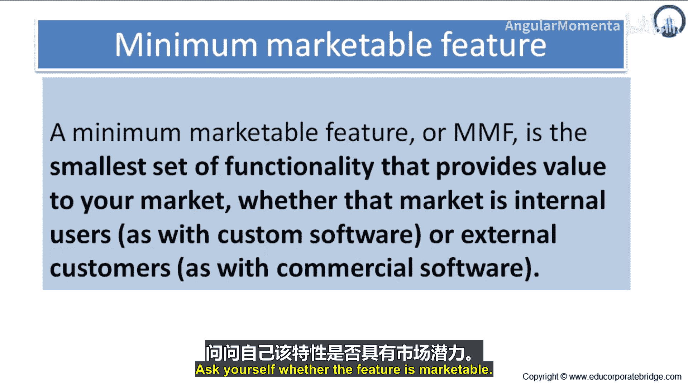

上一节我们介绍了敏捷思维，本节中我们来看看如何将这种思维落实到具体的、可交付的特性上。

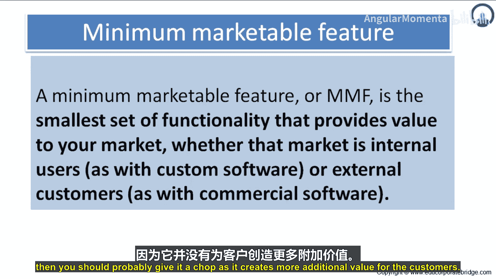

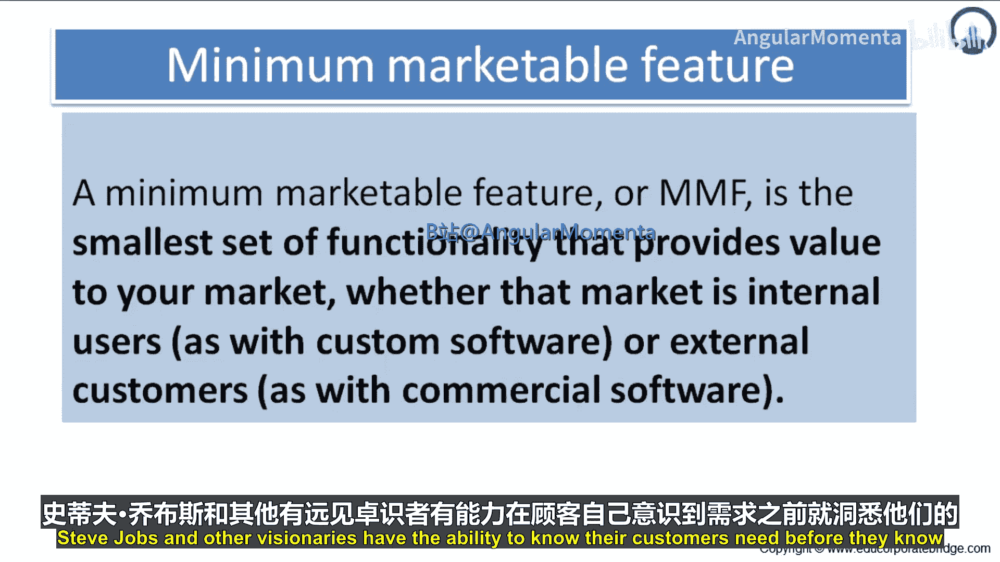

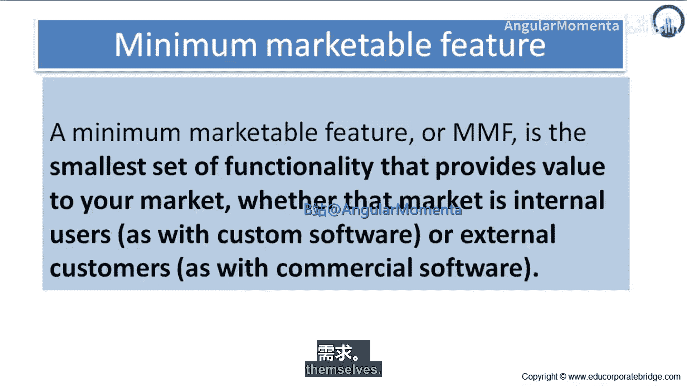

---

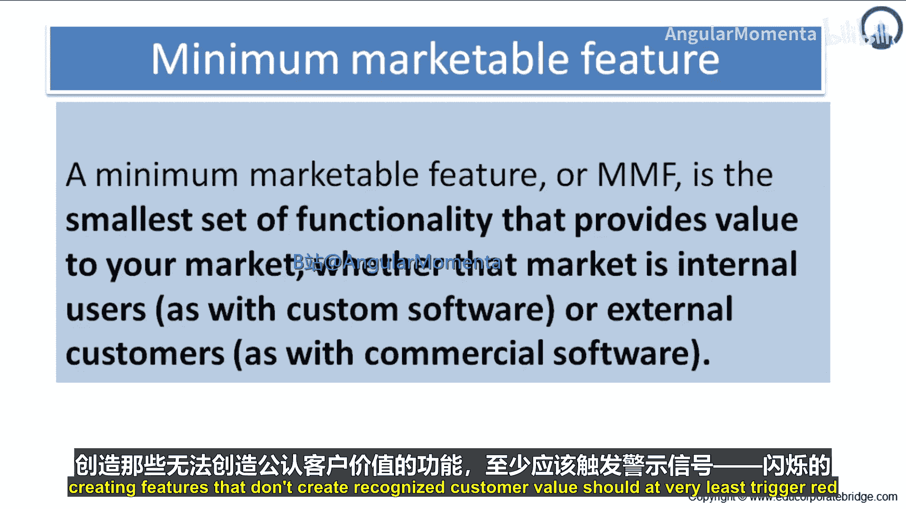

### MMF的三大构成要素 🔑

一个合格的MMF必须同时满足以下三个条件：

#### 1. 最小化（Minimum）
它必须是实现某个客户目标所需的最小功能集合。这意味着它不包含任何多余或“锦上添花”的部分。

**核心公式**：`MMF = 实现核心客户价值的最小功能集`

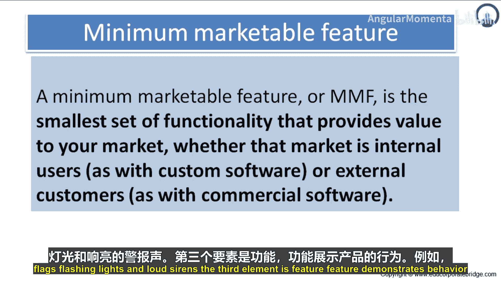

#### 2. 市场化（Marketable）
该特性必须能为客户创造可感知的价值，并值得单独发布。你需要问自己：“这个特性有市场价值吗？”如果答案是否定的，那么它很可能不应该作为一个MMF存在，因为它没有为客户创造额外价值。

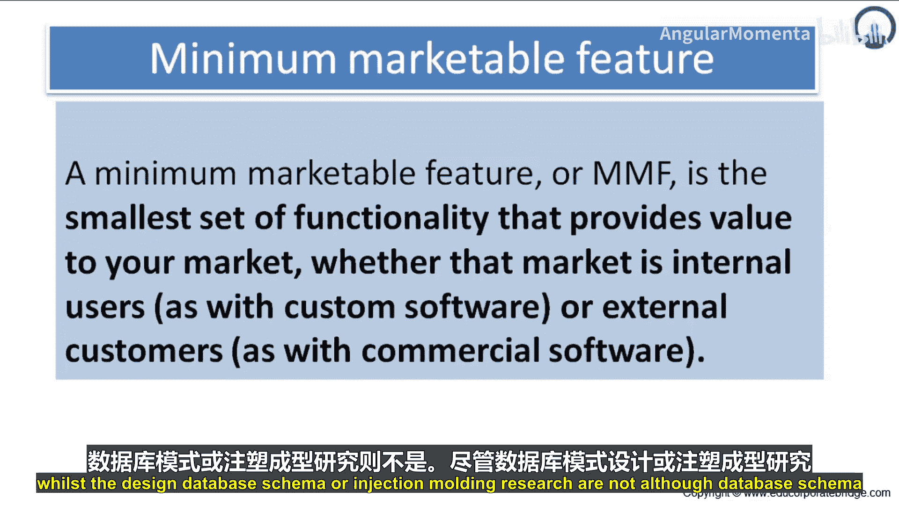

像史蒂夫·乔布斯这样的远见者或许能在客户意识到之前就洞悉其需求。但对于我们大多数人而言，开发一个不被客户认可价值的特性，至少应该引起我们的高度警惕。

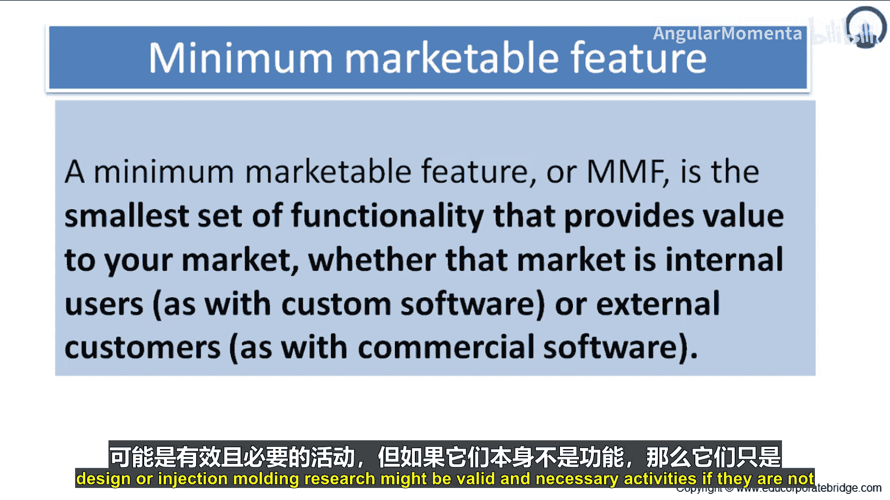

#### 3. 特性（Feature）
它必须展示产品的**外在行为**，是客户能够看到、使用并感知的东西。

以下是符合“特性”定义的例子：
*   购物车
*   3.5毫米耳机插孔

以下是不符合“特性”定义的例子（它们可能是实现特性所必需的活动，但其本身不是特性）：
*   设计数据库架构
*   注塑成型研究

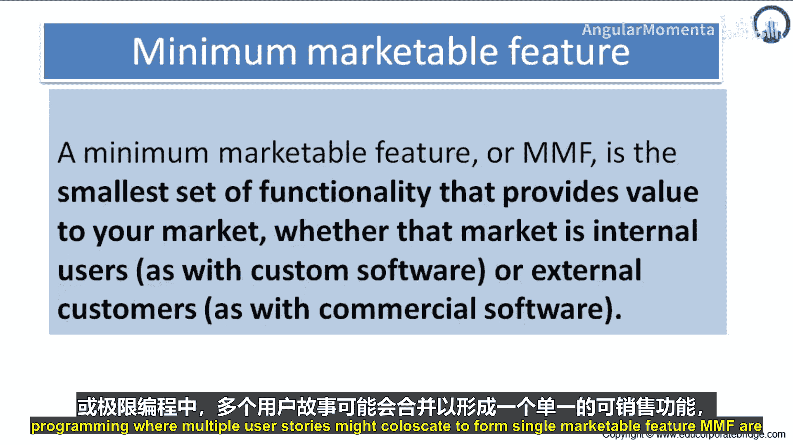

---

### MMF与用户故事的区别 📖

MMF与Scrum或极限编程中典型的用户故事有所不同。

*   **用户故事**通常较小，是开发团队的工作单元。多个用户故事可能共同构成一个MMF。
*   **MMF**的规模则稍大一些，它**不会**再被分解成更小的特性，但其本身已足够独立发布。通常，每完成一个MMF就可以进行一次产品发布。

一个MMF可以用一个用户故事的格式来描述：**`作为一个 <用户角色>， 我想要 <某个功能>， 以便于 <达成某种价值>`**。

在使用MMF时，团队不会将这个用户故事拆分成更小的故事。可以这样思考：将所有共享**同一个“以便于”**（即相同商业价值）的用户故事聚集起来，就构成了你的一个MMF。

---

### MMF的工作流程 🔄

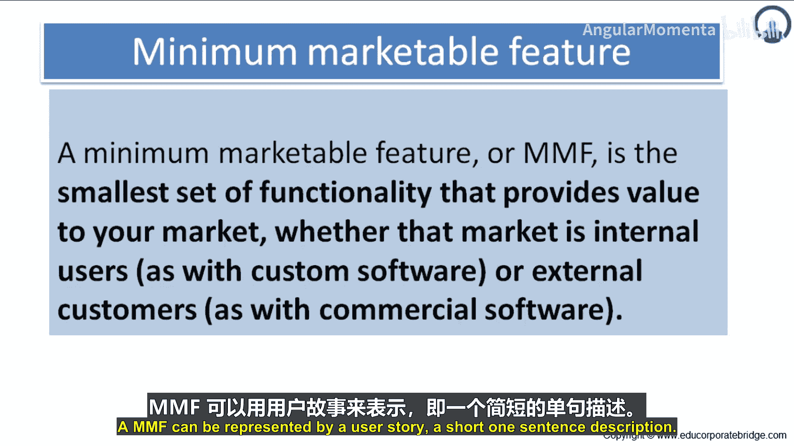

MMF工作流程是开发过程中面向客户的部分。我们在这一领域的工作变革对客户产生了最大的影响，并获得了积极的反馈。

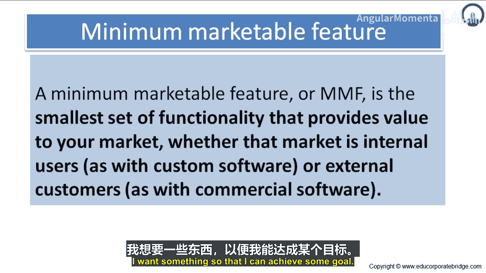

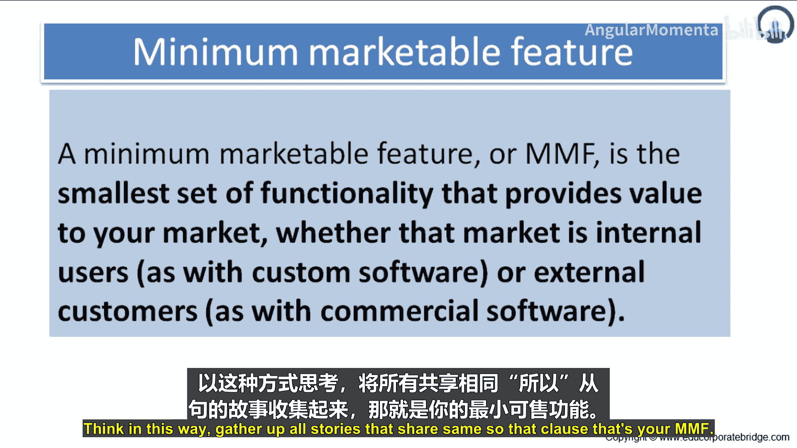

它使我们能够：
1.  将客户与具体的**技术实现**隔离开来。
2.  让客户始终保持对**应用程序行为**的关注。

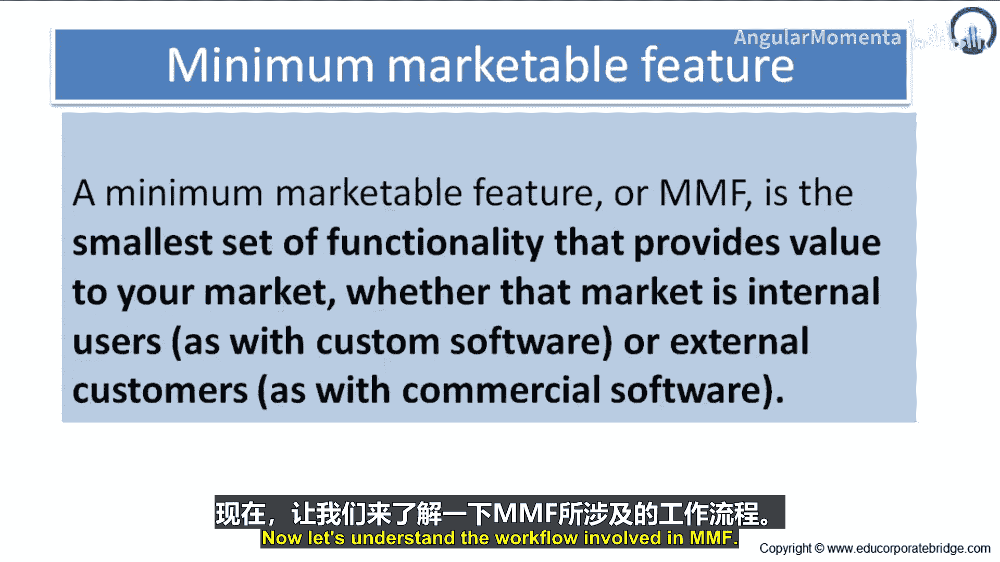

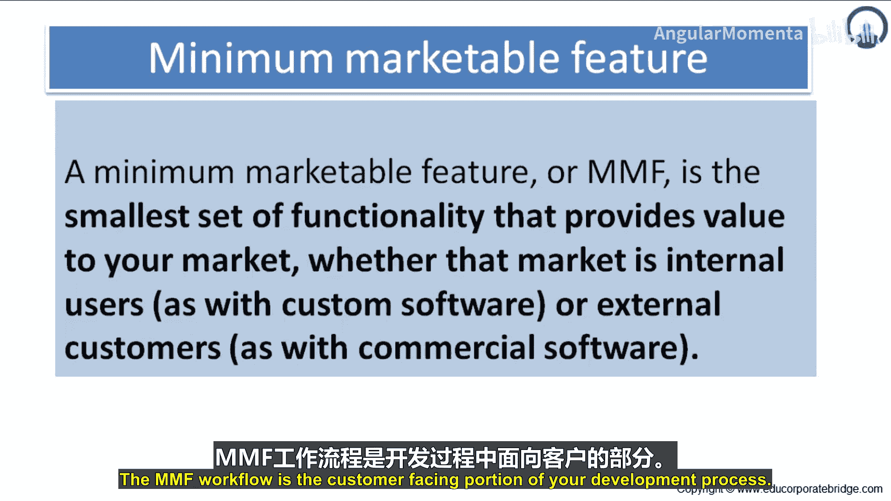

对于我们的大多数客户而言，向精益开发流程的转型是他们首次接触任何类型的敏捷环境，因此这一流程的设计清晰易懂至关重要。

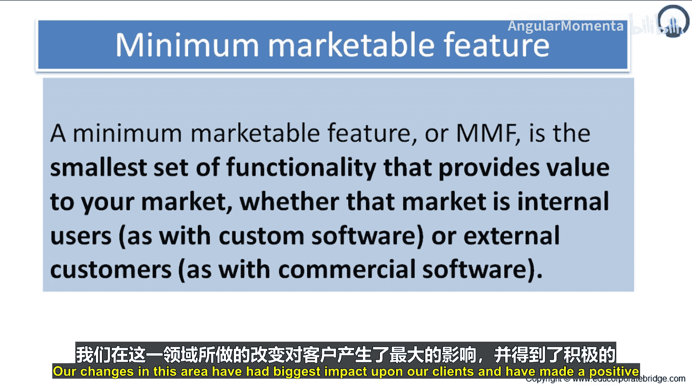

---

### 总结 📝

本节课中我们一起学习了最小可市场化特性（MMF）。我们明确了MMF是**最小、可独立发布、为客户提供价值**的功能单元，它由**最小化、市场化、特性**三个要素构成。MMF比用户故事规模更大，且通常对应一次发布。通过采用MMF工作流，团队可以更专注于为客户交付可感知的价值，并有效管理产品开发过程。

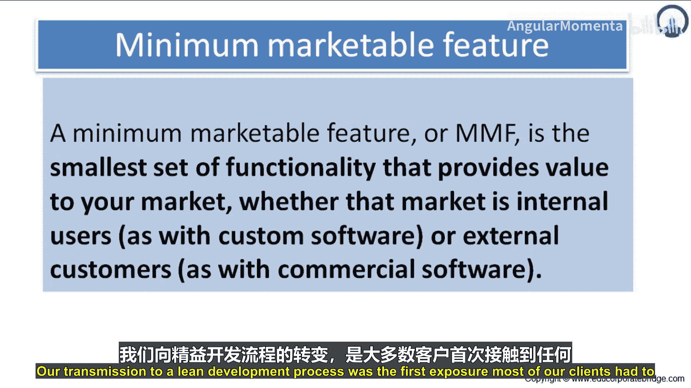

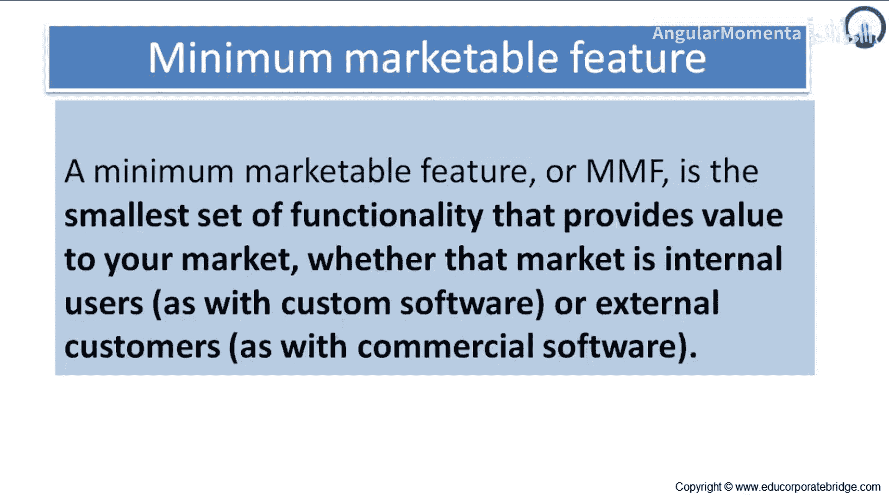

理解并应用MMF，能帮助团队避免开发无用功能，确保每一次迭代都能产出切实的市场价值。