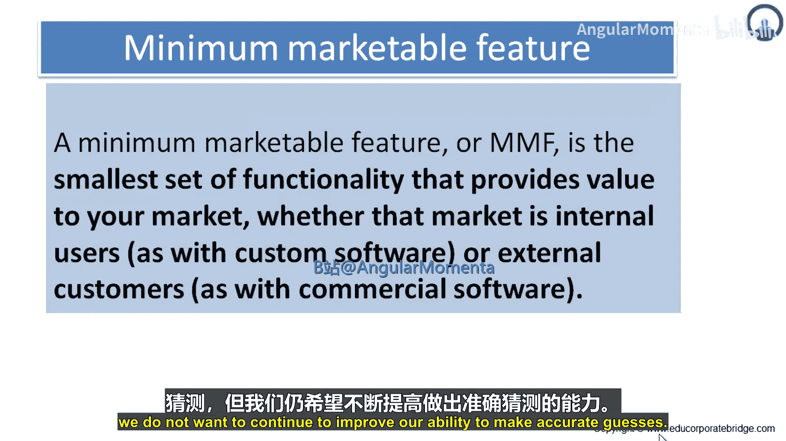
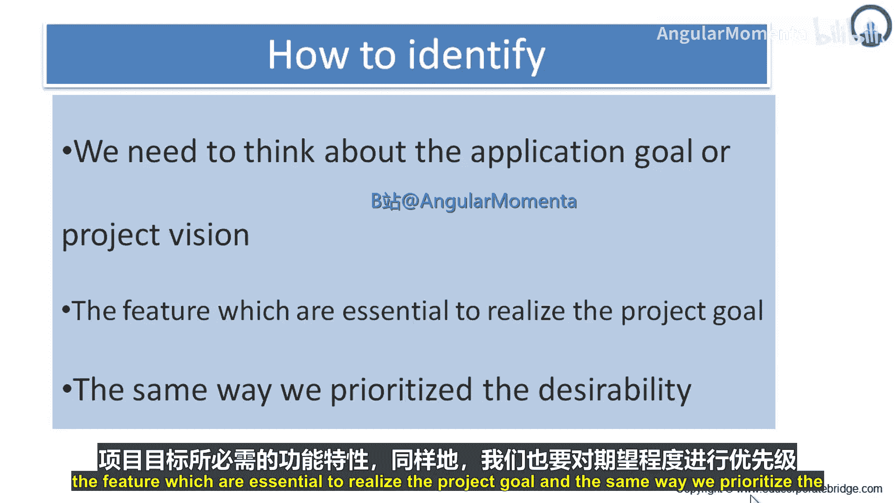
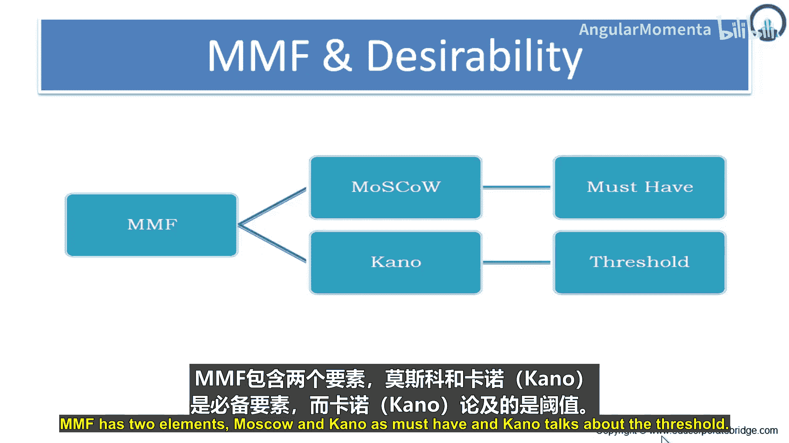
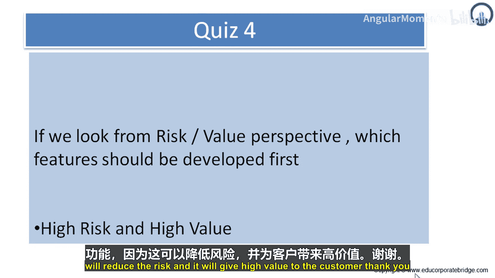

敏捷实践：课程四：章节二：最小可上市功能 (MMF) 工作流与识别

在本节课中，我们将学习最小可上市功能的工作流程、估算方法以及如何识别和构建一个最小可上市产品。这些知识将帮助你以更精益、更高效的方式交付客户价值。

### **MMF工作流程**

MMF工作流程是我们开发过程中面向客户的部分。我们在这一领域的改变对客户产生了最大的影响，并获得了积极的反馈。它使我们能够将客户与具体的实现细节隔离开来，让他们专注于应用程序的行为表现。

我们向精益开发流程的转型，是我们大多数客户首次接触任何类型的敏捷环境。可以理解，他们中的许多人感到不适应，坦白说，我们最初也有同感。让我们和客户成功完成这次转型的关键，是建立在良好关系基础上的信任。我们通过保持高度透明来巩固这种信任。我们让客户知道，这对我们来说也是一次重大变革，并且我们正在学习和完善我们的流程。既然客户是项目团队的重要组成部分，我们就应该公开征求他们的意见，以改进流程。

### **估算MMF**

以下是MMF的估算方法：

*   每个MMF会被赋予一个规模估算值，例如：小、中、大或特大。
*   这些估算可以在MMF处于待办事项列表中的任何时候进行分配。
*   有时，在MMF被加入待办事项列表时就进行估算；有时，直到我们即将将其拉入“待处理”队列时才进行估算。
*   确定特定MMF规模的具体方法并不固定，这是一个基于对MMF描述的直觉和最佳判断的简单过程。
*   尽管没有标准的计算流程，但一些客户发现这些估算在帮助确定优先级方面非常有价值。我们曾有客户做出决定，认为三个小MMF的综合价值超过一个大MMF的价值，从而将它们优先拉入待处理队列。

一旦MMF被拉入待处理队列，其估算值就成为我们回答客户“我多久能拿到这个功能？”这一问题的主要工具。估算并非一成不变。随着我们对MMF范围的理解加深，以及我们获得更多知识，我们能够做出更好的估算。有时，开发一个更高优先级的MMF会影响工作流中靠后MMF的估算。我们的估算越准确，它们就越有价值、越有用。我们会根据系统的整体利益，在必要时更新估算。如果规模变化超过一个等级（例如从小变为大，或从特大变为中），则会触发一次审查，以了解为何对原始估算做出如此重大的调整。

尽管设定估算的过程是一种有根据的猜测，但我们希望持续提高做出准确猜测的能力。

### **如何识别MMF**

上一节我们介绍了MMF的估算，本节我们来看看如何识别MMF。我们需要思考应用程序的目标或项目愿景。以下是识别核心功能的关键步骤：

1.  **聚焦项目目标**：思考哪些功能对于实现项目目标是必不可少的。
2.  **区分“必须有”和“最好有”**：以同样的方式，我们需要区分功能的必要性，优先考虑那些“必须有”的功能。
3.  **应用MoSCoW法则**：MMF包含两个元素：MoSCoW（必须有、应该有、可以有、不会有）和“阈值”。MoSCoW法则帮助我们确定功能的优先级。

### **理解最小可上市产品**

为了创建一个新产品，我们需要展望未来，预测产品大致会是什么样子。然而，对于没有完美预见力的人来说，正确预测未来极其困难。毕竟，关于未来唯一确定的事情就是它的不确定性。没有任何市场研究技术能提供100%准确的预测，尤其是在颠覆性创新领域，正如克莱顿·克里斯坦森在《创新者的窘境》一书中指出的：不存在的市场无法被分析。

因此，投资新产品总是伴随着风险。我们可能瞄准了错误的市场细分、错误的产品或错误的功能，或者产品推出时市场已经发生了变化。

**构想一个精益的最小产品**：最小化投资风险的一个绝佳策略是构想一个功能集尽可能小的精益最小产品。这样的产品被称为**最小可上市产品**。它只包含足以成功推出、营销和销售产品的最基本功能集。

开发一个最小产品比开发一个功能更丰富的雄心勃勃的产品更快、更便宜。如果产品失败，损失的时间和金钱更少；如果成功，产品能更早开始盈利。此外，最小产品允许我们更早获得反馈，从而能更快地根据市场反应调整产品。我们遵循“先推出，再完善”的座右铭，而不是试图一开始就创造完美的产品。请注意，产品质量必须从一开始就是合格的，否则可能难以调整产品，缺陷可能会阻碍其被市场接受，甚至损害品牌。

**迈向最小可上市产品的步骤**：以下是创建精益最小产品的具体步骤：

1.  **限制目标群体**：为少数人而非多数人构建产品。正如史蒂夫·布兰克在《四步创业法》中建议的。例如，如果你使用用户画像来描述目标群体成员，请考虑移除某个画像的影响。产品还能销售吗？如果能，就通过放弃该画像来缩小目标群体。一旦你为早期客户做出了出色的产品，你就有能力通过吸引新客户的新增量版本来建立初步的成功。
2.  **理解价值主张并精选功能**：理解你产品的价值主张，只选择那些对满足目标群体需求至关重要的功能。要有勇气和纪律暂时舍弃所有其他功能。选择最小的功能集并不意味着创造一个平淡或简陋的产品，而是专注于那些对产品成功至关重要的优先事项。例如，如果你在编写用户故事，请审查每个故事或史诗，并问自己：没有它，产品能发布吗？如果能，就排除这个故事。正如法国作家安托万·德·圣-埃克苏佩里所说：“完美不在于无以复加，而在于无可删减。”

### **MMF与发布的关系**

那么，MMF和发布规划有关系吗？答案是肯定的。发布应该包含MMF。当你尝试进行发布时，它应该是一个最小可上市的功能集。必须有几个对客户有吸引力的功能，或者能为客户提供一些可识别的价值。

**谁识别主题价值？** 是产品负责人识别主题价值，因为他是产品的负责人，拥有识别主题价值所需的知识、技能和专长。

**“成本”指的是什么？** “成本”指的是开发所需的花费。故事点估算可以代表成本，也就是开发主题所需的资金，是为完成开发所投入的金额。

**从风险/价值角度看，应优先开发哪些功能？** 应该优先开发**高风险、高价值**的功能。因为这能降低风险，并为客户提供高价值。

### **总结**

本节课中，我们一起学习了最小可上市功能的工作流程、基于直觉的规模估算方法，以及如何通过聚焦核心价值、应用MoSCoW法则和构建最小可上市产品来识别MMF。我们还探讨了MMF与发布的关系，以及从风险和成本角度进行优先级排序的原则。掌握这些概念，能帮助团队更高效、更灵活地交付客户真正需要的价值，同时有效管理项目风险和投资。