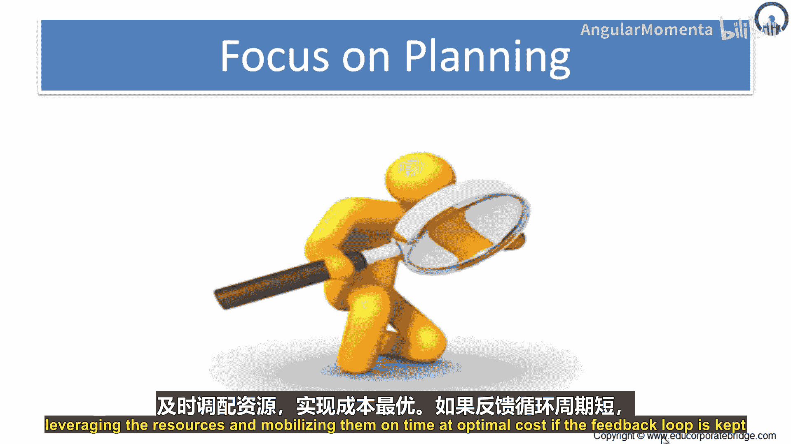
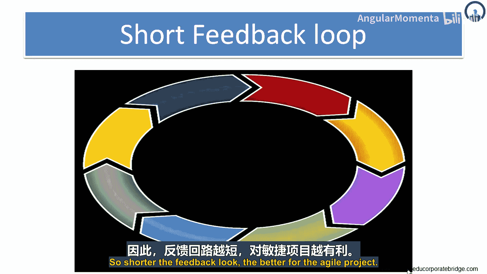
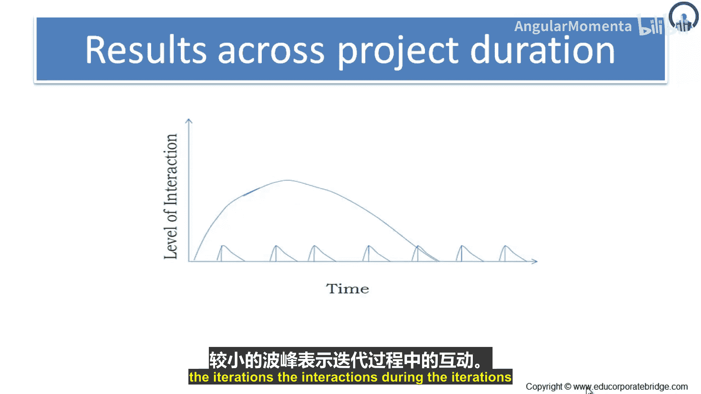

# 046：规划学导论 🗺️

在本节课中，我们将要学习敏捷项目管理中的规划。规划是项目成功的关键，缺乏规划往往导致项目失败。我们将探讨规划的重要性、常见失败原因以及敏捷规划的核心方法。

## 规划的重要性与失败原因

上一节我们提到了规划的重要性，本节中我们来看看项目规划失败的常见原因。根据项目管理协会（PMI）的数据，许多项目在成本、时间和功能交付上都面临挑战。

以下是导致项目失败的主要数据：
*   **成本超支**：近三分之二（64%）的项目显著超出成本估算。
*   **功能浪费**：产品中包含的功能中，有64%很少或从未被使用。
*   **时间延误**：项目平均超出计划时间100%。

这些数据表明，项目经理在规划时需要重点关注客户需求、团队技能以及行业变化，并利用历史数据、自动化工具和最佳实践进行科学预测。

## 敏捷规划的核心：缩短反馈循环

如果反馈循环保持简短，那么“计划-执行-检查-行动”（PDCA）的周期就能更早完成，从而创造价值并使项目更加敏捷。反馈循环越短，对项目越有利。

反馈循环涉及需求澄清、开发、测试和部署等一系列快速连续的活动。通过多次冲刺迭代和发布，敏捷项目能够实现更灵活的规划。

## 敏捷规划方法与实践

基于对敏捷四大核心价值的理解，我们可以关注敏捷团队在实践中的工作方式。这些价值共同导向了高度迭代和增量的软件开发过程。

以下是敏捷团队工作的主要方式：
*   **作为一个团队工作**：团队紧密协作。
*   **短周期迭代**：工作在短的迭代周期内进行。
*   **每次迭代交付成果**：每个迭代结束时都交付可工作的、经过测试的软件。
*   **聚焦业务优先级**：工作重点始终围绕最高业务价值。
*   **检视与调整**：定期回顾并调整工作方式。

## 多层次规划：发布、迭代与每日

一个项目如果规划远超规划者的视野，并且没有留出时间让规划者抬头审视新情况并做出调整，那么它就会面临风险。敏捷团队通过三个不同的时间层面进行规划来应对此风险。

这三个规划层面是：**发布**、**迭代**和**当前日**。大多数敏捷团队只关注这三个层面的规划。

*   **发布规划**：考虑为产品或系统的新版本开发哪些用户故事或主题。其目标是确定项目范围、进度和资源的合理方案。发布规划在项目开始时进行，并会在整个项目期间（通常在每次迭代开始时）持续更新。
*   **迭代规划**：在每个迭代开始时进行。产品负责人根据刚完成的迭代成果，确定团队在新迭代中应处理的高优先级工作。由于视野比发布规划更近，迭代规划会讨论将功能需求转化为可工作、可测试软件所需的具体任务。
*   **每日规划**：大多数敏捷团队使用每日站会来协调工作，同步每日努力。团队在会议中明确并修订他们的计划，将规划视野限定在下次会议之前。

通过在这三个时间层面（发布、迭代、每日）进行规划，敏捷团队能够聚焦于可见且重要的内容进行规划。

图表展示了随着时间推移，团队互动的层次。开始时互动频繁，随后逐渐减少。较大的波峰代表发布层面的集中互动，而较小的波峰则代表迭代期间的互动。

---

本节课中我们一起学习了敏捷项目管理中规划的关键作用。我们了解了项目失败的常见数据、缩短反馈循环的重要性、敏捷团队的工作实践，以及通过发布、迭代和每日三个层面进行渐进式规划的方法。有效的敏捷规划是动态、聚焦且适应变化的，是项目成功交付价值的基石。