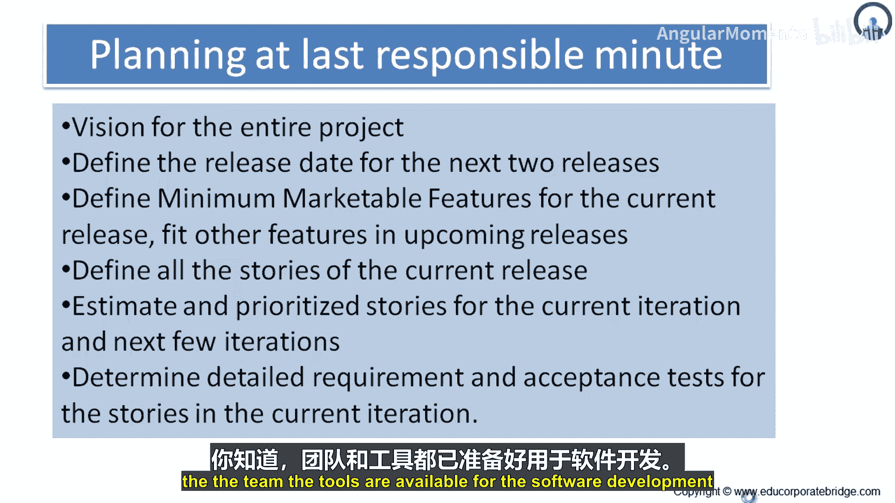
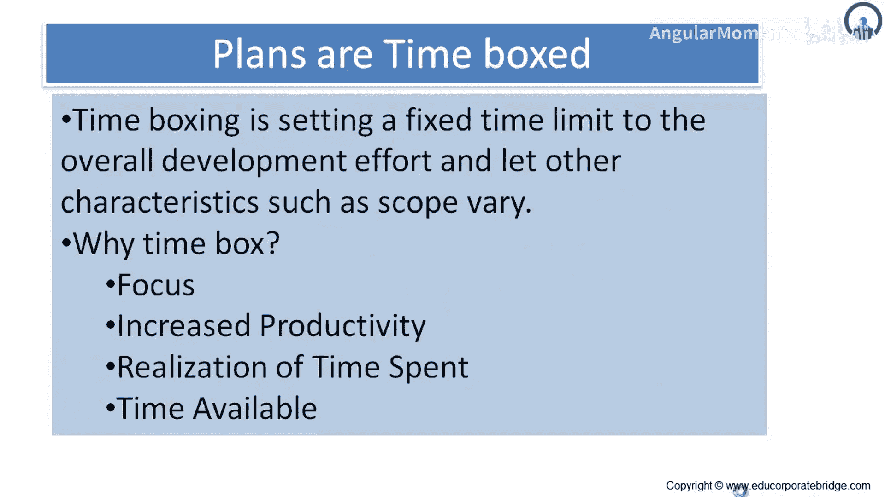

# 047：最后一刻规划的优势 🎯

在本节课中，我们将探讨敏捷规划中的一种特定方法——“最后一刻规划”，并分析其相对于传统前期规划的优势。我们将了解这种方法如何帮助团队更清晰地定义项目愿景、交付物和用户故事。

## 概述

上一节我们介绍了不同的规划方法。本节中，我们来详细看看“在最后一刻进行规划”这一具体方法。

“最后一刻规划”指的是在“最后责任时刻”进行规划。当团队在最后责任时刻进行规划时，能够获得对整个项目的清晰愿景。

## 最后一刻规划的核心优势

以下是采用最后一刻规划方法所带来的主要好处。

*   **项目全景更清晰**：最终的目标、交付物、预期用途、法规要求和可能的测试方案等元素都会变得更加明确和清晰，对项目团队可见。
*   **定义发布周期**：团队可以在制作发布版本时，以确定的间隔为接下来的两个发布定义发布日期。
*   **持续聚焦价值交付**：团队始终专注于向客户交付**可发布的工作成果**、**价值**或**最小可市场化功能（MMF）**。

## 如何管理功能与发布

这种方法有助于为当前发布定义最小可市场化功能，并将其他功能安排到未来的发布中。

因此，最后一刻规划通过交付最小可市场化功能的方式为客户提供价值，同时也能将未包含在近期发布（如发布一和发布二）中的其他功能，妥善安排到发布三和发布四中。

## 用户故事与迭代准备

这种方法还有助于定义当前发布的所有用户故事。因为你在最后一刻进行规划，所以能获得用户故事，并进一步尝试为其添加细节、做好备注。

从为开发进行估算的角度来看，用户故事已准备就绪。对当前迭代和下一次迭代的故事进行优先级排序也成为可能。

## 需求细化与验收测试

由于你正在进行最后一刻的责任规划，可以为当前迭代中的故事明确详细的需求和验收测试。

通过与客户互动，需求得以详细展开，同时你也能获得验收测试的输入信息，从而全面理解当前的迭代和发布。

## 计划与资源配置

团队可以明确计划与资源。你知道团队以及软件开发所需的工具都是可用的。

## 总结

本节课我们一起学习了“最后一刻规划”在敏捷实践中的优势。我们看到，这种方法通过延迟决策，使团队能基于更清晰、更完整的项目信息来规划工作，从而更有效地定义范围、排列优先级，并持续专注于向客户交付最大价值。