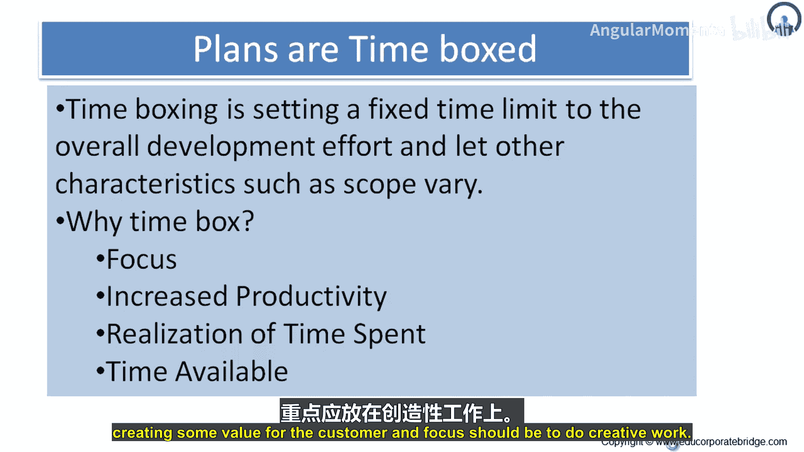
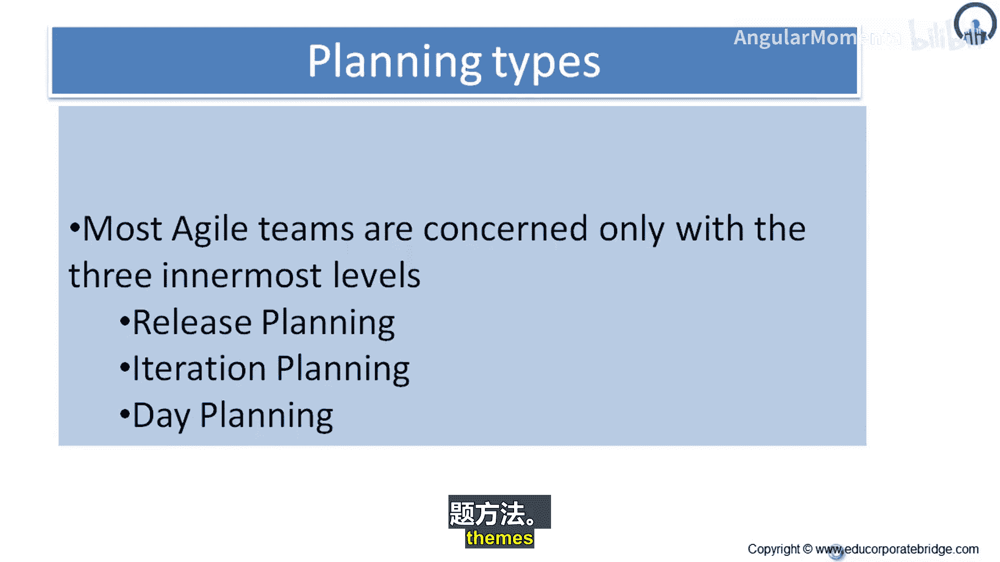

# 048：时间盒 📦

在本节课中，我们将要学习敏捷实践中的一个核心概念——**时间盒**。我们将了解它的定义、作用原理，以及它如何帮助团队聚焦并提升生产力。

---

## 什么是时间盒？⏳

时间盒是指为整体开发工作设定固定的时间限制，并让其他特性（如范围）随之灵活变动。

在敏捷开发中，**时间被视为一个固定约束**。其原则是在固定的时间内，交付最优的功能特性。与传统项目不同，传统项目会获得交付产品所需的全部时间，而敏捷的焦点在于**利用可用时间持续交付产品**。因此，范围是动态的，可以根据团队的速度、故事点或理想日期进行调整。

---

## 为何要使用时间盒？🎯

时间盒之所以重要，是因为它能带来聚焦。以下是使用时间盒的几个关键原因：

1.  **带来高度聚焦**：团队明确知道他们拥有有限的时间和资源进行交付，他们的焦点始终是向客户交付**最小可上市功能**以创造价值。
2.  **提升生产力**：由于整个项目环境都导向创造价值，时间限制带来的同侪压力有助于提高团队的生产力。
3.  **实现时间价值**：时间是项目的宝贵资源。时间盒促使团队合理利用时间，努力为客户交付价值。
4.  **鼓励创新与创造**：在有限的时间内，团队需要专注于创造性的工作，为客户创造价值。

---

## 敏捷团队的规划层级 🗺️

上一节我们介绍了时间盒的概念与目的，本节中我们来看看敏捷团队如何在实际规划中应用时间盒。大多数敏捷团队主要关注三个最核心的规划层级。

以下是这三个核心规划层级：

*   **版本规划**：决定即将发布的内容，例如发布1、发布2，剩余的特性则进入发布3、发布4的待办列表。
*   **迭代规划**：为了交付某个版本（如发布1），团队会进行迭代规划，尝试选取相关的主题进行开发。
*   **每日规划**：在更细粒度上，团队进行每日规划，确保工作持续向前推进。

---

## 总结 📝

本节课中我们一起学习了敏捷实践中的**时间盒**。我们了解到，时间盒通过设定固定时间限制来约束项目，迫使团队聚焦于在有限时间内交付最大价值。它不仅能提升团队的生产力和专注度，还能强化时间作为宝贵资源的意识，并鼓励创造性工作。最后，我们看到了时间盒思想在敏捷团队**版本规划**、**迭代规划**和**每日规划**这三个核心层级中的具体体现。