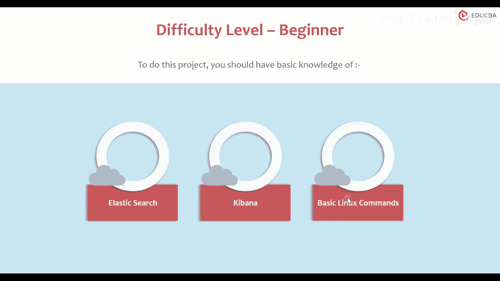
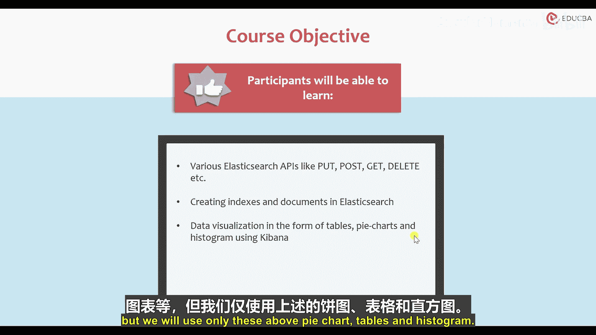
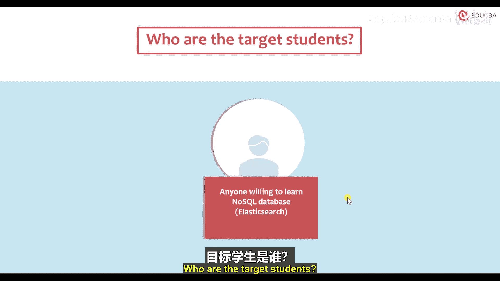
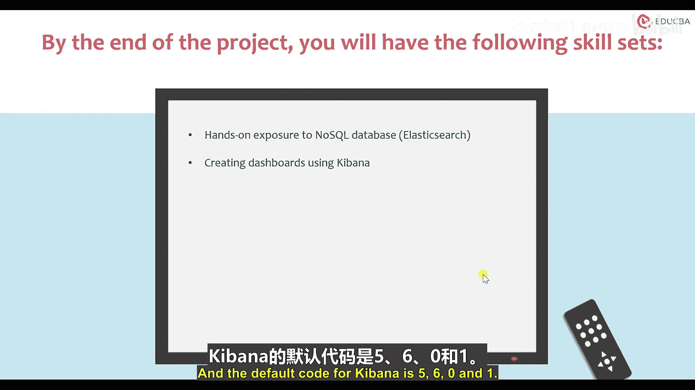
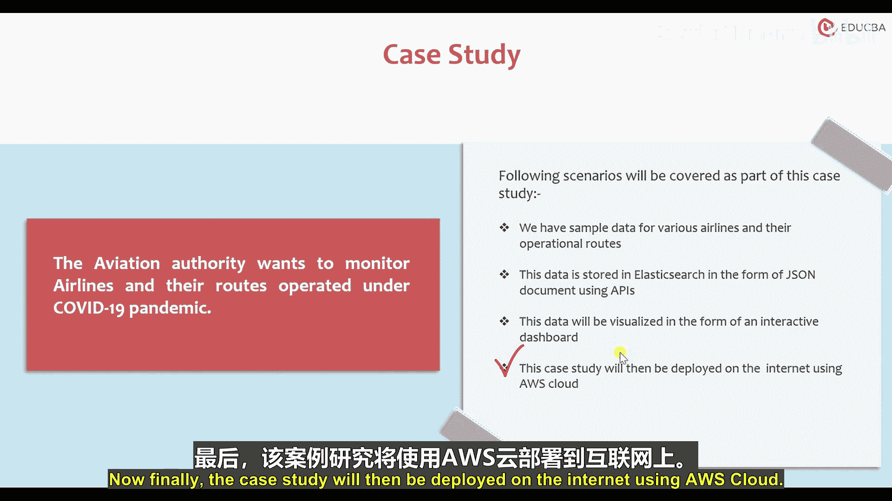

# 001：Elasticsearch航班监控项目导论 🛫

在本节课中，我们将学习一个关于在COVID-19疫情期间进行航班监控的案例研究。我们将了解这个项目的背景、目标、所需技能以及实施步骤。

我们知道，由于这场疫情，航空业遭受了巨大损失。为了获取特定日期的航班信息，航班监控对航空业来说变得非常必要。

## 项目难度与先决条件 🎯

上一节我们介绍了项目的背景，本节中我们来看看完成这个项目需要具备哪些基础。

本项目的难度级别为**初学者**。要完成此项目，你应该具备以下基础知识：
*   **Elasticsearch** 的基本知识。
*   **Kibana** 的基本知识。
*   基本的 **Linux 命令**。

因为这个案例研究是在 **Elastic Stack**（通常称为 **ELK Stack**）中实现的，即 **E**lasticsearch、**L**ogstash 和 **K**ibana。对于我们的案例研究，我们只需要：
*   **Elasticsearch** 作为 NoSQL 数据库。
*   **Kibana** 用于数据可视化。

同时，基本的 Linux 命令也是必需的，因为 Elasticsearch 和 Kibana 的安装以及它们之间的连接配置都是通过 Linux 命令完成的。

## 课程目标 🎯

在了解了先决条件后，接下来我们明确一下通过本课程你将能学到什么。

参与者将能够学习到各种 Elasticsearch API，例如 `POST`、`DELETE`、`GET` 等。这些 API 以 JSON 格式实现，用于存储数据。我们将在 NoSQL 数据库中学习所有这些 API。

具体目标包括：
1.  **在 Elasticsearch 中创建索引和文档**：在我们的案例中，参与者将接触到 NoSQL 这种非关系型数据库。它比 SQL 数据库更简单，因为相关数据不需要在表之间拆分。Elasticsearch 使用基于组件的 NoSQL 数据库，它以 JSON 格式存储数据。
2.  **使用 Kibana 以表格、饼图和直方图的形式进行数据可视化**：我们将使用 Kibana 来实现通过各种 API 存储的数据，并通过饼图、表格、直方图等形式进行数据可视化。虽然还有其他可视化形式如图形、地图、图表等，但我们将主要使用上述几种。

## 项目要求与目标学员 👥

我们已经明确了学习目标，现在来看看实施项目的具体要求和适合学习本课程的人群。

以下是项目的要求或先决条件：
*   在 Linux 系统中安装 **Elasticsearch** 和 **Kibana**。
*   具备 **JSON**、**Linux 命令** 和 **NoSQL 概念** 的基础知识。
*   互联网上提供了完整的指南以及 Linux 命令，你可以按照步骤在 Linux 系统中操作。这部分内容可以使用 AWS Cloud Linux 实例来完成。

目标学员是任何愿意学习 NoSQL 数据库的人。在项目结束时，你将获得以下技能组合：
*   **NoSQL 数据库的实践操作经验**：你将能够在 NoSQL 数据库上工作，并理解如何通过索引直接输入数据，以及如何以 JSON 形式使用 API。
*   **使用 Kibana 创建仪表板**：这些仪表板在一个页面上包含所有的可视化内容。Elasticsearch 的默认端口是 **9200**，Kibana 的默认端口是 **5601**。

## 案例研究概述 📊

最后，让我们详细了解一下我们将要实施的具体案例。

航空当局希望在 COVID 19 大流行期间监控航空公司及其运营的航线。本案例研究将涵盖以下场景，我们将按步骤逐一进行：
1.  **数据准备**：我们拥有各种航空公司及其运营航线的样本数据。
2.  **数据存储**：使用 API 将数据以 JSON 文档的形式存储在 Elasticsearch 中。
3.  **数据可视化**：存储在 Elasticsearch 中的数据将通过 Kibana 以交互式仪表板的形式进行可视化。
4.  **项目部署**：最后，该案例研究将使用 AWS 云服务部署到互联网上。

---

本节课中，我们一起学习了“COVID-19疫情期间航班监控”案例研究的导论部分。我们明确了项目的背景、学习目标、所需的先决条件（Elasticsearch, Kibana, Linux 基础），以及项目的实施流程（从数据准备到最终部署）。接下来，我们将开始动手搭建环境并深入 Elasticsearch 的核心操作。