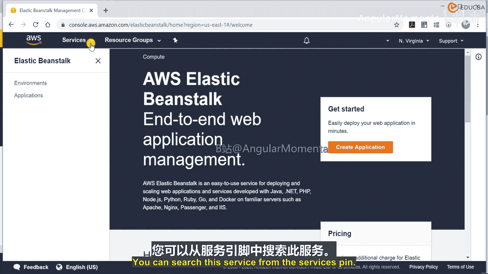
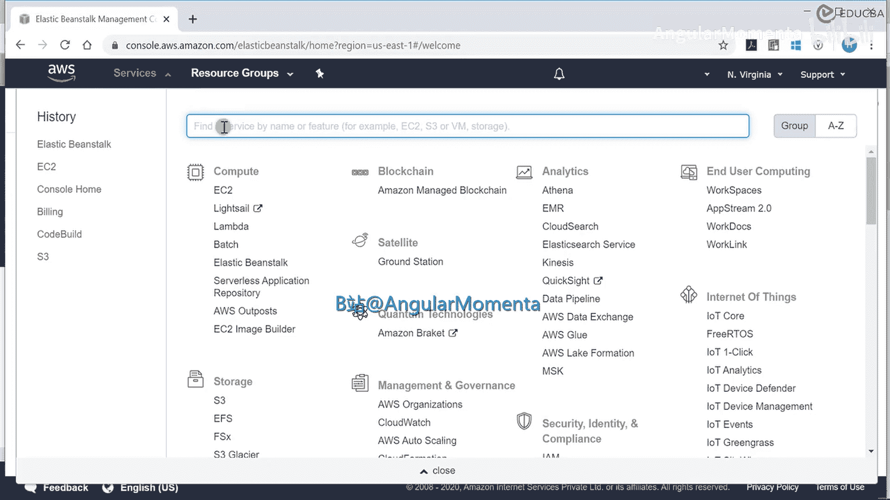
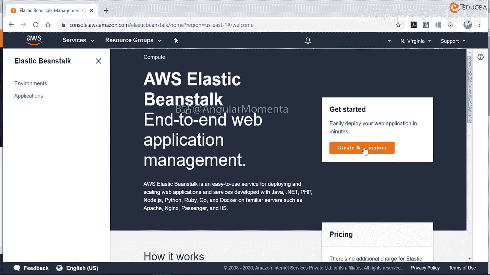
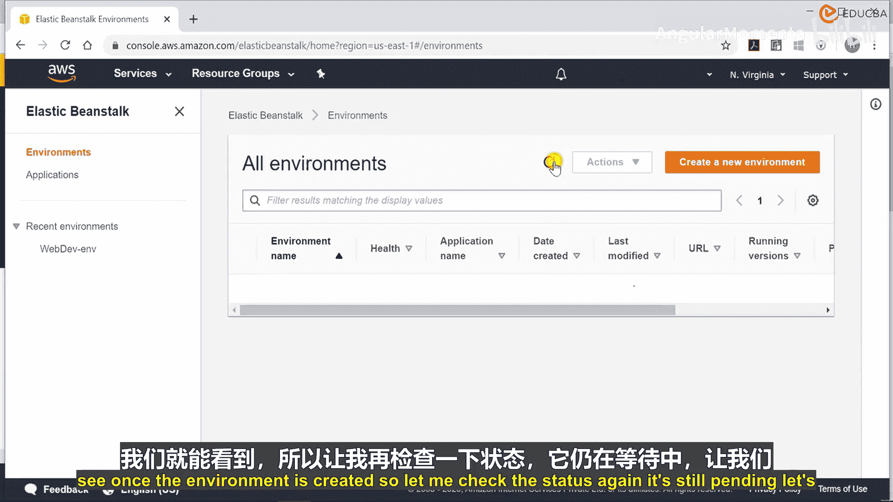
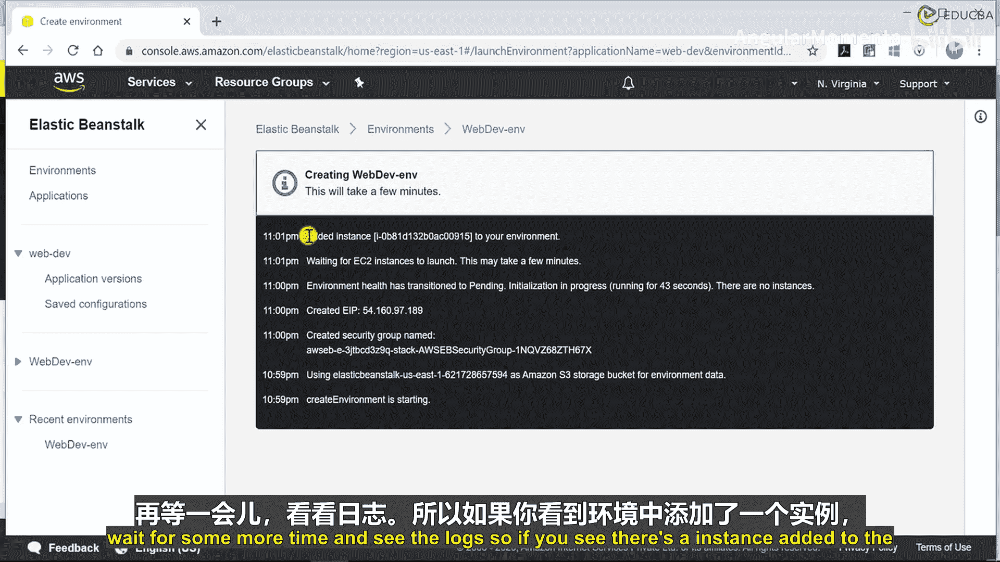
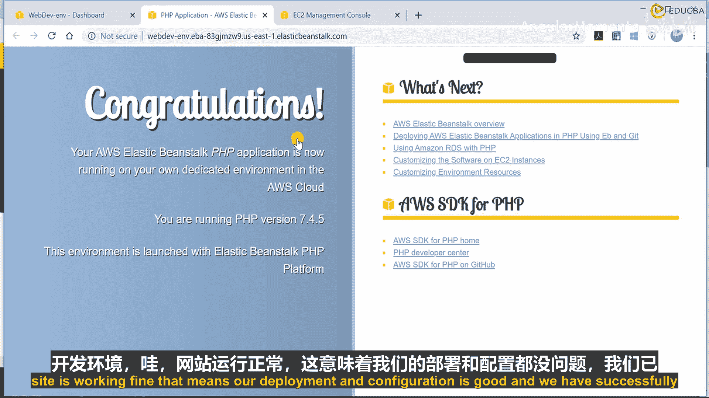
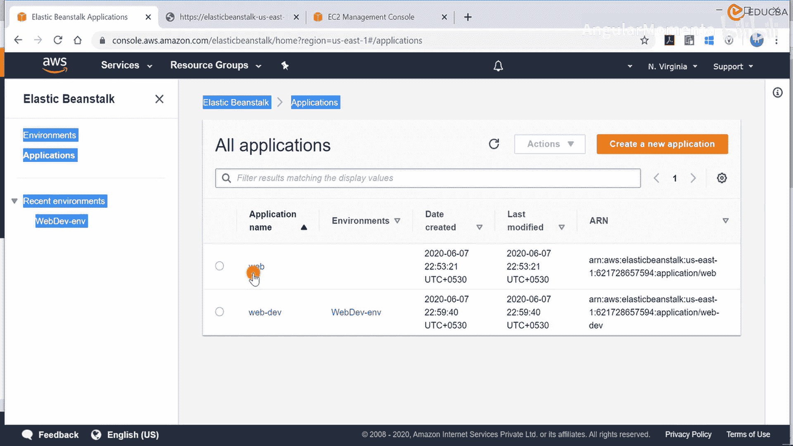

# 002：环境配置 🛠️

在本节课中，我们将学习如何为Web开发项目配置一个AWS Elastic Beanstalk环境。我们将创建一个应用程序和环境，并了解其核心配置选项。

## 概述

我们将登录AWS管理控制台，创建一个名为“web-dev”的Elastic Beanstalk应用程序和环境。我们将选择PHP平台，并配置一个单实例环境来部署示例应用程序。过程中会涉及平台选择、实例配置、安全设置和监控选项的简要说明。

## 创建应用程序与环境

首先，我们需要登录AWS账户并导航到Elastic Beanstalk服务。

在服务搜索栏中，可以找到Elastic Beanstalk。

进入服务后，我们将开始创建应用程序。

我们将创建一个应用程序，并相应地设置环境。我们将此应用程序命名为“web”。可以在此处添加键值对以标识资源，但本次演示中不添加。

## 配置平台与实例

接下来，我们需要选择平台。Elastic Beanstalk支持多种平台，例如.NET、Go、Java、PHP、Python等。本次我们将部署一个PHP Web应用程序，因此选择PHP。请确保选择支持的最新版本。其他设置将使用默认值。

我们选择部署示例应用程序，以验证环境是否正常工作。本课程后续将通过CI/CD管道部署代码。

在配置面板中，可以看到多个预设选项。以下是主要配置选项：

*   **预设配置**：默认选择单实例。也可以选择多可用区实例以实现高可用性，或使用按需/Spot实例，以及自定义配置。本次演示选择单实例。
*   **平台**：已选择运行在64位Amazon Linux上的PHP 7.4。
*   **其他配置**：可以配置日志（如CloudWatch Logs）、实例类型、存储卷（如EBS卷类型和大小）等。本次演示保留默认设置。
*   **容量**：可以在此处更改容量设置，例如实例类型和最小/最大实例数量。还可以配置负载均衡器。
*   **滚动部署**：当前已禁用。如果底层有多个EC2实例，可以设置分批部署策略（例如每次更新50%的实例）。由于当前只有一个实例，默认策略为“一次全部部署”。

我们使用默认的滚动更新设置。然后进入安全部分。

## 安全与监控设置

系统会自动创建一个Elastic Beanstalk服务角色，用于访问实例和执行操作。此外，还会创建EC2密钥对。如果想使用自己的EC2密钥对，而不是让Elastic Beanstalk创建，可以在此选择。本次演示使用默认选项。

在监控部分，当前启用了增强型健康报告系统，但未启用日志流式传输。可以在此配置托管更新，例如设置每周一11:00 UTC的更新窗口和实例替换计划。本次演示不启用这些选项。

可以在此处输入电子邮件地址以接收环境活动的通知。默认情况下，环境不属于任何VPC，但可以将其添加到VPC并选择子网。本次演示使用默认VPC。

由于我们将部署一个简单的静态网站，不需要数据库，因此不配置数据库。可以为资源添加标签以便识别，但本次演示不添加。

## 启动环境创建

现在，我们将应用程序名称更改为“web-dev”，以标识为开发环境。稍后我们还将创建一个生产环境。所有配置确认无误后，点击“创建应用程序”。

系统开始配置并同时创建名为“web-dev-env”的环境。应用程序名为“web-dev”。现在检查应用程序状态。

环境正在创建中。系统首先创建安全组，然后创建存储桶，并为网站分配弹性IP。一旦环境创建完成，我们还将获得一个DNS名称来访问网站。让我们等待环境状态变为“就绪”。

## 验证创建的资源

环境创建期间，我们可以检查已创建的资源。可以看到一个标记为“web-dev”环境的EC2实例正在运行并初始化。同时，还创建了一个S3存储桶，其中包含一些Elastic Beanstalk配置文件。此外，还创建了一个安全组，其入站规则允许通过HTTP（端口80）访问，出站规则默认为允许所有流量。

现在检查环境状态，网站应能正常工作。

这表明我们的部署和配置是成功的。我们已经成功创建了环境和应用程序（目前是示例应用程序）。

## 检查环境配置与日志

现在，我们可以检查环境的配置。所有配置均与我们设置的一致，包括软件设置、容量（单实例）、负载均衡器（未配置）、滚动更新和部署设置。我们没有配置通知电子邮件，监控设置也保持不变。

在日志部分，可以请求并下载日志以查看详细过程。日志记录了所有操作，例如环境创建启动、S3存储桶创建、安全组创建、弹性IP分配、等待EC2实例启动、实例命名以及应用程序URL生成。几分钟内，环境就绪且URL可访问。

监控仪表板显示健康状态良好，可以查看CPU利用率（约60%）、最大网络流入（29 KB）和流出（24 KB）等信息。我们尚未定义任何警报。在“托管更新”和“事件”部分，可以查看所有已发生的事件记录。

至此，环境配置完成，我们可以继续进行项目后续步骤。

## 总结

本节课中，我们一起学习了如何在AWS Elastic Beanstalk上配置一个基础的Web开发环境。我们创建了一个PHP应用程序，选择了单实例配置，并了解了安全组、存储桶、监控等核心资源的自动创建过程。成功部署示例应用后，我们还查看了环境配置详情和操作日志，为后续集成CI/CD管道奠定了基础。