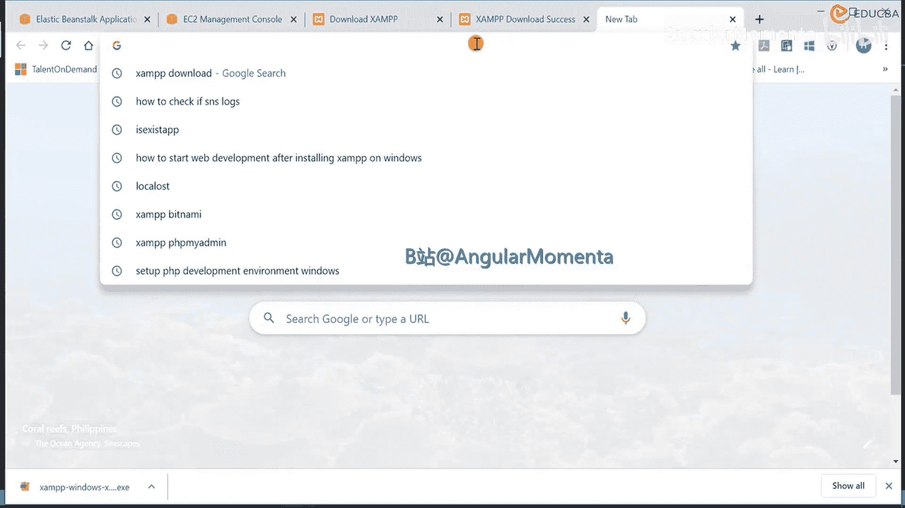
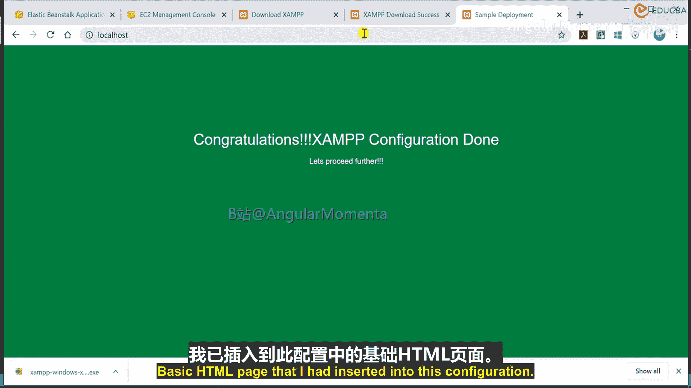
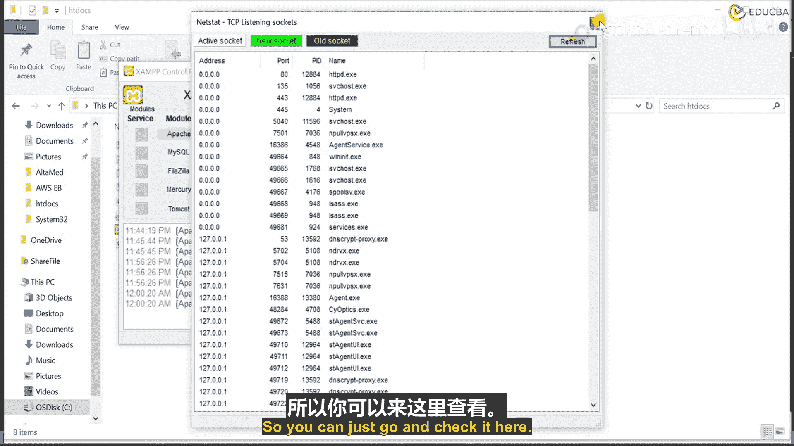
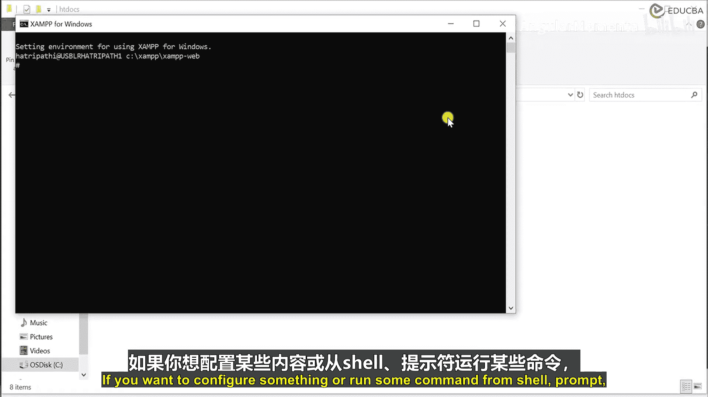
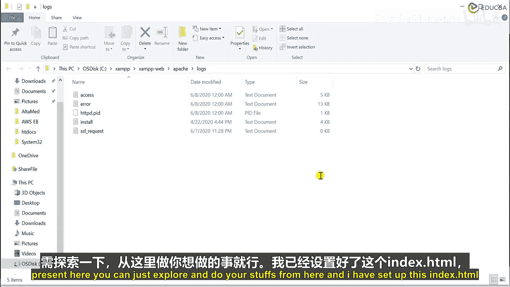
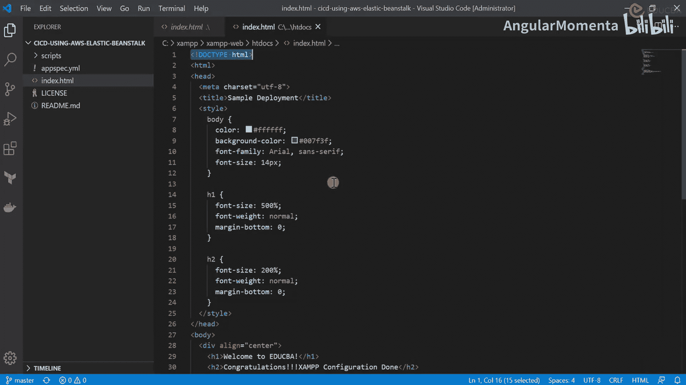
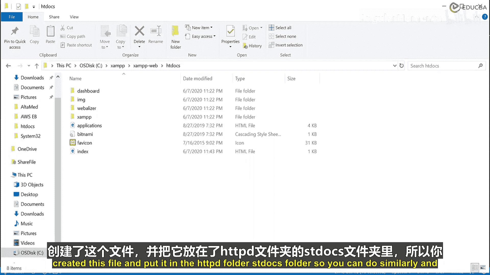
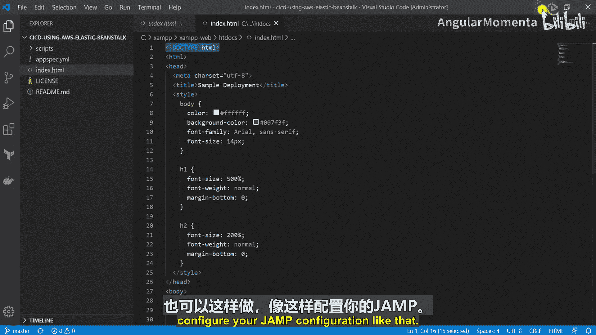
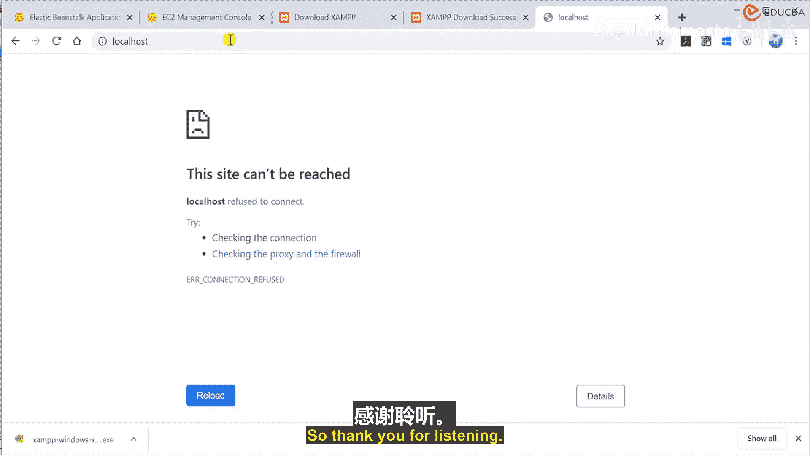

# 003：开发环境配置 🛠️

在本节课中，我们将学习如何为我们的网站配置一个本地开发服务器。具体来说，我们将安装和配置 **XAMPP** 服务器，这是一个集成了Apache、MySQL、PHP等组件的流行开发环境。通过本教程，你将能够搭建一个本地环境来运行和测试你的静态网站。

## 概述

我们将从下载和安装XAMPP开始，然后介绍其控制面板的基本功能，并重点讲解如何配置Apache服务器以托管我们的网站文件。最后，我们会验证网站是否能够成功访问。

## 下载与安装XAMPP

首先，我们需要获取XAMPP的安装程序。你可以通过访问其官方网站或通过搜索引擎找到下载链接。

以下是下载步骤：
*   访问XAMPP官方网站或通过搜索引擎找到下载页面。
*   根据你的操作系统（Windows、Linux或Mac）选择对应的版本进行下载。
*   下载完成后，你会得到一个安装文件（例如，Windows系统是 `.exe` 文件）。

安装过程非常简单。只需双击下载的安装文件，并按照屏幕上的提示进行操作即可完成安装。为了节省时间，本教程将跳过具体的安装步骤演示。

## 认识XAMPP控制面板

安装完成后，启动XAMPP控制面板。你会看到一个类似下图的界面，其中列出了可管理的服务，如 **Apache**、**MySQL**、**FileZilla** 和 **Tomcat**。



在安装时，你可以选择只安装需要的组件。例如，对于一个静态网站，我们主要需要 **Apache** 服务器。如果网站是动态的（例如使用了PHP和数据库），则还需要 **MySQL** 和 **PHP** 组件。

## 配置Apache服务器

上一节我们启动了XAMPP控制面板，本节中我们来看看如何配置Apache服务器以托管我们的网站。


Apache的主要配置文件是 `httpd.conf`。这个文件包含了服务器根目录、监听端口（默认为80）、日志路径等重要设置。你可以用文本编辑器打开这个文件进行查看和修改。

```
# 示例：在 httpd.conf 中修改网站根目录
# DocumentRoot "C:/xampp/htdocs"
# <Directory "C:/xampp/htdocs">
```



如果你想深入了解Apache的配置，可以仔细阅读这个文件中的各项参数。

## 部署与访问网站

现在，让我们将网站文件放到正确的位置并尝试访问它。

首先，我们需要启动Apache服务。在XAMPP控制面板中，找到Apache模块，点击旁边的 **“Start”** 按钮。启动成功后，你会看到Apache运行在端口80上。

接下来，我们需要放置网站文件。XAMPP默认的网站根目录是 `C:\xampp\htdocs\`（Windows系统）或 `/opt/lampp/htdocs/`（Linux系统）。你可以通过控制面板的 **“Explorer”** 按钮快速打开这个目录。


请将你的网站文件（例如 `index.html`）放入这个 `htdocs` 文件夹中。例如，我放置了一个简单的 `index.html` 文件。

现在，打开你的网页浏览器，在地址栏输入 `http://localhost` 或 `http://127.0.0.1`。如果配置正确，你将看到你的网站页面，如下图所示。






## 管理服务器与查看日志

XAMPP控制面板提供了便捷的管理和监控功能。

**服务管理**：你可以随时通过控制面板上的按钮**启动**或**停止**Apache服务。请记住，**Apache服务必须处于运行状态，网站才能被访问**。如果停止服务并刷新浏览器，你将看到连接错误的页面。






**查看日志**：调试网站时，查看日志非常有用。你可以通过控制面板的 **“Logs”** 按钮访问Apache的访问日志和错误日志，以排查问题。



**其他工具**：
*   **Shell**：打开一个命令行窗口，可以直接在服务器环境中执行命令。
*   **Explorer**：快速打开XAMPP的安装目录。
*   **Services**：查看或管理Windows系统后台运行的服务。
*   **Netstat**：查看服务器正在监听的端口和网络连接状态。

## 总结



本节课中我们一起学习了如何为本地开发配置XAMPP环境。我们完成了从下载安装、启动Apache服务、部署网站文件到最终通过浏览器访问网站的全过程。关键点在于：确保Apache服务已启动，并将网站文件放置在正确的 `htdocs` 目录下。这个本地环境是进行网站开发和测试的重要基础。



感谢你的学习。