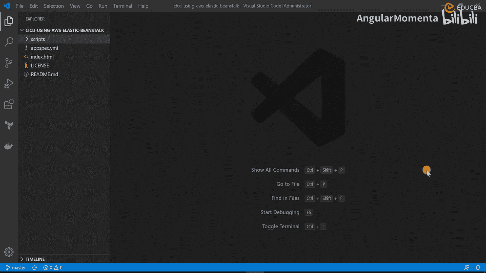
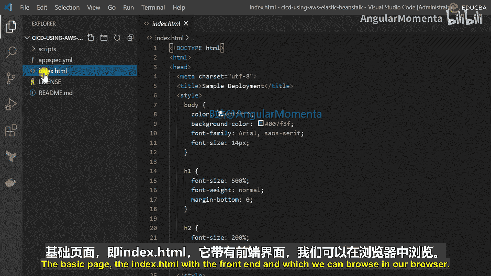
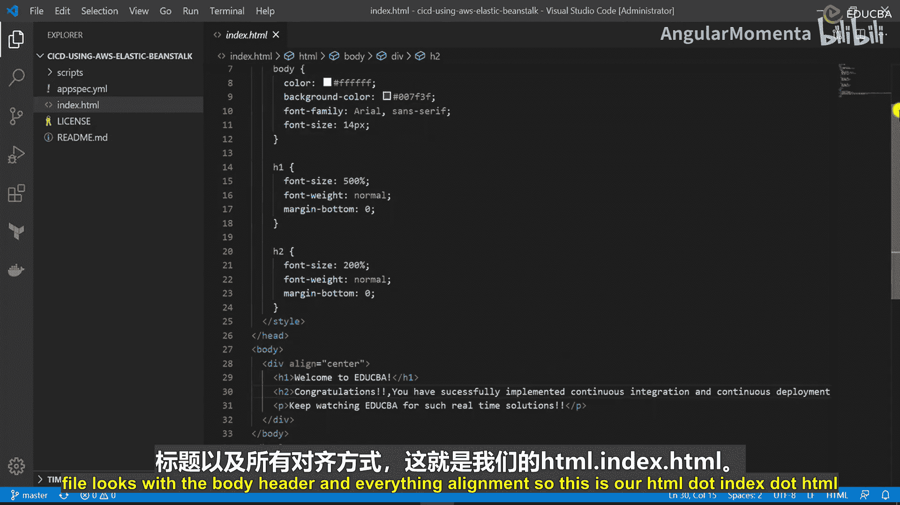
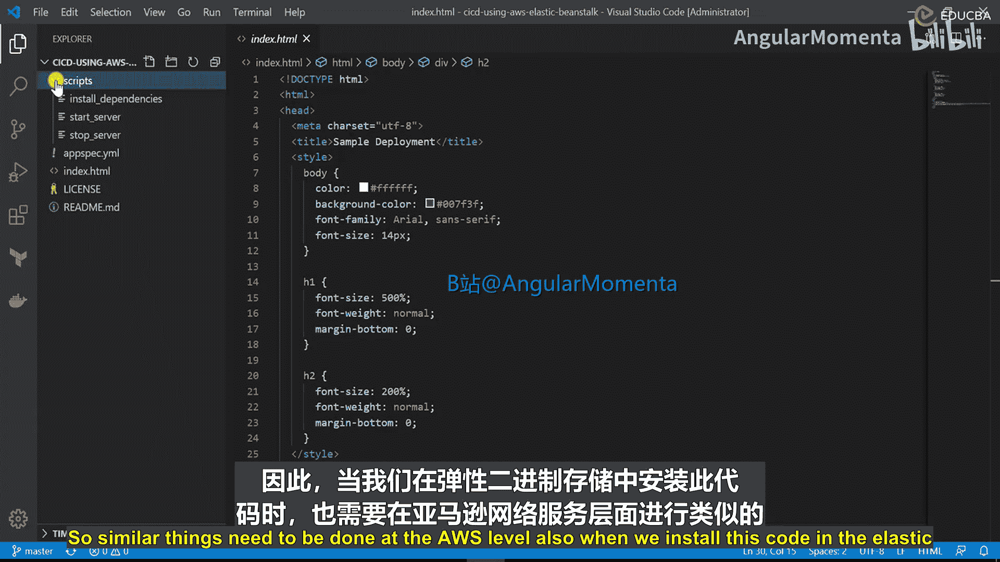
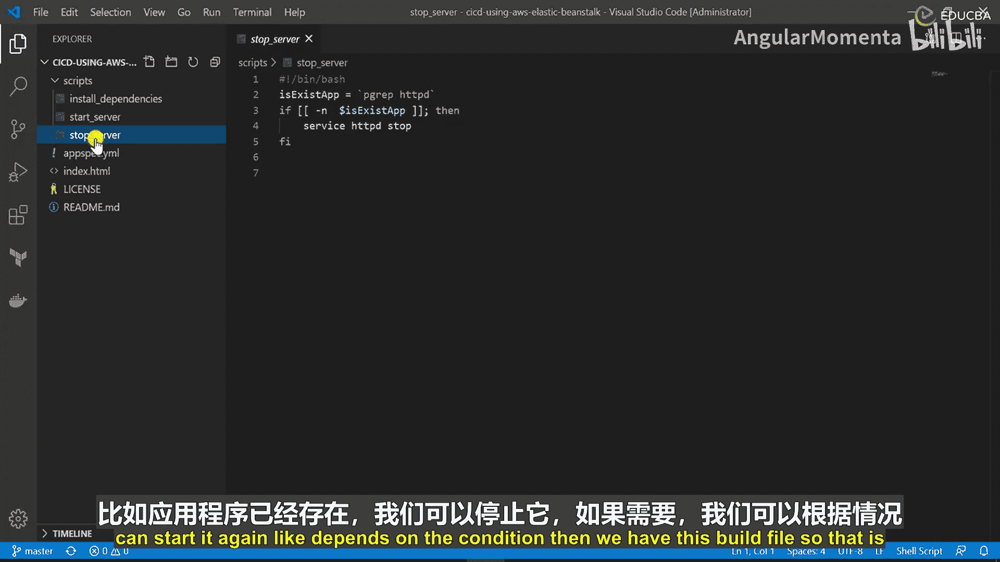
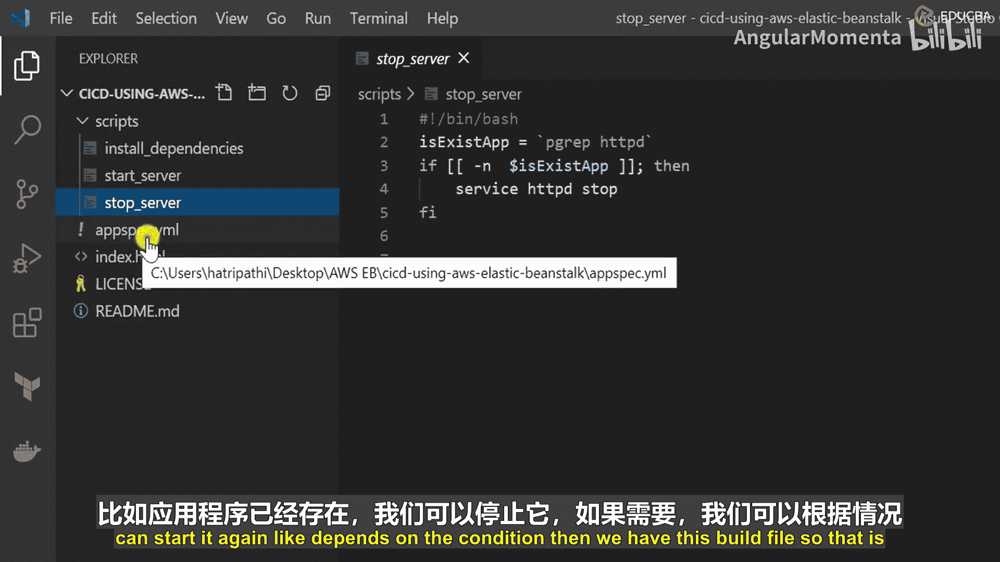
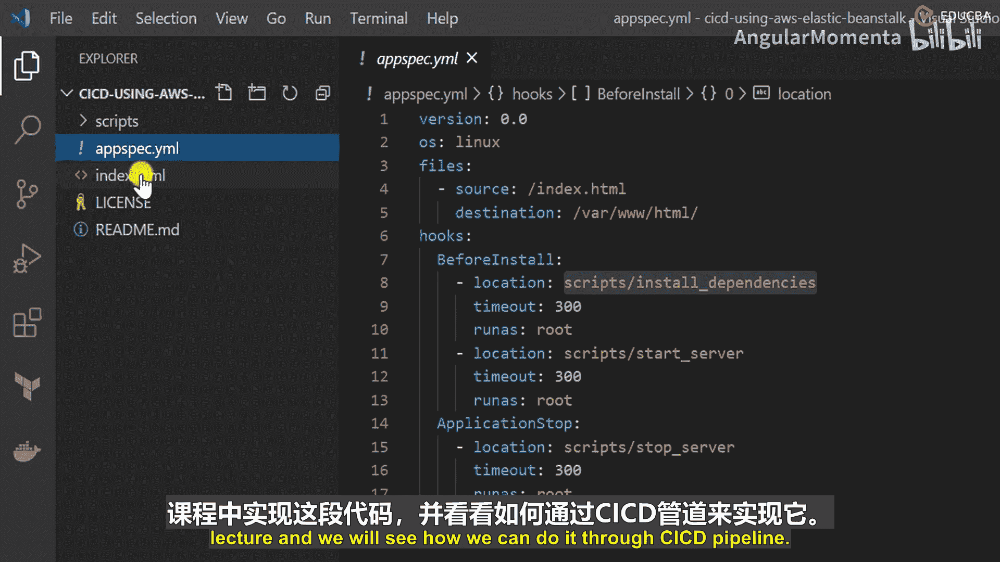
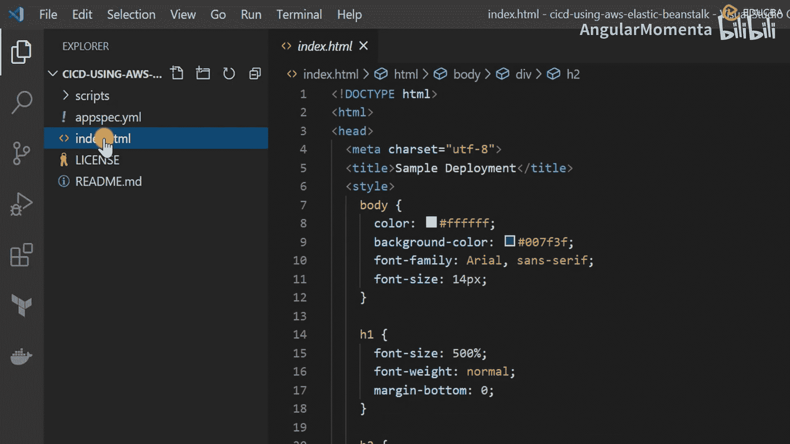

# 004：构建与配置文件 🛠️





在本节课中，我们将学习如何准备一个简单的网页应用代码，以及用于在AWS Elastic Beanstalk上实现持续集成/持续部署（CI/CD）的配置文件和脚本。

上一节我们介绍了CI/CD的基本概念，本节中我们来看看具体的代码和配置文件是如何构成的。

## 前端代码：index.html

我们的应用是一个简单的静态网页。以下是其核心HTML代码：

```html
<!DOCTYPE html>
<html>
<head>
    <title>简单部署</title>
    <style>
        body {
            color: #333;
            background-color: #f4f4f4;
            font-family: Arial, sans-serif;
            font-size: 16px;
        }
        h1 {
            font-size: 500%;
            font-weight: normal;
            margin-bottom: 0;
        }
        h2 {
            font-size: 200%;
            font-weight: normal;
            margin-bottom: 0;
        }
    </style>
</head>
<body>
    <h1>欢迎来到EDUCBA</h1>
    <h2>感谢组织本教程</h2>
    <p>恭喜你已成功实现CI/CD。请持续关注EDUCBA以获取更多实时解决方案。</p>
</body>
</html>
```



这个文件定义了一个包含标题和欢迎信息的网页。你可以根据自己的需求修改其中的文本和样式。

## 部署脚本与依赖

当代码通过CI/CD流程部署到服务器（例如Linux）时，需要确保Web服务器（如Apache）已安装并运行。以下是相关的命令脚本。



以下是部署前需要执行的命令列表：
*   `yum install -y httpd`：安装Apache Web服务器（在基于RHEL的系统上）。
*   `service httpd start`：启动Apache服务。
*   `service httpd stop`：停止Apache服务（用于处理应用重启等场景）。

## 构建配置文件：buildspec.yml



为了指导CI/CD管道（如AWS CodeBuild）按顺序执行任务，我们需要一个构建规范文件。



以下是`buildspec.yml`文件的核心内容：
```yaml
version: 0.2
os: linux
files:
  - source: index.html
    destination: /var/www/html/
hooks:
  before_install:
    - yum install -y httpd
    - service httpd start
  application_stop:
    - service httpd stop
```

这个YAML文件定义了构建过程：
1.  **版本与环境**：指定构建规范的版本和操作系统。
2.  **文件复制**：将源代码中的`index.html`文件复制到服务器的`/var/www/html/`目录下。
3.  **构建钩子**：
    *   `before_install`：在安装应用前，先安装并启动Apache服务器。
    *   `application_stop`：如果应用需要停止（例如更新时），则先停止Apache服务器。

## 总结





本节课中我们一起学习了部署到AWS Elastic Beanstalk所需的核心文件。
我们首先分析了一个简单的HTML前端页面，然后了解了确保Web服务器运行的安装脚本，最后详细解读了指导整个自动化部署流程的`buildspec.yml`构建配置文件。
在接下来的课程中，我们将实际使用这些文件，通过CI/CD管道来完成部署。