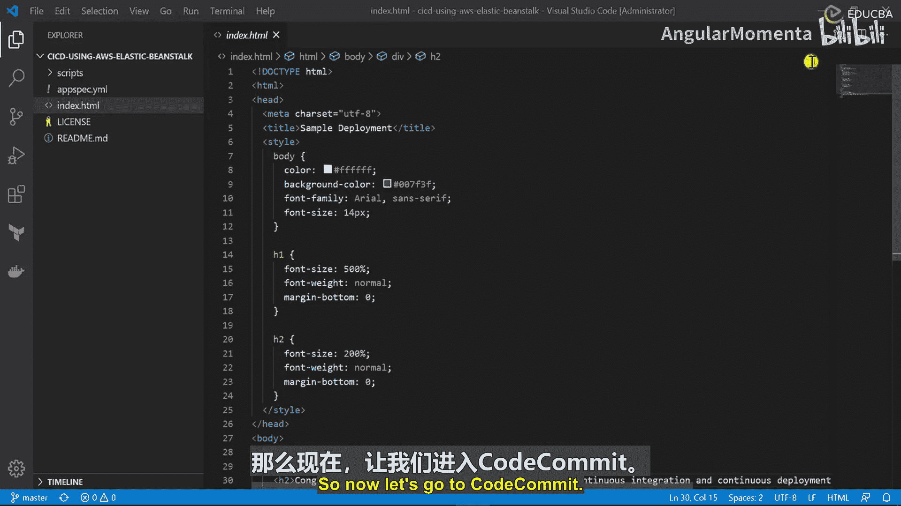
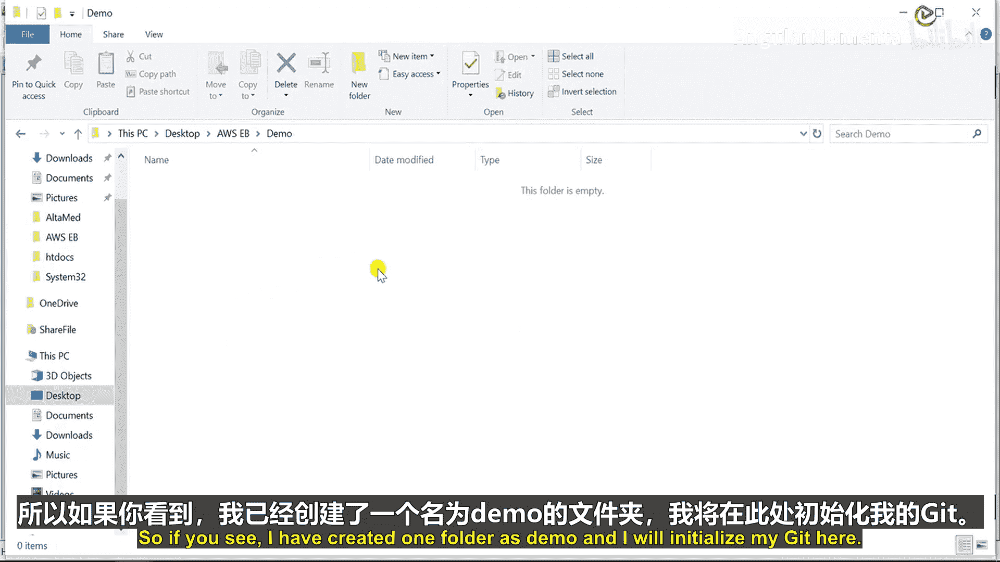

# 005：配置Git仓库

在本节课中，我们将学习如何为持续集成/持续部署（CI/CD）流水线配置第一个组件：AWS CodeCommit。我们将创建一个Git仓库，并配置本地环境以连接到此仓库，为后续的代码推送和自动化部署做好准备。

## 配置AWS CodeCommit仓库

上一节我们完成了项目编码，本节中我们来看看如何将代码托管到AWS CodeCommit服务中。AWS CodeCommit是一个完全托管的源代码控制服务，用于托管安全的Git仓库。



首先，我们需要在AWS控制台中创建一个CodeCommit仓库。


1.  在AWS控制台搜索并进入CodeCommit服务。
2.  点击“创建仓库”按钮。
3.  为仓库命名，例如 `VbRepo`。
4.  添加描述，例如 `CI/CD Demo`。
5.  可以按需添加标签。
6.  由于这是一个PHP项目，无需启用“Amazon CodeGuru Reviewer for Java”选项。
7.  点击“创建”按钮。

至此，我们的代码仓库已在CodeCommit中创建完成。

## 配置本地Git环境

现在我们需要配置本地环境以访问这个远程仓库。有多种连接方式，例如HTTPS、SSH或HTTPS（GRC）。在本教程中，我们将使用HTTPS方式。

以下是配置本地环境所需的步骤：

**第一步：安装Git客户端**
您必须使用支持Git版本1.7.9或更高版本的客户端。请根据您的操作系统下载并安装Git。

**第二步：配置IAM用户权限**
您的IAM用户需要拥有访问CodeCommit的权限。这通常通过附加一个托管策略来实现。

1.  进入AWS IAM服务，选择您的用户。
2.  点击“添加权限”。
3.  选择“直接附加现有策略”。
4.  搜索并选择策略，例如 `AWSCodeCommitPowerUser` 或 `AWSCodeCommitFullAccess`。

**第三步：生成Git凭证**
为了通过HTTPS连接，您需要为IAM用户生成Git凭证。

1.  在IAM控制台进入您的用户详情页。
2.  切换到“安全凭证”选项卡。
3.  在“HTTPS Git凭证 for AWS CodeCommit”部分，点击“生成凭证”。
4.  下载并保存生成的用户名和密码。

## 克隆远程仓库到本地

完成上述配置后，我们就可以将远程仓库克隆到本地了。

首先，在本地创建一个项目文件夹并初始化Git。



```bash
# 创建项目文件夹
mkdir demo
cd demo

# 初始化Git仓库
git init
```

接下来，使用之前从CodeCommit仓库页面复制的HTTPS URL和生成的Git凭证进行克隆。

```bash
# 克隆远程仓库（请替换为您的实际URL）
git clone https://git-codecommit.<region>.amazonaws.com/v1/repos/VbRepo
```

系统会提示您输入用户名和密码，请使用生成的Git凭证。

## 总结


本节课中我们一起学习了如何为CI/CD流水线配置源代码管理。我们首先在AWS CodeCommit中创建了一个Git仓库，然后配置了本地Git环境所需的权限和凭证，最后成功将远程仓库克隆到了本地。这为后续将代码推送到仓库并触发自动化构建和部署流程奠定了基础。