# 006：AWS CodeCommit 代码仓库操作指南 🗂️

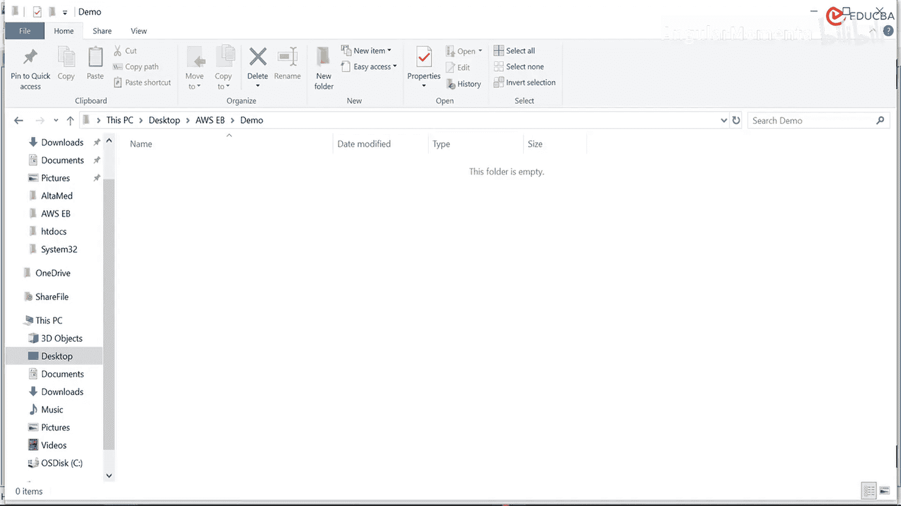

在本节课中，我们将学习如何将本地代码推送到 AWS CodeCommit 代码仓库。这是实现持续集成与持续部署流程的第一步，我们将通过实际操作，完成从初始化本地 Git 仓库到将代码成功推送至云端仓库的全过程。

## 创建并初始化本地目录

首先，我们需要在本地计算机上创建一个新的文件夹，用于存放项目代码。我们将在此文件夹内初始化 Git 仓库。

以下是具体操作步骤：

1.  创建一个名为 `demo` 的新文件夹。
2.  使用终端或命令行工具进入该文件夹。
3.  执行 `git init` 命令来初始化一个空的 Git 仓库。

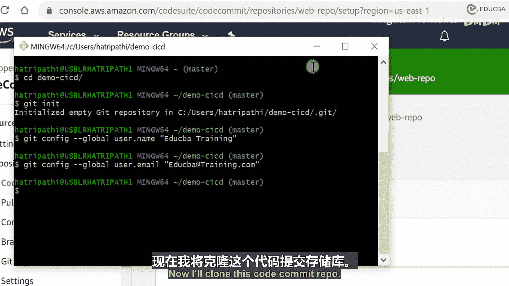

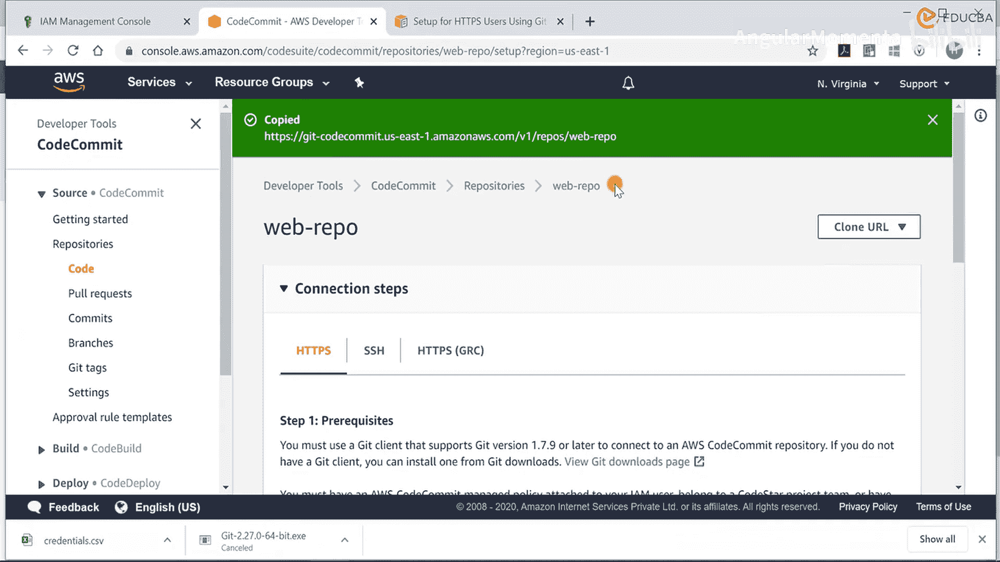

初始化完成后，我们需要配置 Git 的用户信息，以便在提交代码时进行身份标识。

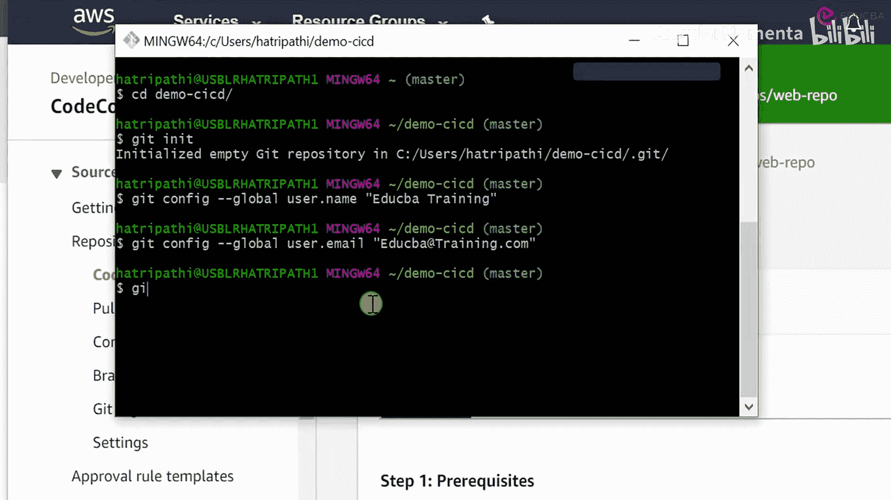

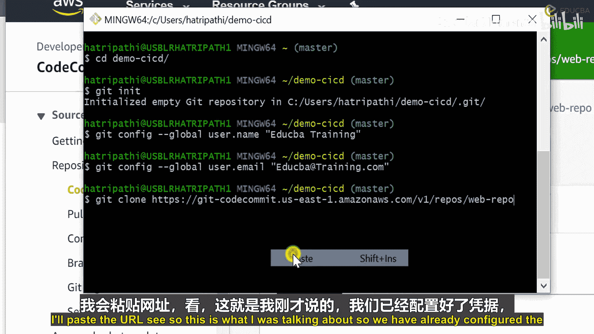

## 配置 Git 用户信息

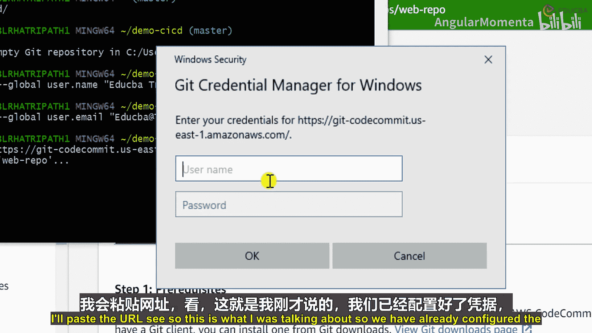

上一节我们创建了本地仓库，本节中我们来配置必要的用户信息。这包括用户名和邮箱地址，它们会记录在每一次代码提交中。

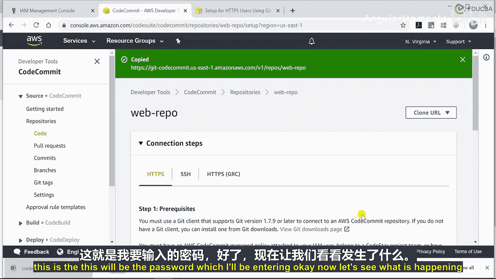

配置命令如下：
```bash
git config --global user.name "EDUCBA Training"
git config --global user.email "educba@example.com"
```

## 克隆远程仓库到本地

配置好用户信息后，接下来我们需要将 AWS CodeCommit 上的远程仓库克隆到本地。这建立了本地与云端仓库的连接。

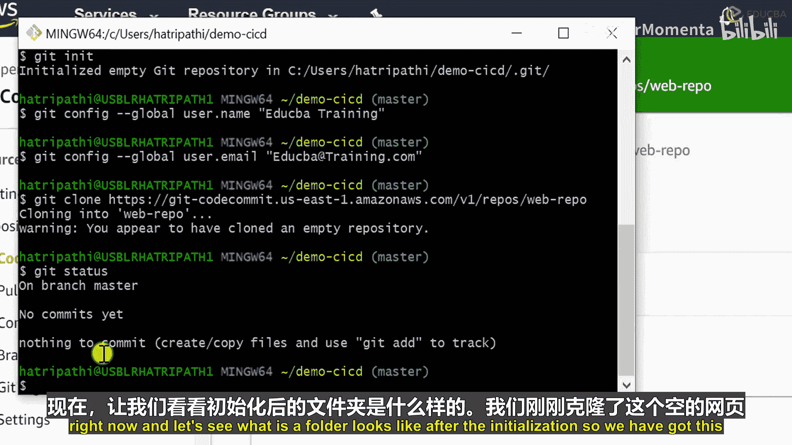

操作步骤如下：

1.  在 AWS CodeCommit 控制台找到并复制仓库的 HTTPS 克隆 URL。
2.  在本地终端执行 `git clone <仓库URL>` 命令。
3.  根据提示输入 AWS IAM 用户的访问凭证（用户名和密码）进行身份验证。

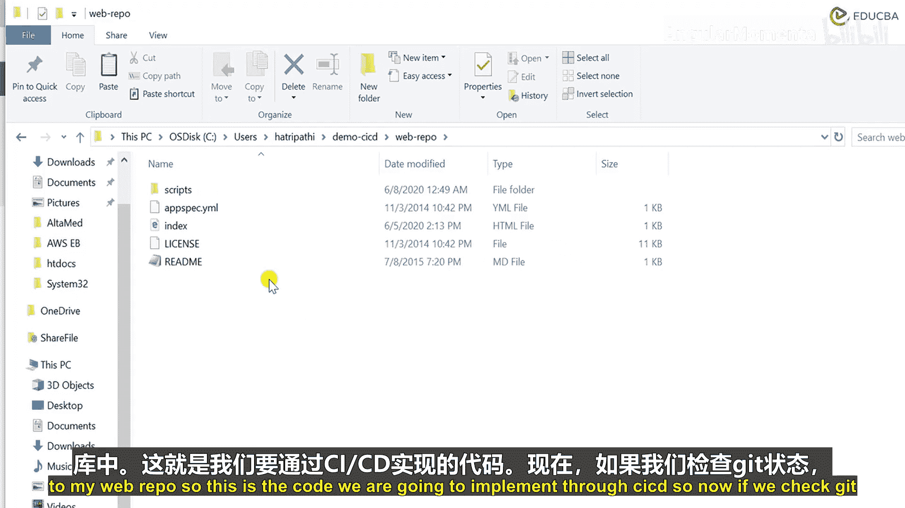

克隆成功后，你会看到一个警告，提示克隆了一个空仓库。这是正常的，因为我们尚未向远程仓库推送任何代码。

## 添加代码并提交到本地仓库

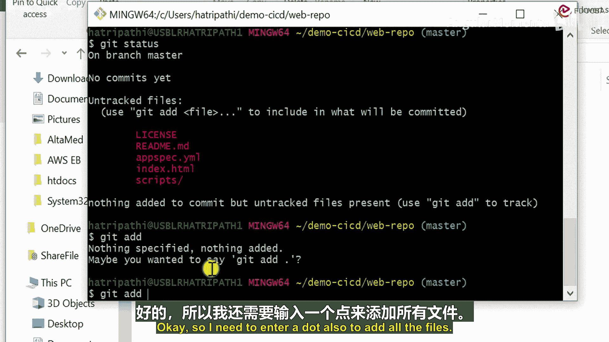

现在，我们已经将远程仓库克隆到本地。本节中我们来看看如何将项目代码添加到本地仓库并进行提交。

以下是操作流程：

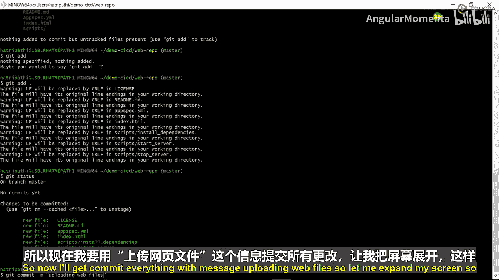

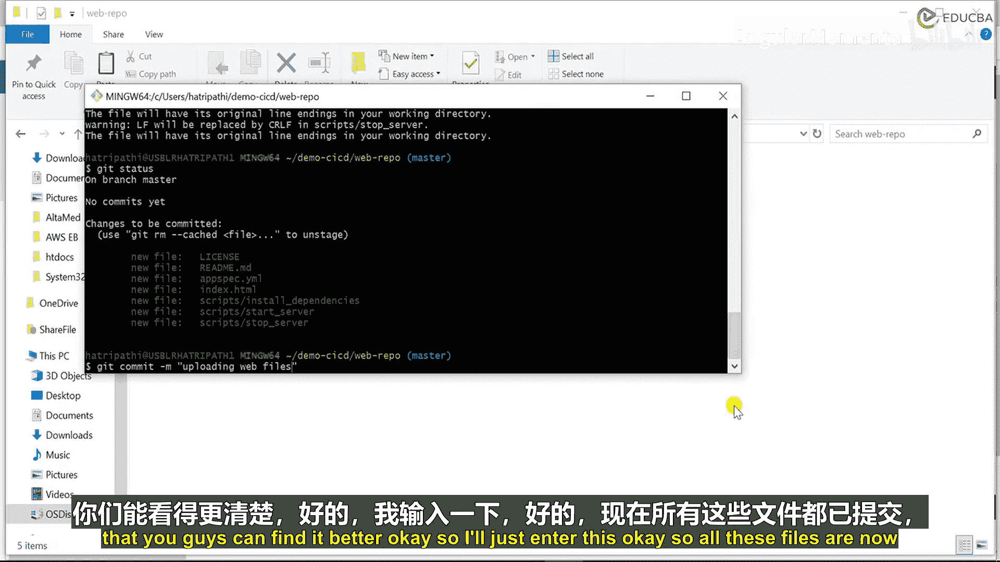

1.  将你的项目代码文件复制到克隆下来的本地仓库文件夹中。
2.  使用 `git add .` 命令将所有新文件添加到 Git 的暂存区。
3.  使用 `git status` 命令可以查看已暂存等待提交的文件列表。
4.  使用 `git commit -m “Initial commit”` 命令将暂存区的文件提交到本地仓库，并附上提交信息。

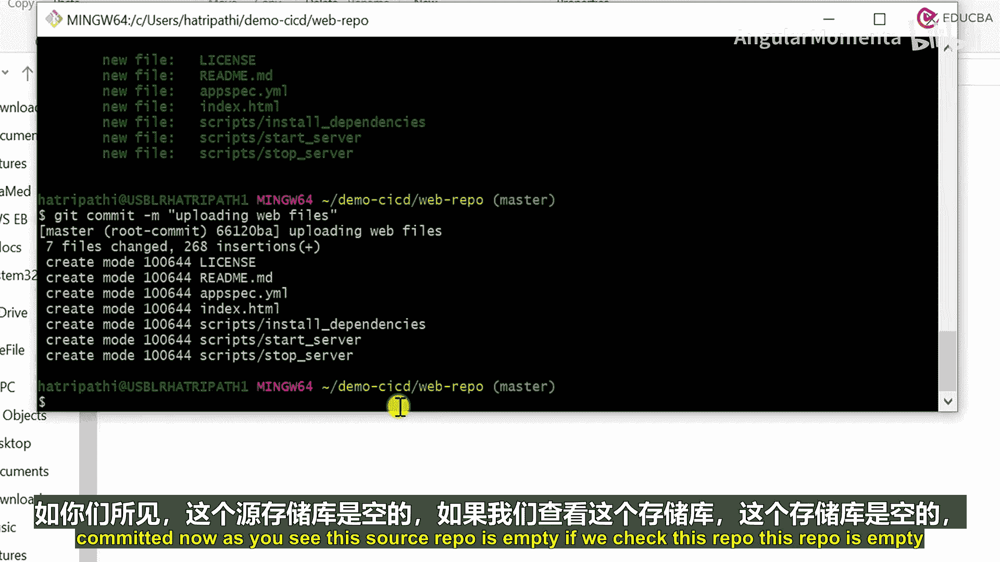

## 将本地提交推送到远程仓库

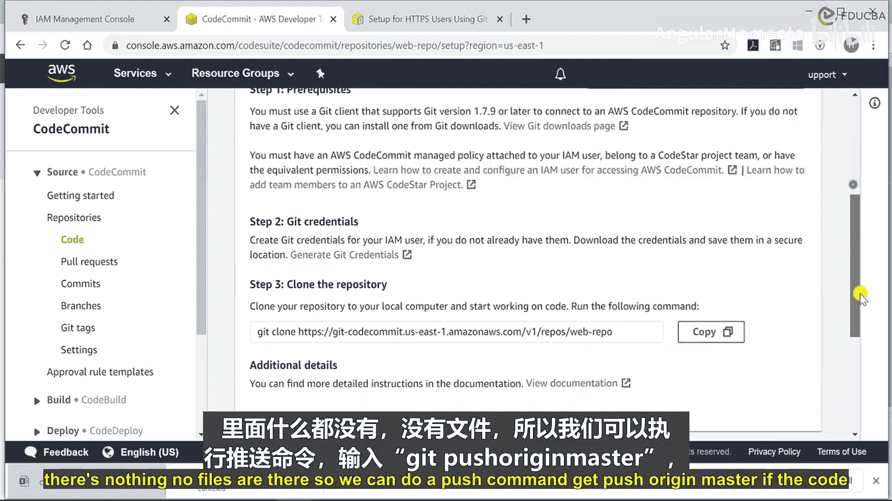

代码已提交到本地仓库，最后一步是将其同步到 AWS CodeCommit 远程仓库，以便团队协作和后续的 CI/CD 流程。

执行以下命令进行推送：
```bash
git push origin master
```
此命令会将本地 `master` 分支的提交推送到名为 `origin` 的远程仓库。

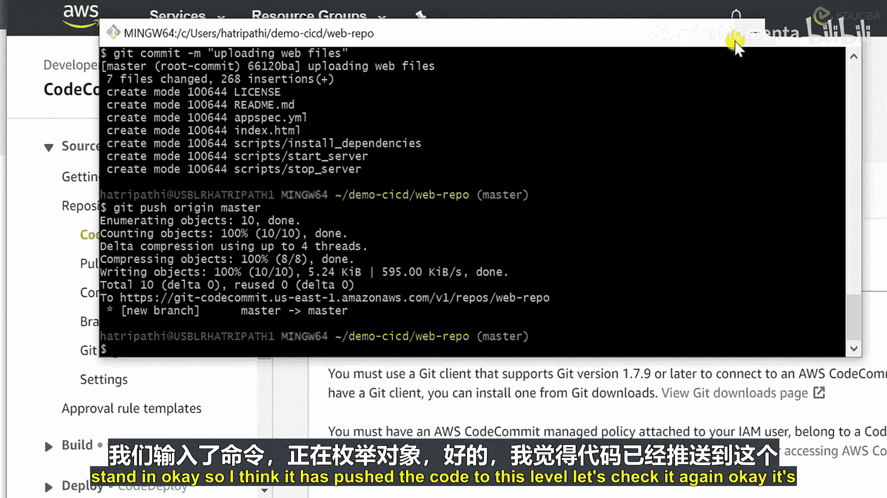

推送完成后，你可以刷新 AWS CodeCommit 控制台的代码浏览页面。之前空白的仓库现在应该显示了你刚刚推送的所有代码文件，这标志着本地代码已成功托管至云端。

---

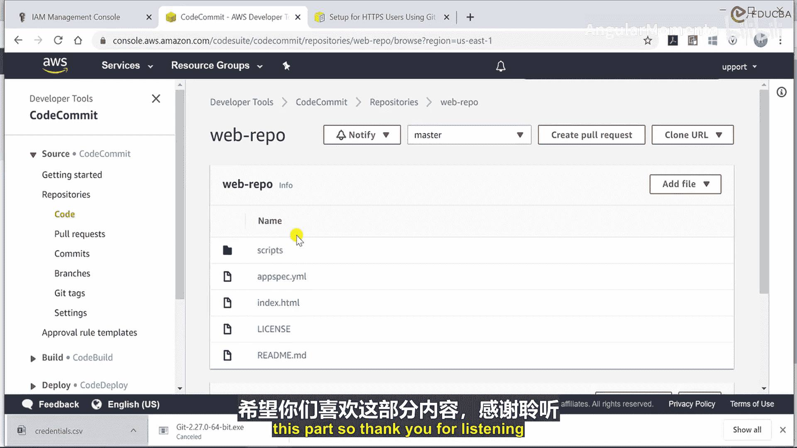

本节课中我们一起学习了使用 Git 命令行工具操作 AWS CodeCommit 的核心步骤：从初始化本地仓库、配置用户、克隆远程仓库，到添加代码、提交更改，最终将代码推送至云端。掌握这些操作是构建自动化部署流水线的坚实基础。