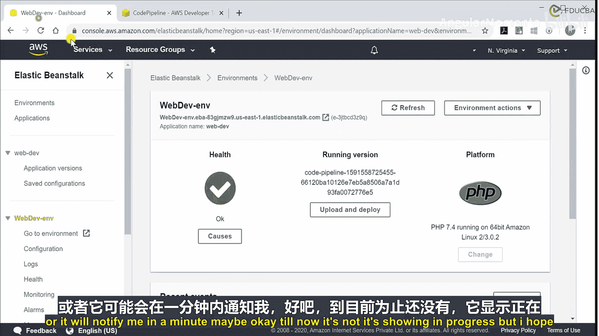
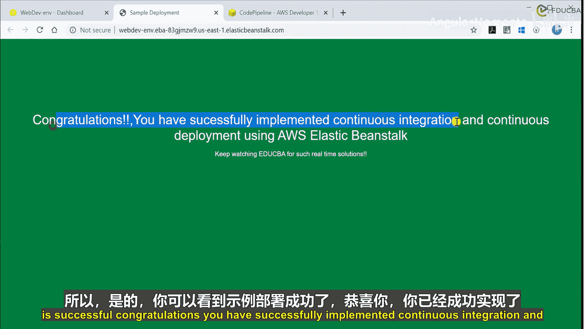
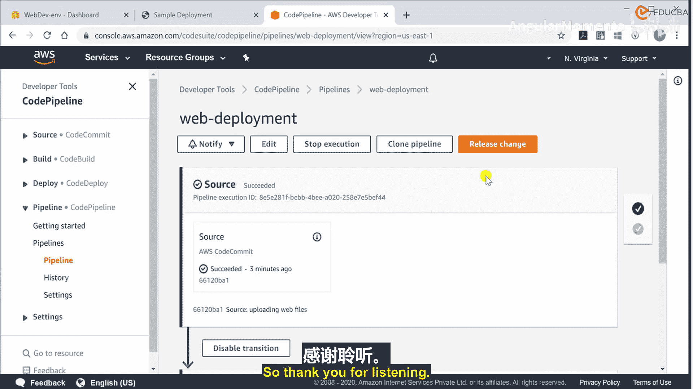

# 007：P07 01_02_03_代码流水线配置 🚀

在本节课中，我们将学习如何配置一个完整的CI/CD（持续集成/持续部署）流水线。我们将使用AWS CodePipeline，将存储在AWS CodeCommit仓库中的代码，自动部署到AWS Elastic Beanstalk环境中。

上一节我们介绍了如何将代码提交到AWS CodeCommit仓库。现在，我们将创建一个流水线来自动化构建和部署过程。

## 创建流水线

首先，我们需要在AWS控制台中创建一条新的流水线。

1.  在AWS控制台搜索并进入 **CodePipeline** 服务。
2.  点击 **创建流水线** 按钮。
3.  为流水线命名，例如 `WebDeploymentPipeline`。
4.  在“服务角色”部分，选择 **允许CodePipeline创建服务角色**。这将由AWS自动创建一个拥有必要权限的角色。
5.  其他高级设置（如用于存储构件的S3桶和加密方案）保持默认即可。
6.  点击 **下一步**。

## 配置源代码阶段

现在，我们需要指定代码的来源。

1.  在“源提供商”中，选择 **AWS CodeCommit**，因为我们的代码存储在那里。
2.  选择之前创建的仓库（例如 `WebRepo`）和分支（例如 `master`）。
3.  在“更改检测选项”中，选择 **使用CloudWatch事件**。这样，每当有新的代码提交到仓库时，流水线就会自动触发。
4.  点击 **下一步**。

## 跳过构建阶段

由于我们的项目是一个基本的静态网站，不需要编译或构建过程，因此可以跳过此阶段。

1.  在“构建提供商”步骤，直接点击 **跳过构建阶段**。
2.  确认弹出的警告信息。

## 配置部署阶段

接下来，我们设置将代码部署到哪里。

1.  在“部署提供商”中，选择 **AWS Elastic Beanstalk**。
2.  确保区域与你的资源所在区域一致（例如 `美国东部（弗吉尼亚北部）`）。
3.  选择对应的Elastic Beanstalk **应用程序名称**（例如 `WebDeploy`）和 **环境名称**（例如 `WebDevEnv`）。
4.  点击 **下一步**。

## 审核并创建

在此步骤，你可以回顾流水线的所有配置。

1.  仔细检查所有设置，确保源代码、部署目标等信息正确无误。
2.  确认无误后，点击 **创建流水线**。

流水线创建成功后，它会立即检测CodeCommit仓库中的代码并开始执行首次部署。你可以在CodePipeline控制台看到部署进度。

## 验证部署结果

部署完成后，你可以通过Elastic Beanstalk环境的URL访问你的网站。如果部署成功，网站内容将从原始的AWS示例页面，更新为你提交到CodeCommit仓库中的代码。

## 管理流水线

创建完成后，你可以在CodePipeline控制台进行以下操作：

*   **查看详情**：点击流水线名称，查看其结构和当前状态。
*   **检查历史记录**：在“历史记录”选项卡中，查看所有过往的执行记录、状态（成功/失败）以及详细的执行日志。
*   **修改配置**：在“配置”选项卡中，可以更新源代码、部署目标等设置。
*   **查看构件**：了解流水线生成的构件存储在哪个S3桶中。
*   **管理权限**：查看流水线使用的服务角色和策略。

本节课中，我们一起学习了如何配置一个连接AWS CodeCommit和Elastic Beanstalk的完整CI/CD流水线。我们设置了源代码自动检测、跳过了不必要的构建阶段，并成功实现了代码的自动部署。通过这条流水线，任何提交到主分支的代码变更都将自动、快速地被部署到线上环境，极大地提升了开发效率。

在接下来的课程中，我们将为流水线配置通知功能，以便在部署发生时通过邮件等方式及时获知状态，从而更好地监控我们的AWS环境。