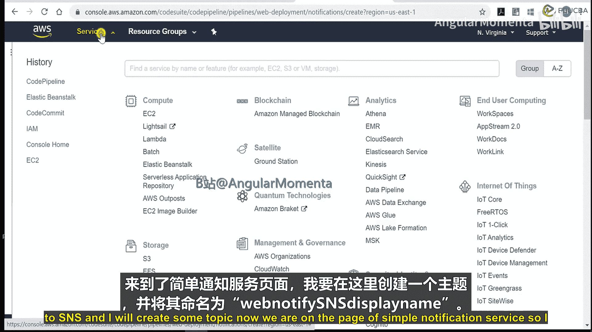
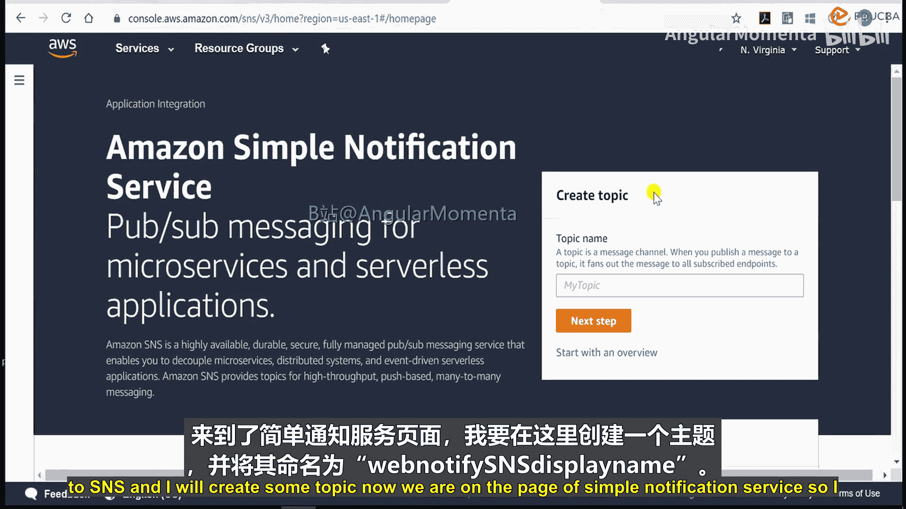
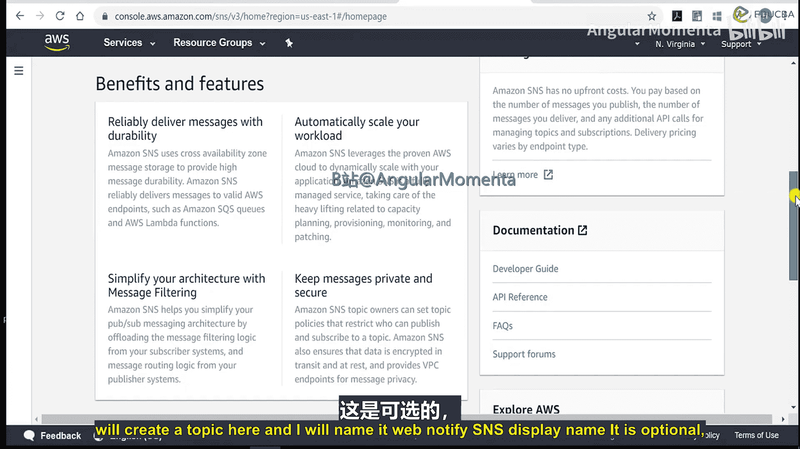
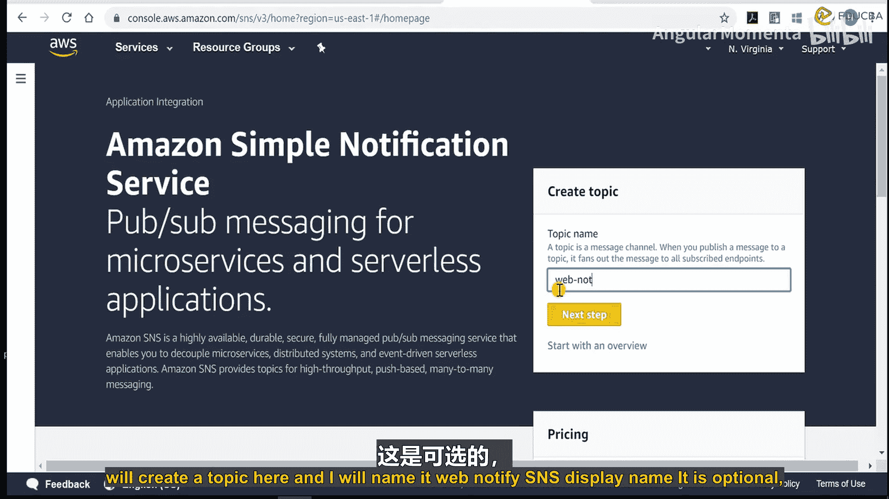
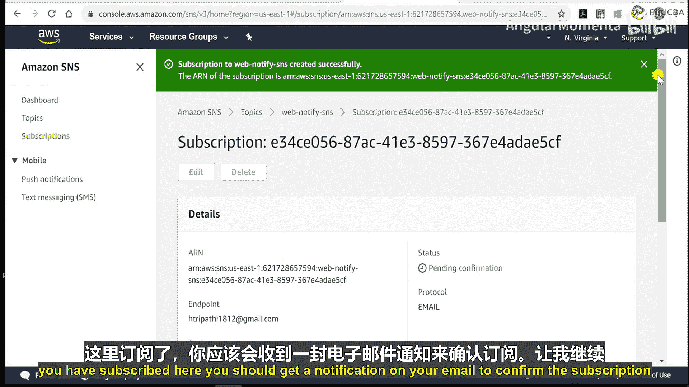
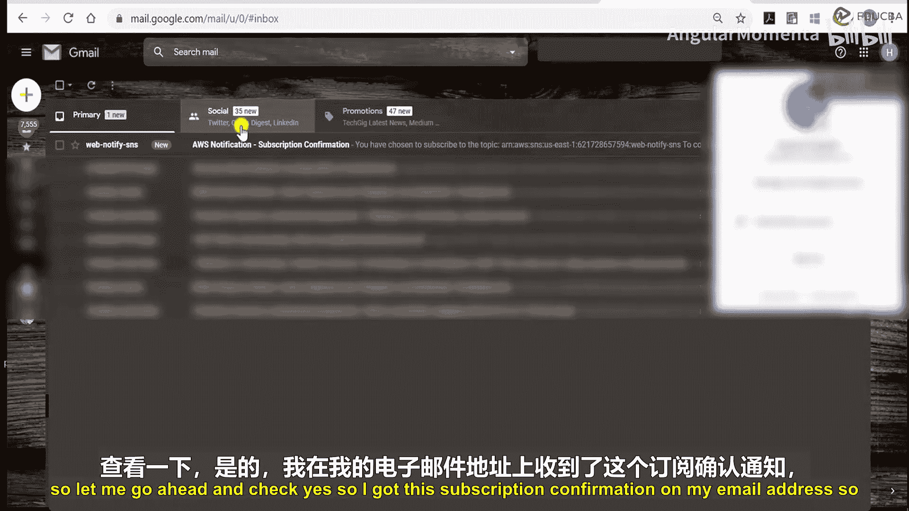
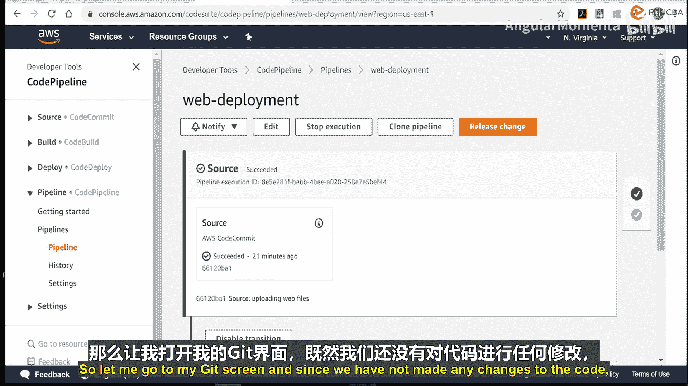
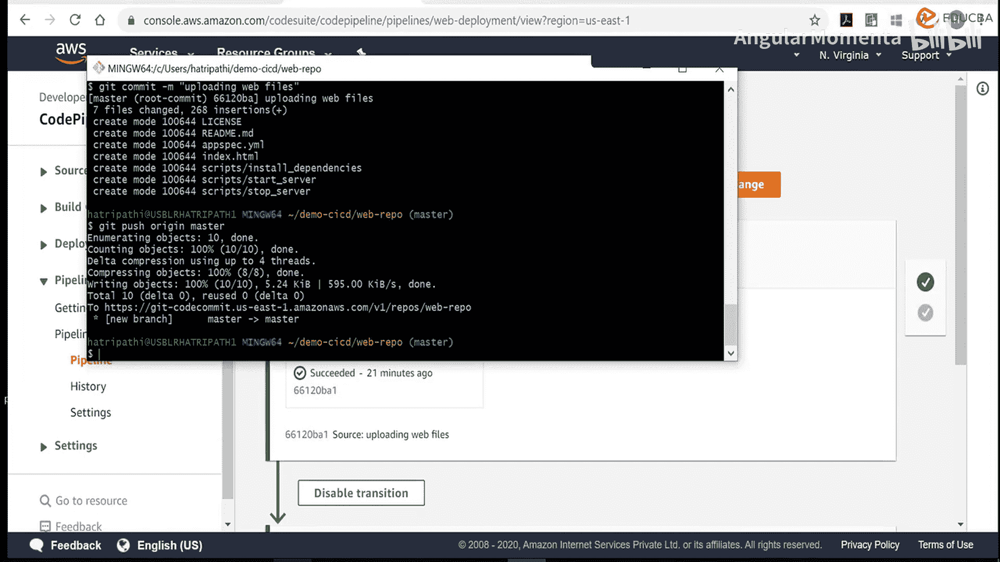
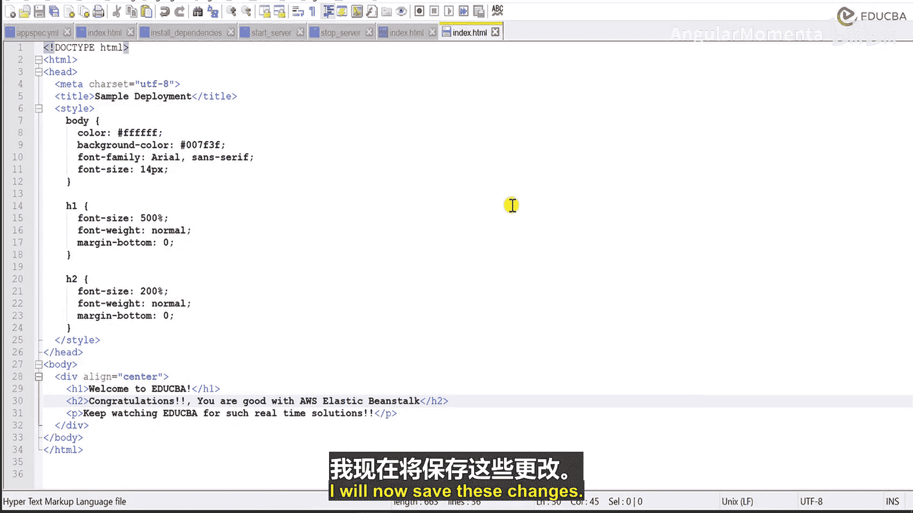

# 008：部署通知 📧

## 概述
在本节课中，我们将学习如何为AWS CodePipeline配置部署通知。通过使用AWS Simple Notification Service (SNS)，我们可以设置邮件提醒，以便在代码部署的各个阶段（无论是成功还是失败）都能及时收到通知。

在上一节中，我们介绍了如何将源代码集成到AWS CodeCommit，并通过CodePipeline将其部署到AWS Elastic Beanstalk。本节中，我们来看看如何为这个流程添加通知功能。

## 创建通知规则
以下是创建通知规则的步骤。

首先，在已创建的CodePipeline（例如 `web-deployment`）中，找到并点击“创建通知规则”的选项。

1.  **命名规则**：为通知规则指定一个名称，例如 `web-notify`。
2.  **选择详细级别**：选择“完整”级别，以便获取所有操作细节的通知。
3.  **选择通知事件**：选择您希望接收通知的事件类型。这包括：
    *   **操作执行**：成功、失败、取消、已开始。
    *   **阶段执行**：已开始、成功、已恢复、已取消、失败。
    *   **管道执行**：失败、已取消、已开始、已恢复、成功、已取代。
    *   **手动批准**：已开始、已批准、已拒绝、已覆盖、已需要。

> **注意**：手动批准功能将在后续课程中介绍，目前可以全选以确保收到所有相关活动的通知。

## 配置SNS主题作为通知目标
接下来，我们需要创建一个目标来接收这些通知。我们将使用AWS SNS服务创建一个主题，并订阅我们的邮箱。

以下是创建SNS主题和订阅的步骤。

1.  导航到AWS管理控制台的 **Simple Notification Service (SNS)** 页面。
2.  点击“创建主题”。
3.  选择主题类型为“标准”。
4.  为您的主题命名，例如 `web-notify-topic`。显示名称是可选的，可以填写相同名称。
5.  配置其他选项（可根据生产环境需求调整，本教程使用默认设置）：
    *   **加密**：对于非机密信息，可暂时保持禁用。
    *   **访问策略**：保持默认设置，仅允许主题所有者发布消息。
    *   **重试策略**：默认配置为在消息传递失败时重试3次，每次延迟20秒。
    *   **交付状态日志记录**：可选功能，本教程暂不启用。
    *   **标签**：可选，用于资源管理。
6.  点击“创建主题”。

主题创建完成后，需要为其添加订阅者。

1.  在新创建的主题详情页，点击“创建订阅”。
2.  选择协议为 **`Email`**。
3.  在“端点”字段中，输入您希望接收通知的邮箱地址。
4.  点击“创建订阅”。

订阅创建后，您指定的邮箱会收到一封确认订阅的邮件。**必须点击邮件中的确认链接**，订阅才会生效。

## 在CodePipeline中关联SNS主题
现在，我们需要回到CodePipeline，将创建好的SNS主题设置为通知目标。

1.  返回CodePipeline的“通知规则”创建页面。
2.  在“目标”部分，选择您刚刚创建的SNS主题（例如 `web-notify-topic`）。
3.  点击“提交”，完成通知规则的创建。

## 测试通知功能
为了验证通知配置是否生效，我们可以触发一次新的部署。

以下是测试步骤。

1.  前往您的AWS CodeCommit代码仓库。
2.  修改项目中的某个文件（例如 `index.html`），例如更新一些文本内容。
3.  提交并推送这次代码更改。
4.  CodePipeline会自动检测到代码变更并开始执行部署流程。

此时，请检查您的邮箱。您应该会收到来自SNS的多封邮件，分别对应管道执行开始、源代码阶段成功、部署阶段开始、部署成功等各个事件。这证明通知系统已成功配置并正常工作。

## 总结
本节课中，我们一起学习了如何为AWS CodePipeline配置部署通知。我们通过创建SNS主题和订阅，将管道执行的关键事件（如成功、失败、状态变更）以邮件形式通知给相关人员。这确保了开发团队能够及时了解部署状态，是构建健壮的CI/CD流程中的重要一环。