# 009：部署持续通知 📨

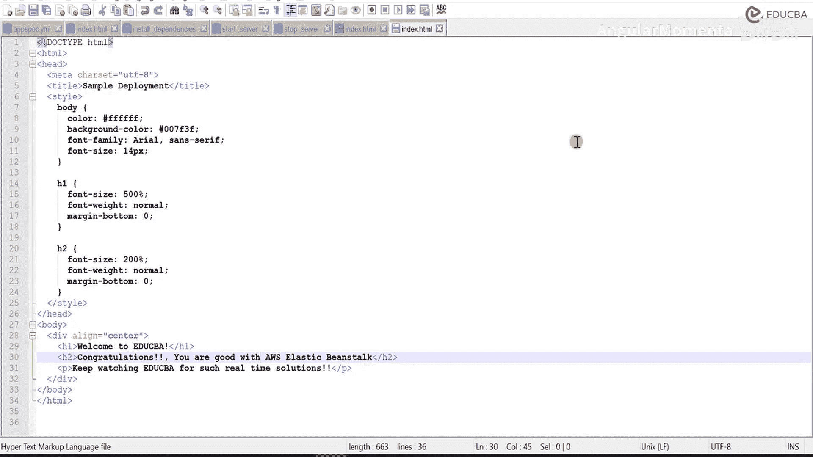

在本节课中，我们将学习如何为AWS CodePipeline配置持续通知。通过设置通知，您可以在代码提交、构建和部署的每个阶段自动收到更新，从而无需手动登录控制台即可跟踪项目状态。

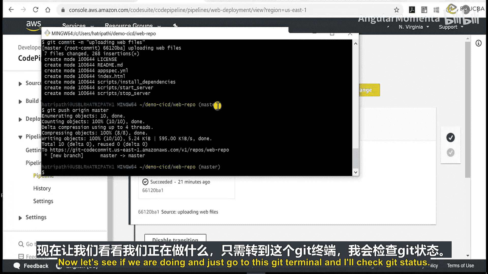

上一节我们完成了CI/CD管道的搭建，本节中我们来看看如何配置通知功能，以便及时了解部署动态。

---

现在，检查当前操作并前往相应页面。


检查其状态。确认是否显示索引文件已被修改。

现在需要提交此更改。然后将其推送到AWS CodeCommit仓库。再次执行操作。

执行提交命令。需要提供提交信息。

```bash
git commit index.html -m "updated index.html"
```

现在代码已提交，文件是`index.html`。接着将代码从本地主分支推送到远程主分支。

```bash
git push origin master
```

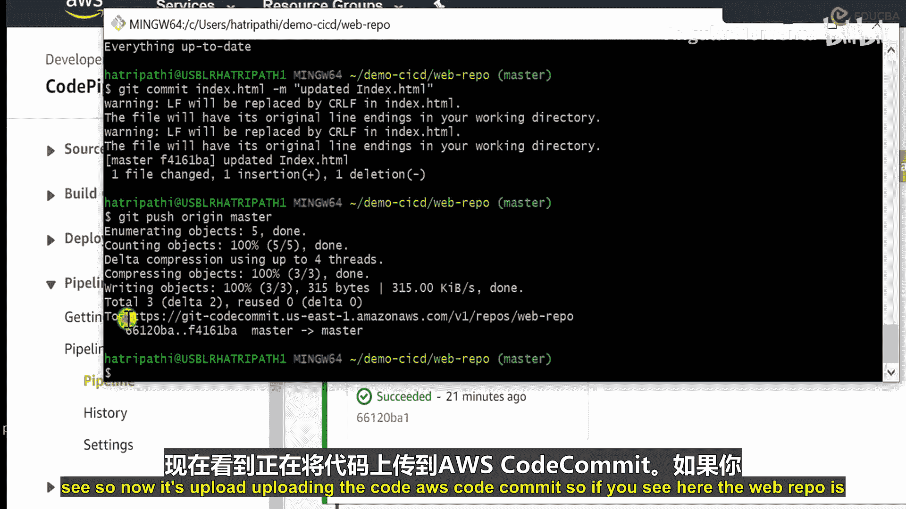

检查此处的问题。似乎我们刚刚执行了`git push`，但尚未指定文件。需要先使用`git commit`命令提交文件`index.html`。

```bash
git commit index.html -m "update the index process"
```

这就是提交命令。这里的`-m`代表提交信息，没有信息则无法提交，请确保为每次提交添加信息。

由于已提交，现在执行推送。

```bash
git push origin master
```

现在代码正在更新，AWS代码正在提交。可以看到，代码仓库已更新。

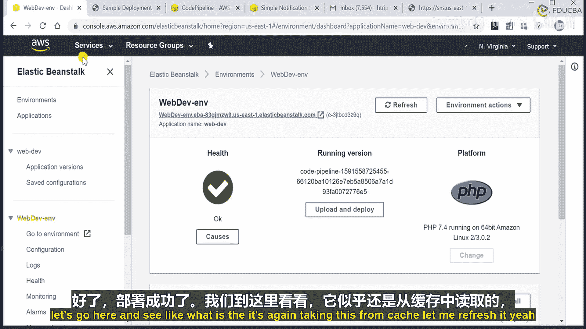


现在前往管道页面。上次检查是在21分钟前。它现在应该开始检查，因为我们已经将代码推送到代码仓库。

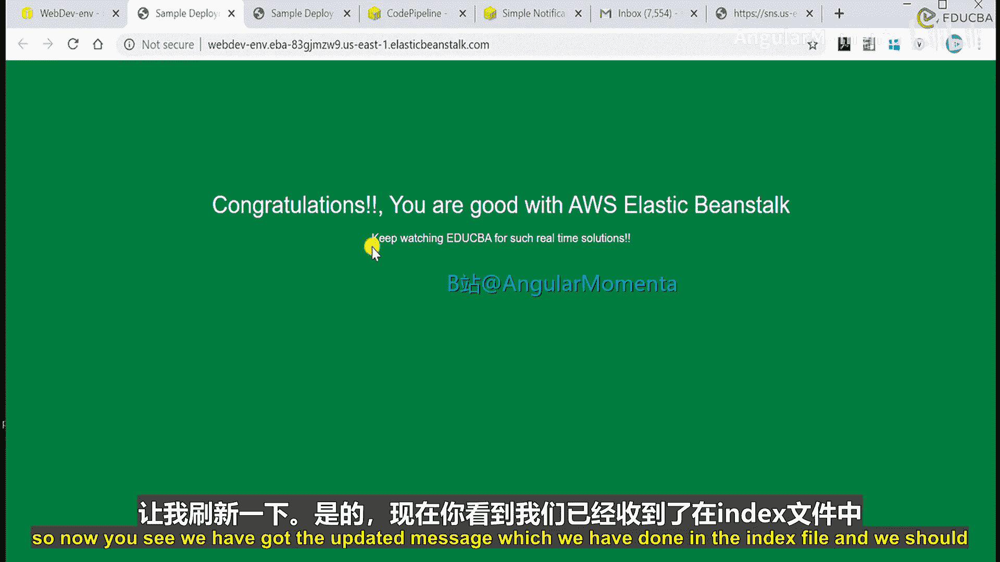

现在可以看到状态已变为“1分钟前”。这意味着我们收到了提交时输入的信息“updated index.html”。目前部署正在进行中。

等待部署完成。部署已成功。前往此处查看。


页面可能从缓存加载。刷新页面。现在可以看到我们在索引文件中更新的信息。

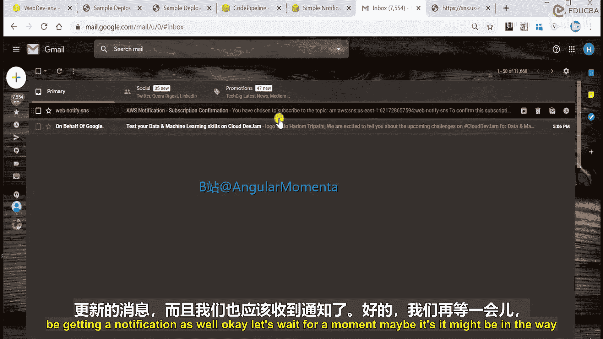


同时，我们应该会收到通知。稍等片刻。可能正在发送中。我们将配置通知。再等待一下。

发现问题，通知主题无法访问。正在检查。由于原通知主题无法访问，我创建了一个新主题。


进入管理通知规则页面。进入通知设置。创建了一个具有此名称的新主题。可以看到它显示为“活动”状态。之前显示为“无法访问”，现在显示为“活动视图”。

我选择了这个主题并删除了它，然后创建了一个新的。如果您遇到问题，可能是AWS后端的问题。我创建了一条新规则。

查看这里的简单通知服务。我创建了这个新主题，并提供了相同的SNS端点。现在一切正常，我们正在接收通知。

但我会通过一次新的部署来展示整个过程。这是我们的管道。在此之前，我将对代码进行一些更改。

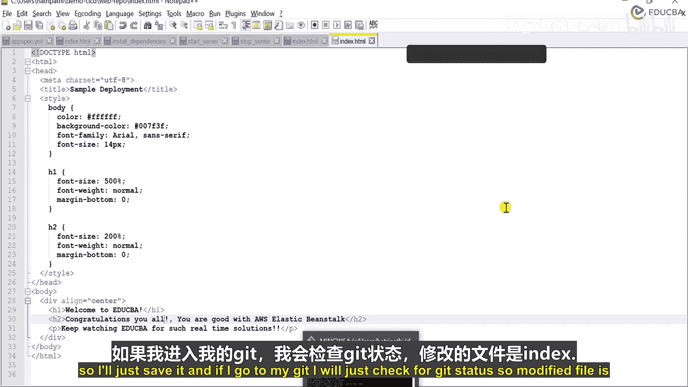

假设将“Congratulations”改为“Congratulations you all”。保存文件。


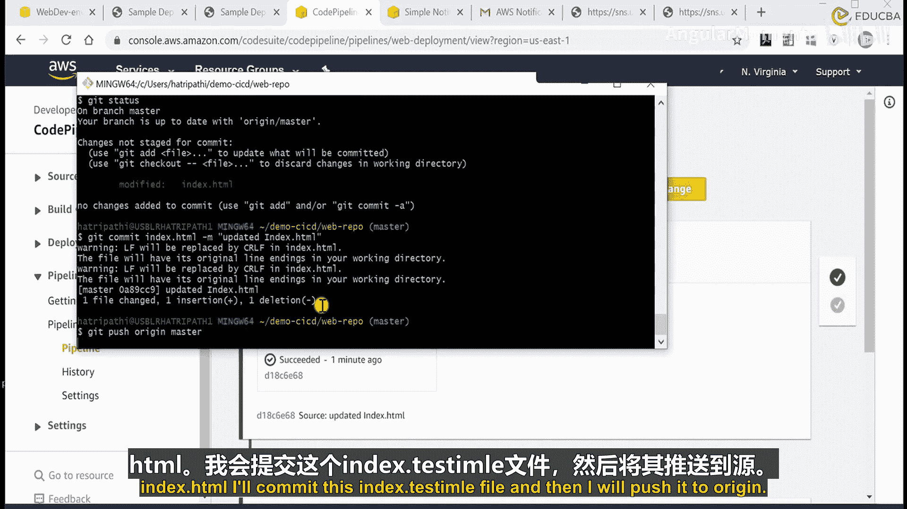

检查Git状态。已修改的文件是`index.html`。

提交此`index.html`文件。然后将其推送到GitHub。


在此处查看。刷新页面。它应该会获取新代码并开始部署。等待一分钟。再次刷新。可以看到部署正在进行中。

检查是否收到任何通知。现在收到一条通知。查看其内容。关于此次部署执行已开始。我们收到了所有相关通知。

收到了更多新通知。查看这些，部署已开始。现在看起来不错，我们收到了所有状态转换的通知。

再次查看此处。部署现在应该已完成。是的，已成功。

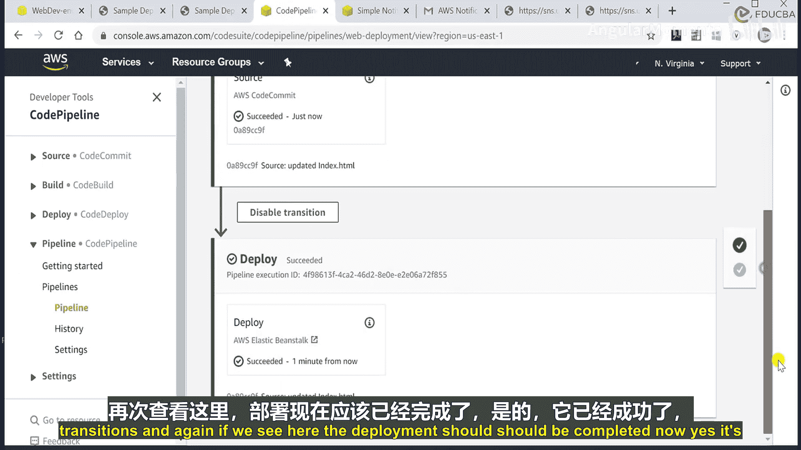


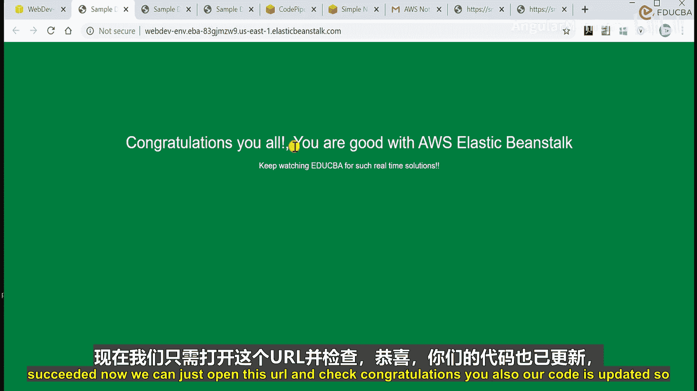

现在可以打开网站并检查。“Congratulations you all”已显示。


这就是我们为CI/CD管道中的所有操作配置通知的方法。它帮助我们跟踪环境中发生的情况，而无需登录环境，并能及时获得更新。

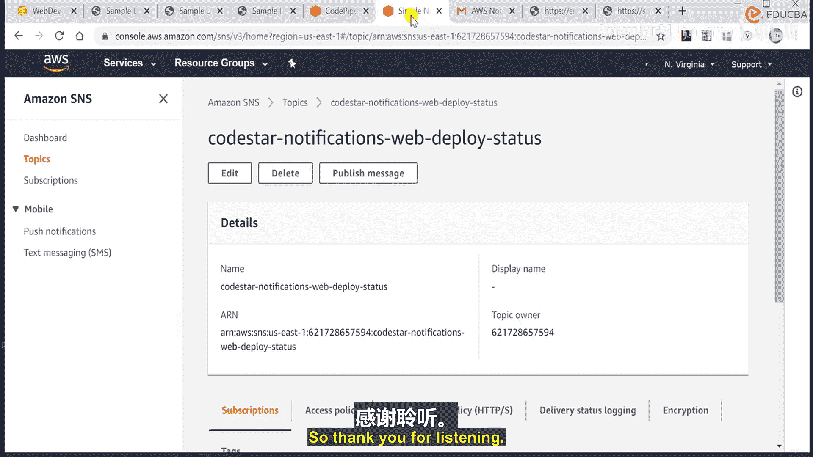

本节课中我们一起学习了如何为AWS CodePipeline配置持续通知。通过设置SNS主题和通知规则，您可以自动接收代码提交、构建和部署等关键事件的提醒，从而实现对CI/CD流程的自动化监控。