# 010：配置审批阶段 🛠️

在本节课中，我们将学习如何为现有的部署流水线添加更多阶段，包括一个生产环境阶段和审批阶段。通过配置审批，可以确保代码在部署到生产环境前获得必要的批准。

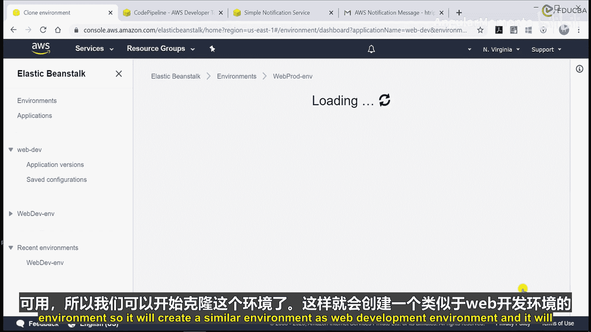

---

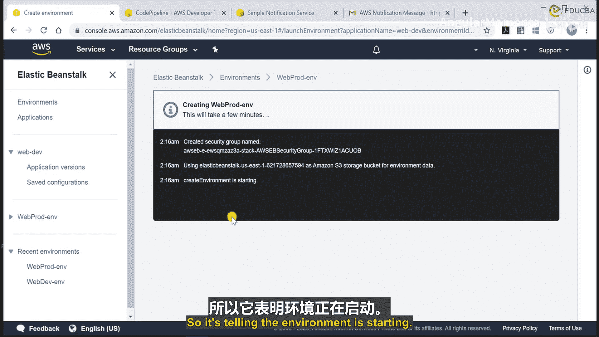

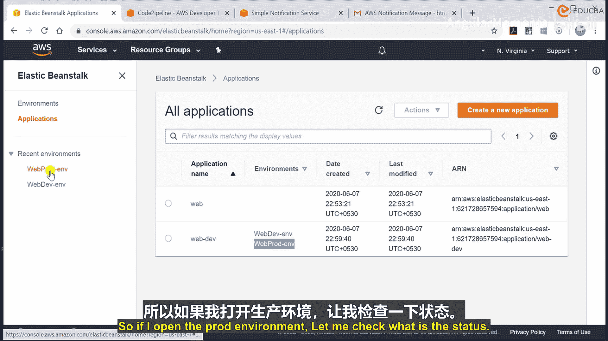

上一节我们设置了基本的开发环境部署流水线。本节中，我们将扩展这个流水线，使其包含一个生产环境和一个手动审批环节。

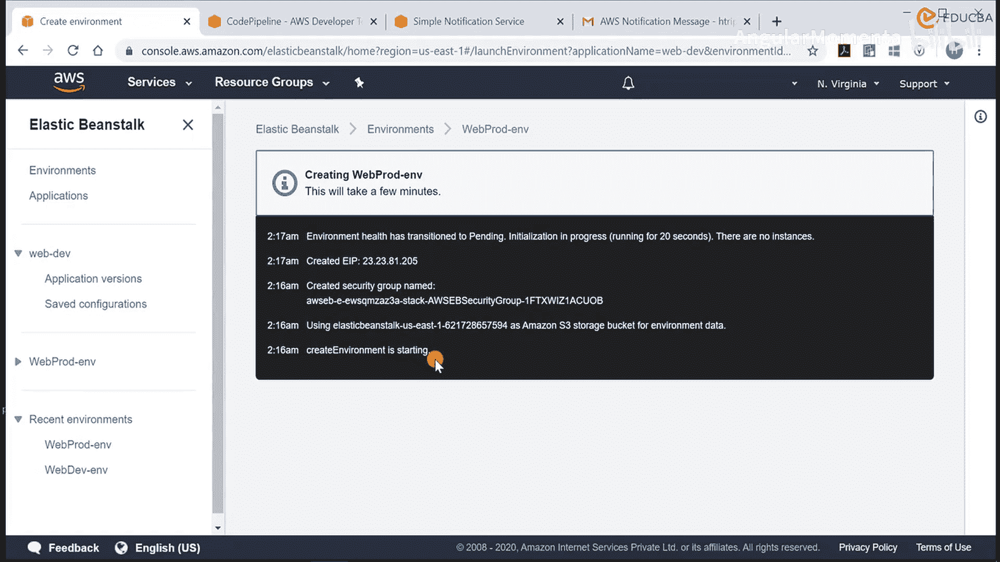

## 创建生产环境

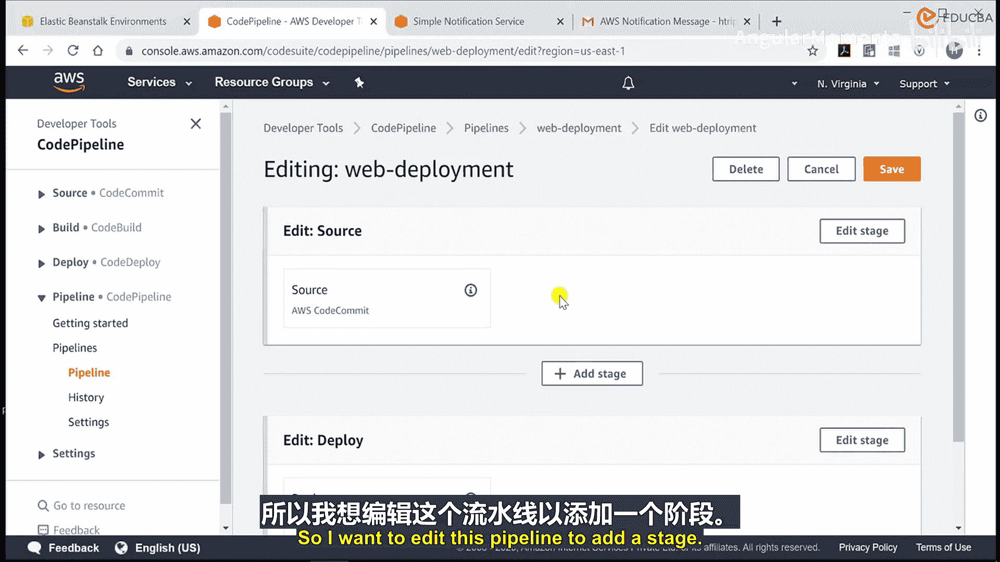

首先，我们需要为生产部署创建一个新的Elastic Beanstalk环境。

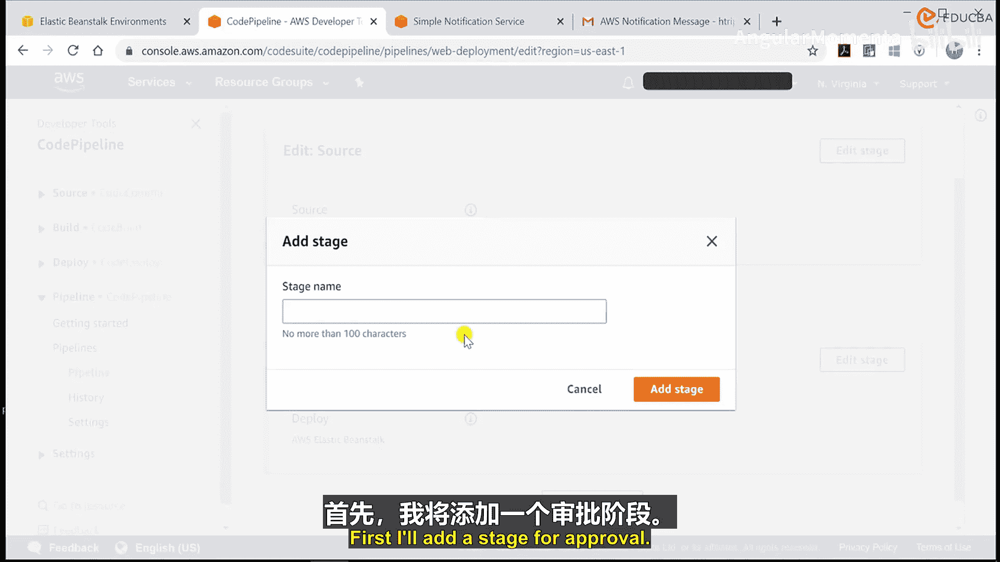

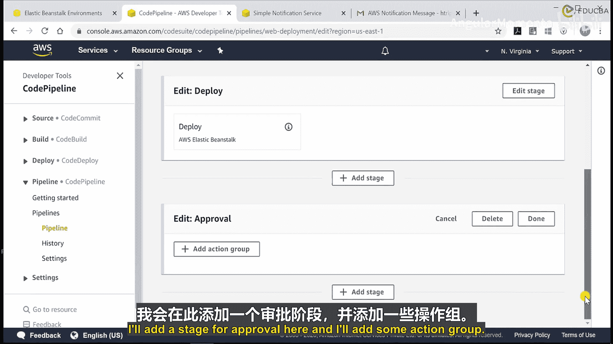

1.  导航到Elastic Beanstalk控制台的“环境”部分。
2.  选择现有的开发环境（例如 `web-dev-env`）。
3.  点击“克隆环境”选项。
4.  将新环境命名为 `web-prod-env`。
5.  确认URL可用后，开始创建克隆环境。

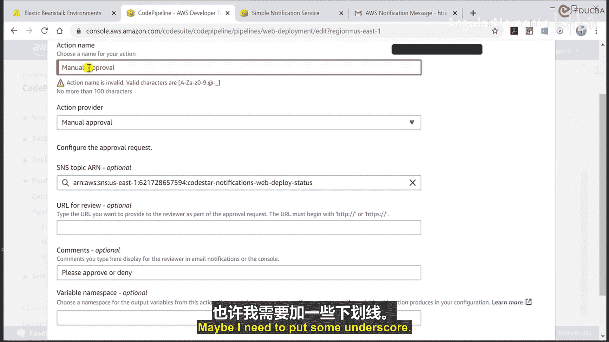

创建过程需要一些时间。在等待环境启动的同时，我们可以开始配置流水线的多阶段部署。

## 配置流水线阶段

环境准备就绪后，我们需要编辑现有的CodePipeline流水线，为其添加新的阶段。

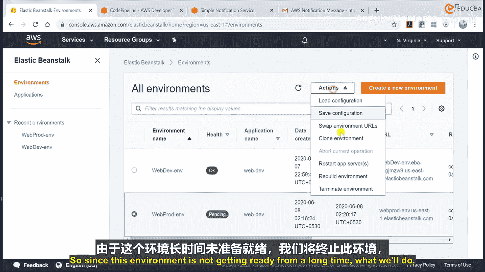

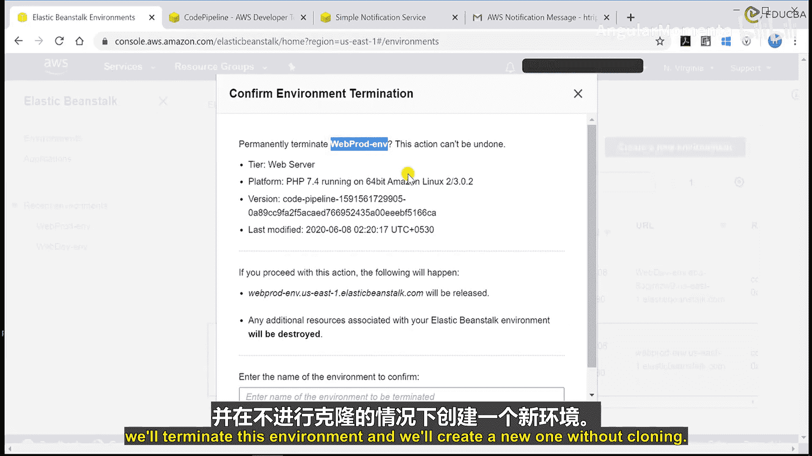

以下是需要添加的步骤：

1.  **添加审批阶段**：在开发部署阶段之后，添加一个用于手动审批的阶段。
2.  **添加生产部署阶段**：在审批通过后，添加一个用于部署到生产环境的阶段。

### 1. 添加审批阶段

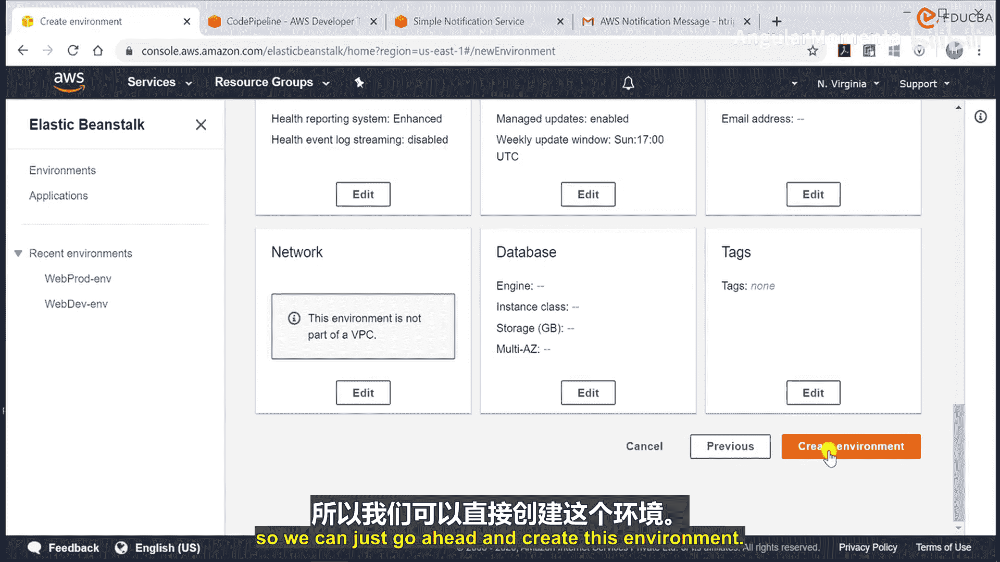

在流水线编辑器中，执行以下操作：

*   在开发部署阶段后，点击“添加阶段”。
*   将阶段命名为 `Approval`。
*   在该阶段内，点击“添加操作组”。
*   配置操作：
    *   **操作名称**：`Manual-Approval`
    *   **操作提供者**：选择“Manual approval”
    *   **配置**：
        *   **SNS主题**：选择一个已存在的SNS主题（例如 `web-dev-pipeline`），用于发送审批通知。
        *   **说明**：可填写“请批准或拒绝此次部署”。

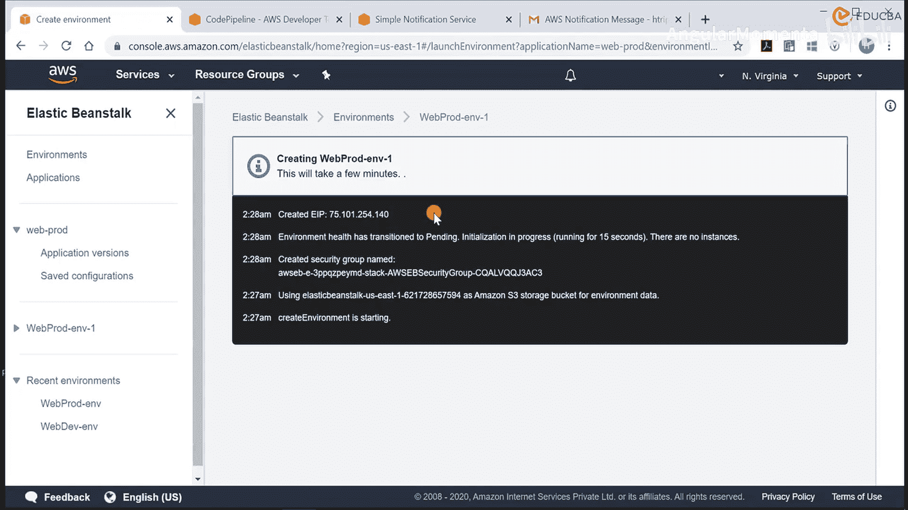

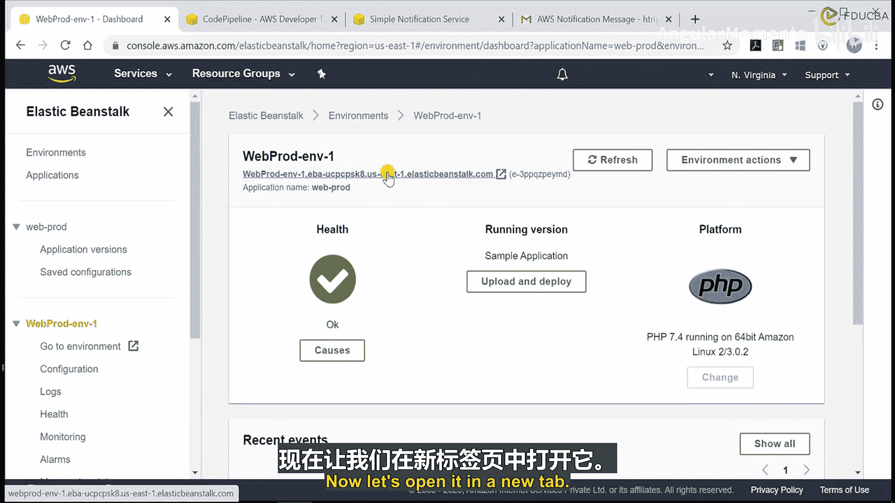

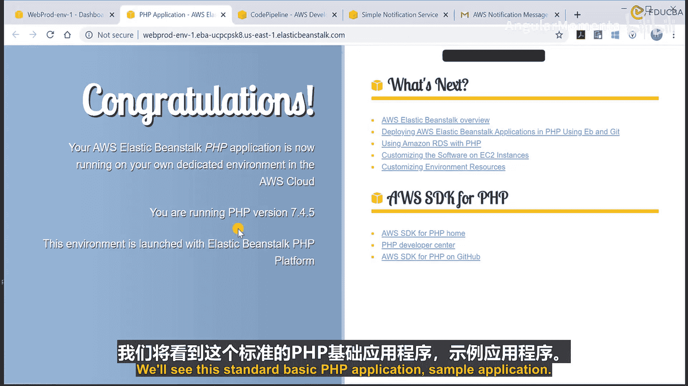

### 2. 添加生产部署阶段

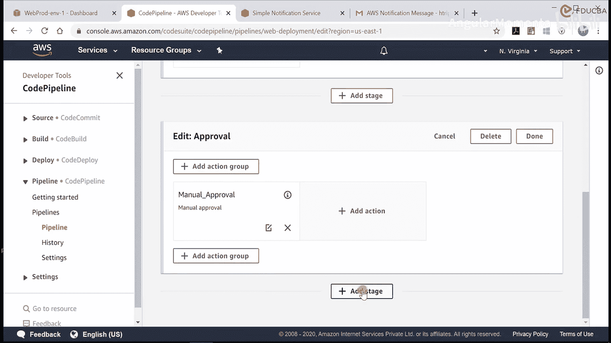

审批阶段配置完成后，添加生产部署阶段。

*   在审批阶段后，点击“添加阶段”。
*   将阶段命名为 `Prod-Deployment`。
*   在该阶段内，点击“添加操作组”。
*   配置操作：
    *   **操作名称**：`Deploy-to-Prod`
    *   **操作提供者**：选择“AWS Elastic Beanstalk”
    *   **区域**：选择您的区域（例如 `us-east-1`）
    *   **输入工件**：选择 `SourceArtifact`（即来自源阶段的代码）
    *   **应用程序名称**：选择您的Elastic Beanstalk应用程序（例如 `web-prod`）
    *   **环境名称**：选择刚创建的生产环境（例如 `web-prod-env`）

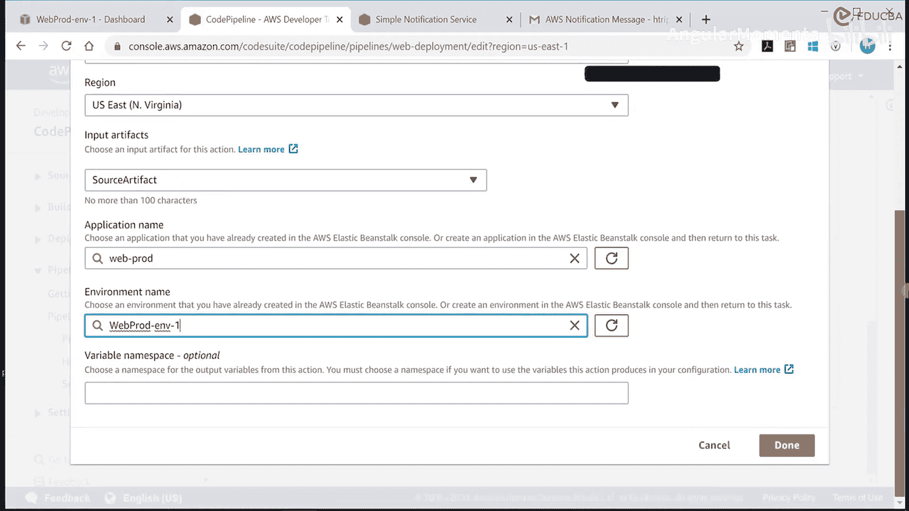

配置完成后，保存对流水线的所有更改。

## 总结

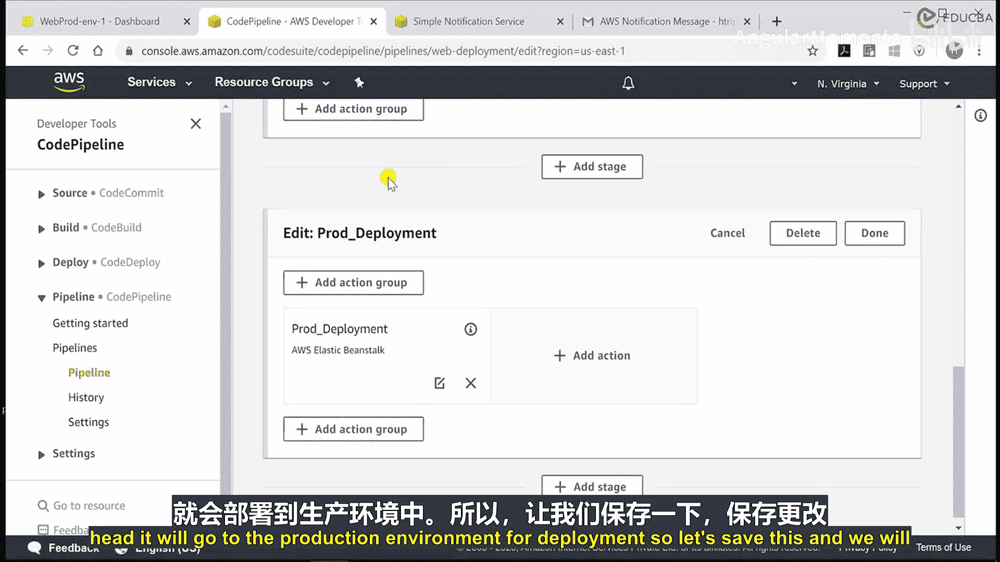

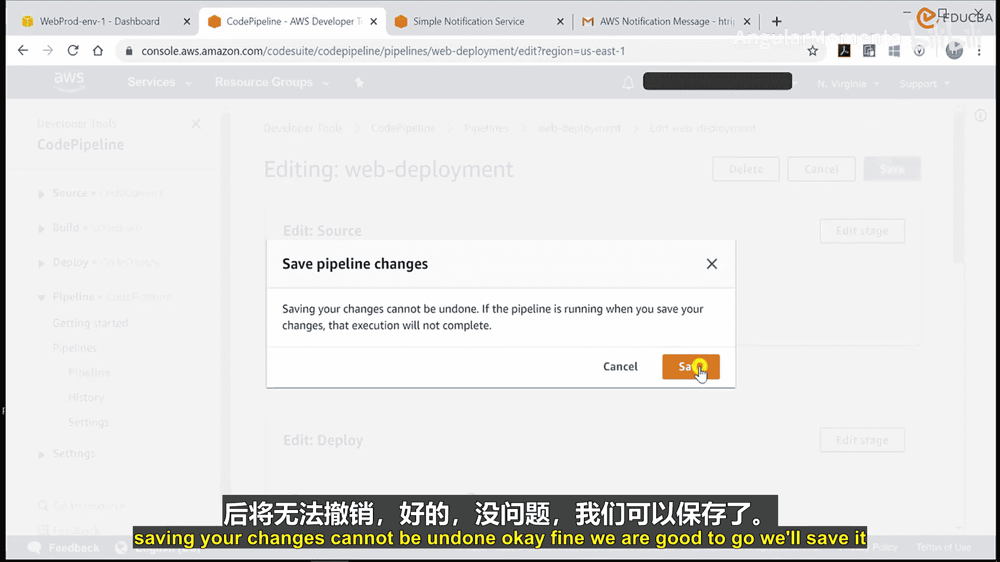

本节课中我们一起学习了如何扩展CI/CD流水线。我们创建了一个新的生产环境，并在流水线中加入了**手动审批阶段**和**生产部署阶段**。现在的完整流水线流程是：**源代码 -> 构建 -> 部署到开发环境 -> 等待手动批准 -> 部署到生产环境**。这种结构加强了对生产环境部署的控制，符合最佳实践。