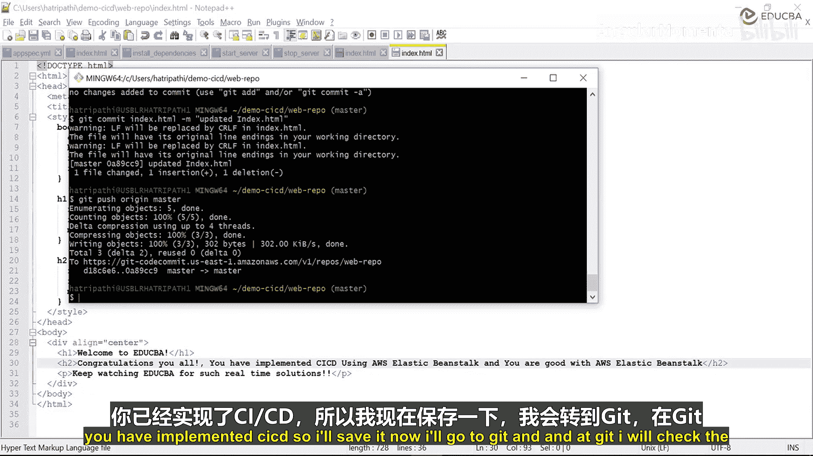
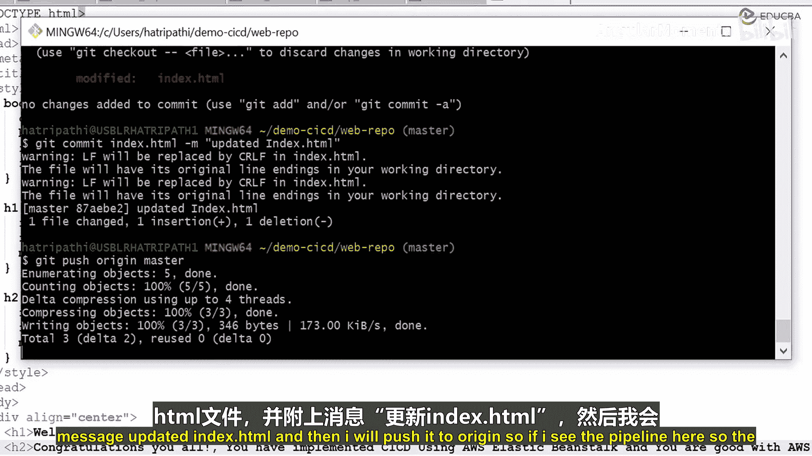
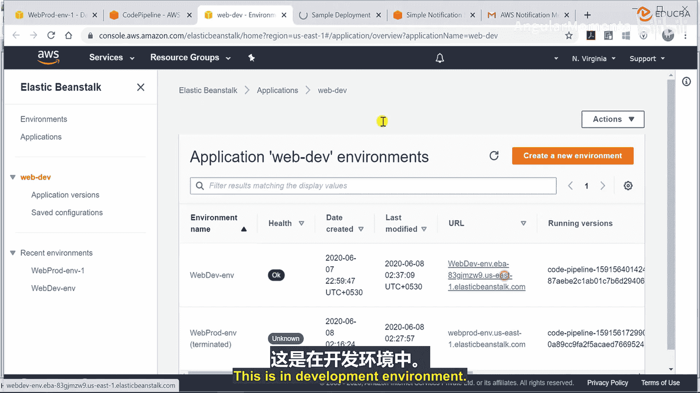
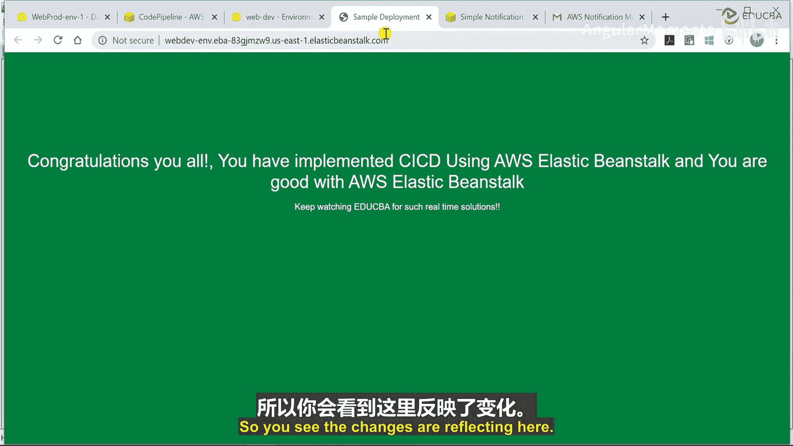
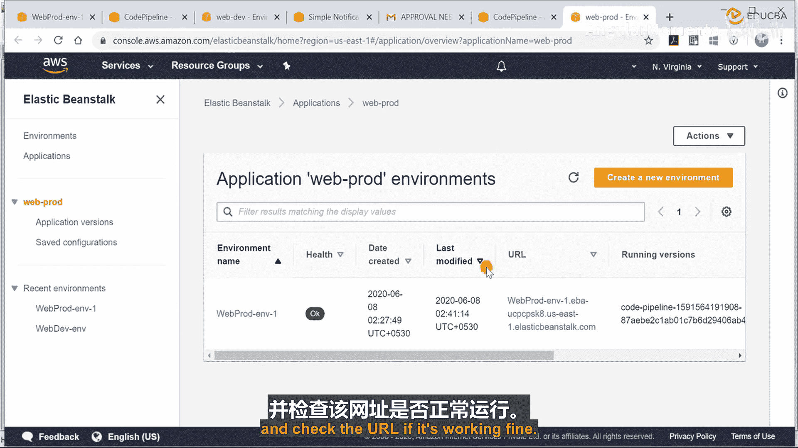
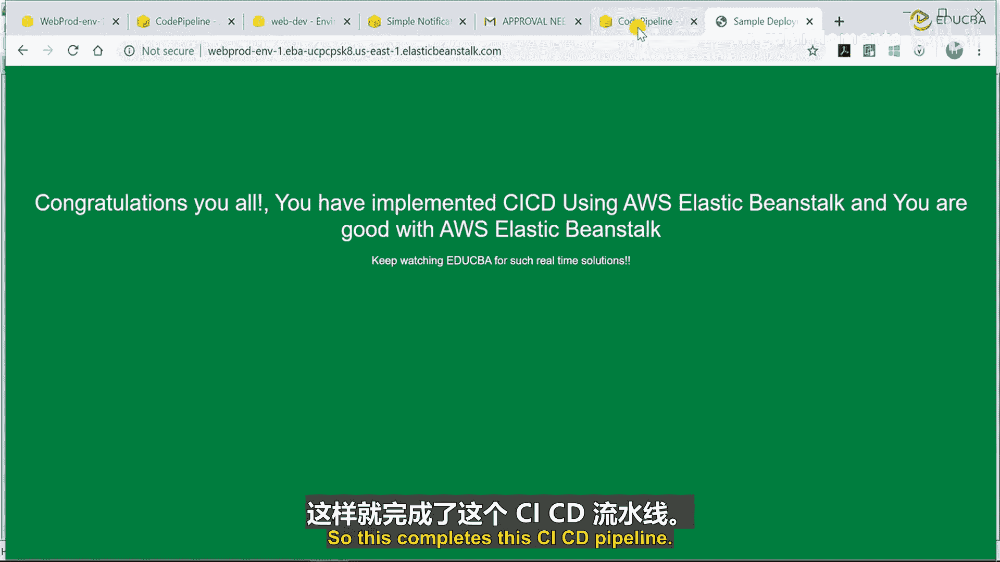
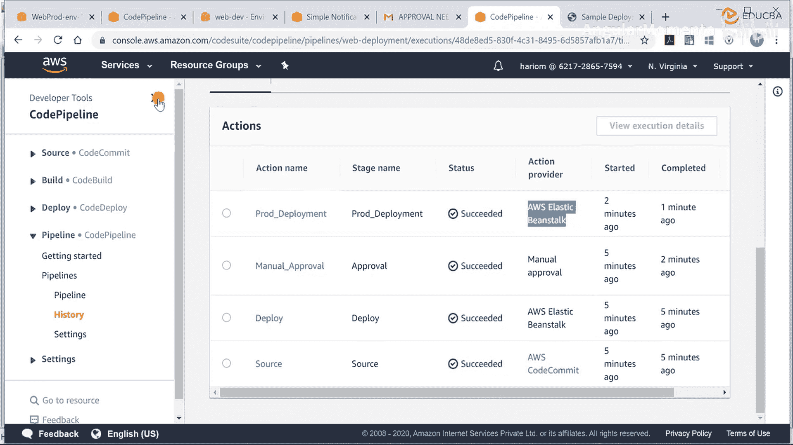

# 011：配置审批并继续 🚦

在本节中，我们将学习如何配置和使用 AWS CodePipeline 中的**审批阶段**。我们将通过修改代码、触发流水线、观察部署流程，并最终手动批准部署到生产环境，来完整演示一个包含审批环节的 CI/CD 流程。

## 概述

一个典型的企业部署流程通常包含四个阶段：**源代码提交**、**部署到预发布环境**、**人工审批**以及最终的**生产环境部署**。本节将重点展示在预发布环境部署成功后，如何通过审批来控制向生产环境的推进。

---

上一节我们配置了完整的流水线，本节中我们来看看当代码变更触发流水线后，审批环节是如何工作的。

首先，我对项目代码进行一个简单的修改。我将 `index.html` 文件中的内容更新为 “Welcome to EDUCBA. Congratulations, you all have implemented CI/CD.” 并保存文件。

接下来，我需要将这次修改提交到代码仓库。以下是操作步骤：

1.  使用 `git status` 命令检查文件变更状态。系统会提示 `index.html` 文件已被修改。
2.  使用命令 `git commit -m “updated index.html”` 提交这次修改。
3.  使用 `git push` 命令将提交推送到远程仓库。

完成代码推送后，流水线会自动被触发。我可以回到 AWS CodePipeline 控制台查看流水线的执行状态。

此时，流水线的 **Source（源代码）** 阶段已经开始执行。稍等片刻，代码检查完成后，部署流程将进入 **Deploy to Development（部署到开发环境）** 阶段。

部署成功后，我可以在开发环境的 Elastic Beanstalk 应用 URL 中看到我们刚才所做的文本更改已经生效。

---

在开发环境部署成功之后，流水线并没有立即继续。如下图所示，它停在了下一个阶段，并显示 **Approval（审批）** 状态。

这正是我们配置的审批环节。流水线在向生产环境部署之前，需要等待手动批准。

同时，由于我们在上一节配置了 Amazon SNS 通知，审批负责人也会收到一封请求批准的电子邮件。邮件中包含了流水线的详细信息和一个可直接批准或拒绝的链接。

现在，我作为审批人，将执行批准操作。在 CodePipeline 控制台的审批阶段，我可以添加评论（例如：“Looks good to me”），然后点击 **Approve（批准）**。

---

一旦批准操作完成，流水线的状态会立即更新。随后，流程将自动进入最终的 **Deploy to Production（部署到生产环境）** 阶段。

等待生产环境的部署完成。部署成功后，我访问生产环境的 Elastic Beanstalk 应用 URL，确认新的更改也已成功上线。

至此，整个 CI/CD 流水线从代码提交到生产部署的全流程已成功执行完毕。我们可以回顾一下整个流水线的结构：

## 总结

本节课我们一起学习了 CI/CD 流水线中**审批阶段**的完整工作流程。我们实践了从代码修改、提交、触发自动化部署到开发环境，再到等待人工审批，最后批准并完成生产部署的全过程。

关键点总结如下：
*   **流程控制**：审批阶段是控制代码从预发布环境进入生产环境的关键闸门。
*   **通知机制**：通过 SNS 服务，审批请求可以自动通过邮件等方式通知负责人。
*   **操作方式**：审批既可以在 CodePipeline 控制台完成，也可以通过邮件中的链接快速处理。
*   **紧急处理**：在流水线执行过程中，即使已获得批准，在必要时仍可通过控制台立即停止执行。

通过本实践，你应该已经掌握了如何在 AWS 上使用 Elastic Beanstalk 和 CodePipeline 构建一个包含审批环节的稳健的 CI/CD 流程，并可以尝试在自己的项目中实施。