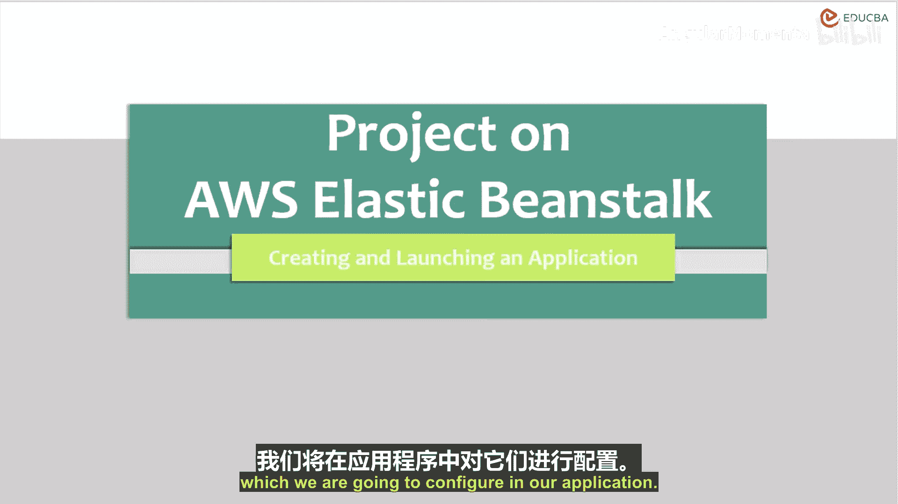
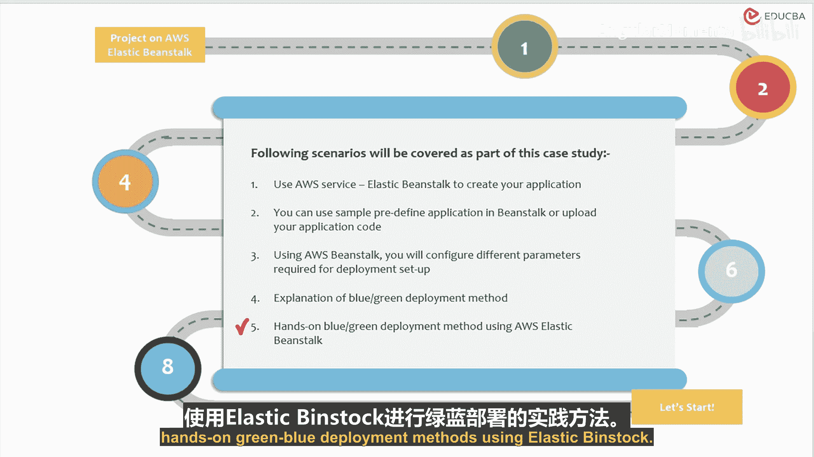

# 012：项目弹性豆茎应用创建与启动简介 🚀

在本节课中，我们将学习一项非常有趣的AWS服务——AWS Elastic Beanstalk。我们将了解如何利用这项服务来创建和启动应用程序，从而节省大量的基础设施设置时间。

在开始动手实践之前，我们先通过PPT了解一下什么是Elastic Beanstalk。

## 课程目标 🎯

我们将理解本服务及本项目的目标。如前所述，我们将使用它来创建和启动一个应用程序。在这个项目中，我们将使用AWS提供的、用不同语言及其不同版本编写的示例应用程序。

## 项目难度与前提条件 ⚙️

接下来，了解本项目的难度级别很重要。本项目属于中级水平。因为是中级项目，所以期望你了解一些基本的AWS服务，例如我们将要在应用程序中配置的S3和EC2实例。

进行本项目，你必须拥有一个AWS账户，也可以使用AWS免费套餐账户。

如果你想部署自己的代码来创建应用程序，请准备好你的代码。

## 项目核心目标 📋

进一步讨论项目目标，参与者将能够使用不同语言（如Java、.NET、PHP、Node.js、Python、Ruby和Go）的服务来创建应用程序。能在单一平台上使用所有这些语言及其不同版本，是不是很令人兴奋？

此外，参与者还可以：
*   上传其应用程序的不同版本。
*   启动你的环境。
*   监控你的环境。

## 你将学到什么 📖

你将学习Elastic Beanstalk的架构和不同组件，并使用这些服务创建应用程序。你也可以在此服务中创建和启动自己的应用程序。

有任何项目要求和先决条件吗？是的。你必须拥有一个AWS账户，这样你就不必为任何服务付费，仅此而已，你就可以开始学习AWS Elastic Beanstalk了。

## 服务价值与技能收获 💡

我们可以讨论一下，AWS Elastic Beanstalk如何被那些寻找简单方式部署应用程序的开发人员使用。如前所述，这将为你节省大量的基础设施设置时间。

本应用程序将对开发人员有所帮助，同时也将提供实践经验。因此，对于那些想要通过AWS解决方案架构师助理认证的学生来说，这将很有帮助。

在本项目结束时，你将拥有以下技能：
*   部署你的示例应用程序。
*   了解许多AWS服务（我将在动手实践Elastic Beanstalk时告诉你）。
*   监控应用程序（我们可以使用不同的服务来监控此应用程序）。
*   使用此服务维护已部署应用程序的不同版本。

项目内容包括Elastic Beanstalk的架构，以及我们将要进行的动手实践。

## 案例研究 📊

现在，让我们讨论本次课程将遵循的案例研究。你的客户希望更专注于开发和创新想法。

你建议你的客户使用AWS Elastic Beanstalk进行应用程序部署和维护不同的部署版本。你将向客户演示，如何节省大量设置部署和基础设施环境的时间和精力，使用AWS示例应用程序创建应用程序，以及通过上传自己的代码来创建应用程序。

作为本案例研究的一部分，将涵盖以下场景：
1.  使用AWS服务Elastic Beanstalk创建你的应用程序。
2.  使用Elastic Beanstalk中预定义的示例应用程序或上传你自己的应用程序代码。
3.  使用Elastic Beanstalk配置部署设置所需的不同参数。
4.  解释绿色和蓝色部署方法。
5.  使用Elastic Beanstalk进行绿色/蓝色部署方法的动手实践。

---

本节课中，我们一起学习了AWS Elastic Beanstalk服务的简介、项目目标、所需技能以及一个具体的客户案例。我们了解到，Elastic Beanstalk是一个能极大简化应用部署和管理的平台服务，适合希望专注于核心业务逻辑的开发团队。在接下来的章节中，我们将开始动手实践，创建我们的第一个Elastic Beanstalk应用。