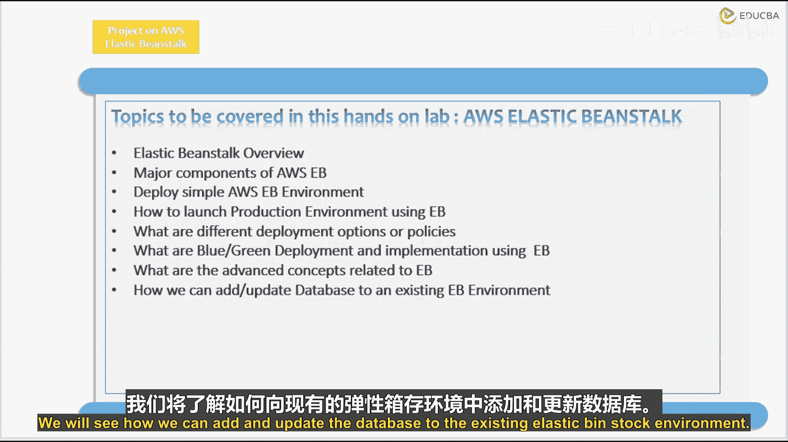
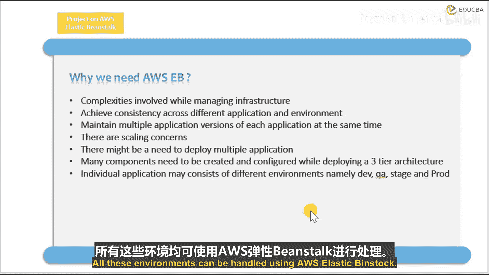
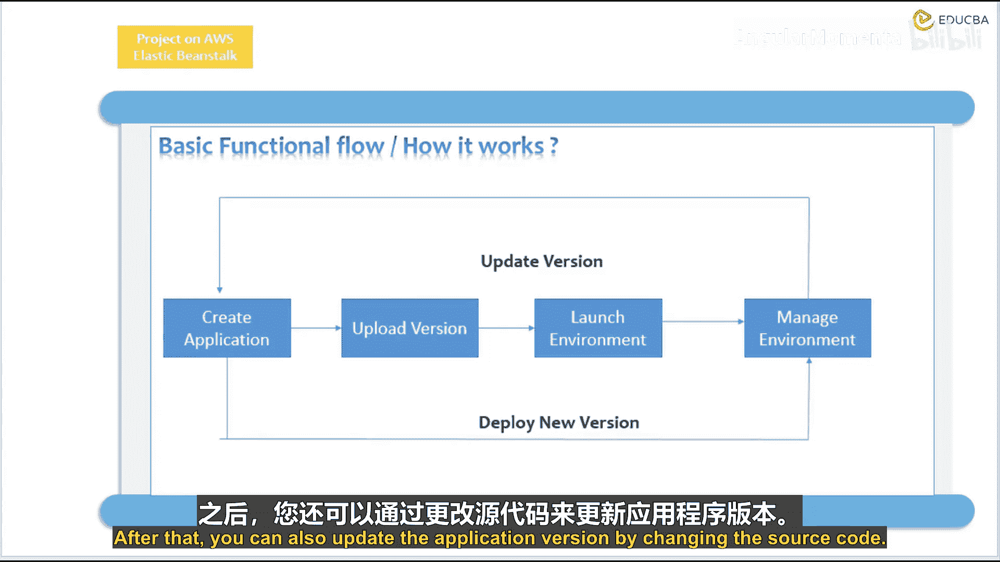

# 013：为何我们需要 AWS Elastic Beanstalk 🚀

在本节课中，我们将学习 AWS Elastic Beanstalk 的核心概念、主要组件以及它如何简化应用程序的部署和管理。我们将探讨使用它的原因，并通过图解理解其工作原理。

## 概述

AWS Elastic Beanstalk 是一项服务，用于简化在 AWS 云上部署和扩展 Web 应用程序及服务的过程。它能够自动处理容量配置、负载均衡、自动扩展和应用程序健康监控等细节。

## 为何需要 Elastic Beanstalk

管理基础设施涉及许多复杂性，需要消耗大量时间和资源来处理。Elastic Beanstalk 是最佳选择，因为它能帮助我们忽略这些复杂性。

使用 Elastic Beanstalk 可以实现不同应用程序和环境之间的一致性。我们可以用它来同时维护每个应用程序的多个版本。

我们知道，存在许多扩展性问题，而使用 AWS Elastic Beanstalk 可以忽略这些问题。

有时可能需要部署多个应用程序，我们可以使用 Elastic Beanstalk 来实现这一点。

在部署三层应用程序架构时，需要创建和配置许多组件。单个应用程序可能包含不同的环境，例如开发、测试、预发布和生产环境。

所有环境都可以通过 AWS Elastic Beanstalk 进行管理。

## Elastic Beanstalk 的主要组件

Elastic Beanstalk 主要由三个核心类别构成：**应用程序**、**应用程序版本**和**环境**。

*   **应用程序**：是 Elastic Beanstalk 的基本单元，代表您要部署的服务或网站。
*   **应用程序版本**：指向特定代码版本（例如，一个.zip文件）的引用。一个应用程序可以有多个版本。
*   **环境**：是运行应用程序版本的 AWS 资源集合。每个环境只运行一个应用程序版本。

## Elastic Beanstalk 的工作原理

现在，让我们看看它的实际工作流程。想象一下，您想要创建并部署一个应用程序。

您可以上传我们的应用程序版本，然后它将启动一个环境。环境就是运行应用程序版本所需的一系列 AWS 资源的集合。

您也可以管理您的环境。这意味着，每当您创建一个应用程序并部署一个环境时，您就已经部署了一个新的应用程序版本。

之后，您还可以通过更改源代码来更新应用程序版本。

## 本课程实践内容简介

在接下来的实践中，我们将首先使用 Elastic Beanstalk 部署一个简单的 Node.js 应用程序，而不是从复杂的开始。我们将了解如何利用 Elastic Beanstalk 来部署一个简单的应用程序。

然后，我们将启动一个高级的或生产级别的环境。这将是一个使用高可用性配置预设的高级生产环境。

我们将使用高可用性选项，例如负载均衡器和自动扩展组，这些将作为我们环境的一部分。

接着，我们将讨论部署选项和策略。我们将看到蓝绿部署方法。我们将利用之前创建的两个不同环境。您可以使用 Route 53 设置将流量对半分割。

我们将看到与 Elastic Beanstalk 相关的高级概念。我们将了解如何向现有的 Elastic Beanstalk 环境添加和更新数据库。

## 总结

本节课我们一起学习了 AWS Elastic Beanstalk 的基本概念和重要性。我们了解到，它通过自动化基础设施管理，解决了部署中的复杂性和扩展性问题。其核心组件——应用程序、应用程序版本和环境——共同协作，使我们能够轻松部署、管理和更新应用程序。在后续课程中，我们将动手实践，从简单部署开始，逐步深入到高可用性生产环境的配置。