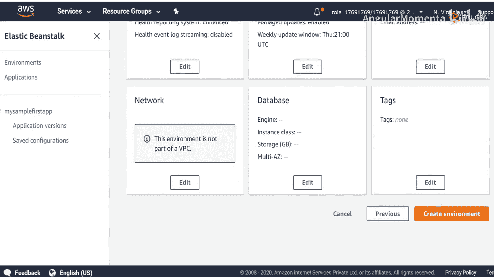
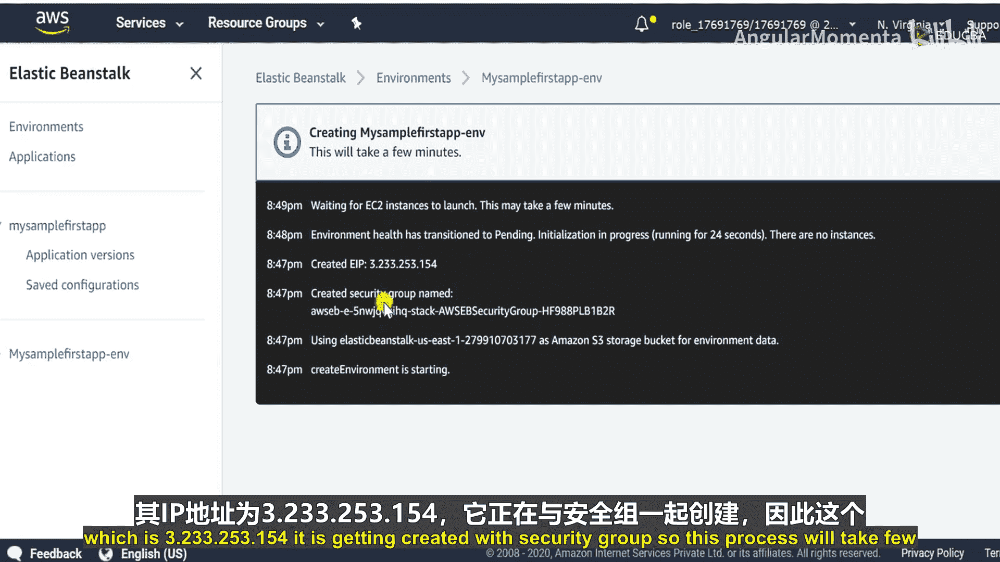
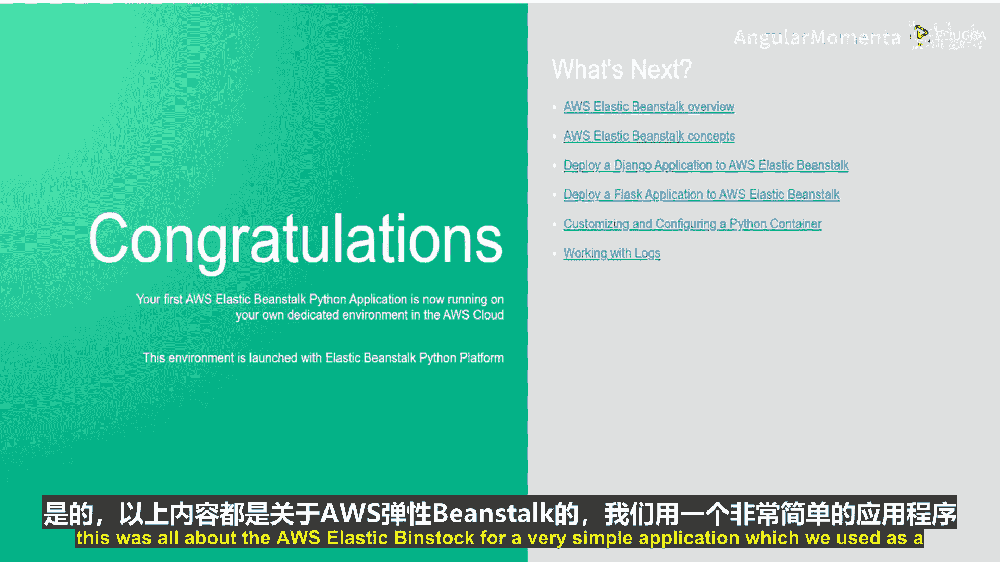
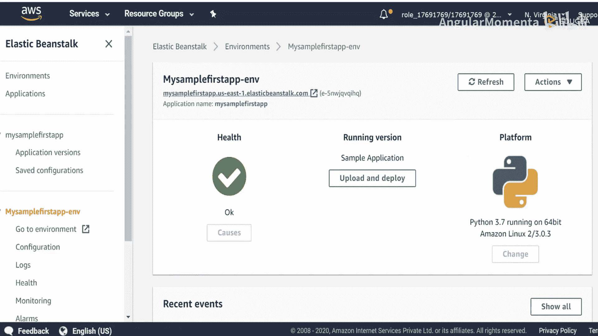

# 014：基本功能流程 🚀

在本节课中，我们将要学习 AWS Elastic Beanstalk 的核心概念、定价策略，并通过一个手把手的实验来部署第一个应用程序。我们将了解其基本组件和工作流程。

## 定价策略 💰

现在，我们来讨论定价策略。你将了解使用 AWS Elastic Beanstalk 服务如何收费。

使用 Elastic Beanstalk 没有额外费用。你无需为使用该服务本身支付任何费用。然而，你只需为你实际使用或你的应用程序所消耗的底层 AWS 资源付费。

例如，你可能部署了 EC2 实例、Elastic Load Balancer 或任何其他资源。你需要为这些资源付费。但是，你无需为 Elastic Beanstalk 这项服务付费。

以上就是 Elastic Beanstalk 的概述。现在，我们开始使用 Elastic Beanstalk 部署第一个应用程序。

## 什么是 Elastic Beanstalk？ 🤔

Elastic Beanstalk 是一个以开发者为中心的视角，用于在 AWS 上部署应用程序。你可以在此快速部署和管理应用程序，无需了解运行这些应用程序的基础设施。它有助于在不牺牲选择或控制权的情况下降低管理复杂性。你只需上传应用程序并进行部署。

Elastic Beanstalk 负责容量预置、负载均衡、扩展和应用程序健康监控。

## 基本组件 🧩

让我们看看 Elastic Beanstalk 的一些基本组件。基本上，我们有三个主要类别：**应用程序**、**应用程序版本**和**环境**。

以下是这三个核心概念的详细说明：

*   **应用程序**：应用程序是 Elastic Beanstalk 组件的逻辑集合，包括环境、版本和环境配置。
*   **应用程序版本**：应用程序版本指可部署的代码源包。例如，一个 Java `.war` 文件。应用程序版本是应用程序的一部分，它只是一个源代码包。一个应用程序可以有许多版本，每个应用程序版本都是唯一的。
*   **环境**：环境是运行一个应用程序版本的 AWS 资源集合。每个环境一次只运行一个应用程序版本。你可以同时在多个环境中运行相同的应用程序版本或不同的应用程序版本。当你创建一个环境时，Elastic Beanstalk 会预置运行你指定的应用程序版本所需的资源。

以上就是围绕 Elastic Beanstalk 的三个主要类别。

## 动手实验：部署第一个应用 🛠️

现在，让我们开始进行 Elastic Beanstalk 的动手实验。首先，转到 AWS 控制台首页，在“计算”部分下找到 Elastic Beanstalk，点击它。

第一步是创建一个应用程序。点击“创建新应用程序”。你将看到创建应用程序页面，填写所需详细信息。我们将应用程序命名为“my-sample-first-app”。描述字段可以留空，如果需要也可以填写。标签也是可选的。然后点击“创建”。

创建完成后，你会看到应用程序已创建，但该应用程序需要一个环境。因此，我们点击“立即创建环境”。你会看到两个选项：第一个是“Web 服务器环境”，第二个是“工作线程环境”。由于我们要部署一个 Web 应用程序，我们选择“Web 服务器环境”。如果你想运行一个处理长时间运行的工作负载或按计划处理任务的工作线程应用程序，可以选择“工作线程环境”。但根据当前部署 Web 应用程序的需求，我们选择“Web 服务器环境”。

选择后，填写所需详细信息。我们的应用程序名称已给出为“my-sample-first-app”。然后填写环境名称。接着，我们需要选择一个域名。我们尝试输入我们的域名并检查其是否可用。检查可用性后，确认可用，我们继续下一步。

现在，这里需要你选择平台。你可以从以下选项中选择：.NET、Docker、Go、Java、Node.js、PHP、Python、Ruby、Tomcat。我将选择 Python。这里你还有一个优势，可以选择平台分支和平台版本，选择你熟悉或希望部署的版本。目前，我将选择推荐的版本，即 3.7 或更高版本。

第三个选项是“应用程序代码”。正如之前阶段提到的，你可以部署自己的代码，也可以使用现有版本，或者由于这是一个全新的应用程序，我们可以选择此处的“示例应用程序”。出于演示目的，我将选择“示例应用程序”。

我们还可以查看“配置更多选项”的含义。你可以编辑那里提到的任何默认配置。由于这是一个简单的应用程序，我不打算编辑任何内容。我们将在更广泛的环境部署中检查这些配置。

目前，我认为一切看起来都很好，我们将直接创建环境。系统提示正在创建环境和应用程序，这可能需要一段时间。实际上，后台正在发生以下过程：所有 AWS 资源，如 S3、EC2、VPC 等，都在为你的应用程序创建和部署。

我将暂停视频，我们稍后再看。如你所见，AWS 资源正在生成，例如 EC2 实例。它正在与安全组一起创建。这个过程需要几分钟。

如你所见，我们的应用程序正在生成。状态是“健康”，运行版本是此版本，我们选择的平台是 Python 3.7。在这里你可以看到事件，例如成功启动环境“my-sample-first-app”。应用程序可通过此路径访问，为此环境添加了 EC2 实例。

这就是你可以查看的方式。你可以创建你的环境、你的应用程序，也可以刷新以检查是否有任何更新。目前，我们的应用程序环境处于健康状态。

现在，要查看我们的应用程序是否实际创建，只需点击我们为域名选择的这个 URL。这是我们的域名，点击它。是的，你可以看到我们的应用程序已成功部署，并且可以看到此输出。

## 总结 📝

本节课中，我们一起学习了 AWS Elastic Beanstalk 的基本功能。我们了解了它的定价策略（仅为底层资源付费），认识了其三个核心组件：**应用程序**、**应用程序版本**和**环境**。最后，我们通过一个完整的动手实验，使用示例应用程序成功在 Elastic Beanstalk 上部署了一个简单的 Web 应用，并验证了其可访问性。整个过程展示了 Elastic Beanstalk 如何简化在 AWS 上的应用部署与管理。