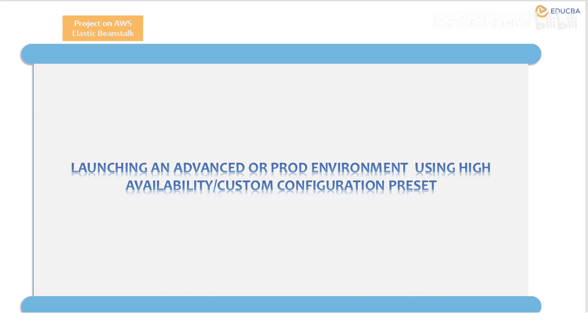
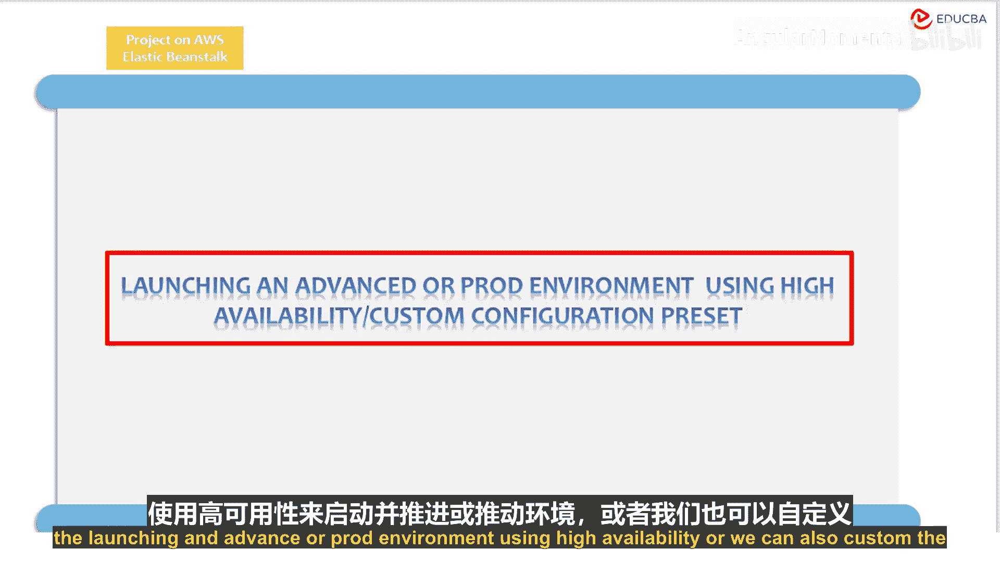
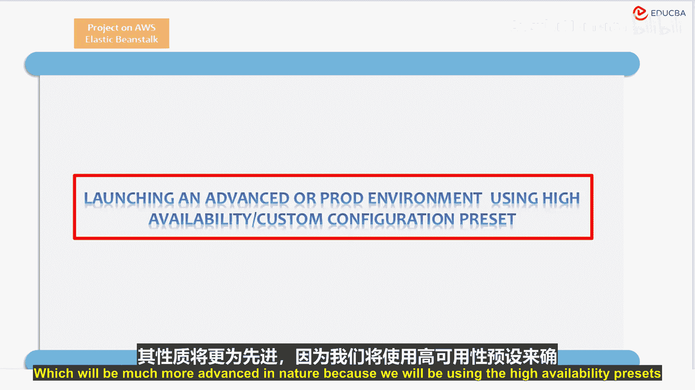
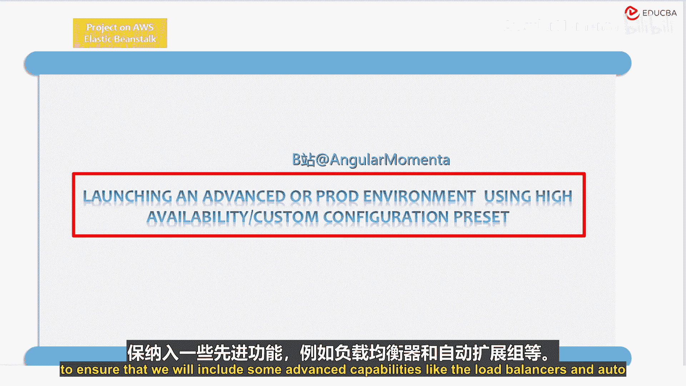
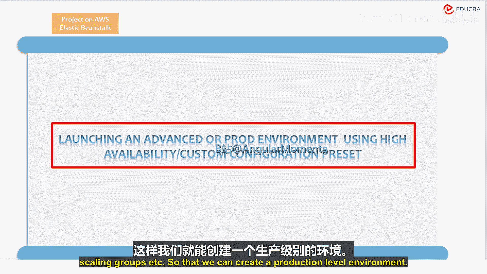
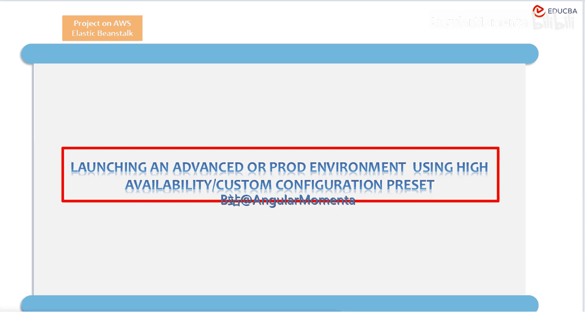
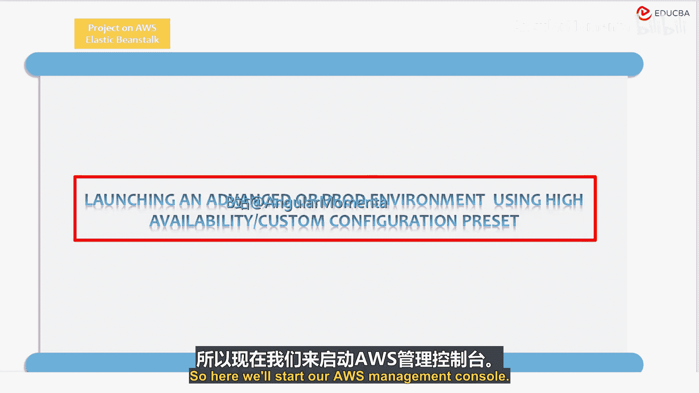

# 015：自定义配置预设 🛠️

在本节课中，我们将学习如何在AWS Elastic Beanstalk中创建自定义配置预设。我们将使用高可用性预设来构建一个生产级别的环境，该环境将包含负载均衡器和自动伸缩组等高级功能。

上一节我们介绍了基础环境配置，本节中我们来看看如何通过自定义预设来构建更高级、更健壮的部署环境。

## 启动高级环境

我们可以启动一个使用高可用性的高级或广泛环境。我们也可以自定义配置预设，这本质上会更加高级，因为我们将使用高可用性预设来确保包含一些高级功能，例如负载均衡器和自动伸缩组等。这样我们就可以创建一个生产级别的环境。

现在，让我们开始整个操作过程。

## 操作步骤

以下是启动AWS管理控制台并开始创建自定义配置预设的步骤。

1.  打开AWS管理控制台。
2.  导航到Elastic Beanstalk服务。
3.  点击“创建新环境”。
4.  在环境配置页面，选择“自定义配置”选项。
5.  在预设选择部分，勾选“高可用性”预设。
6.  此预设将自动配置负载均衡器和自动伸缩组。
7.  根据您的应用程序需求，进一步调整实例类型、最小/最大实例数等参数。
8.  完成所有配置后，点击“创建环境”开始部署。

本节课中我们一起学习了如何在AWS Elastic Beanstalk中通过自定义配置预设来构建一个具备高可用性的生产环境。我们了解了高可用性预设如何自动集成负载均衡和自动伸缩功能，从而提升应用程序的可靠性和扩展性。