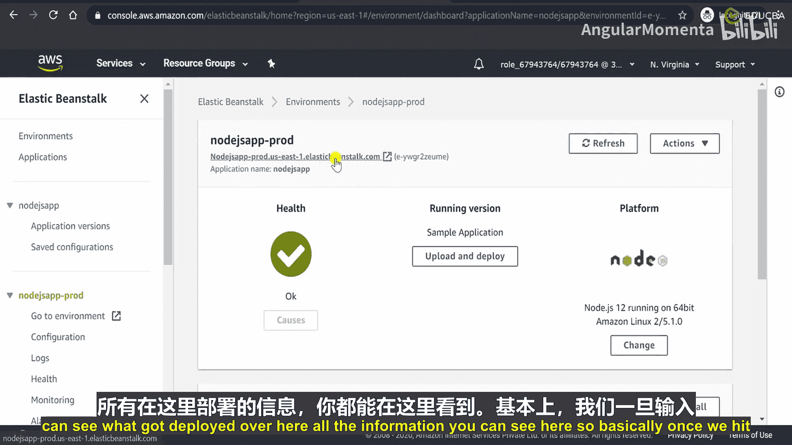
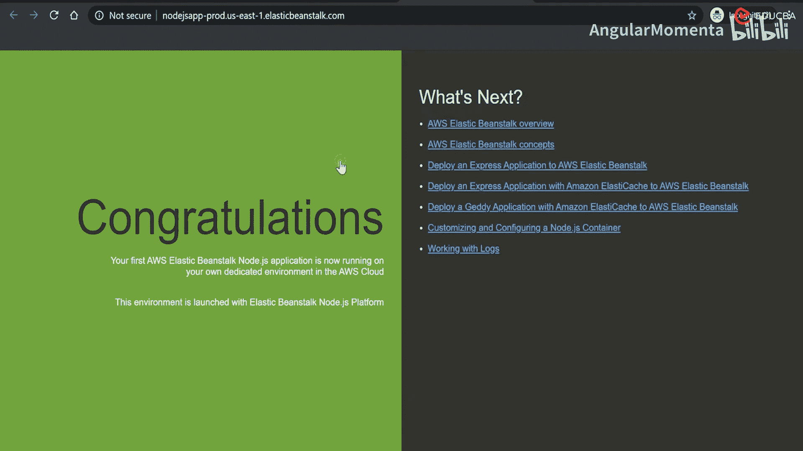
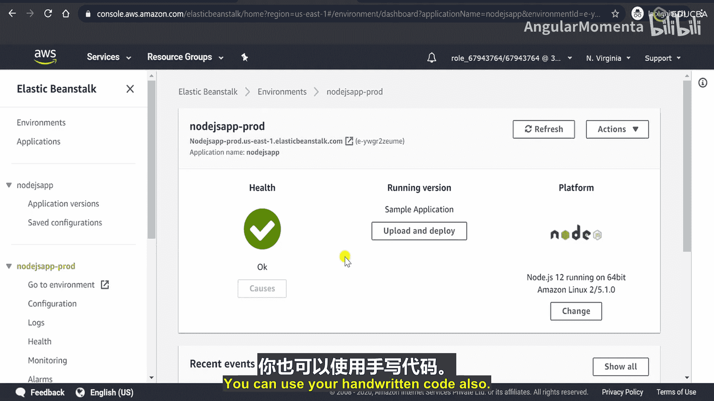

# 016：创建新应用程序 🚀

在本节课中，我们将学习如何在 AWS Elastic Beanstalk 中创建一个新的应用程序，并为其配置测试环境和生产环境。我们将使用 Node.js 平台作为示例，并了解环境创建过程中的关键配置选项。

## 概述

首先，我们需要登录 AWS 管理控制台，并导航到 Elastic Beanstalk 服务。我们的目标是创建一个 Node.js 应用程序，并为其建立两个独立的环境：一个用于测试，另一个用于生产。

## 创建应用程序

进入 AWS 管理控制台后，在“计算”服务类别下选择 **Elastic Beanstalk**。

接下来，我们将在此处创建一个新的应用程序。由于我们将使用 Node.js，因此需要相应地命名应用程序。

以下是创建应用程序的步骤：
*   **应用程序名称**：为你的应用程序命名。
*   **描述**：此字段为可选，可以填写应用程序的描述信息。
*   **标签**：添加键值对标签也是可选的。

现在，我们的 Node.js 应用程序已经创建成功。但一个应用程序需要一个环境才能运行。

## 创建测试环境

应用程序创建后，我们需要为其创建环境。首先，我们将创建一个测试环境。

点击“创建新环境”按钮。环境类型分为 **Web 服务器环境** 和 **工作环境**。我们之前讨论过，工作环境适用于处理长时间运行任务或按计划执行任务的应用程序。目前，我们要部署的是 Web 应用程序，因此选择 **Web 服务器环境**。

以下是配置测试环境的关键步骤：
*   **域名**：这是一个必填字段。我们输入一个域名并检查其可用性。
*   **描述**：此字段为可选。
*   **平台**：选择 Node.js。我们将使用推荐的最新平台版本。
*   **应用程序代码**：在此示例中，我们选择使用 **示例应用程序代码**。

点击“创建环境”后，系统将开始为我们的应用程序构建环境。仪表板会显示后台正在创建的 AWS 资源，此过程需要几分钟时间。

## 创建生产环境

在等待测试环境创建的同时，我们可以为同一个应用程序创建生产环境。

返回应用程序列表，选择我们刚创建的应用程序。你会看到测试环境正在创建中。点击“操作”按钮，选择“创建环境”来添加另一个环境，即生产环境。一个应用程序可以拥有任意数量的环境。

再次选择 **Web 服务器环境**。我们将环境名称更改为“生产环境”，并设置一个对应的域名。

在平台配置部分，我们再次选择 Node.js 和推荐的最新平台版本。

接下来，我们将看到“配置更多选项”。这里提供了几种预设配置：
*   **单实例**：适用于免费套餐。
*   **使用 Spot 实例的单实例**。
*   **高可用性**。
*   **使用 Spot 实例和按需实例的高可用性**。
*   **自定义配置**。

每种预设都包含一组配置，例如 EC2 实例类型、负载均衡器类型等。为了获得高可用性，我们选择 **高可用性** 预设。你可以查看其详细的配置参数，如实例类型（默认为 `t2.micro`）、存储类型、自动扩展组设置、部署策略（默认为“一次全部部署”）和负载均衡器类型（默认为推荐的应用程序负载均衡器）。你还可以检查安全组和监控设置。

目前，我们直接使用预设的配置值，不做修改，点击“创建环境”。现在，系统将开始创建我们的生产环境，这比测试环境配置更高级。

## 环境部署完成

等待一段时间后，可以看到生产环境已成功部署，健康状态显示为“正常”。所有部署的资源和配置信息都可以在环境概览页面查看。

至此，我们的 Node.js 应用程序拥有了两个环境：一个测试环境和一个生产环境。通过这种方式，你可以为单个应用程序部署多个环境，无论你需要何种配置。你可以使用不同的预设配置，也可以上传自己编写的代码，而不仅仅是本示例中使用的示例代码。

## 总结

本节课中，我们一起学习了在 AWS Elastic Beanstalk 中创建 Node.js 应用程序的完整流程。我们创建了一个应用程序，并为其成功配置了测试环境和生产环境。我们了解了环境类型的选择（Web 服务器 vs. 工作环境），以及如何使用预设的高可用性配置来部署生产环境。这为后续实现持续集成和持续部署（CI/CD）打下了基础。