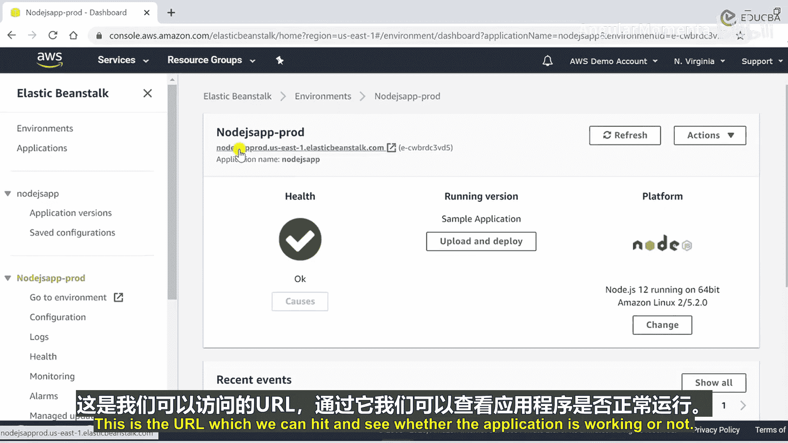
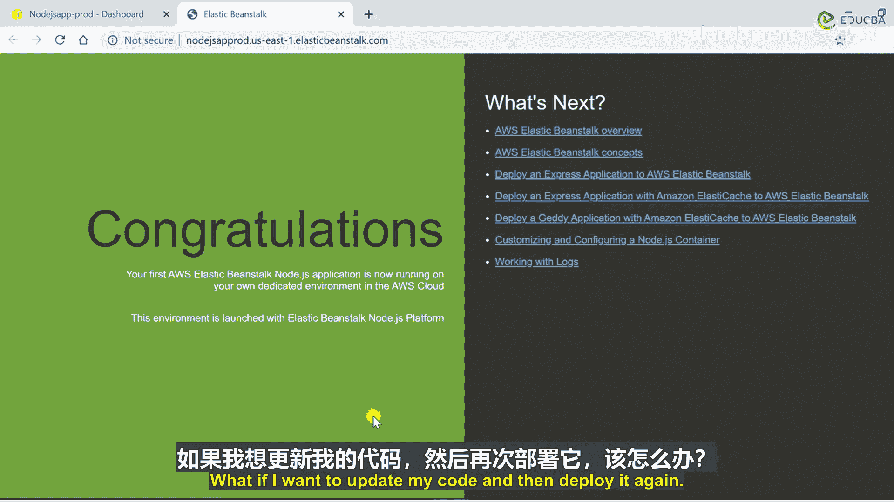
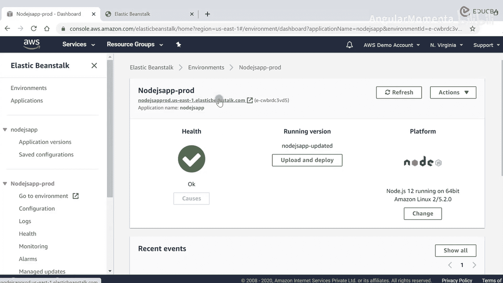
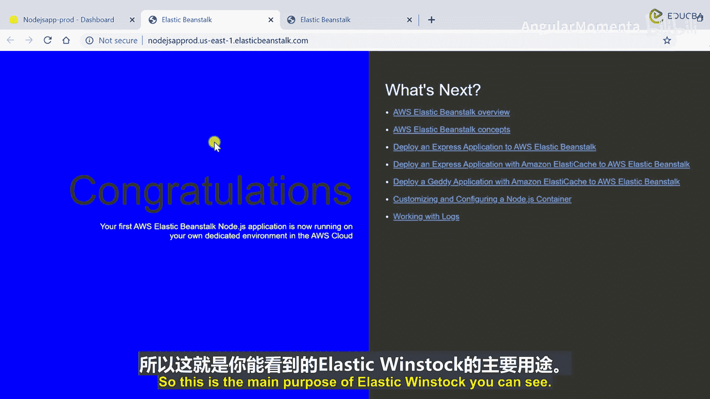
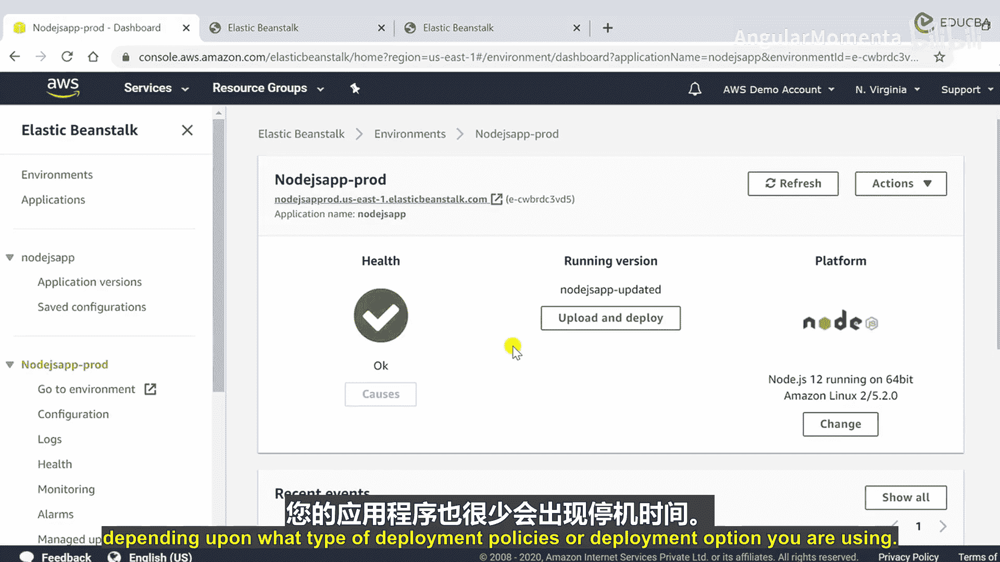
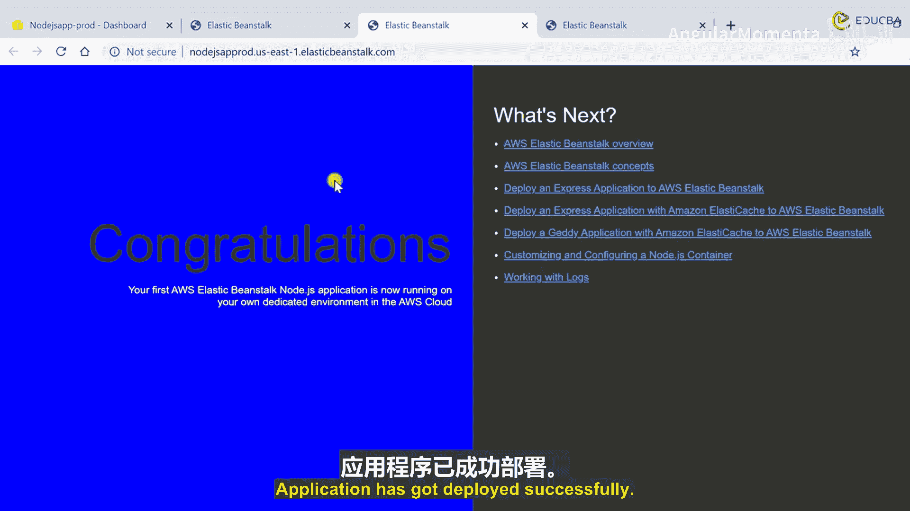
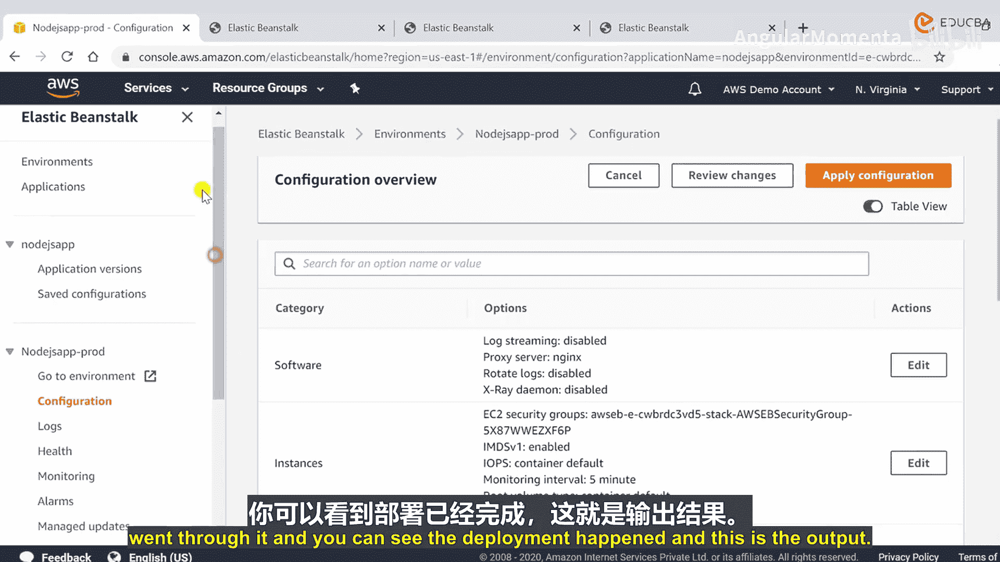
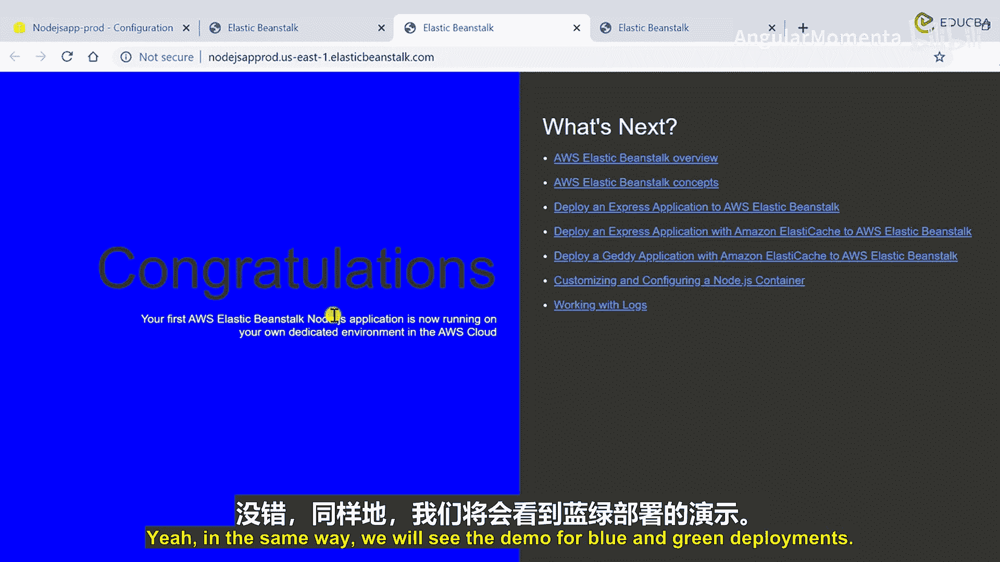

# 017：部署策略 🚀

在本节课中，我们将学习 AWS Elastic Beanstalk 中可用的部署选项与策略。我们将探讨四种主要的部署方式，并了解它们各自的优缺点及适用场景。最后，我们将通过一个简单的演示，了解如何更新和部署应用程序代码。

---

## 概述

AWS Elastic Beanstalk 提供了多种部署策略，以适应不同的应用场景和需求。理解这些策略有助于我们在平衡部署速度、成本、可用性和风险之间做出最佳选择。

---

## 部署策略详解

我们将讨论 AWS Elastic Beanstalk 中可用的部署选项和策略。

主要有四种不同的策略选项：**一次性全部部署**、**滚动部署**、**带额外批次的滚动部署**以及**不可变部署**。下面我们简要概述这些不同选项，并看看如何在 Elastic Beanstalk 中使用它们。

### 一次性全部部署 ⚡

让我们从第一种策略开始，即一次性全部部署。

一次性全部部署是所有部署选项中最快的一种。

当我们使用这种部署选项时，应用程序会出现停机时间。

这是在部署环境中进行快速迭代的一个很好选择。然而，此策略没有额外成本。这是 AWS Elastic Beanstalk 中的默认部署选项。

### 滚动部署 🔄

第二种策略是滚动部署。

滚动部署一次升级少量实例，待第一批实例健康后，再继续下一批。

您可以设置批次大小。在此策略下，应用程序会同时运行新旧两个版本。这里没有涉及额外成本。

部署过程较长，因为一旦选择升级策略或想要升级应用程序，就必须分批进行。这导致部署过程更长。

### 带额外批次的滚动部署 🔄➕

接下来是带额外批次的滚动部署。

这是我们在上一节看到的滚动部署的高级版本。

此策略的特点是：应用程序在部署期间保持全容量运行。您也可以设置批次大小。应用程序同时运行两个版本。

由于我们会启动新的批次，所以会产生少量额外成本。在部署结束时，初始批次的实例会被移除，因为所有单元测试用例升级后就不再需要它们了。这同样导致部署时间较长。

### 不可变部署 🛡️

最后但同样重要的是不可变部署策略。

在这种策略中，我们利用自动伸缩组。让我们看看它的特点。

部署应用程序时实现零停机时间。新代码被部署到临时自动伸缩组的新实例上。由于实例数量会翻倍，因此成本较高。

部署时间较长，但从该部署策略中获得的好处是，在出现故障时可以快速回滚。如果新应用程序无法正常工作，您可以终止新的自动伸缩组，并保留现有的那个。这非常适合生产环境部署。

---

## 蓝绿部署 🌊🌿

我们下一个要讨论的主题是蓝绿部署。

蓝绿部署是一种通过将流量在两个运行着不同版本应用程序的相同环境之间切换，来发布应用程序的技术。蓝绿部署可以减轻与部署软件相关的常见风险，例如停机时间和回滚能力。

让我们看一个例子。您有用户和产生的网络流量（HTTP 或 HTTPS）。这些网络流量会到达 Route 53 DNS 服务器，其中 90% 的流量被发送到蓝色环境（包含应用程序版本 1），其余 10% 的流量被发送到最新版本，即应用程序的版本 2，也称为绿色环境。这样，您就将环境分成了两个不同的类别：蓝色环境和绿色环境。

您可以在 Route 53 中使用加权路由策略，以这种方式分割流量：90% 的流量发送到包含软件版本 1 的蓝色环境，10% 的流量发送到包含应用程序版本 2 的绿色环境。

关键在于，一旦您的绿色环境通过健康检查，您就可以使用“交换 URL”的概念，然后将全部流量发送到您的绿色环境。此后，您可以终止蓝色环境。

它的工作原理是：通过使用蓝绿部署，可以提高可用性并降低风险。蓝色环境是通常承载实时流量的生产环境。绿色环境则是用升级版本创建的。

---

## 演示：更新与部署代码 💻

在这个演示视频中，我们将看到如何利用不同的部署选项，以及如何更新我们的代码并进行部署。这是 Elastic Beanstalk 部署更新代码的主要目的。

如您所见，我有一个 Node.js 应用程序，目前有两个环境：一个是测试环境，另一个是生产环境。我将转到生产环境，检查其状态。它是健康的，并且正在运行 Node.js 12。这是我们可以访问并查看的 URL。

您可以看到输出。如果我想更新我的代码然后再次部署呢？

我将点击“上传和部署”。它会给我两个选项：一是可以部署此应用程序的先前版本，二是我可以上传新代码。我们可以选择任何一种方式，让我们选择第二种方式，即上传应用程序。

这是上传文档的简单机制。我有一个包含所有更新代码的 zip 文件。我将其命名为 `nodejs-update-1.zip`。当前实例数量为 1。这是模式。zip 文件已上传，我将点击部署按钮。

后台发生的情况是：我们正在用上传的新代码进行部署。

我们可以查看正在发生的事件。这些都在更新。环境正在用新代码再次更新。是的，我可以看到我的部署已完成，更新后的代码现已通过健康检查。

好的，这是我们的 URL。如果我们再次访问这个 URL：

您可以看到，我们已经用蓝色背景更新了代码，并且部署成功。我们只是点击并上传了代码，然后点击了几个按钮，部署就完成了，没有任何基础设施方面的麻烦，也不需要做任何额外的工作。我们完全避免了为部署而设置基础设施的所有头疼问题。这就是 Elastic Beanstalk 的主要目的。

这非常简单。以同样的方式，您现在可以为您的应用程序上传任何核心代码片段。根据您使用的部署策略或部署选项类型，您的应用程序可能会有一些停机时间。应用程序在此成功部署，我使用了滚动更新。

那么如何配置您的部署策略呢？您只需要点击“配置”部分。

您可以看到应用程序中的所有配置。在这里您可以看到“滚动更新和部署”。如果您想选择其他选项，是的，有部署策略，但默认是一次性全部部署。配置更新已禁用，所以我在这里没有更改任何内容，只是按照流程操作，您可以看到部署发生了，这就是输出。

同样地，我们也将看到蓝绿部署的演示。

---

## 总结

本节课中，我们一起学习了 AWS Elastic Beanstalk 的四种核心部署策略：**一次性全部部署**、**滚动部署**、**带额外批次的滚动部署**和**不可变部署**，并了解了**蓝绿部署**这一降低风险的高级技术。每种策略在部署速度、成本、可用性和复杂性之间有不同的权衡。通过实际操作演示，我们还看到了在 Elastic Beanstalk 中更新和部署应用程序代码是多么简单直接，它极大地简化了基础设施管理的复杂性。