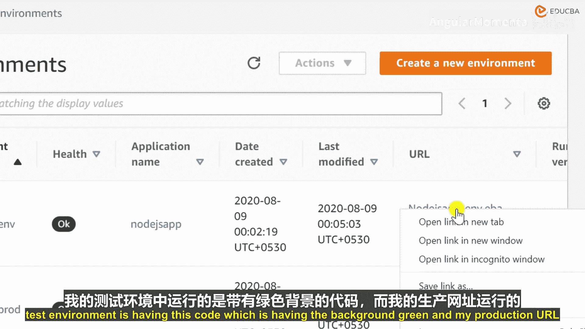
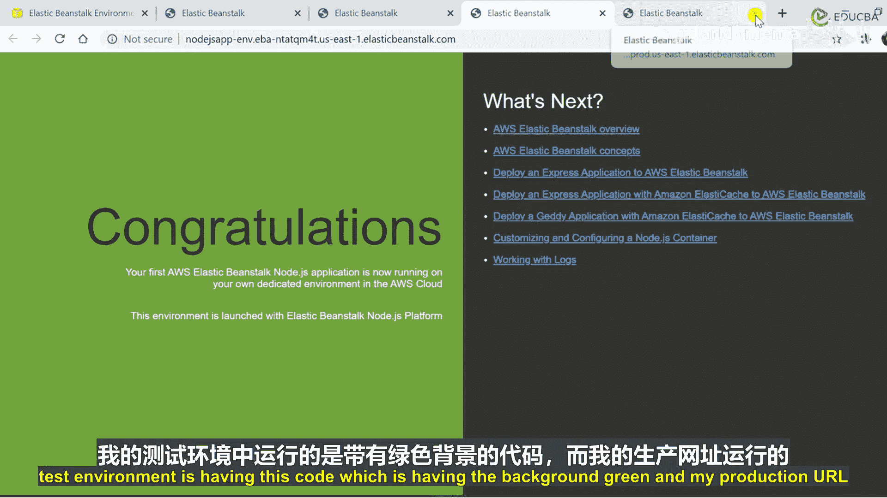
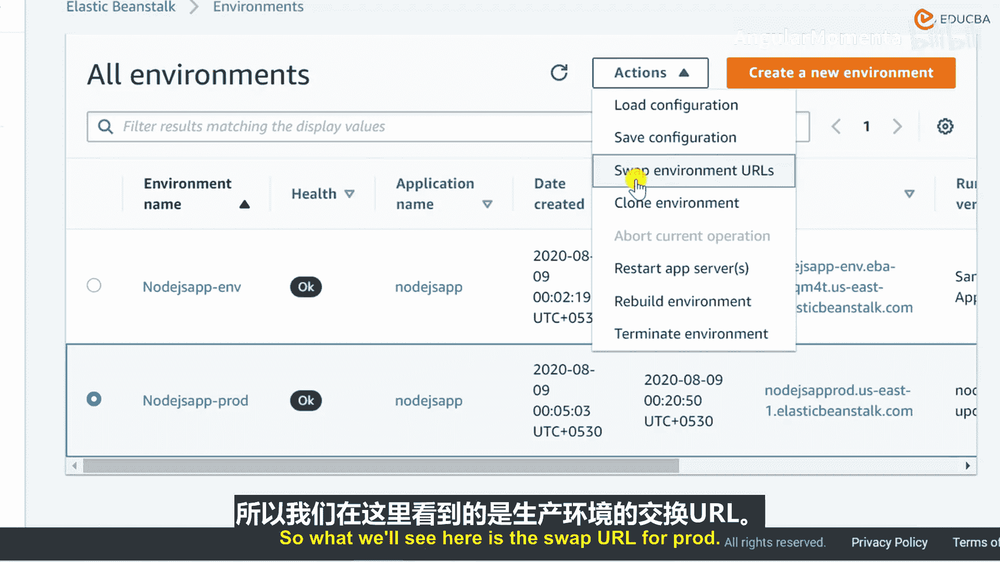

# 018：蓝绿部署演示 🎬

在本节课中，我们将学习如何使用蓝绿部署方法。这种方法能确保在部署新版本应用时，通过交换URL的选项，将域名流量无缝切换到运行新版本应用的环境实例上。接下来，让我们看看整个过程是如何发生的。

## 部署环境现状

上一节我们介绍了如何将新代码部署到测试环境。现在，我的应用程序有两个环境：

*   测试环境（Broad Environment）运行着新版本的代码，其背景色为绿色。
*   生产环境（Production Environment）运行着旧版本的代码，其背景色为蓝色。

目前，所有的生产流量都指向生产环境。

## 执行URL交换

为了实现蓝绿部署，我们需要交换这两个环境的URL。以下是具体操作步骤：

1.  在AWS Elastic Beanstalk控制台中，选择你的生产环境。
2.  点击“操作”（Actions）按钮。
3.  从下拉菜单中，选择“交换环境URL”（Swap Environment URLs）选项。

通过这个操作，生产环境的域名将立即开始指向之前作为测试环境的实例（即运行新版本绿色背景应用的实例），而之前的“生产环境”则变成了新的测试环境。这个过程非常迅速，能实现流量的无缝切换，最大程度减少服务中断。

## 核心操作与概念

以下是蓝绿部署在Elastic Beanstalk中的关键操作列表：
*   **交换环境URL**：此操作会交换两个环境（例如生产与测试）的CNAME记录，从而实现流量的即时切换。
*   **克隆环境**：用于创建一个与现有环境配置完全相同的新环境，这是准备“绿色”环境的基础。
*   **加载/保存配置**：用于管理环境设置，确保部署的一致性。

## 总结

本节课我们一起学习了AWS Elastic Beanstalk中的蓝绿部署流程。我们了解到，通过先在新环境（绿色）中部署和验证应用，然后使用“交换环境URL”功能，可以安全、快速地将用户流量切换到新版本，从而实现零停机部署。这种方法极大地提高了发布的可靠性和用户体验。