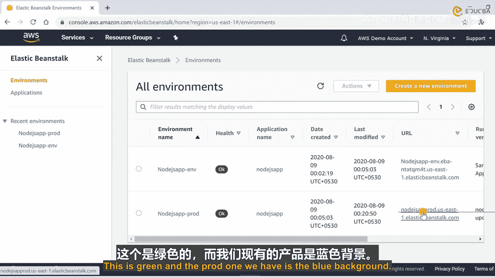
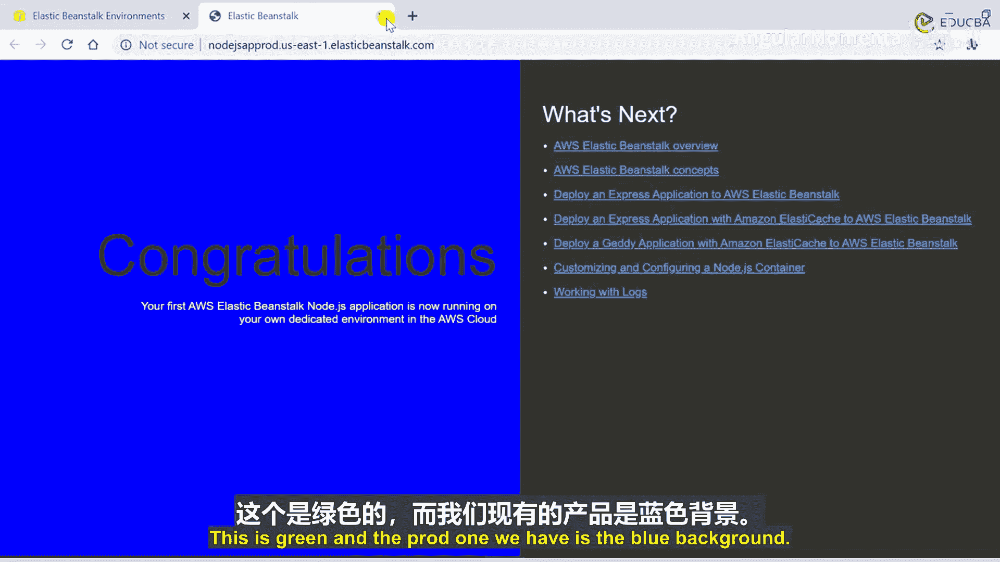
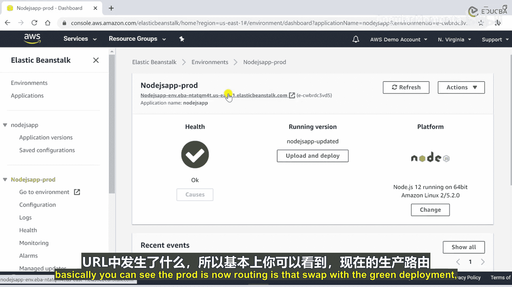
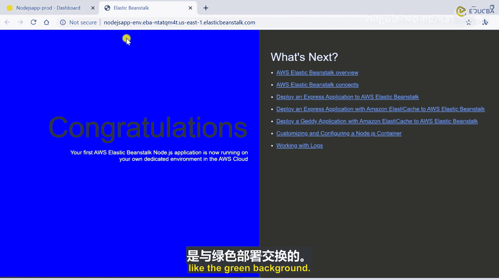
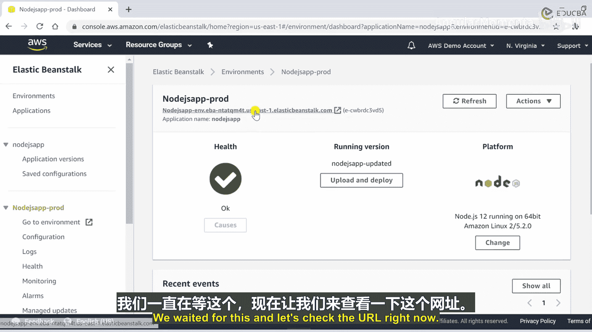
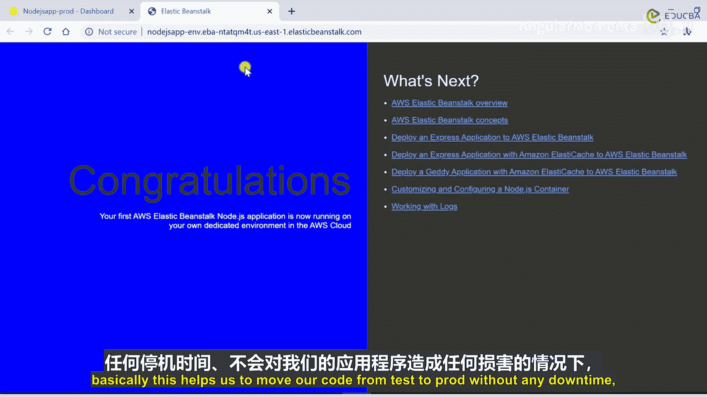
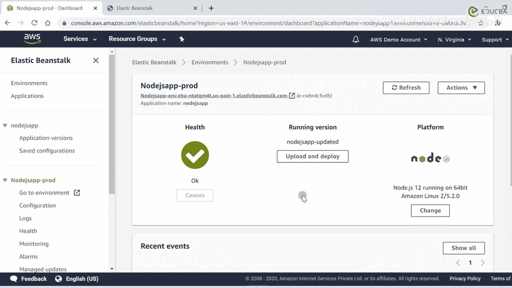

# 019：配置 Route 53 与蓝绿部署 🚀

在本节课中，我们将学习如何配置 AWS Route 53 服务，以实现流量的加权路由，并演示如何使用 Elastic Beanstalk 的“交换环境 URL”功能执行蓝绿部署，从而实现零停机时间的应用更新。

---

## 配置 Route 53 加权路由策略

上一节我们介绍了 Elastic Beanstalk 环境。本节中，我们来看看如何将用户流量引导到不同的环境。为此，我们将使用名为 Route 53 的 AWS 服务。

在 AWS 控制台的搜索栏中搜索 “Route 53”，你将进入此服务的管理窗口。这里会列出你的托管区域，你可以拥有多个托管区域。

我们需要在此创建一个记录。点击“创建记录”。

以下是关于路由策略的基本信息。如果你想了解路由策略的具体类型，可以阅读此处提供的描述。为本次演示，我将使用“加权”路由策略。点击“下一步”。

接下来，我们需要配置一些参数来定义记录。

*   **记录名称**：你可以在此处输入任何名称。
*   **记录类型**：我将使用默认的 **A 记录**，它将流量路由到 IPv4 地址。
*   **TTL**：保持为 300 秒。

现在我们需要定义加权记录。点击相应区域进行配置。界面会显示已选择的记录名称和类型。接下来需要选择流量要路由到的端点。

在下拉菜单中，你可以看到不同的选项。Route 53 与许多其他 AWS 服务（如 API 网关、CloudFront 分发、Elastic Beanstalk 环境、负载均衡器等）互联。由于我们正在使用 Elastic Beanstalk 环境，因此选择它。

*   **区域**：选择我们正在使用的区域，例如“美国东部（弗吉尼亚北部）”。
*   **端点**：选择我们的生产环境 URL。
*   **记录 ID**：可以输入例如 `sample-domain-production`。
*   **权重**：定义权重值，例如 `10`。

配置完成后，创建此记录。这样，我们就将 10% 的域名流量路由到了生产环境链接。

现在，我们将创建另一个记录，将 90% 的流量路由到测试环境。重复相同的过程。

*   再次选择路由策略为“加权”。
*   记录名称保持不变。
*   记录类型选择 **A 记录**。
*   在端点部分，再次选择 Elastic Beanstalk 环境，区域为“美国东部（弗吉尼亚北部）”。
*   这次选择测试环境的 URL。
*   将权重设置为 `90`。
*   记录 ID 可以设为 `sample-domain-test`。

现在创建此记录。至此，我们已配置好域名，将全部流量分配到两个链接：10% 到生产环境，90% 到测试环境。



在 Route 53 控制台，你可以看到已创建的加权策略记录。现在，让我们返回 Elastic Beanstalk 控制台查看环境状态。



---

## 执行蓝绿部署（交换环境 URL）

现在我们已经配置好 Route 53 的加权记录集。接下来，我们将在 Elastic Beanstalk 中执行一次蓝绿部署。

在 Elastic Beanstalk 控制台，选择生产环境。点击“操作”菜单，在“部署”部分找到“交换环境 URL”功能并点击。

此功能的作用是交换生产环境和测试环境的 URL。在弹出框的下拉菜单中，选择我们的测试环境。

**核心操作**：
```plaintext
swap_environment_urls(Production_Environment, Target_Environment=Test_Environment)
```



系统会给出警告：交换 URL 将修改 Route 53 的 DNS 配置，可能需要几分钟时间。在更改传播期间，你的应用程序将继续运行，不会出现停机。这是该服务最重要的特性之一。



点击“交换”按钮。后台进程开始运行，部署状态显示为“健康”。让我们检查一下 URL 发生了什么变化。

理论上，生产链接现在应该被交换为测试链接，所有 DNS 策略都会相应更改。我们打开生产环境的 URL 查看。最初可能仍显示蓝色背景（原生产环境），因为 DNS 更改需要时间传播。持续刷新页面等待几分钟。



等待大约两到三分钟后，再次刷新生产环境 URL。现在，你看到的输出是绿色背景（原测试环境的内容）。

---

## 流程总结与回顾

本节课中我们一起学习了如何配置 Route 53 和执行蓝绿部署。让我们回顾一下整个流程：



1.  **第一步 - 流量分配**：我们使用 Route 53 的加权路由策略，将 90% 的流量导向测试环境（绿色背景），10% 的流量导向生产环境（蓝色背景）。
2.  **第二步 - 环境交换**：我们在 Elastic Beanstalk 中对生产环境执行了“交换环境 URL”操作，将其 URL 与测试环境的 URL 互换。
3.  **最终结果**：交换完成后，**生产环境的 URL** 现在接收了 90% 的流量，并且指向了更新后的代码（即原先在测试环境验证过的代码）。通过刷新页面，我们验证了生产 URL 现在显示的是绿色背景。

这种方法帮助我们将代码从测试环境移动到生产环境，**无需任何停机时间**，也**不会对应用程序造成损害**。

这是一个简单的示例。你可以使用相同的术语和方法，通过上传新代码、利用各种部署选项、以及交换测试与生产环境的 URL，来修改更复杂的代码。Elastic Beanstalk 服务本身是免费的，你只需为应用程序实际使用的 AWS 资源付费。



这就是关于蓝绿部署和部署选项的全部内容。