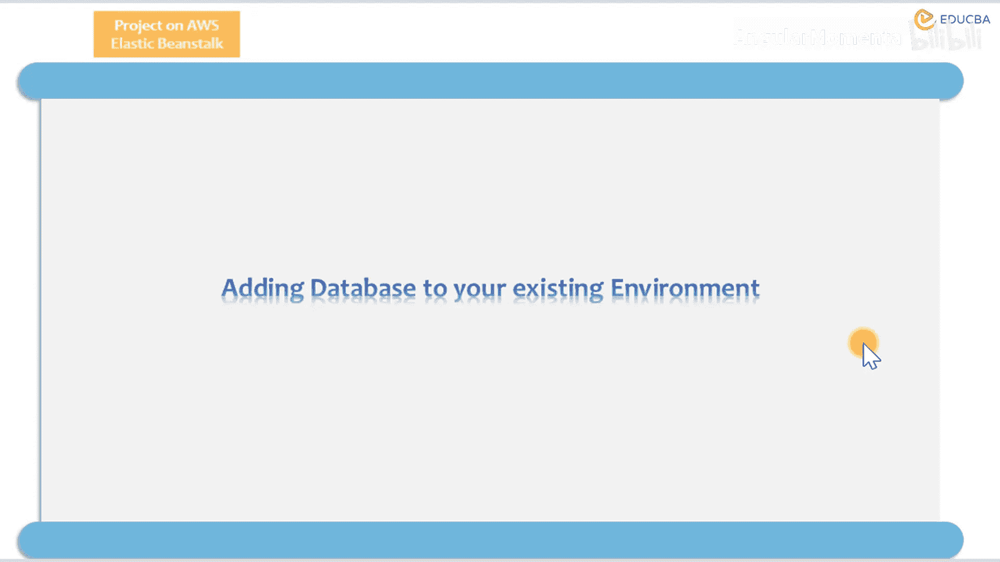
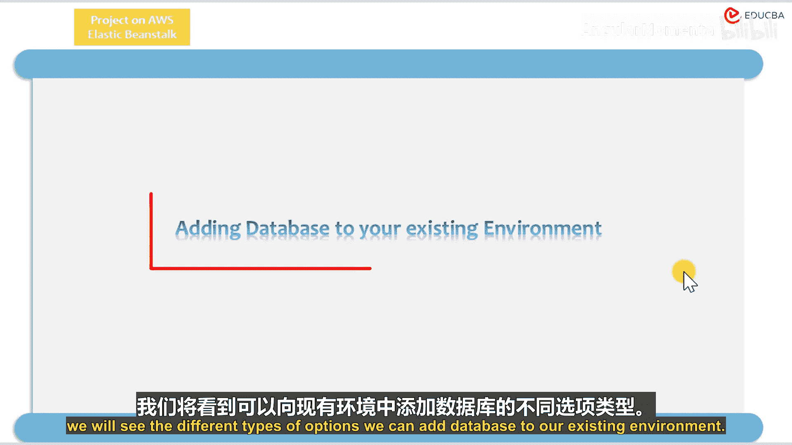
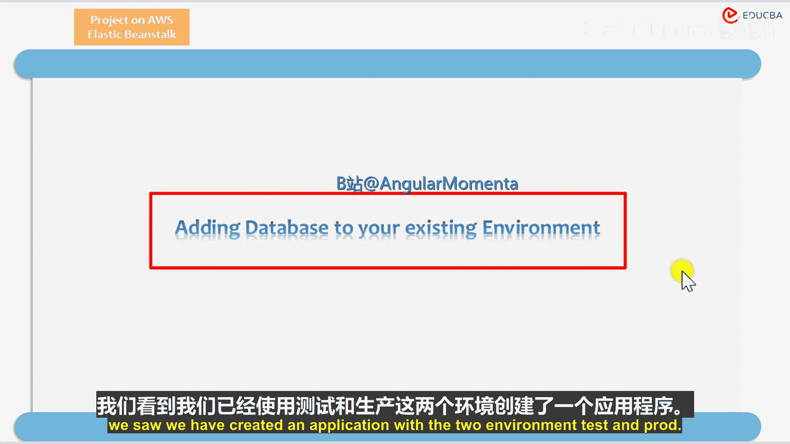
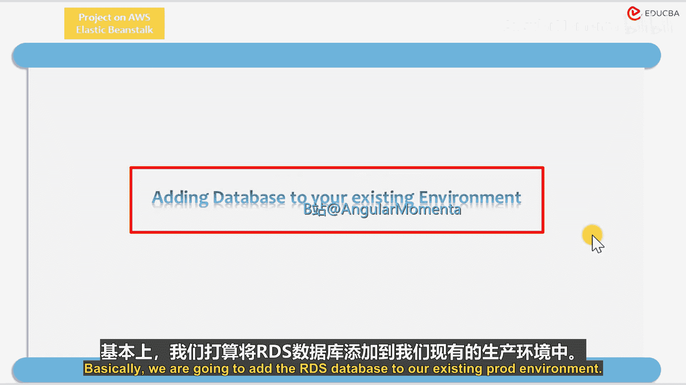
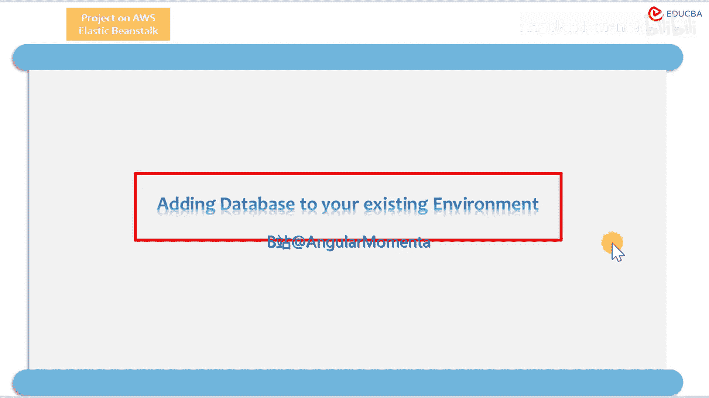

AWS Elastic Beanstalk与CI/CD：03_01_02：数据库导论 🗄️

在本节课中，我们将学习如何为现有的AWS Elastic Beanstalk环境添加数据库。我们将探讨可用的不同选项，并演示具体的操作步骤。

在上一节中，我们创建了一个包含测试（test）和生产（pro）两个环境的应用程序。本节中，我们将具体了解如何为环境附加数据库资源。我们将以为现有的生产（pro）环境添加一个RDS数据库为例进行说明。

以下是向现有环境添加数据库的主要步骤：

1.  登录AWS管理控制台，导航到Elastic Beanstalk服务。
2.  在左侧导航栏中，选择“环境”，然后点击您要修改的环境名称（例如“pro”）。
3.  在环境仪表板的左侧导航栏中，找到并点击“配置”。
4.  在配置页面中，滚动到“数据层”部分，点击“编辑”。
5.  在数据层配置页面，您可以选择创建新的数据库实例或连接到现有实例。对于新建，您需要设置数据库引擎（如MySQL、PostgreSQL）、实例类型、存储大小、用户名和密码等参数。
6.  完成所有必要配置后，点击页面底部的“应用”按钮。Elastic Beanstalk将开始更新您的环境以包含新的数据库资源。

这个过程的核心是修改环境的配置，其本质是更新一个描述环境的JSON或YAML文件，例如更新 `.ebextensions` 目录下的配置文件来声明数据库依赖。





```yaml
# 示例：在 .ebextensions 配置中声明数据库选项（概念示意）
option_settings:
  aws:rds:dbinstance:
    DBEngine: mysql
    DBInstanceClass: db.t2.micro
    DBUser: mydbuser
    DBPassword: mypassword
```





完成上述步骤后，您的应用程序环境将与一个托管的数据库实例关联。应用程序可以通过环境变量（如 `RDS_HOSTNAME`, `RDS_DB_NAME`）自动获取数据库连接信息，无需在代码中硬写配置。



本节课中，我们一起学习了如何为AWS Elastic Beanstalk环境集成数据库。我们回顾了通过控制台配置界面添加RDS数据库的流程，并理解了其背后通过环境配置和变量注入实现连接的基本原理。这为构建需要数据持久化的完整应用程序奠定了基础。