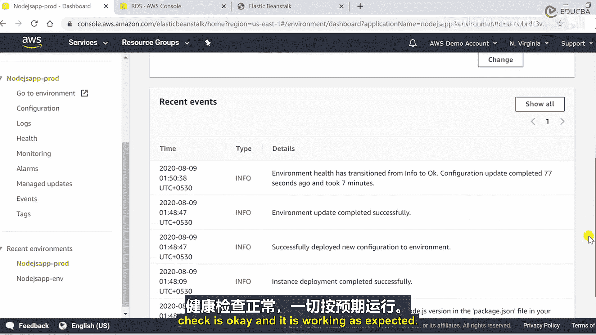
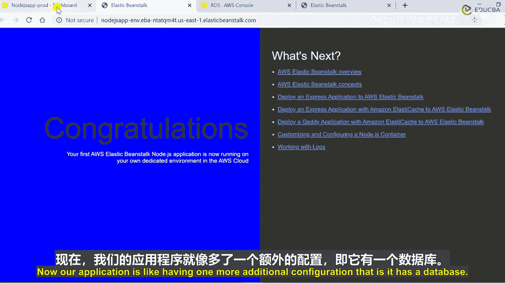
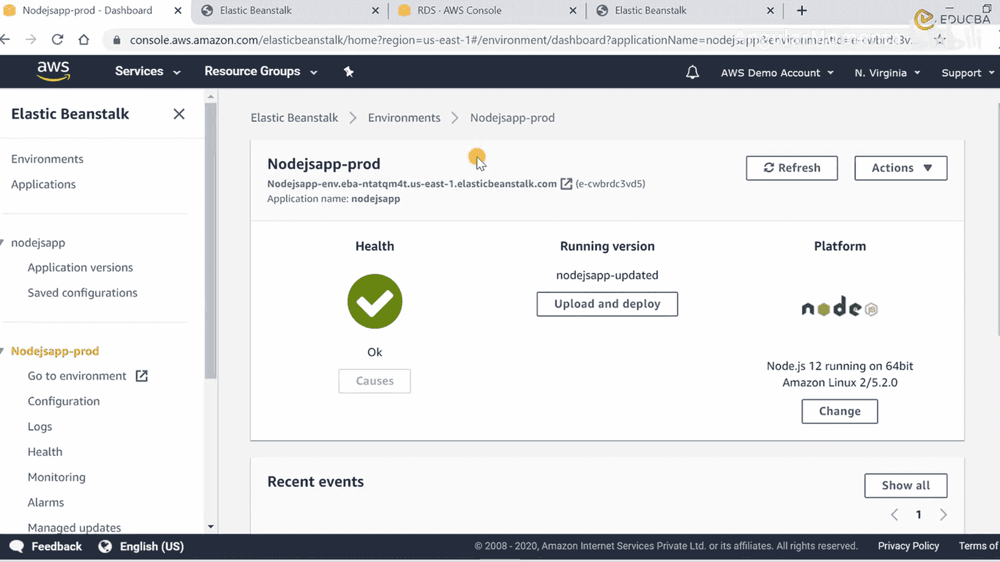

# 022：演示数据库配置 🗄️

在本节课中，我们将学习如何在 AWS Elastic Beanstalk 环境中添加并配置一个 RDS 数据库实例。我们将通过控制台操作，为现有的应用程序环境附加一个数据库，并了解相关的配置选项和生命周期管理。

## 概述

上一节我们介绍了 Elastic Beanstalk 环境的基本状态。本节中，我们来看看如何为这个环境添加一个关系型数据库服务（RDS）。我们将从环境仪表盘开始，逐步完成数据库的创建和配置。

## 访问环境配置

这是我们的 Elastic Beanstalk 仪表盘，可以看到两个环境位于同一个应用程序下。目前环境处于健康状态。

现在需要执行的操作是为该环境添加一个 RDS 数据库。当前，此应用程序尚未附加任何数据库。

以下是查看或编辑配置的位置。

```plaintext
配置 (Configuration) 列
```

点击此列后，将显示当前环境的所有配置项，并可以进行编辑。最后一项是数据库配置，目前此处为空。

## 编辑数据库配置

我们将点击“编辑”按钮。系统首先会获取当前的配置信息，以便修改数据库设置。此操作将把一个 Amazon RDS 数据库添加到您的基础设施和环境中，用于开发和测试目的。

AWS Elastic Beanstalk 通过设置环境属性（如数据库主机名、用户名、密码、表名和端口）来向您的实例提供连接信息。当您向环境添加数据库时，其生命周期将与您的环境绑定。对于生产环境，您可以配置实例以连接到外部数据库。

## 配置数据库参数

现在，界面显示了一些参数选项，例如“从快照恢复”。

此选项询问我们是希望从账户中现有的快照恢复数据库，还是需要创建一个新数据库。

AWS 提供了从快照恢复数据库的功能。但在此演示中，我们将选择创建新数据库。

因此，我们选择“无”。如果账户中存在快照，它们会出现在此下拉列表中。目前没有，所以只显示“无”。

选择“无”后，我们需要创建新数据库。以下是需要配置的选项。

默认数据库引擎是 MySQL。但这里提供了多种数据库选项，包括 Oracle、PostgreSQL、SQL Server 等。

出于演示目的，我们将使用默认的 MySQL 引擎。引擎版本为 8.0.17，实例类为 db.t2.micro（这是默认的免费套餐类型）。

存储配置选项允许选择 5 GB 到 1 TB 或 24 GB。由于是演示，我们选择最小值 5 GB。

接下来需要设置用户名和密码。正确配置用户名和密码非常重要，这将帮助您访问 RDS 数据库。

我们设置用户名为 `testingDb`，密码也设置为 `testingDb`。

下一个选项是关于保留策略的：当您终止环境时，数据库实例也会被终止。选择“创建快照”会在终止前保存该数据库的快照。

因此，您可以将此快照与之前的“从快照恢复”选项关联使用。这里，我们选择“删除”。

此外，如果您的应用程序不需要多租户或高可用性，可以选择单一可用区。如果需要高可用性，则可以选择多可用区部署。目前，我们选择单一可用区。

确保所有信息输入正确，然后点击“应用”。

## 应用配置与部署

系统正在验证并保存所有配置。它提示保存配置，但建议不要将数据库相关配置保存在本地桌面。

现在，环境开始重新部署。因为我们更改了配置，环境将更新以包含我们刚刚配置的 RDS 数据库。此过程需要几分钟。

我们可以通过事件部分监控部署进度。所有活动都会显示在此处，对于 Elastic Beanstalk 的初学者，观察后台部署步骤非常有益。

页面会自动刷新以显示最新状态。现在可以看到事件显示 RDS 数据库已使用指定名称创建。

## 验证 RDS 创建

我们可以在 AWS 控制台验证 RDS 实例的创建。进入 RDS 控制台，查看数据库部分，确认实例已创建。

点击该实例，可以查看所有安全和连接参数。这些参数都是为此特定 RDS 实例自动创建的。

可以看到关联的安全组处于活动状态。还可以检查复制设置，目前我们只有一个实例。



由于未选择从快照创建，快照部分为空。可以通过点击“修改”按钮来调整配置，这与我们刚刚完成的配置过程相同。

RDS 实例已创建，但环境仍在更新其他组件。如前所述，这需要几分钟时间等待。



大约 7 分钟后，我们收到了消息。环境健康状态恢复为“正常”，并且运行良好。

现在，我们的应用程序拥有了一项额外的配置：一个数据库。

## 探索环境监控与日志

此外，我想向大家展示如何查看与环境相关的日志。您可以在此处配置不同的日志。

您可以请求查看最后一百行日志，或者需要完整日志。要查看完整日志，首先需要在实例上进行配置。

目前我们没有配置，所以此处看不到。您可以点击“健康”查看整体健康状况，或查看我们刚创建的特定实例的监控信息。

我们尚未设置增强监控。此处显示的是免费套餐中提供的基础监控信息。

CPU 使用率为 0.6%。最大网络流入为 69 KB，最大网络流出为 38 KB。您可以随时调整此图表的显示范围。

由于实例是几分钟前刚启动的，数据变化不大。您可以查看 CPU 利用率图表，此处有一个峰值，因为我们在那时启动了 RDS 实例。

通过这种方式，您可以随时监控应用程序及其活动。您还可以将其与 CloudWatch 集成以设置警报。

所有这些服务都可以相互链接，以实现最佳性能和应用监控。您也可以从这里设置警报，或使用 CloudWatch 实现。

虽然本课程重点在 Elastic Beanstalk，但我提及其他 AWS 服务是因为它们都以某种方式与 Elastic Beanstalk 相互关联。Elastic Beanstalk 本质上是一个平台，我们可以在此平台上启动并集成其他 AWS 服务，以构建一个完整的环境。

## 总结



本节课中，我们一起学习了如何在 AWS Elastic Beanstalk 环境中添加和配置 RDS 数据库。我们完成了从访问配置、设置数据库参数、应用更改到验证创建的完整流程，并简要了解了环境监控和日志查看功能。请务必使用 AWS 账户亲自配置这些服务和应用程序，进行更多探索和实践。