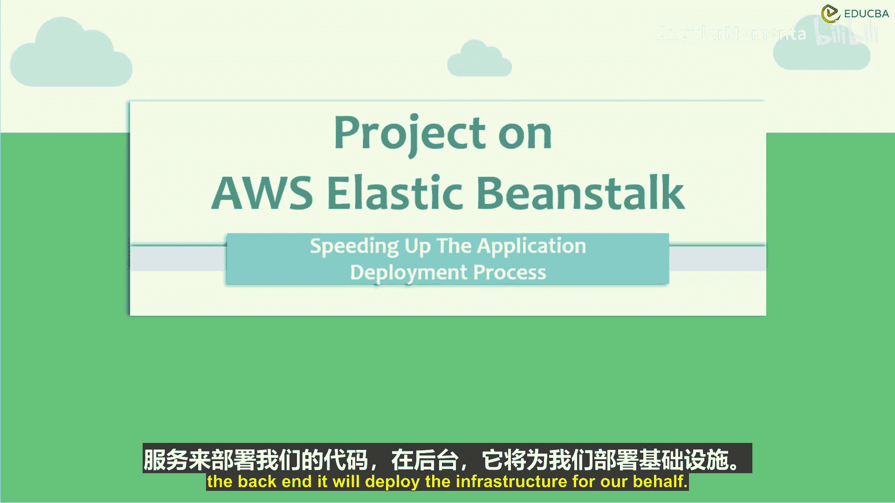
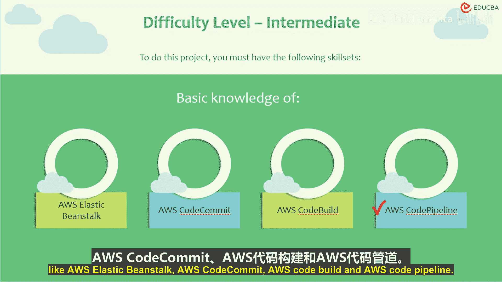
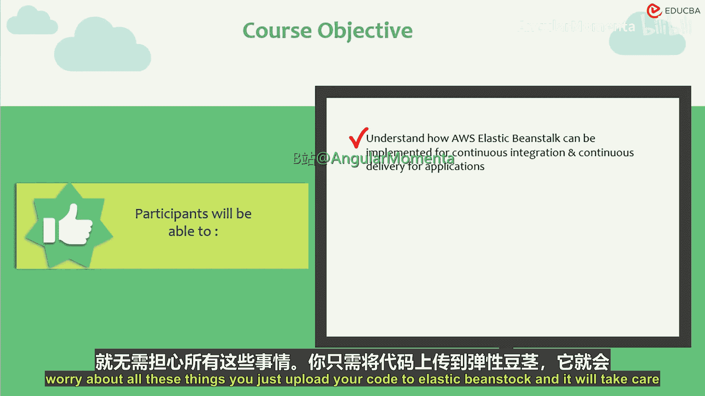
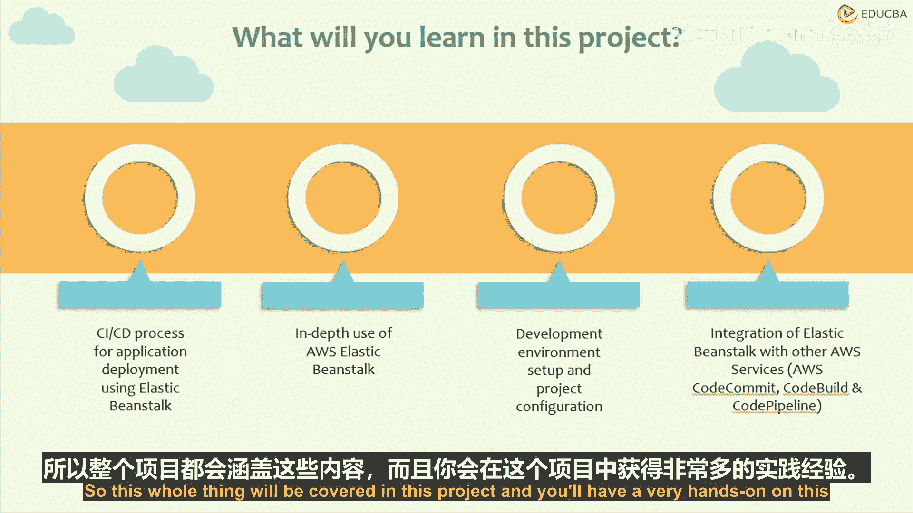
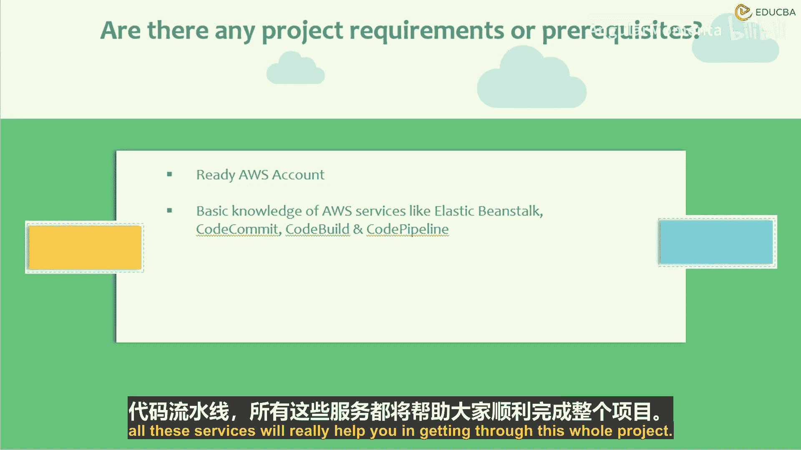
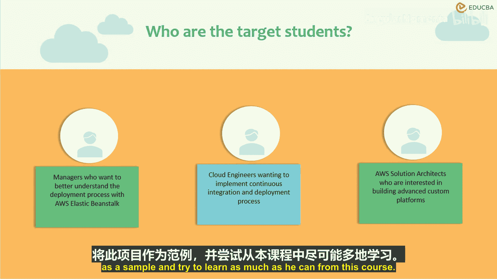
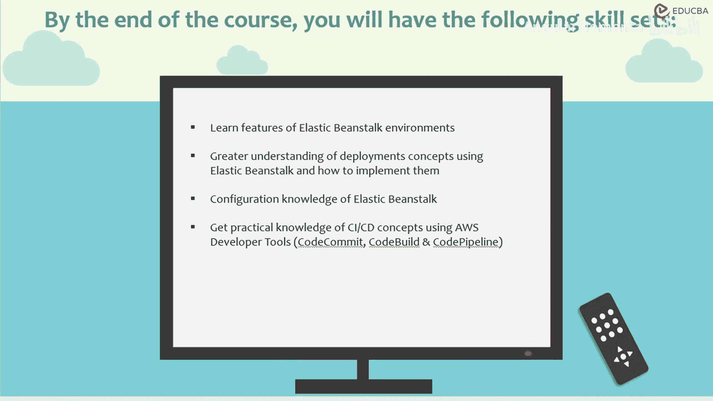
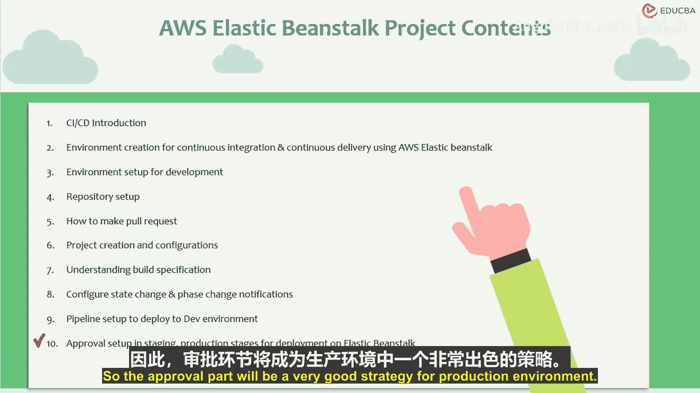
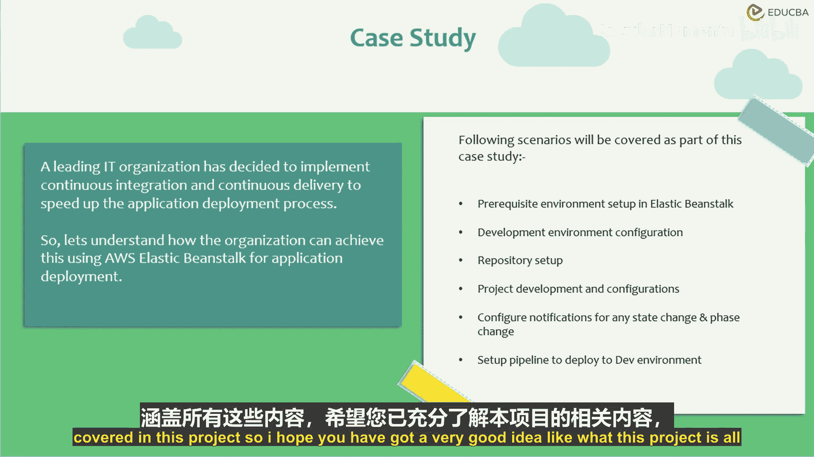

# 023：课程导论与概述

在本节课中，我们将要学习如何利用AWS Elastic Beanstalk及相关服务，为云项目构建一个自动化的持续集成与持续部署（CI/CD）流程。我们将从核心概念入手，逐步了解整个项目的目标、所需工具以及你将学到的具体技能。

## 课程概述

本项目旨在加速应用程序的部署流程，即实现持续集成与持续部署。当前，DevOps正迅速成为行业标准，而CI/CD是DevOps流程中与软件开发和发布紧密相关的术语。

简单来说，持续集成是一种允许开发人员每天多次将代码集成到主共享仓库的过程，并即时提供关于功能或测试可能出错的反馈。这避免了在开发周期结束时才去构建和集成来自不同团队或个人的软件工作成果。

通过持续集成，你可以定期构建代码。这有助于开发人员满足代码质量标准，及早解决错误，并降低集成成本。

持续交付是持续集成的延伸，它专注于自动化软件的交付过程。这有助于随时将代码部署到预发布和生产环境。

持续部署则是一个自动构建并将代码部署到服务器的过程。该流程可以完全自动化，实现跨多个环境的构建、测试和部署，并能自动处理故障并回滚到之前良好的状态。

## CI/CD工具与AWS方案

当我们谈论使用CI/CD部署应用程序时，市场上有多种工具可以帮助你构建强大的CI/CD流水线，以满足敏捷开发、持续构建、部署和交付的需求。

例如，我们有Jenkins、Travis CI、Gitlab、Bamboo等。这些都是提到CI/CD时，人们通常会立即想到的工具。

但在本项目中，我们将使用AWS原生工具来部署CI/CD流水线。我们将使用AWS CodePipeline、AWS CodeDeploy，并将Elastic Beanstalk作为平台即服务来部署我们的代码。Elastic Beanstalk将在后端为我们自动部署所需的基础设施。

## 项目难度与目标

这是一个中级难度的项目。你需要对以下AWS服务有一些基本了解：AWS Elastic Beanstalk、AWS CodeCommit、AWS CodeBuild和AWS CodePipeline。

本课程的目标是理解如何利用Elastic Beanstalk为应用程序实现持续集成和持续交付。

## 什么是AWS Elastic Beanstalk？

Elastic Beanstalk是一个高度托管的服务，用于部署你的代码。在通常的情况下，你需要一台服务器，需要在服务器上配置代码、构建数据库并处理所有安全问题。完成所有这些事情后，你的代码才能在此基础设施上运行。

然而，当我们使用Elastic Beanstalk时，你无需担心所有这些事情。你只需将代码上传到Elastic Beanstalk，它就会自动处理所有所需的基础设施。

## 你将学到什么

在本项目中，你将学习到以下内容：
*   使用Elastic Beanstalk部署应用程序的CI/CD流程。
*   Elastic Beanstalk的深入使用。
*   设置Elastic Beanstalk环境。
*   设置CodePipeline和CodeDeploy的环境。
*   如何自动化从代码检入到在Elastic Beanstalk中部署的整个周期。

本项目将涵盖所有这些内容，并提供丰富的实践操作。在学习本项目时，建议你创建一个免费的AWS账户，并熟悉我在此提到的AWS服务，如Elastic Beanstalk、CodeCommit、CodeBuild和CodePipeline。这些服务将极大地帮助你完成整个项目。

## 目标学员

任何技术人员都可以运行此项目，特别是：
*   任何试图在其环境中实施CI/CD的技术工程师。
*   任何云工程师、解决方案架构师或开发人员。
*   任何希望实施CI/CD并希望采用DevOps模式的经理。

他们都可以将此项目作为样本，并从中尽可能多地学习。

## 课程收获

完成本课程后，你将：
*   了解Elastic Beanstalk环境的一些特性。
*   深刻理解使用Elastic Beanstalk进行部署的方法及其实施。
*   掌握Elastic Beanstalk的配置知识。
*   获得一个使用AWS工具实践CI/CD概念的优秀示例。
*   能够通过跟随本课程，完全独立地构建整个CI/CD流水线。

## 课程内容大纲

以下是本课程将要涵盖的主题：
1.  引言
2.  使用Elastic Beanstalk为CI/CD创建环境
3.  为开发设置环境（本项目将使用PHP，因此在接下来的课程中将设置PHP环境）
4.  学习如何设置代码仓库、创建拉取请求并将代码推送到CodeCommit
5.  项目创建与配置（配置使代码能在Elastic Beanstalk中顺利运行的其他事项）
6.  理解构建规范（检入代码时需要考虑的事项，以及如何准备代码以减少部署问题）
7.  设置通知（以便了解代码何时正在构建、部署等，从而跟踪环境状态）
8.  将代码部署到开发环境，然后部署到生产环境
9.  在部署流程中设置审批步骤（例如，手动批准代码是否需要部署到开发或生产环境，这对于生产环境是一个很好的策略）

## 案例研究

本课程将以一个领先的组织为例，该组织正试图使用CI/CD加速其应用程序部署流程。课程将涵盖以下所有场景：
*   预生产环境设置
*   开发环境配置
*   仓库设置
*   项目开发与配置
*   通知变更
*   设置审批
*   部署到开发和生产环境的流水线

本项目将涵盖所有这些内容。

## 总结

本节课中，我们一起学习了本CI/CD项目的整体介绍。我们明确了课程目标是利用AWS Elastic Beanstalk及相关服务构建自动化部署流水线，了解了CI/CD的核心概念、将使用的AWS工具组合、项目的难度与目标学员，并预览了整个课程的知识大纲和最终你将获得的实践技能。希望你现在对本项目的内容有了清晰的认识。