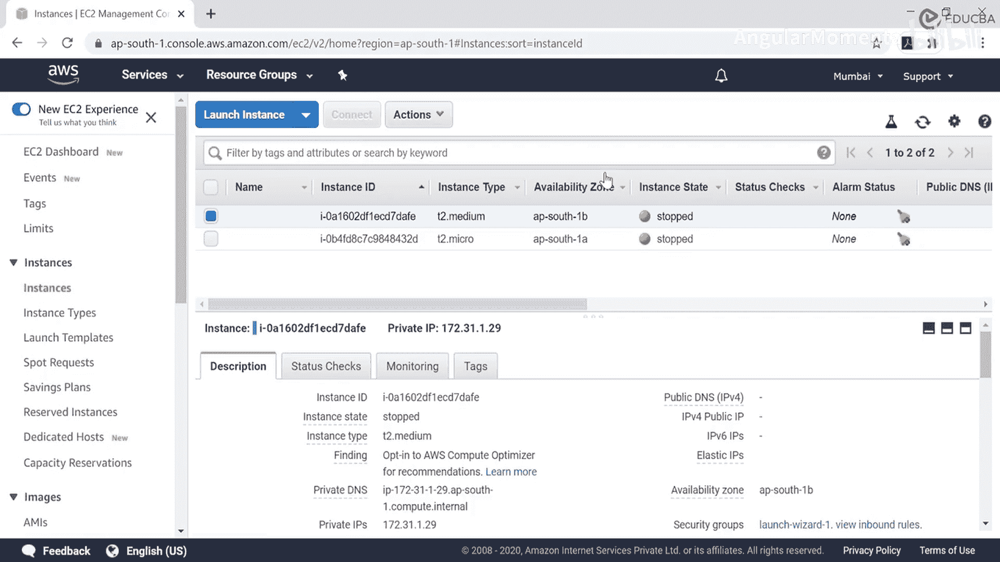
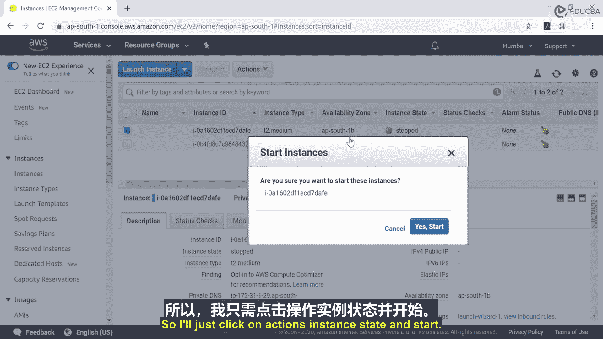
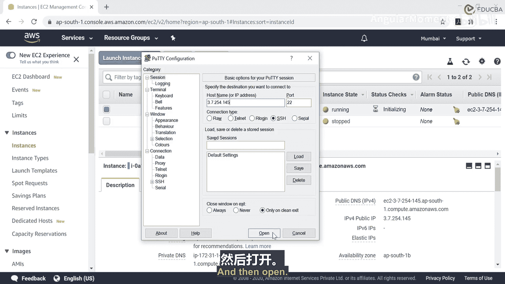
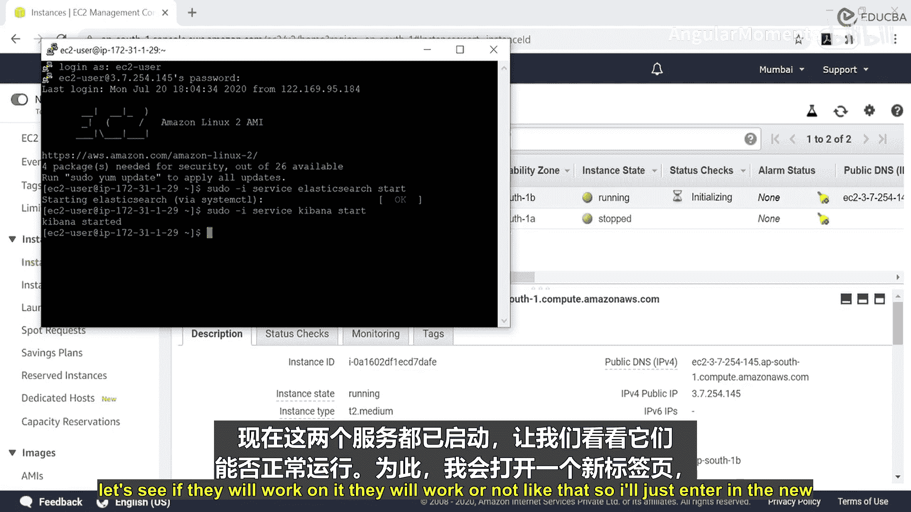
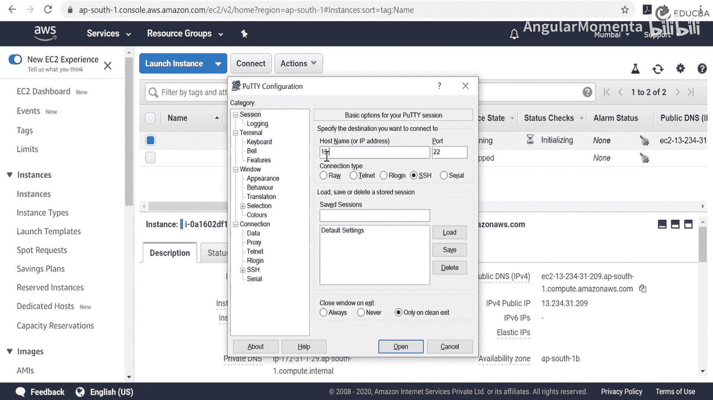
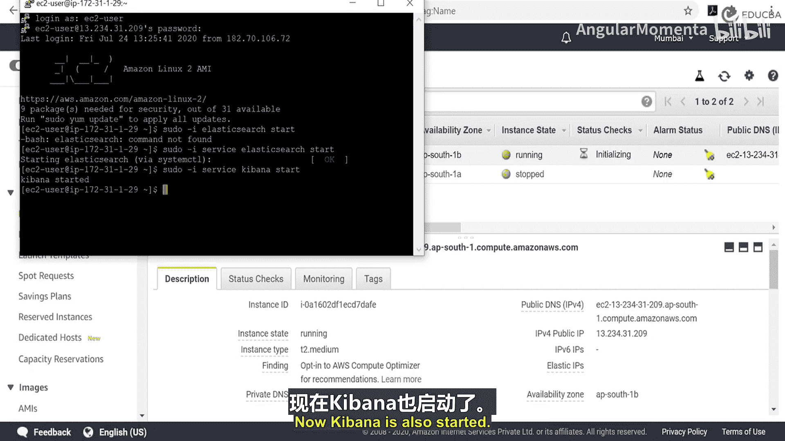
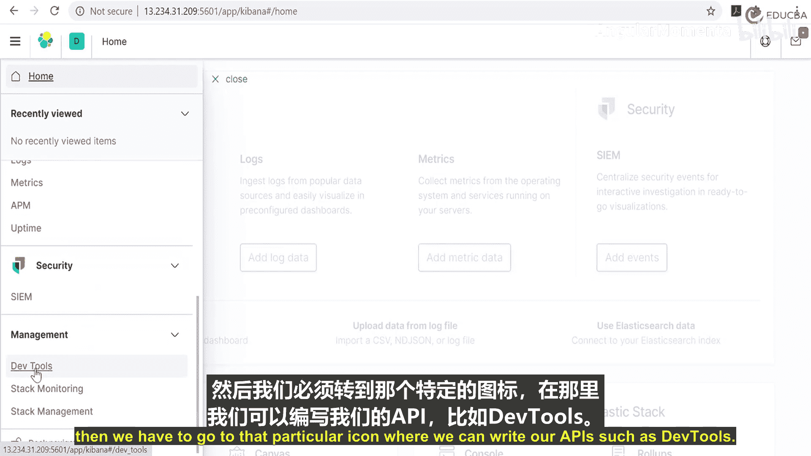

# 024：理解AWS控制台 🖥️

在本节课中，我们将学习如何理解AWS控制台及其工作原理。我们将通过一个具体的项目案例——新冠疫情下的航班监控系统——来演示如何访问AWS服务，并启动Elasticsearch和Kibana服务。

## 概述

我们的项目是一个用于航空业的疫情航班监控系统。该项目需要使用Elasticsearch和Kibana软件。学习本教程需要具备Linux基础知识，并且你的系统中应已安装Elasticsearch和Kibana。

本课程将解决四个主要问题：
1.  理解AWS控制台及其工作原理。
2.  实现所有API，用于在NoSQL数据库中存储和访问数据。
3.  使用之前创建的NoSQL数据库中的数据，在Kibana中创建饼图、表格和直方图。
4.  创建一个包含所有数据可视化的仪表板，并应用过滤器来获取数据。

在本节视频中，我们只涵盖第一个问题：理解AWS控制台及其工作原理。我已经使用过AWS控制台，并通过实例创建了一个可共享的IP地址。

## 什么是AWS控制台？

AWS控制台是一个基于Web的用户界面，它通过EC2实例服务提供对云的访问。

我们可以通过一个比喻来理解：假设你住在一个小房子里，这里没有你需要的所有设施，但你具备使用这些设施的知识，并且你想使用它们。现在，有一栋大房子，里面有你想要使用的所有设施和基本的互联网连接。如果你想在那个特定的地方工作，你需要向那栋房子支付一些费用。现在，为了从小房子到达大房子，你需要一辆特定的自行车，这辆自行车在你想要进入大房子时必须随身携带。

在这个场景中：
*   **小房子**代表**本地主机**。
*   **大房子**代表**AWS控制台**，它允许你将IP地址分享给世界上任何有互联网连接的人。
*   **那辆特定的自行车**代表**PuTTY**，它是进入EC2实例的中介。

## 访问AWS并启动服务

现在，让我们开始了解如何进入AWS以及如何访问Elasticsearch服务。

这是EC2仪表板。我已经创建了我的实例，并在上面安装了Elasticsearch和Kibana。点击“运行中的实例”。

这就是我已经安装了Elasticsearch和Kibana的实例。它只允许我通过特定的IP地址进入。如你所见，这里的实例状态是“已停止”。现在，我需要启动这个实例。所以我将点击“操作” -> “实例状态” -> “启动”。




与此同时，我们将打开PuTTY，它作为中介，将带我进入EC2实例。



在“主机名”中，我将输入实例启动后将提供的公共IP地址。每次启动服务时，它都会更改公共IP和私有IP地址，我们只能在PuTTY配置中添加那个特定的IP地址。这是公共IP地址：`3.7.254.145`。输入这个特定的IP地址，然后点击“打开”。



这是一个警告，点击“是”。我已经预先设置好了用户名和密码。


现在，我们已经到达了特定部分。也就是说，我们已经进入了这个特定项目的EC2实例。

## 启动Elasticsearch和Kibana服务

接下来，我们需要启动Elasticsearch和Kibana的服务。对于这两者，都有相应的命令。

首先，我们将启动Elasticsearch服务。命令是：
```bash
sudo service elasticsearch start
```
然后按回车。现在它正在启动Elasticsearch。我之前已经安装了Elasticsearch，所以我只是启动它的服务。

当我们启动这两个服务后，我们将看到它是如何工作的，以及我们如何在电脑上进入并操作它。

Elasticsearch服务已经启动。现在让我们启动Kibana的服务。命令是：
```bash
sudo service kibana start
```
如果你想停止服务，可以输入 `sudo service kibana stop`，Elasticsearch同理。

现在，两个服务都已启动。让我们看看它们是否能正常工作。



## 验证服务

我将打开一个新的浏览器标签页。我将输入这个公共IP地址以及Elasticsearch或Kibana的默认端口。由于我们正在使用Kibana，让我们从Kibana开始。Kibana的基本默认端口是5601。所以地址是：`3.7.254.145:5601`。

让我们看看它是否启动。它正在加载。我们也可以检查Elasticsearch服务，因为API只在Kibana中编写，Kibana中有一个部分允许我们输入API。所以Elasticsearch只是为了显示它是否正常工作。

让我们看看Elasticsearch或Kibana是否正常工作。是的，我们已经成功进入了Kibana主页，同样也进入了Elasticsearch。

## 总结

在本节视频中，我已经向你展示了如何进入Kibana。在下一个视频中，我们将在Kibana服务上工作。我们将讨论下一个问题：实现所有API以在NoSQL数据库中存储和访问数据。每个人都应该了解什么是NoSQL数据库。NoSQL数据库没有表，基于文档的概念工作。

现在，像上一个视频一样启动我们的实例。这是我们的实例：“操作” -> “实例状态” -> “启动”。与此同时，让我们启动PuTTY。现在，我们将添加实例将提供给我们的主机名。它仍处于“等待中”状态。

我们知道，在这个视频中，我们将讨论四种API：PUT、POST、GET和DELETE。现在，我们在这里获得了公共IP。将其输入到主机名中。



然后点击“打开”。我们已经创建了用户。好的，现在我们将启动服务。

首先，启动Elasticsearch服务。命令是：
```bash
sudo service elasticsearch start
```
现在正在启动你的Elasticsearch。


当我们启动这两个服务后，我们将进入控制台。现在，启动Kibana服务。命令是：
```bash
sudo service kibana start
```
是的，这个命令，名字变了。现在Kibana也已经启动，但这里的工作已经完成。




现在，我们将首先输入从该实例获得的公共IP：`13.234.31.209`，以及Kibana的默认端口5601。它正在加载Elasticsearch。

然后，我们必须进入那个可以编写API的特定图标，即“开发工具”。



