# 026：创建饼图、直方图与数据表 📊

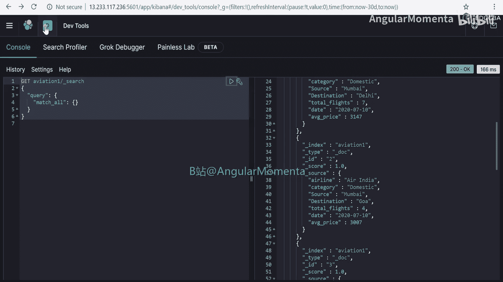

在本节课中，我们将学习如何利用API获取数据，并基于这些数据创建饼图、直方图和数据表。我们将从创建索引模式开始，逐步完成三种不同类型的可视化图表。

首先，我们运行API并查看数据。数据中包含六份文档，每份文档具有不同的ID。接下来，我们将基于这些数据创建饼图、直方图和数据表。

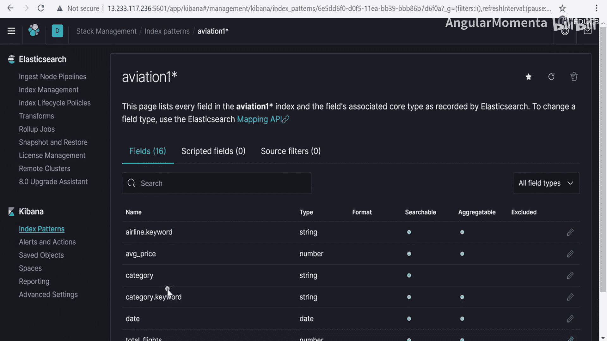

## 创建索引模式

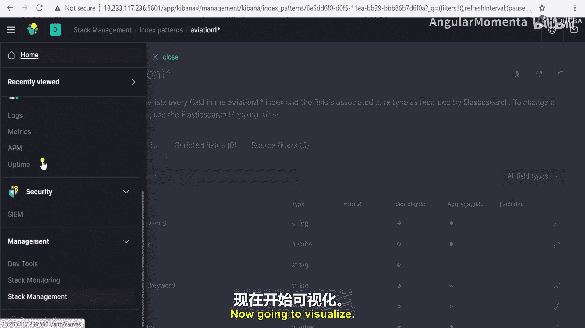

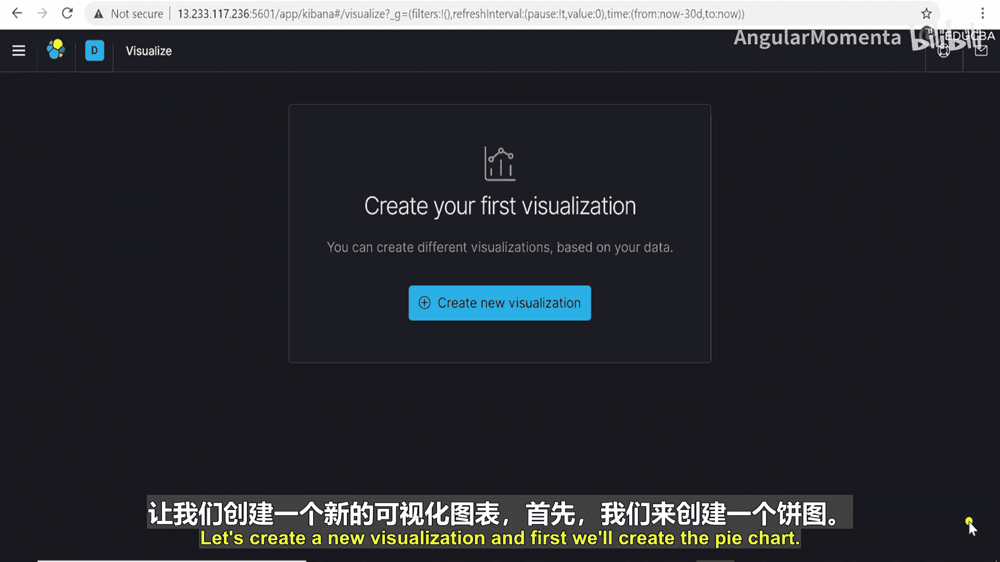

为了进行数据可视化，首先需要创建一个索引模式。

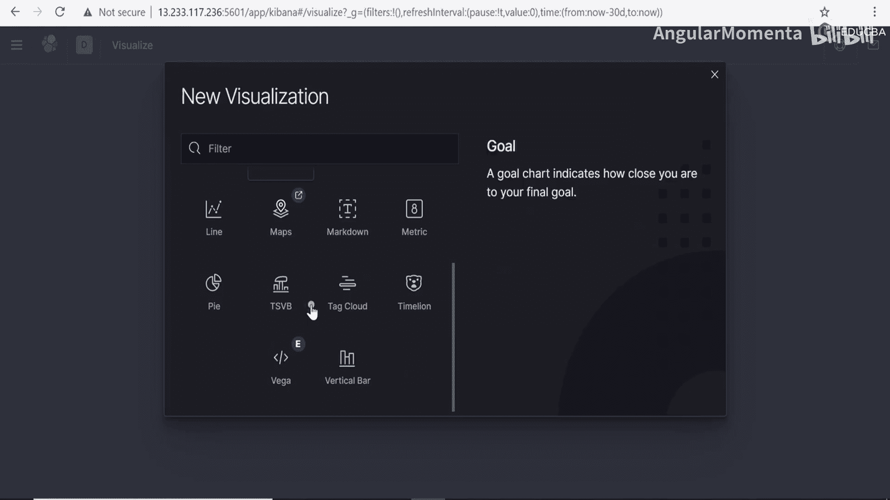

我们进入深度工具，管理空间，选择“索引模式”，然后点击“创建索引模式”。我们将创建一个名为 `aviation_1` 的索引模式。在下一步中，我们不使用时间过滤器。

我们使用的字段包括：`source`（出发地）、`destination`（目的地）、`airline`（航空公司）、`price_category`（价格类别）、`date`（日期）和 `total_flights`（总航班数）。

至此，索引模式已创建完成。

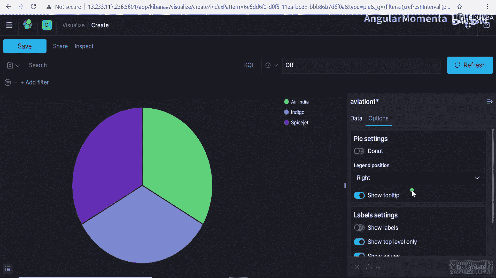

## 创建饼图 🥧

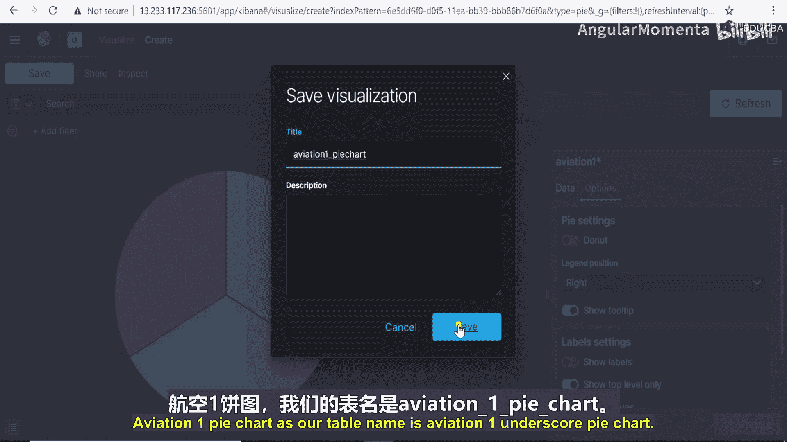

上一节我们创建了索引模式，本节中我们来看看如何创建饼图。

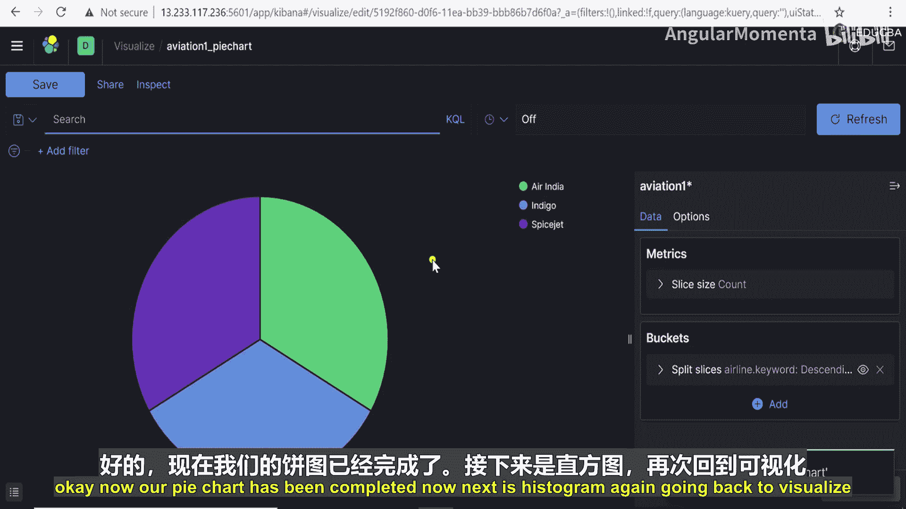

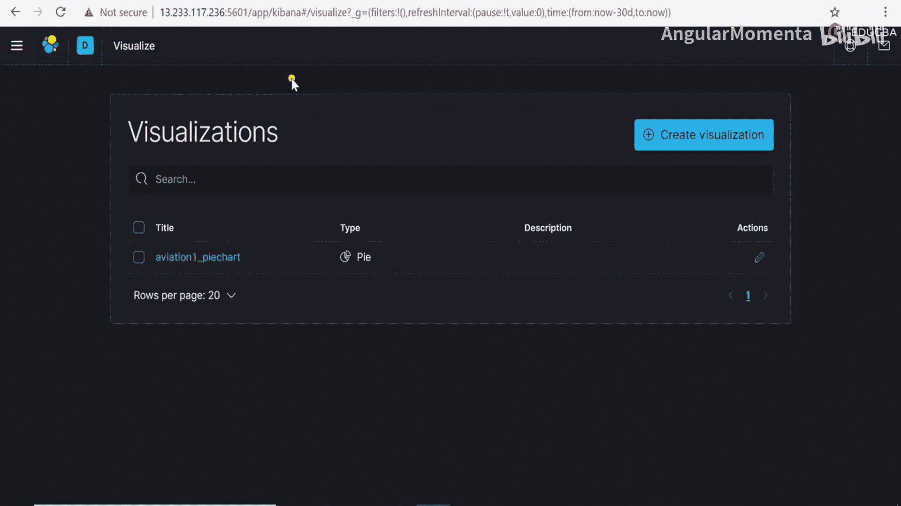

我们进入“可视化”界面，点击“创建新的可视化”，选择“饼图”类型。

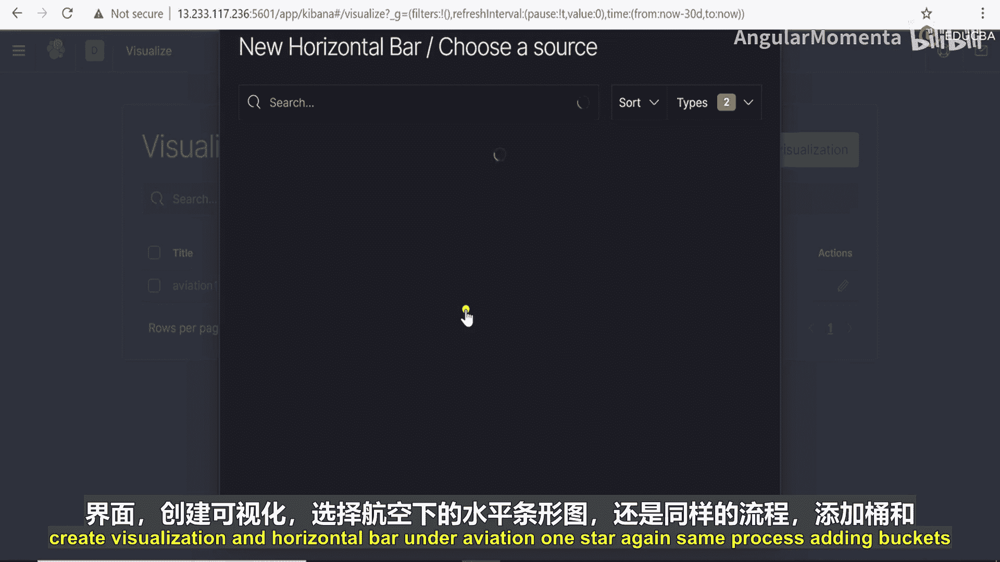

以下是创建饼图的具体步骤：
1.  选择索引模式 `aviation_1`。
2.  添加存储桶，选择“切片”类型。
3.  在聚合方式中选择“词条”。这允许我们自由选择用于创建饼图的字段。
4.  在本例中，我们希望根据不同的航空公司创建饼图，因此选择字段 `airline.keyword`。
5.  自定义标签为“Airlines”，然后点击“更新”。

现在，我们可以看到饼图中显示了不同航空公司的数据切片。我们不希望它是环形图，因此取消选中“环形图”选项。这样，最终的饼图就创建完成了。

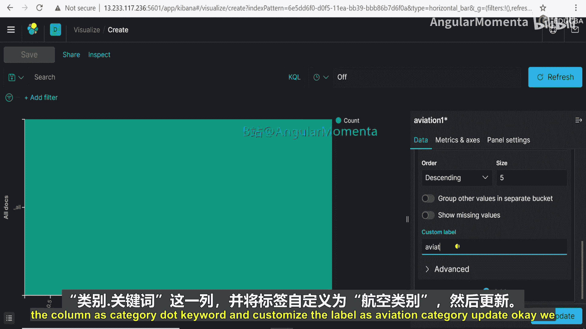

我们可以根据需要使用不同的设置进行调整。现在，保存这个饼图，命名为 `Aviation_1_Pie_Chart`。

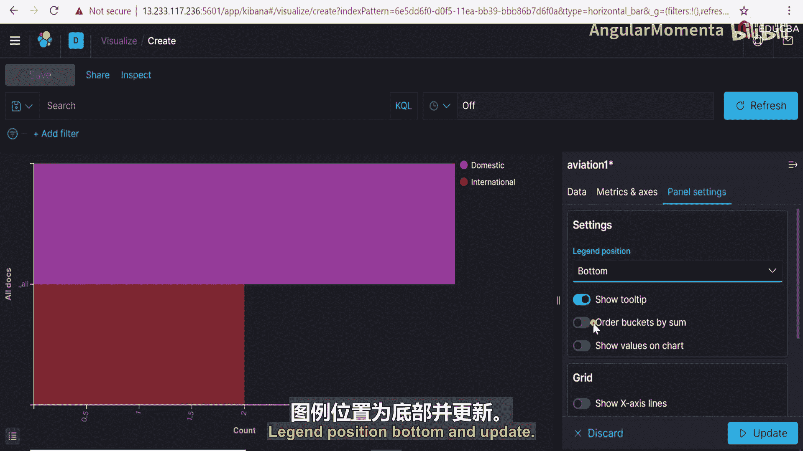

## 创建直方图 📈

饼图创建完成后，接下来我们学习如何创建直方图。

我们再次回到“可视化”界面，点击“创建新的可视化”，这次选择“水平条”类型（用于创建直方图）。

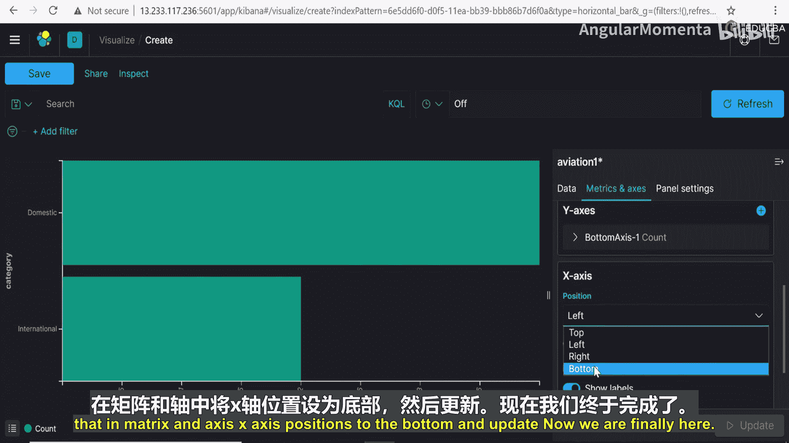

以下是创建直方图的具体步骤：
1.  选择索引模式 `aviation_1`。
2.  添加存储桶，选择“拆分系列”。
3.  在聚合方式中选择“词条”。
4.  在本例中，我们希望根据航班类别（国内或国际）来展示直方图，因此选择字段 `category.keyword`。
5.  自定义标签为“Aviation Category”，然后点击“更新”。

我们可以进行一些调整，例如将图例位置设置为底部。更新后，直方图的可视化就创建好了。

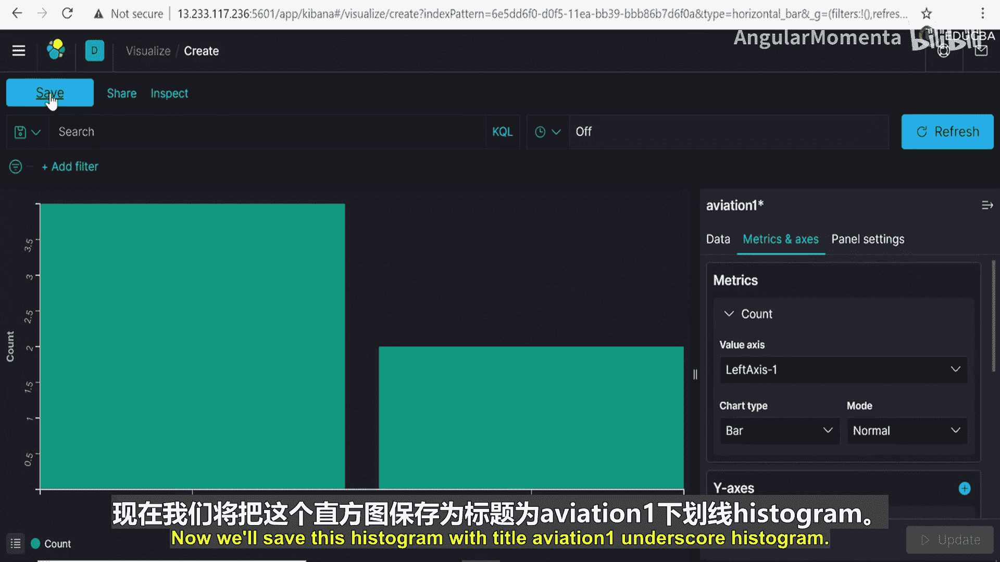

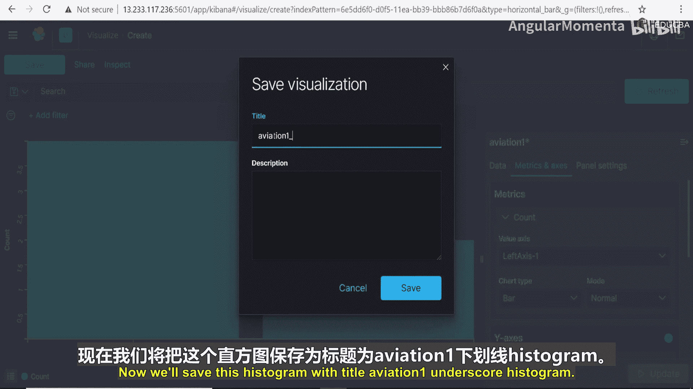

现在，我们创建一个新的“直方图”可视化，重复类似的过程：
1.  添加存储桶到X轴。
2.  选择基于“词条”的聚合方式。
3.  选择字段 `category.keyword`，并自定义标签为“Category”。
4.  更新后，将X轴位置调整到底部。

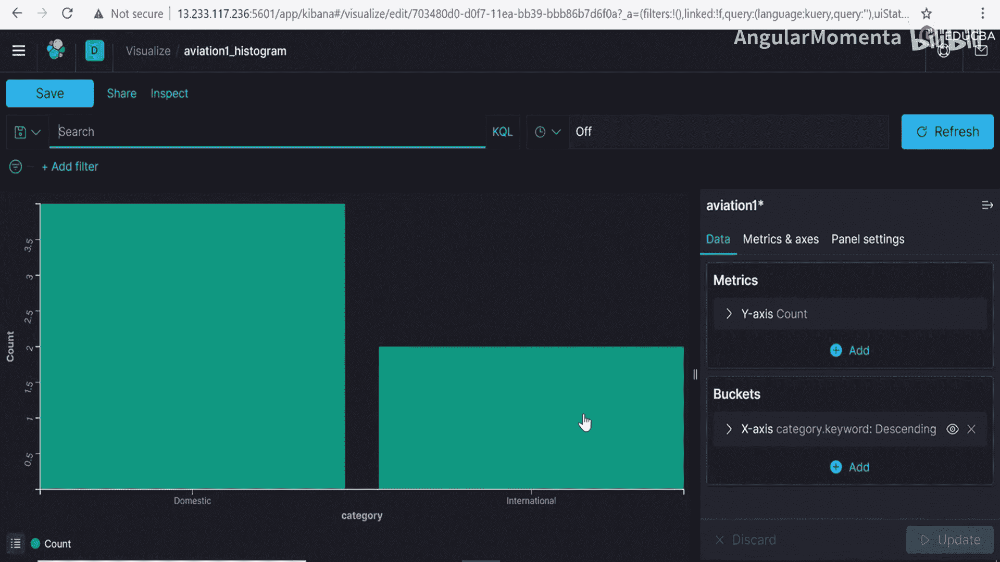

直方图提供了丰富的设置选项，您可以尝试不同的配置以观察效果。最后，保存这个直方图，命名为 `Aviation_1_Histogram`。

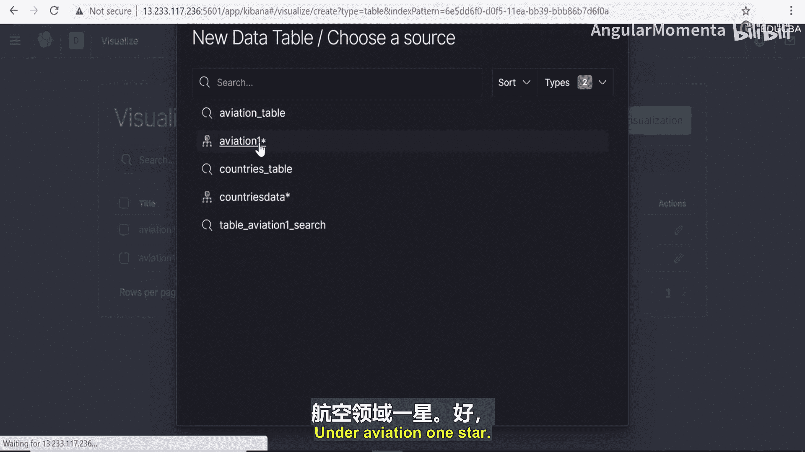

## 创建数据表 📋

我们已经创建了饼图和直方图，最后我们来创建数据表。

我们回到“可视化”界面，点击“创建新的可视化”，选择“数据表”类型，并基于 `aviation_1` 索引模式。

以下是创建数据表的具体步骤：
1.  添加存储桶，选择“拆分行”。
2.  选择基于“词条”的聚合方式。
3.  选择第一个要显示的字段，例如 `airline.keyword`，并自定义标签为“Airline”。
4.  重复此过程，依次添加其他字段。字段的添加顺序决定了它们在表中从左到右的显示顺序。
5.  继续添加 `category.keyword`（标签为“Category”）、`source.keyword`（标签为“Source”）、`destination.keyword`（标签为“Destination”）、`total_flights`（标签为“Total Flights”）和 `average_price`（标签为“Average Price”）等字段。
6.  最后，添加 `date` 字段（标签为“Date”）。

每添加一个字段并更新后，左侧的表格预览会实时变化。完成所有字段的添加后，完整的数据表就创建好了。

最后，保存这个数据表，命名为 `Aviation_1_Data_Table`。

## 总结

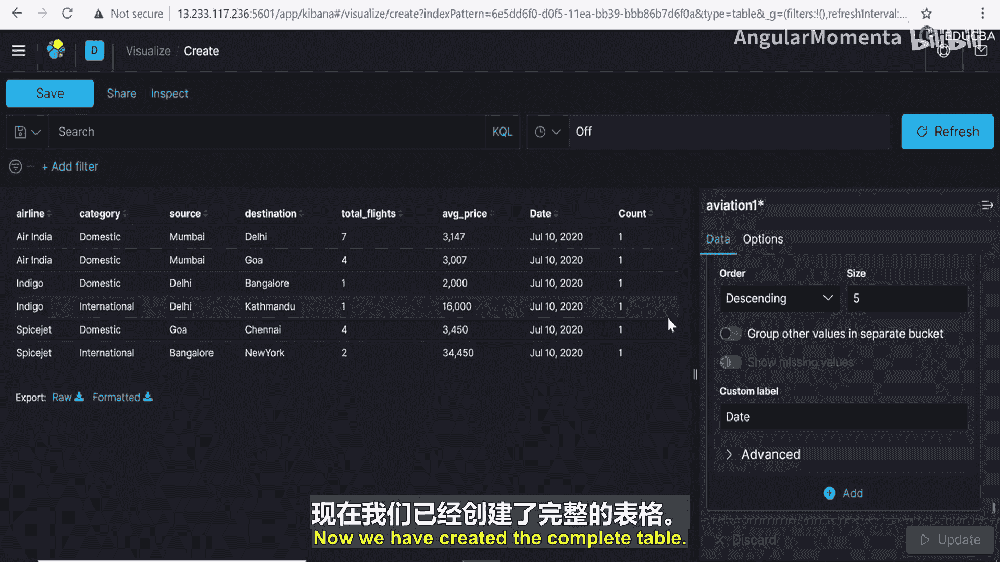

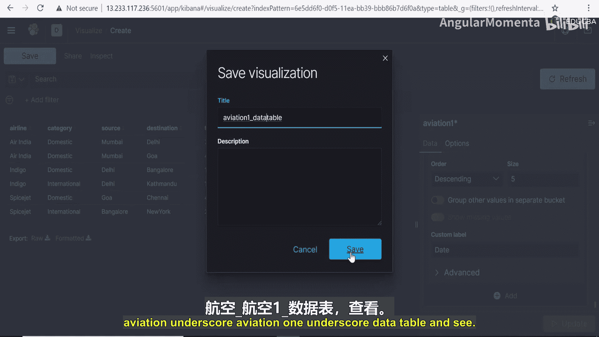

本节课中，我们一起学习了数据可视化的基本流程。我们从创建索引模式开始，逐步完成了三种常见图表：**饼图**、**直方图**和**数据表**。通过实际操作，我们掌握了在可视化工具中选择索引、配置聚合方式、添加字段以及自定义图表属性的方法。这些技能是进行数据分析和展示的基础。