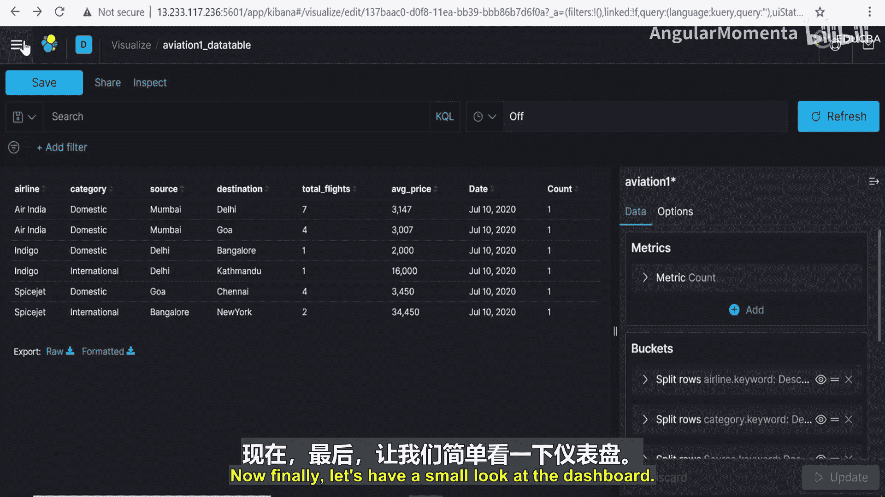
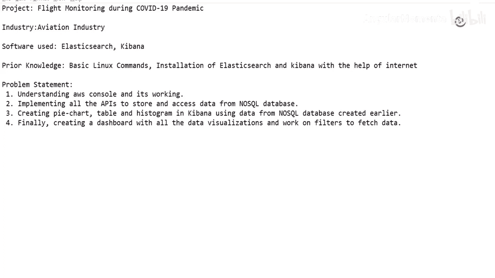
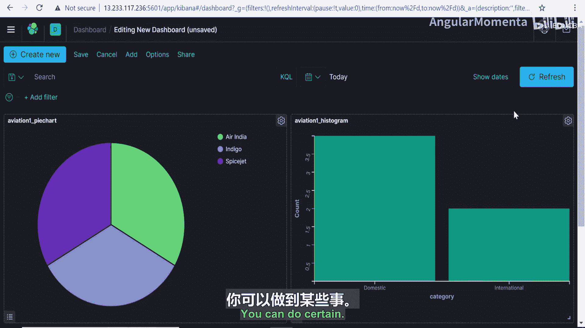

# 027：使用筛选器 📊

在本节课中，我们将学习如何在Kibana仪表板中配置日期格式、整合多个可视化图表，以及使用筛选器来动态过滤和查看数据。我们将通过实际操作，将之前创建的饼图、直方图和数据表整合到一个统一的仪表板中，并应用筛选器进行交互式数据分析。

---

上一节我们介绍了如何创建数据表。本节中，我们来看看如何调整数据表中的日期显示格式。

在数据表中，可以看到创建时间字段同时包含了日期和时间。现在，我将更改设置以移除时间部分。

为此，需要进入“堆栈管理”。在堆栈管理中，找到“高级设置”。在高级设置里，可以看到“日期格式”选项。你可以根据需求更改日期格式，系统也提供了多种预设格式。

我不希望日期显示中包含时间，因此移除了时间列。这里还有其他日期时间格式可供选择，你可以根据具体要求进行调整。

保存更改后，原本表格中的默认日期时间格式就被更新了。现在回到数据表查看变化，可以看到时间部分已被移除，只保留了所需的日期信息。

---

现在，让我们看一下仪表板。在最后的视频中，我们的最终目标是创建一个包含所有数据可视化的仪表板，并应用筛选器来过滤数据。在之前的视频中，我们已经创建了饼图、数据表和直方图，现在需要将这三个可视化组件整合到同一个仪表板上。

我们将返回到Elasticsearch页面。之前我们是在创建数据表的页面，现在回到选项菜单，选择“仪表板”。

我们将创建新的仪表板，并添加之前创建并保存在面板页面中的不同可视化组件。

我们会按照希望在仪表板上显示的次序，逐一添加面板。首先，添加“aviation 1”饼图，接着是“aviation 1”直方图，最后是“aviation 1”数据表。

现在可以看到，所有三个可视化组件都呈现在同一个仪表板上了。我们可以根据需要拉伸数据表的大小进行调整。

---

我们目前所在的这个仪表板可以添加筛选器，以便根据需求查找数据。例如，如果我想查看印度航空的国内客户数据，只需选择“国内”筛选条件。

这样，我就能看到印度航空有2个国内航班的数据。因为首先选择了“国内”筛选器，所以现在仪表板只显示所有国内航班的数据。

如果进一步只想查看印度航空的航班，可以再选择“印度航空”筛选器。现在，仪表板就清晰地展示了印度航空的国内客户数据：首先是孟买到德里的航班，然后是孟买到果阿的航班。

移除筛选器后，显示的内容会恢复原状。这个日期筛选器默认提供过去30天的数据，你也可以选择“今天”或其他自定义日期范围来查看不同时间段内创建的仪表板。

如果你想查看靛蓝航空的数据，也可以更改筛选条件。选择“靛蓝航空”后，可以看到有两条靛蓝航空的航班数据。

这提供了清晰的数据视图，所有筛选器都可以根据你的选择进行排列组合，从而获取相应的数据。

---

你还可以通过以下方式添加筛选器：首先选择想要添加筛选器的字段，然后设置操作符。例如，操作符可以设置为检查某个特定航空公司是否存在。

你可以相应地添加筛选器、更改日期，并执行尽可能多的调整。也可以根据喜好查看设置，并进行一些隐藏的尝试。

---

本节课中我们一起学习了如何在Kibana中调整日期格式、创建并整合多图表仪表板，以及使用筛选器进行交互式数据探索。掌握这些技能可以帮助你更高效地定制数据视图和进行深入分析。