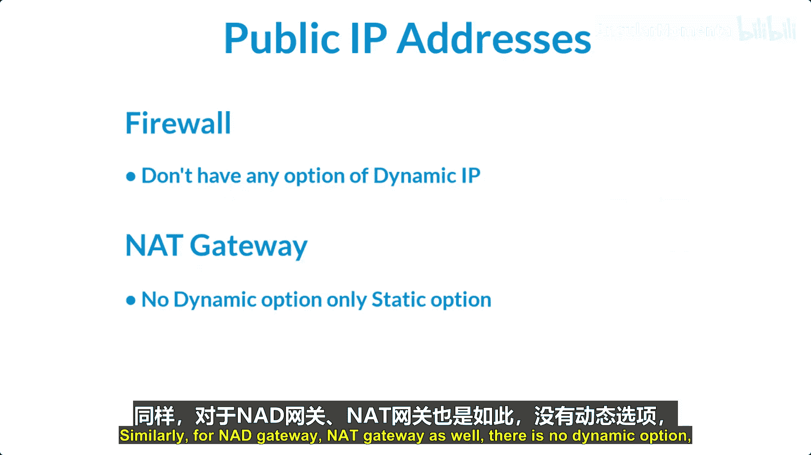
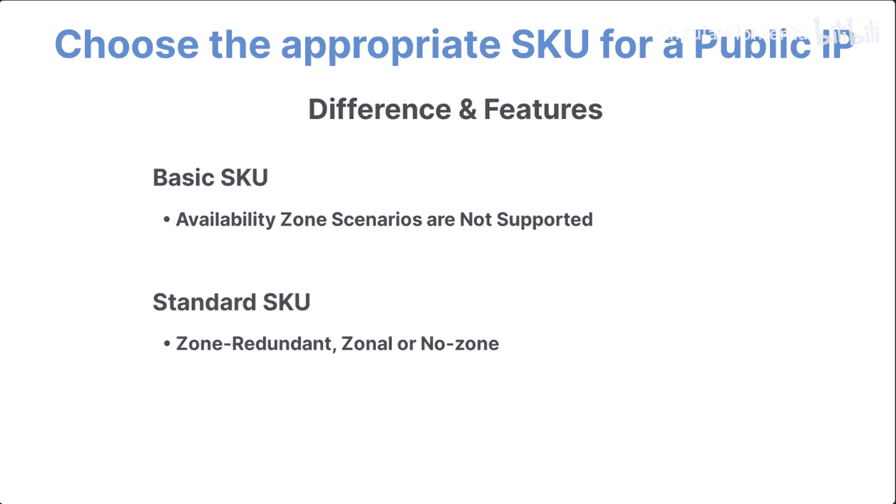
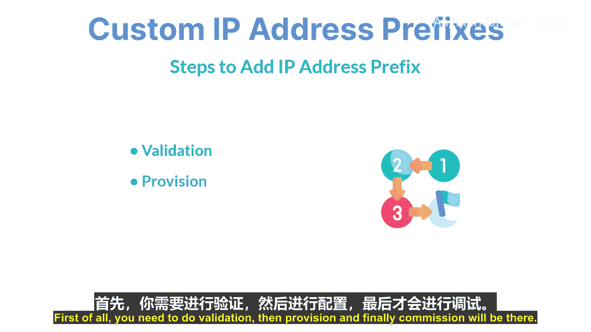
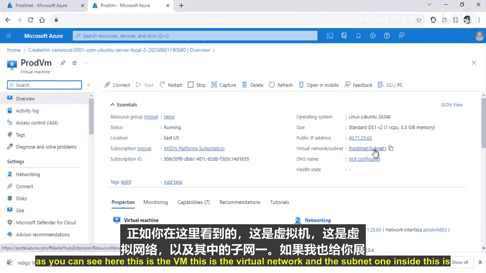
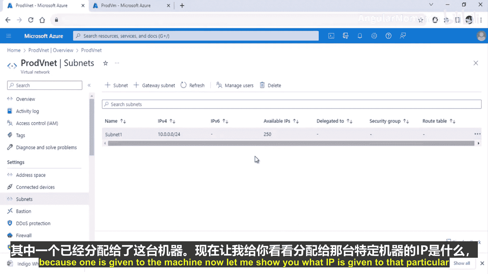
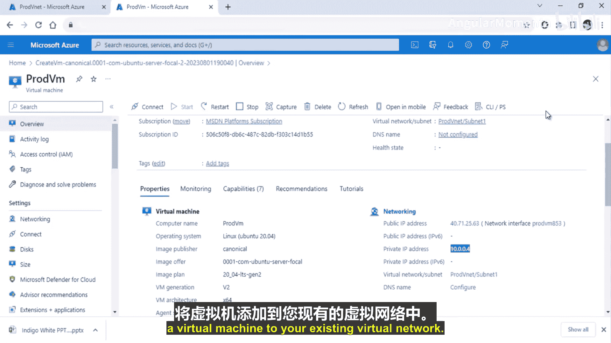

# 001：公共IP地址

在本节课中，我们将要学习Azure中的公共IP地址。公共IP地址是允许资源从互联网被访问的关键组件。我们将探讨其类型、SKU选项以及如何将其分配给虚拟机。

## 公共IP地址类型

上一节我们介绍了公共IP地址的基本概念，本节中我们来看看它的两种主要分配类型：动态和静态。

公共IP地址有两种分配类型：
*   **动态公共IP地址**：这是默认设置。当资源（如虚拟机）重启或停止后重新启动时，其公共IP地址可能会改变。其生命周期与Azure资源的运行状态紧密相关。
*   **静态公共IP地址**：此地址在分配后不会改变，即使资源重启。它会在资源的整个生命周期内保持不变，直到你手动取消分配。

以下是不同Azure服务对IP类型的支持情况：
*   **支持动态和静态**：负载均衡器、虚拟机、应用程序网关。
*   **仅支持静态**：VPN网关、防火墙、NAT网关。

## 公共IP地址SKU

了解了IP地址的类型后，接下来我们看看公共IP地址的两种服务等级（SKU）：基本版和标准版。它们提供了不同的功能集。

以下是基本SKU和标准SKU的主要区别：

| 特性 | 基本SKU | 标准SKU |
| :--- | :--- | :--- |
| **分配方法** | 支持**静态**和**动态**分配。 | 仅支持**静态**分配。 |
| **安全默认值** | 默认**开放**所有入站流量。建议自行配置防火墙。 | 默认**关闭**所有入站流量。必须使用网络安全组（NSG）显式允许所需流量。 |
| **可分配对象** | 可分配给网络接口、VPN网关、**基本**公共负载均衡器或应用程序网关。 | 可分配给网络接口、**标准**公共负载均衡器或应用程序网关。 |
| **可用性区域** | **不支持**可用性区域场景。 | 支持**区域冗余**、**区域性**或**非区域**IP地址。 |

## 自定义IP地址前缀

除了使用Azure提供的IP地址，你还可以将自己的IP地址前缀引入Azure网络，这被称为“自带IP地址”（BYOIP）。

自定义IP地址前缀允许你：
*   保留已有的IP地址，以维持良好的网络声誉并避免被列入黑名单。
*   像使用Azure原生公共IP一样，在虚拟网络内部使用这些地址。
*   使用这些IP地址从Azure广域网访问外部目标。
*   通过私有IP地址与Azure资源进行交互。

将自定义IP前缀添加到Azure需要三个步骤：
1.  **验证**：证明你对IP地址前缀拥有所有权。
2.  **预配**：在Azure中注册并预配该IP前缀。
3.  **委托**：将前缀委托给Azure资源使用。

## 实战：将虚拟机加入虚拟网络

现在，让我们通过一个实际操作，将一台虚拟机加入到现有的虚拟网络中，并观察其IP地址的分配。

1.  导航到Azure门户，创建一台新的虚拟机。
2.  在创建过程的 **“网络”** 选项卡中，选择之前创建的虚拟网络（例如 `prod-vnet`）及其子网。
3.  在 **“公共IP”** 设置处，可以选择“新建”并接受默认（基本SKU，动态IP），也可以稍后附加。
4.  配置其他设置（如身份验证、大小等），然后创建虚拟机。
5.  部署完成后，在虚拟机的属性中查看其分配到的**私有IP地址**。例如，如果子网范围是 `10.0.0.0/24`，Azure会保留前4个和最后1个地址（`10.0.0.0`-`.3` 和 `.255`），因此第一台虚拟机通常会获得 `10.0.0.4` 这个地址。

*图示：虚拟机成功部署到指定虚拟网络。*

*图示：查看虚拟机获取的具体私有IP地址（例如 `10.0.0.4`）。*

## 总结

本节课中我们一起学习了Azure公共IP地址的核心知识。我们首先区分了**动态**和**静态**公共IP地址，然后对比了**基本**和**标准**两种SKU在分配方法、安全性和功能上的差异。接着，我们了解了如何将自定义的IP地址前缀引入Azure。最后，通过一个实战演示，我们成功将一台虚拟机加入了现有虚拟网络，并理解了Azure子网内IP地址的自动分配机制。掌握这些是构建安全、可靠Azure网络的基础。