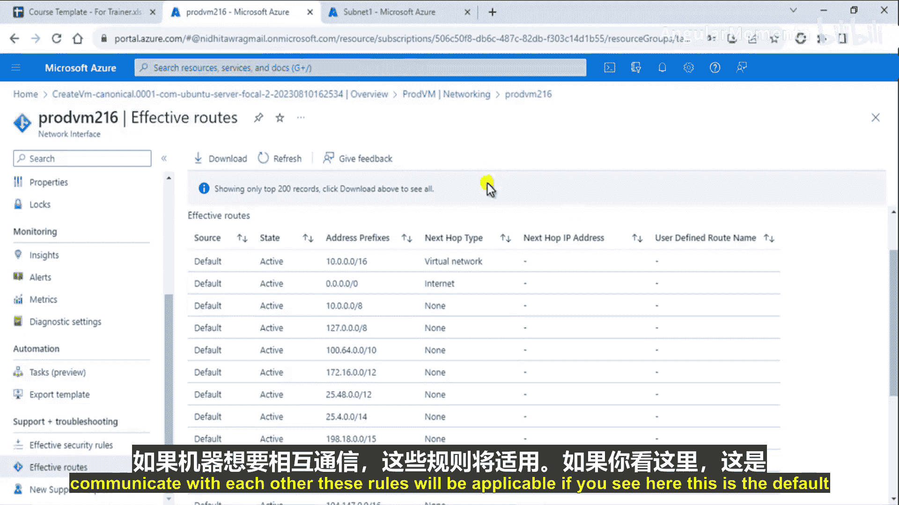
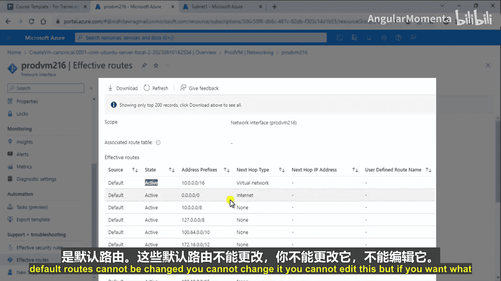
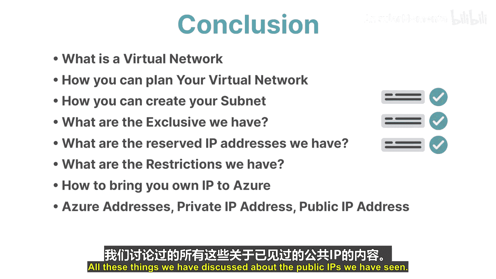

# 002：Azure路由配置 🧭

在本节课中，我们将学习Azure中的路由配置。我们将了解系统路由和自定义路由的区别，并通过一个实例演示如何创建和使用自定义路由来控制虚拟机之间的流量路径。

---

## 系统路由与自定义路由

上一节我们介绍了Azure虚拟网络的基本概念，本节中我们来看看网络流量是如何被引导的，即路由。

Azure中的路由主要分为两种类型：**系统路由**和**自定义路由**。

*   **系统路由**：当你创建一个虚拟网络并在其中部署虚拟机时，Azure会默认附加一个路由表。这些由Azure自动创建和管理的路由就是系统路由。你**无法更新或更改**这些系统路由，但可以通过自定义路由来**覆盖**它们。
*   **自定义路由**：如果你想创建自己定义的路由规则，可以使用自定义路由。这需要你创建自己的路由表并定义路由规则。

---

## 为何需要自定义路由？ 🎯

为了理解自定义路由的应用场景，让我们看一个例子。

假设在一个虚拟网络中，我们有两个子网：
*   **前端子网** (FrontEnd-Snet)
*   **后端子网** (BackEnd-Snet)

在同一个网络中，还有一台安装了防火墙的**虚拟设备** (Virtual Appliance)。

默认情况下，借助系统路由，前端和后端子网中的虚拟机可以直接相互通信。然而，如果你希望所有从前端到后端的通信流量都必须经过中间的防火墙设备进行安全检查，那么默认的系统路由就无法满足需求。

**此时，你就需要创建自定义路由**，来强制指定从前端到后端的流量下一跳指向那台虚拟设备。

---

## 演示：查看默认系统路由 🔍

在创建自定义路由之前，我们先查看一下Azure提供的默认系统路由。



首先，我们创建一个资源组、一个虚拟网络和一台虚拟机（步骤略）。创建完成后，我们查看虚拟机的有效路由。



1.  在Azure门户中，找到并进入你的虚拟机。
2.  在“设置”下，点击“网络”。
3.  找到关联的网络接口并点击进入。
4.  在“支持 + 故障排除”部分，点击“有效路由”。

你将看到一个路由列表，这些都是**系统路由**。例如，你会看到类似下面这条路由：

```
地址前缀：10.0.0.0/16
下一跳类型：虚拟网络
状态：有效
```

这条路由意味着，所有发送到虚拟网络内部地址（`10.0.0.0/16`）的流量，都会在虚拟网络内部直接转发。你无法修改或删除这些条目。

**路由的评估顺序是：首先匹配自定义路由，如果没有匹配项，则应用系统路由。**

---

## 演示：创建并应用自定义路由 🛠️

现在，我们来创建自定义路由，以实现之前提到的流量引导目标。

### 步骤1：创建路由表

首先，我们需要创建一个空的路由表容器。
1.  在Azure门户中，搜索并进入“路由表”服务。
2.  点击“+ 创建”。
3.  选择资源组、区域，为路由表命名（例如 `MyRouteTable`），然后创建它。

### 步骤2：将路由表关联到子网

创建路由表后，它还没有生效，需要将其关联到目标子网。
1.  进入你的虚拟网络。
2.  点击“子网”，选择你的虚拟机所在的子网（例如 `Subnet-1`）。
3.  在“路由表”下拉菜单中，选择你刚创建的 `MyRouteTable`。
4.  点击“保存”。

### 步骤3：在路由表中添加自定义路由

最后，我们在路由表中定义具体的路由规则。
1.  进入你创建的 `MyRouteTable`。
2.  在“设置”下，点击“路由”，然后点击“+ 添加”。
3.  配置路由规则：
    *   **路由名称**：`Route-To-Firewall`
    *   **地址前缀**：`10.0.0.0/16` (这是你的整个虚拟网络地址空间)
    *   **下一跳类型**：选择“虚拟设备”
    *   **下一跳地址**：输入你的虚拟设备（防火墙）的IP地址，例如 `10.0.0.8`

    ```yaml
    路由名称: Route-To-Firewall
    目标地址前缀: 10.0.0.0/16
    下一跳: 虚拟设备 (IP: 10.0.0.8)
    ```
4.  点击“添加”。

### 步骤4：验证自定义路由

添加并等待几分钟让配置传播后，再次查看虚拟机的“有效路由”。
现在，你会发现对于目标地址 `10.0.0.0/16`，**状态为“有效”的路由变成了你自定义的路由**，其下一跳指向 `10.0.0.8`。而原来的系统路由对于该前缀的状态可能显示为“无效”。

这证明自定义路由已成功覆盖了系统路由。从此，该子网内所有发往虚拟网络内部的流量，都会被引导至IP为 `10.0.0.8` 的虚拟设备。

---

## 总结 📚

本节课中我们一起学习了Azure的路由机制。

*   我们了解了**系统路由**是Azure自动创建和管理的默认路由，无法修改。
*   我们认识了**自定义路由**，它允许我们创建自己的路由表来定义流量路径，并能覆盖系统路由。
*   我们通过一个实例，演示了为何需要自定义路由（例如强制流量经过防火墙），并逐步完成了**创建路由表、关联子网、添加路由规则**的全过程。
*   我们明确了路由的**评估顺序：自定义路由优先于系统路由**。



掌握路由配置是设计安全、可控的Azure网络架构的关键技能，它确保了你的网络流量能够按照企业策略进行流转。