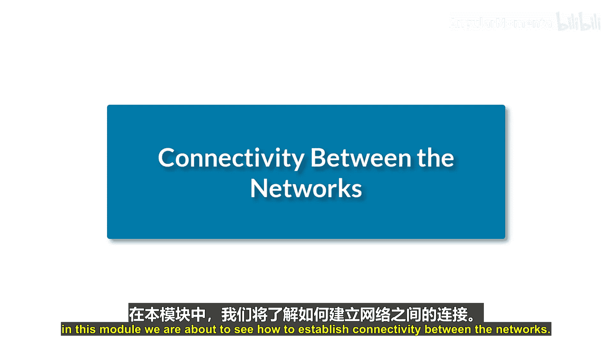
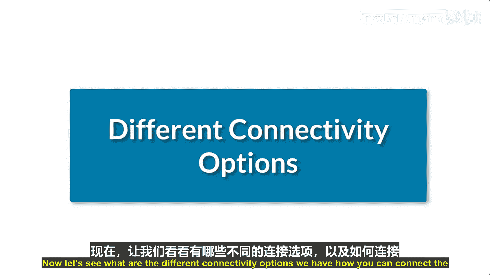
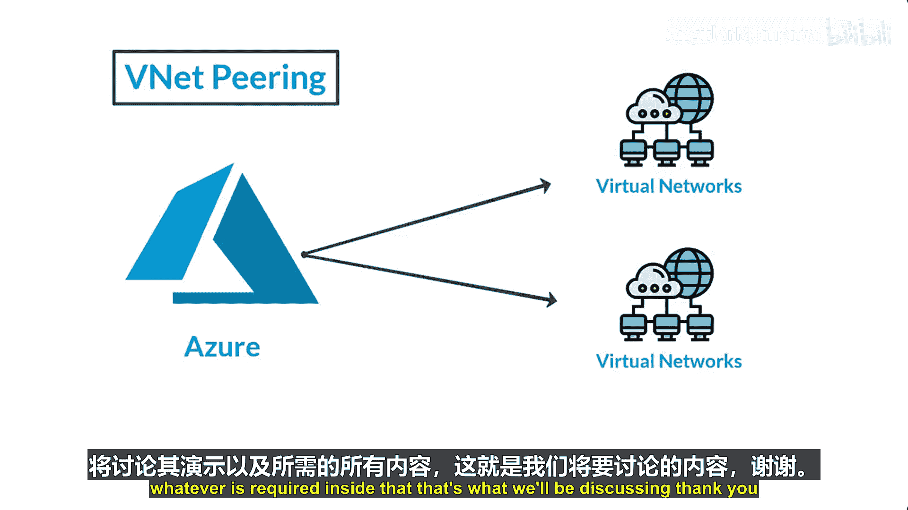

# 003：Azure虚拟网络连接简介

在本节课中，我们将学习如何在不同的网络之间建立连接。这包括将您的本地网络连接到Azure，以及在Azure内部连接两个虚拟网络。我们将探讨为什么需要这些连接，并介绍几种主要的连接方式。

## 概述

作为网络工程师，您可能需要将公司网络迁移到云端，并希望实现一个全球传输网络架构，以连接分散在各地的办公室。通过建立网络连接，您可以管理以云为中心的网络环境，利用全球企业IT足迹，并支持远程办公等需求。此外，为了访问位于云端的资源（如文件存储、数据库或应用程序），与云资源建立连接也是必要的。

上一节我们介绍了虚拟网络的基本概念，本节中我们来看看如何实现网络间的互联。

## 连接选项

以下是几种在Azure中连接网络的主要方式：

1.  **VPN连接**
    *   **站点到站点VPN**：用于将您的本地数据中心连接到Azure虚拟网络。
    *   **点到站点VPN**：用于将单个客户端设备（如个人电脑）连接到Azure虚拟网络。

2.  **虚拟网络对等互连**
    *   用于在Azure内部，直接连接两个不同的虚拟网络。

### VPN连接详解

VPN（虚拟专用网络）通过在公共网络（如互联网）上建立加密隧道来安全地传输数据。在Azure中，您可以通过VPN建立两种主要连接：

*   **站点到站点VPN**：这种连接方式在您的本地网络网关与Azure虚拟网络网关之间建立一条安全的隧道。它适用于需要将整个本地网络（如公司数据中心）持续连接到Azure的场景。配置通常涉及在两端设置兼容的VPN设备或网关。
*   **点到站点VPN**：这种连接方式允许单个设备通过创建安全的VPN连接来访问Azure虚拟网络。它非常适合远程办公人员或需要临时访问云端资源的场景。用户通常需要在设备上安装一个VPN客户端配置文件。

### 虚拟网络对等互连详解

虚拟网络对等互连是一种将两个Azure虚拟网络直接连接起来的方法。对等互连建立后，两个网络中的资源可以通过私有IP地址直接通信，就像它们在同一网络中一样。这种连接方式流量不经过公共互联网，因此延迟更低、带宽更高且无需额外的网关设备。

## 总结

本节课中我们一起学习了Azure中主要的网络连接方式。我们了解了**站点到站点VPN**和**点到站点VPN**如何通过加密隧道安全地连接本地网络或单个设备到Azure。同时，我们也探讨了**虚拟网络对等互连**，这是一种在Azure内部高效、直接连接两个虚拟网络的解决方案。掌握这些连接选项，是设计和实施混合云或纯云网络架构的基础。