# 004：站点间VPN连接简介

在本节课中，我们将要学习Azure中的站点间VPN连接。我们将了解VPN网关的概念、支持的设备类型、不同的架构以及创建站点间VPN连接的具体步骤。

## 概述

VPN（虚拟专用网络）用于通过安全隧道发送流量。站点间VPN连接特指将本地数据中心连接到Azure虚拟网络。

## VPN网关简介

在深入了解站点间VPN之前，我们先讨论VPN网关。VPN网关是一种服务，它使用特定类型的虚拟网络网关，通过公共互联网在Azure虚拟网络和本地位置之间发送加密流量。它建立的就是一个安全隧道。

VPN网关也可用于通过Microsoft网络在Azure虚拟网络之间发送加密流量。此外，可以向同一个VPN网关创建多个连接，所有VPN隧道共享可用的网关带宽。

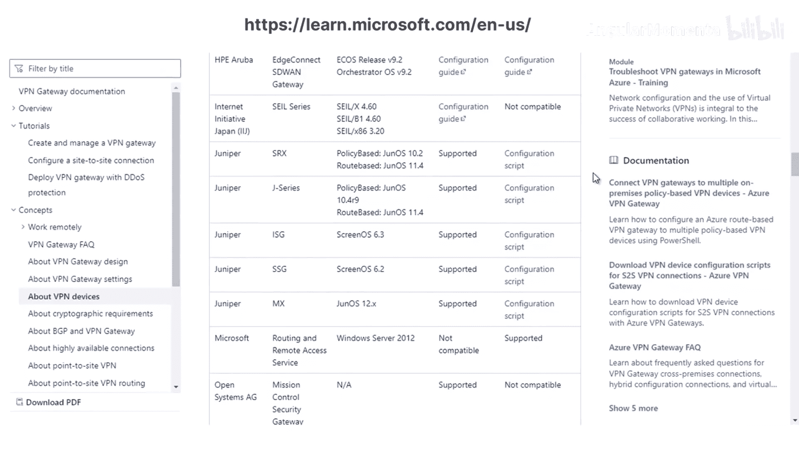

## 连接架构与设备

以下是VPN网关支持的三种主要连接架构：

*   **站点间连接**：用于从本地网络连接到Azure。
*   **虚拟网络间连接**：用于在Azure内部通过VPN连接不同的虚拟网络。
*   **点到站点连接**：用于将单个客户端计算机连接到Azure。

本节课我们主要关注站点间连接。要建立站点间连接，您的本地数据中心需要一台兼容的VPN设备。以下是部分支持的VPN设备厂商：

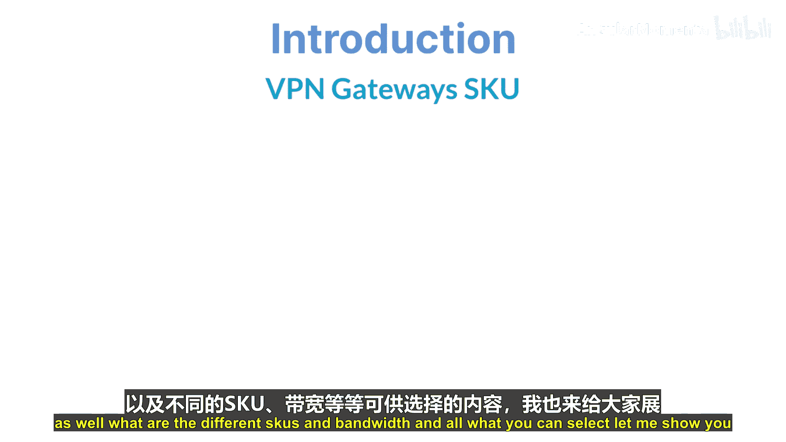

*   Cisco
*   Citrix
*   F5
*   4net

## VPN网关SKU

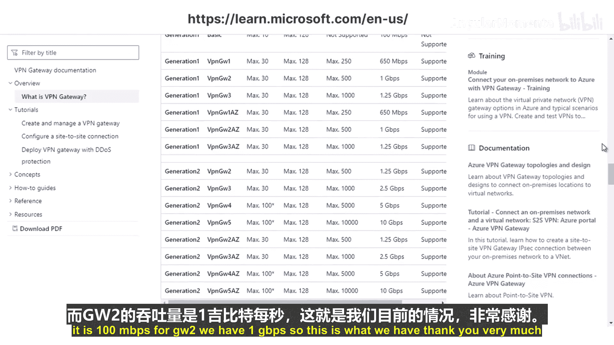

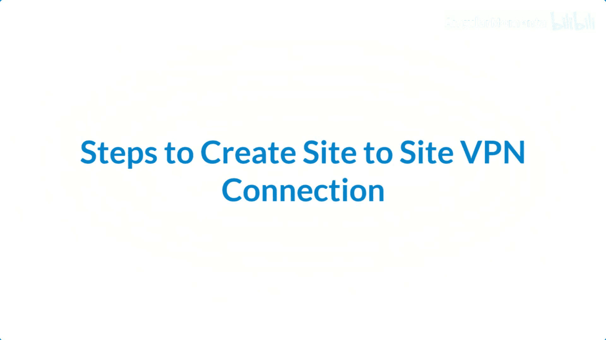

选择VPN网关时，需要根据性能需求选择合适的SKU（库存单位）。以下是第一代网关的部分SKU示例：

| SKU名称 | 最大站点间隧道数 | 聚合吞吐量基准 |
| :--- | :--- | :--- |
| Basic | 10 | 100 Mbps |
| VpnGw1 | 30 | 650 Mbps |
| VpnGw2 | 30 | 1 Gbps |

**注意**：上表为示例，具体规格请参考官方文档。选择SKU时，需考虑所需的连接数和带宽。

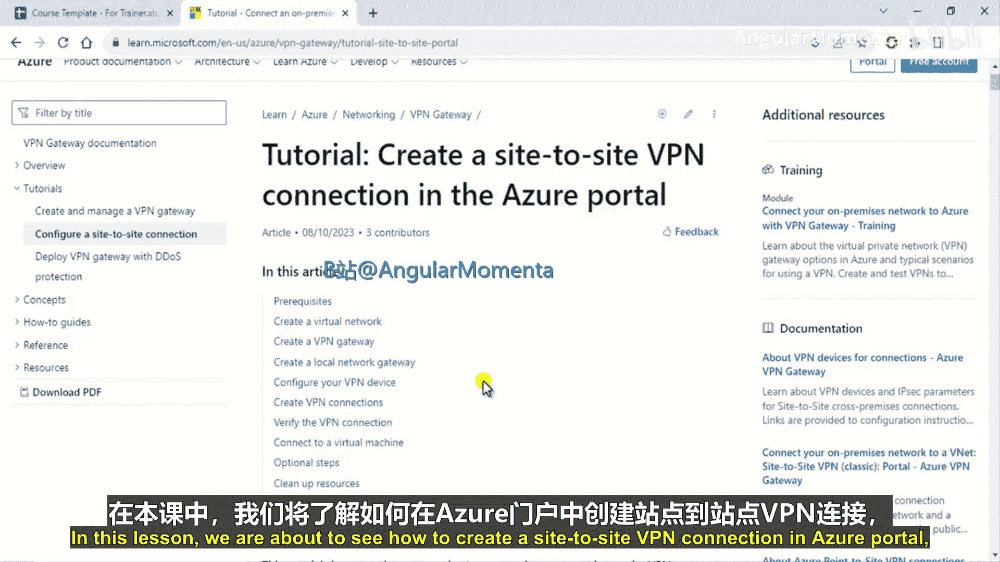

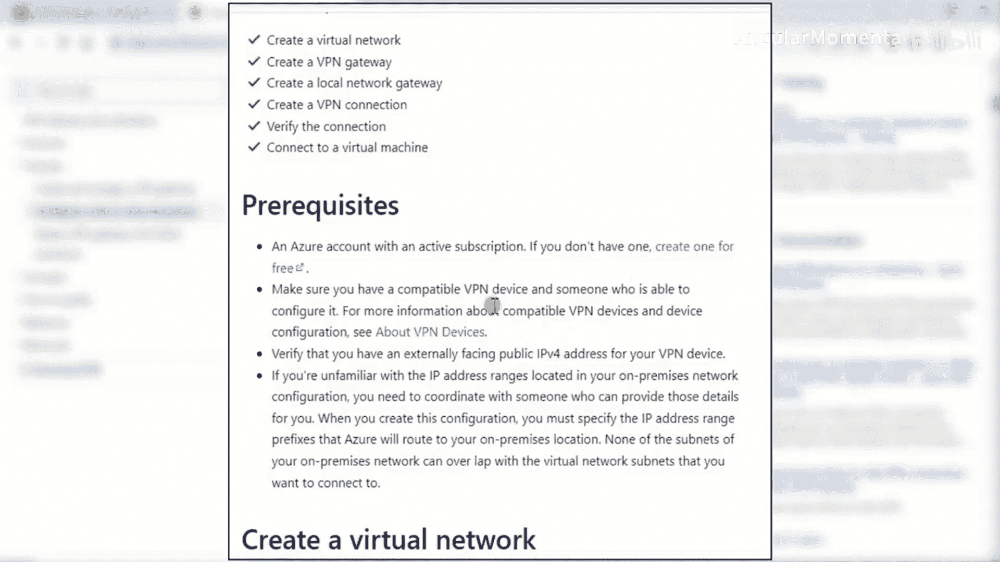

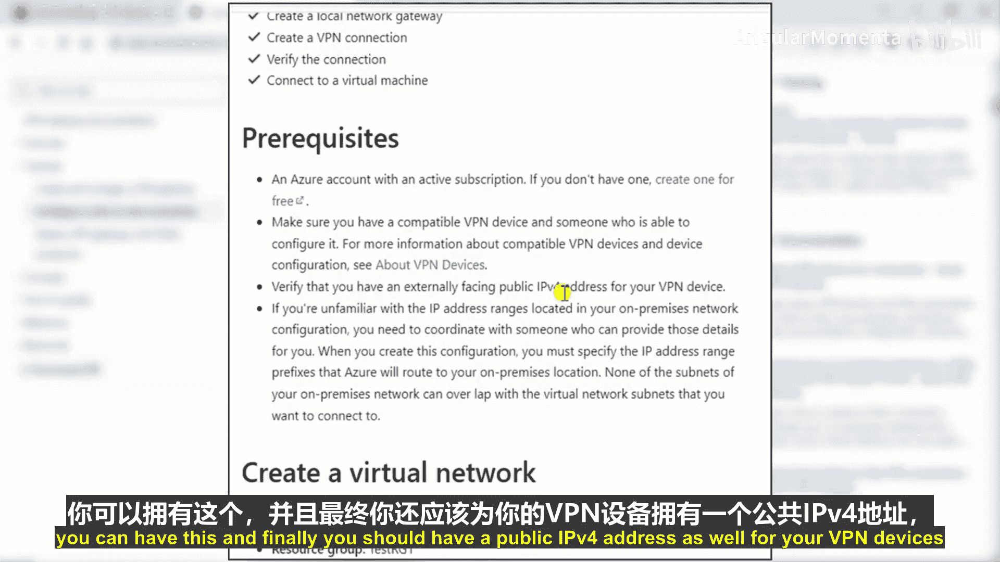

## 创建站点间VPN连接

上一节我们介绍了VPN网关的基础概念，本节中我们来看看如何一步步创建站点间VPN连接。

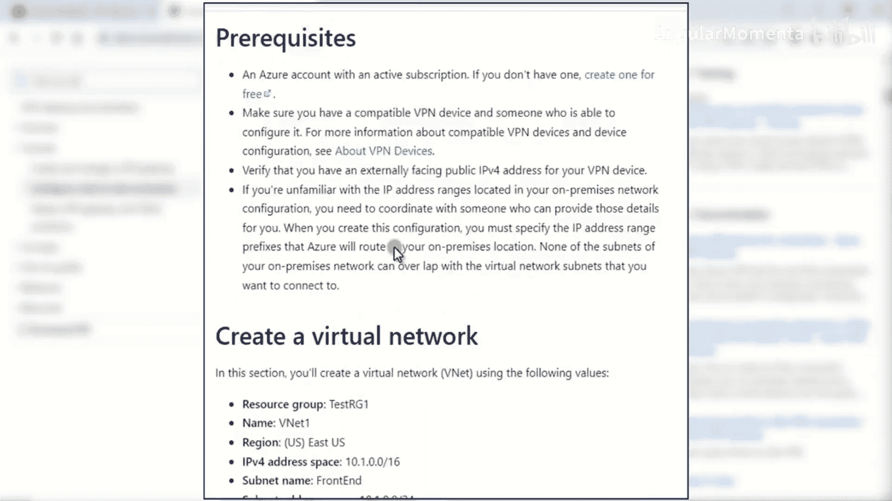

### 先决条件

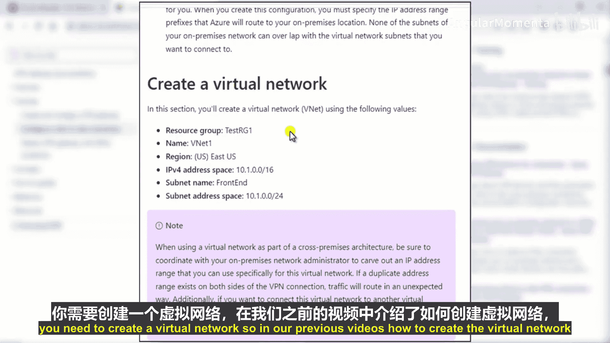

在开始之前，请确保满足以下条件：

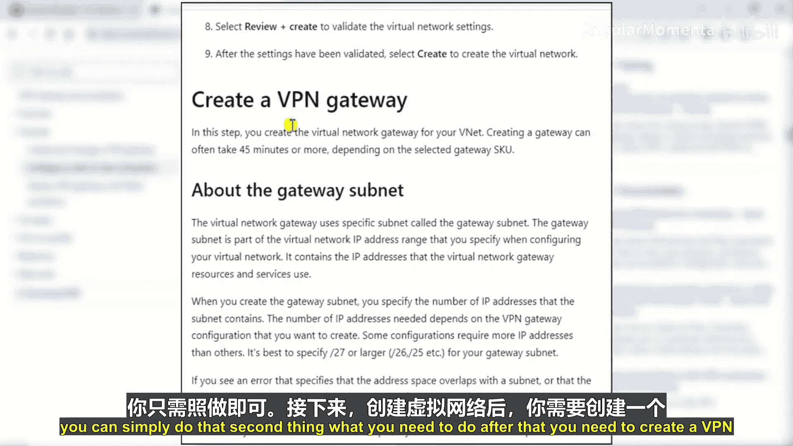

1.  拥有一个有效的Azure账户。
2.  本地数据中心有一台兼容的VPN设备。
3.  该VPN设备拥有一个公共IP地址。

### 操作步骤

以下是连接本地设备到Azure的核心步骤：

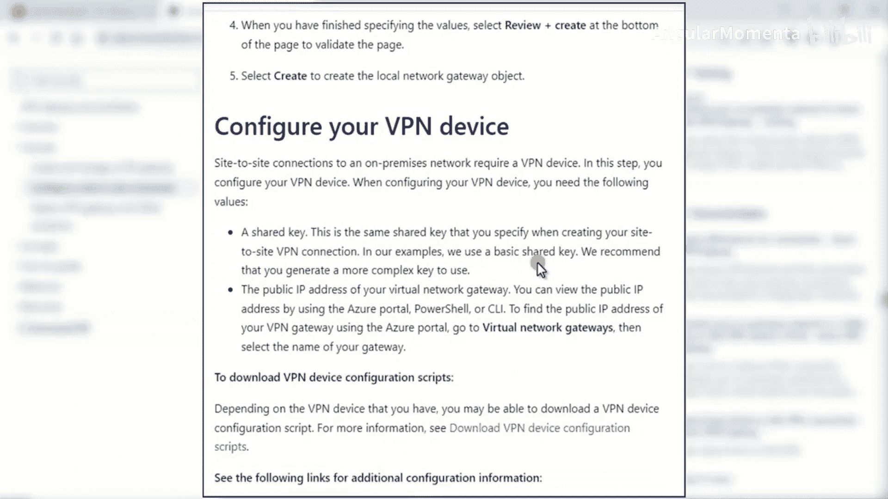

1.  **创建虚拟网络**：在Azure中创建一个虚拟网络（VNet）。
2.  **创建VPN网关**：在VNet中创建一个VPN网关。建议为网关子网分配 `/27` 或更大的地址空间，该子网应仅用于网关资源。
3.  **查看公共IP地址**：创建网关后，在概述页面记下其分配到的公共IP地址。
4.  **创建本地网络网关**：在Azure中创建一个本地网络网关资源，用于代表您的本地网络，需要填写本地VPN设备的公共IP地址和本地地址空间。
5.  **配置VPN设备**：在您的本地VPN设备上进行相应配置，以连接到Azure VPN网关。
6.  **创建VPN连接**：在Azure门户中创建连接资源，将虚拟网络网关和本地网络网关关联起来。连接类型选择“站点到站点”，并配置共享密钥。
7.  **验证连接**：创建连接后，验证其状态是否显示为“已连接”。
8.  **连接到虚拟机**：连接建立后，您就可以从本地网络访问Azure虚拟网络中的虚拟机了。

**关键配置项**：在创建VPN连接时，必须使用与本地VPN设备配置相同的**共享密钥**。

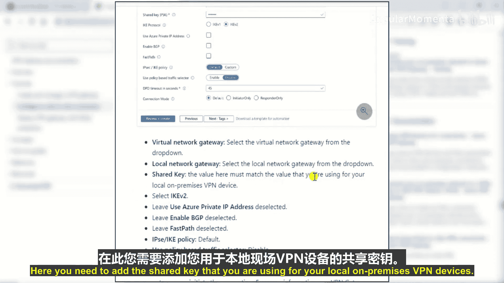

## 总结

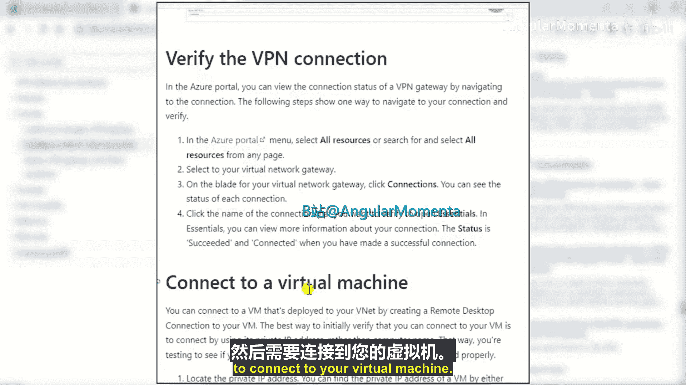

本节课中我们一起学习了Azure站点间VPN连接。我们了解了VPN网关的作用、三种连接架构、所需的VPN设备以及如何通过八个主要步骤建立从本地到Azure的安全连接。记住，配置的关键在于确保Azure端的设置与本地VPN设备的设置（尤其是公共IP和共享密钥）相匹配。