# 005：点到站点VPN连接介绍与配置 🖧

在本节课中，我们将要学习Azure中的点到站点VPN连接。点到站点VPN允许单个客户端计算机与Azure虚拟网络建立安全连接，非常适合远程办公人员或少量客户端需要访问云端资源的情况。

## 点到站点VPN连接概述

点到站点VPN网关连接允许您从单个客户端计算机创建到虚拟网络的安全连接。该连接由客户端计算机发起建立。此解决方案主要适用于需要从远程位置（例如家中或会议场所）连接到Azure虚拟网络的远程办公人员。

与站点到站点VPN相比，点到站点VPN适用于客户端数量较少的情况。当您只有少数几个客户端需要连接时，可以选择点到站点VPN，而无需建立完整的站点到站点连接。

## 支持的VPN协议

点到站点VPN支持多种协议，以下是主要的几种：

1.  **OpenVPN协议**：这是一种基于SSL或TLS的VPN协议。TLS VPN解决方案通常能够穿透防火墙，因为大多数防火墙开放TCP 443端口用于出站连接，而TLS正是使用此端口。OpenVPN可用于Android、iOS、Windows、Linux和Mac设备。
2.  **SSTP协议**：即安全套接字隧道协议，同样是一种基于TLS的VPN协议。它也能穿透防火墙并使用443端口进行出站连接。但需要注意的是，SSTP仅支持Windows设备。Azure支持所有具有SSTP并支持TLS 1.2及以上版本的Windows系统，例如Windows 8.1及更高版本。
3.  **IKEv2 VPN**：这是一种基于标准的IPsec VPN解决方案，可用于从Mac设备进行连接，支持macOS 10.11及更高版本。

## 客户端身份验证方法

点到站点VPN客户端可以通过以下几种方法进行身份验证：

1.  **基于证书的身份验证**：使用Azure原生证书认证时，设备上存在的客户端证书将用于对连接用户进行身份验证。客户端证书从受信任的根证书生成，然后安装到每台客户端计算机上。您可以使用企业解决方案生成的根证书，也可以生成自签名证书。VPN网关负责执行客户端证书的验证。
2.  **原生Azure Active Directory身份验证**：您可以使用Azure Active Directory凭据进行连接。原生Azure AD身份验证仅支持我们上一节提到的OpenVPN协议，并且需要使用Azure VPN客户端。支持的操作系统包括Windows 10和macOS。
3.  **RADIUS服务器身份验证**：Azure Active Directory域身份验证允许用户使用其组织的域凭据连接到Azure。这需要一个特定的RADIUS服务器。该RADIUS服务器将与AD服务器集成，组织也可以使用其现有的RADIUS部署进行身份验证。RADIUS服务器可以部署在本地或Azure虚拟网络中。在身份验证过程中，Azure VPN网关充当传递角色，在RADIUS服务器和连接设备之间转发身份验证消息。

## 创建点到站点VPN连接

上一节我们介绍了点到站点VPN的概念和协议，本节中我们来看看如何创建一个点到站点VPN连接。以下是创建步骤的简要概述，您也可以参考提供的Microsoft官方链接获取详细指南。

首先，您需要创建一个资源组。


然后，您需要创建一个虚拟网络。这些步骤您应该已经熟悉。在这里，您需要创建子网。我们已经详细了解了如何创建子网和虚拟网络。

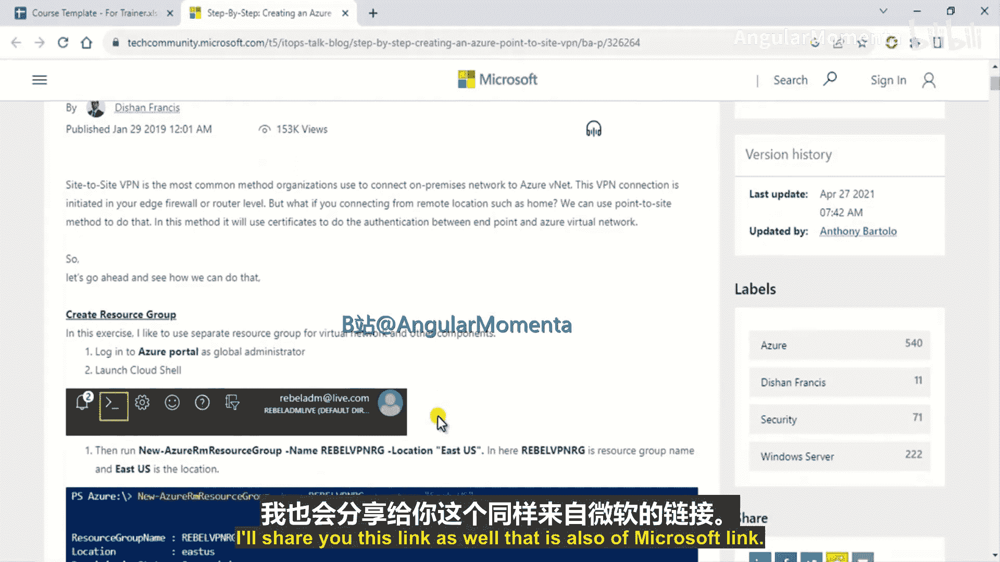

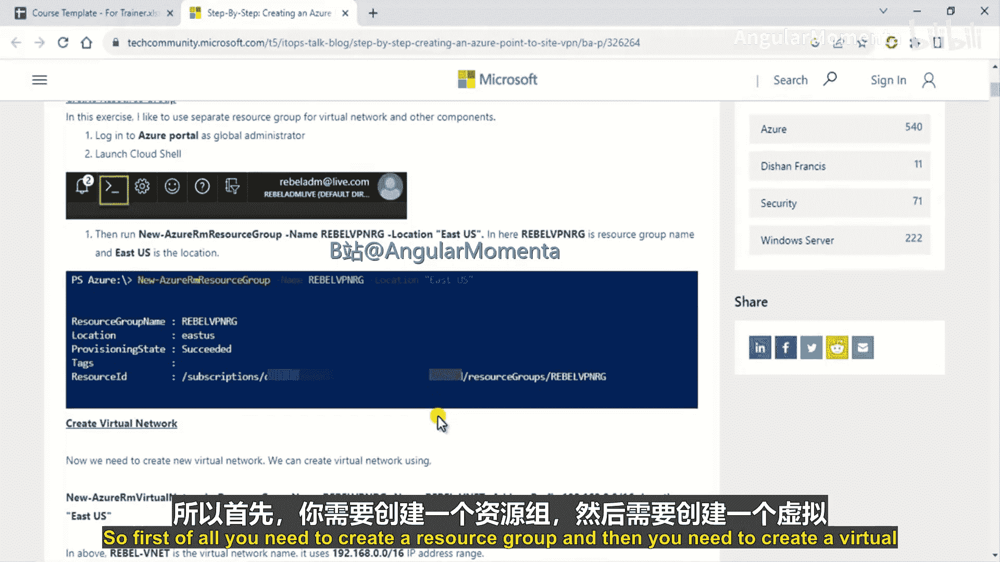

之后，您需要创建一个网关子网。当您打开虚拟网络的子网配置时，会看到“添加网关子网”的选项。您需要添加一个网关子网。


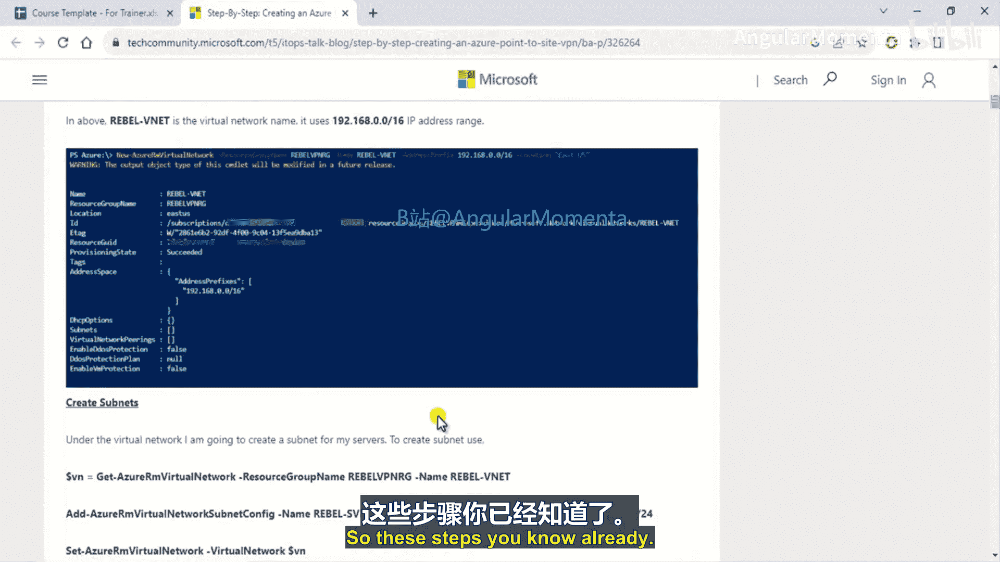

他们正在按照确切的方式添加。这是他们使用的CIDR地址块。


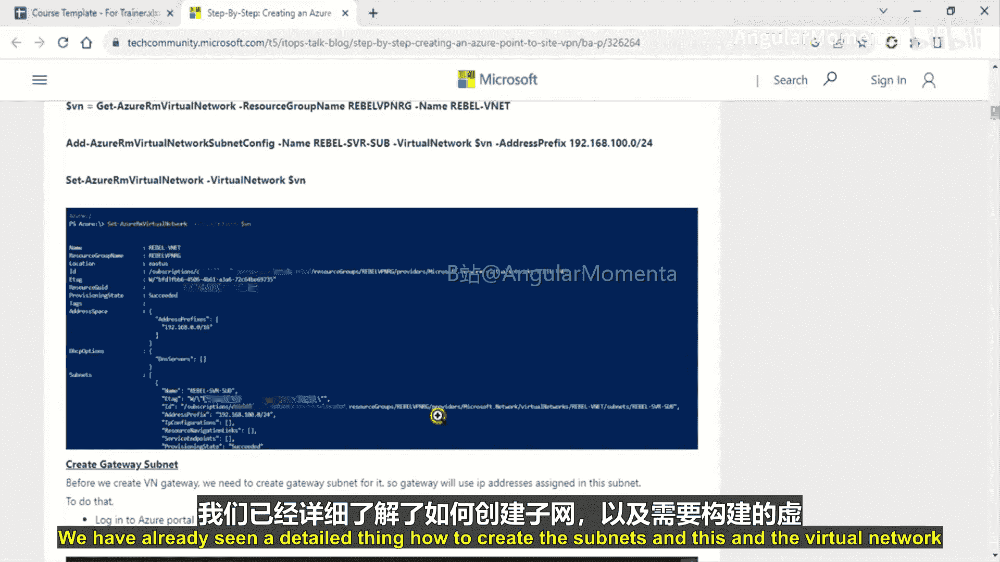

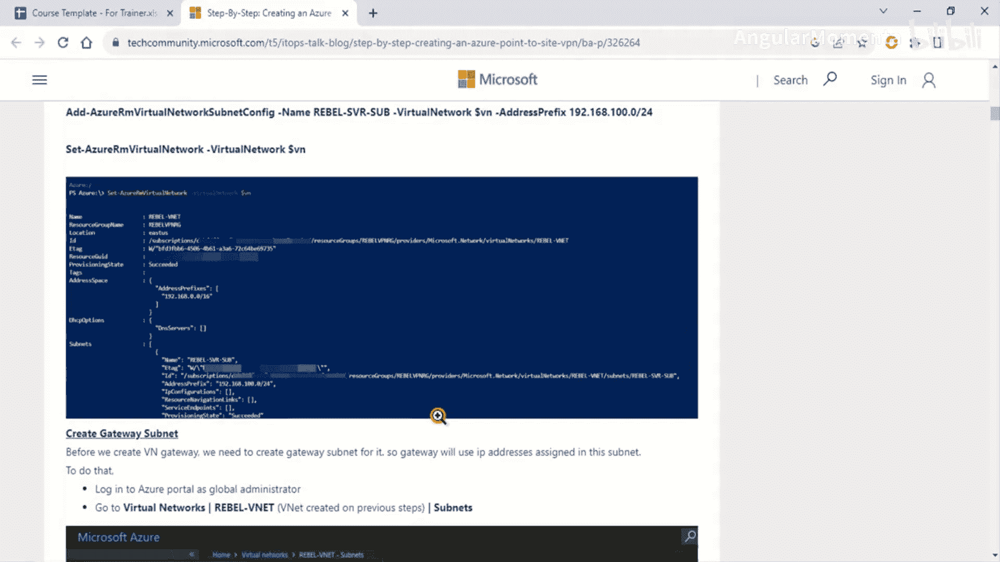

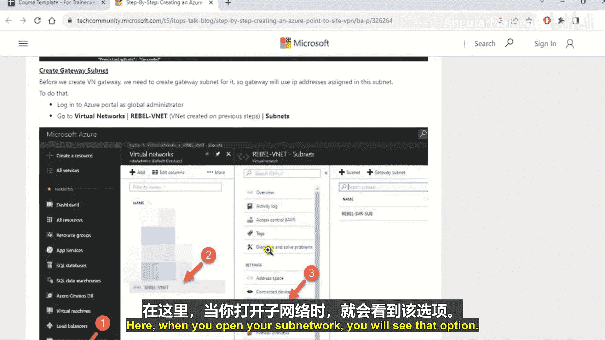

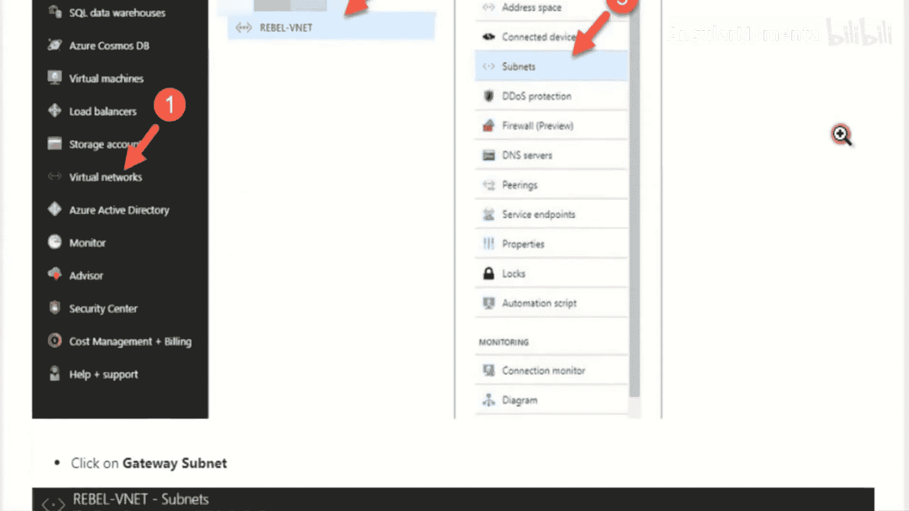

完成之后，您需要创建虚拟网络网关。您只需在门户中搜索“虚拟网络网关”，然后点击“创建”并添加设置，包括您想要的名字、网关类型、SKU等选项。


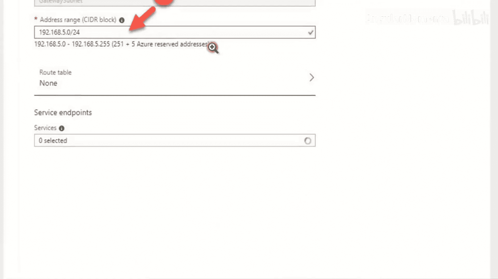

接下来，您需要创建证书。正如之前提到的，我们有不同的身份验证选项。在示例中，他们使用的是客户端证书。他们正在创建自签名的根客户端证书，您也可以这样做。这是他们使用的命令。

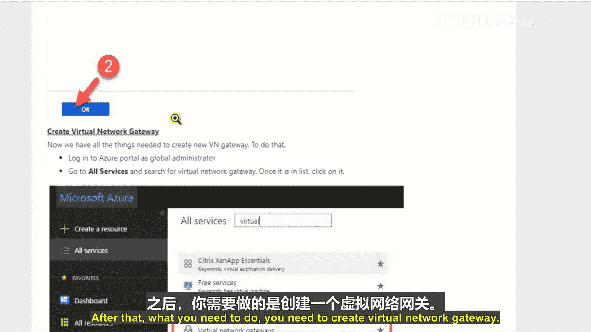

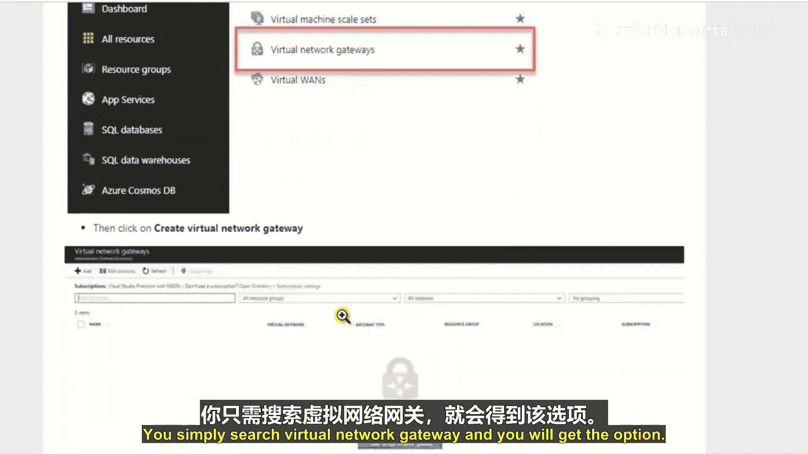

```powershell
# 示例：生成自签名根证书的命令（具体命令请参考官方文档）
```

在创建证书之后，您需要配置点到站点连接。您只需搜索“点到站点配置”并进行添加，然后配置所有选项，包括地址池、隧道类型以及您想要的身份验证类型（证书或RADIUS）。因为我们使用证书，所以选择Azure证书身份验证，最后添加此配置。

最后，您需要测试VPN连接。具体操作是：登录Azure门户，转到您的VPN网关页面，点击“点到站点配置”，下载VPN客户端，然后进行连接测试。以上就是主要的步骤。


## 总结

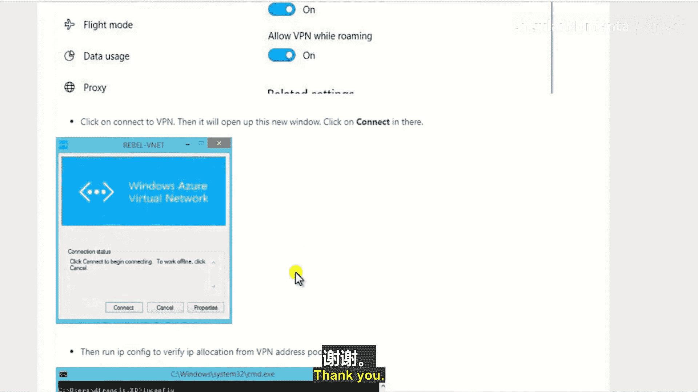

本节课中我们一起学习了Azure点到站点VPN连接。我们了解了它的定义、适用场景、支持的协议（OpenVPN、SSTP、IKEv2）以及三种客户端身份验证方法（证书、Azure AD、RADIUS）。最后，我们概述了在Azure门户中创建和配置点到站点VPN连接的关键步骤。掌握这些知识，您就可以为远程用户或少量客户端建立安全的云端接入通道了。