# 006：虚拟网络对等连接简介 🧩

在本节课中，我们将要学习Azure虚拟网络对等连接（VNet Peering）的核心概念、类型及其高级功能，如网关传输和服务链。我们将通过简单的示例和实际操作演示，帮助你理解如何连接不同的虚拟网络。

---

## 什么是虚拟网络对等连接？🤔

上一节我们介绍了虚拟网络及其子网的基本概念和创建方法。本节中，我们来看看如何连接不同的虚拟网络。

虚拟网络对等连接使你能够无缝地连接两个独立的Azure虚拟网络，并实现最优的网络性能。通常，大规模运营的组织需要在不同的虚拟网络之间建立连接，VNet对等连接正是为此设计。

默认情况下，**同一个虚拟网络**内的虚拟机，即使位于不同的子网中，也可以通过私有IP地址相互通信。然而，**不同虚拟网络**中的虚拟机默认无法通过私有IP直接通信，必须借助公共网络通道。

通过建立VNet对等连接，不同虚拟网络中的资源可以像在同一个网络中一样，通过Azure骨干网进行通信，而无需使用公共IP地址。

**核心概念**：
*   默认同VNet内通信：`VM1 (私有IP) <--> VM2 (私有IP)`
*   默认跨VNet通信：`VM1 (私有IP) -> 公共网络 -> VM3 (私有IP)`
*   对等连接后跨VNet通信：`VM1 (私有IP) <--Azure骨干网--> VM3 (私有IP)`

此外，对等连接还支持跨租户和跨订阅配置。需要注意的是，VNet对等连接**不具有传递性**。这意味着，如果VNet A与VNet B对等，VNet B与VNet C对等，这并不自动意味着VNet A与VNet C对等。

---

## 对等连接的类型 🌍

了解了VNet对等连接的基本作用后，我们来看看它的两种主要类型。

VNet对等连接主要分为两种类型：区域对等和全局对等。

以下是两种类型的简要说明：
*   **区域对等**：连接位于**同一Azure区域**内的两个虚拟网络。
    *   示例：`VNet1 (美国东部) <--> VNet2 (美国东部)`
*   **全局对等**：连接位于**不同Azure区域**的两个虚拟网络。
    *   示例：`VNet2 (美国东部) <--> VNet3 (欧洲西部)`

---

## 网关传输 🚌

在建立了对等连接的基础上，我们来看看如何实现对等网络之外的资源访问，这就用到了网关传输功能。

网关传输是VNet对等连接的一个属性，它允许对等虚拟网络中的资源使用其中一个虚拟网络的VPN网关，来访问本地数据中心（跨 premises）或其他虚拟网络。

例如，假设VNet1与VNet2对等，而VNet1中配置了一个VPN网关连接到本地数据中心。如果启用了网关传输，那么VNet2中的虚拟机也可以通过VNet1的VPN网关访问本地数据中心的资源，而无需在VNet2中单独部署VPN网关。

**核心要点**：
*   一个虚拟网络只能有一个网关。
*   网关传输同时支持区域对等和全局对等。
*   该功能允许对等虚拟网络**共享网关**，节省成本和管理开销。

---

## 服务链 ⛓️

除了网关传输，对等连接还支持更复杂的网络流量引导，即服务链。

服务链使你能够通过用户定义的路由，将流量从一个虚拟网络定向到对等虚拟网络中的虚拟设备（如防火墙、WAN优化器）或虚拟网络网关，从而实现自定义路由。

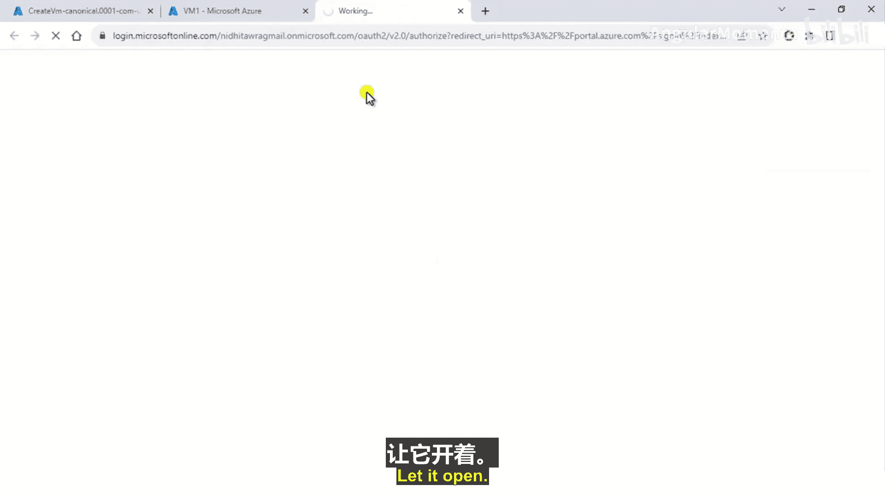

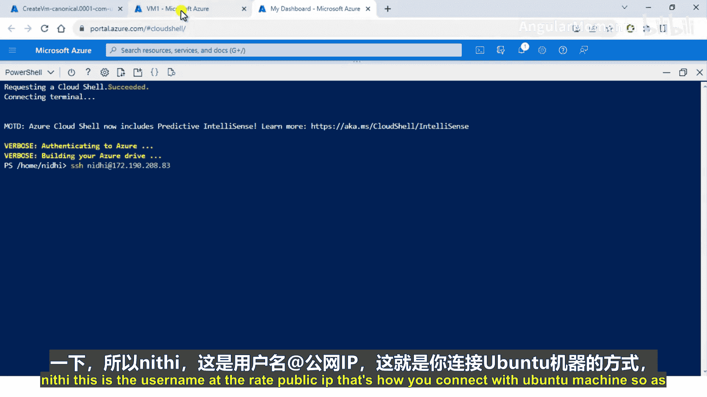

一个典型的应用场景是**中心-辐射型**网络拓扑：
1.  创建一个中心虚拟网络，其中部署了网络虚拟设备（如防火墙）或VPN网关。
2.  创建多个辐射虚拟网络，用于托管不同的工作负载（如应用服务器、数据库）。
3.  将所有辐射虚拟网络与中心虚拟网络对等。
4.  配置用户定义路由，使辐射虚拟网络的流量在到达目的地前，先流经中心虚拟网络中的虚拟设备进行检查或优化。

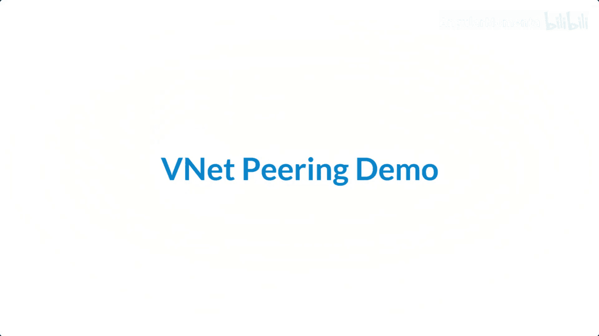

这样，你可以在中心点集中管理安全策略和网络连接。

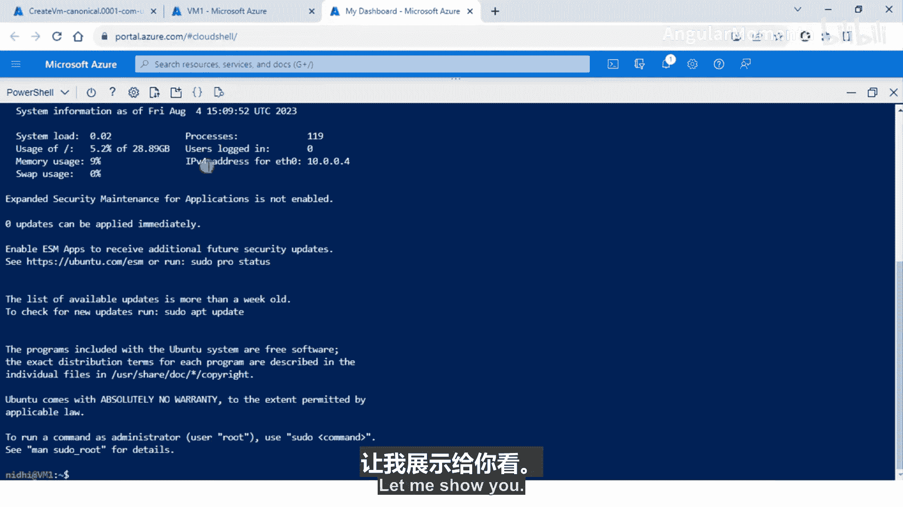

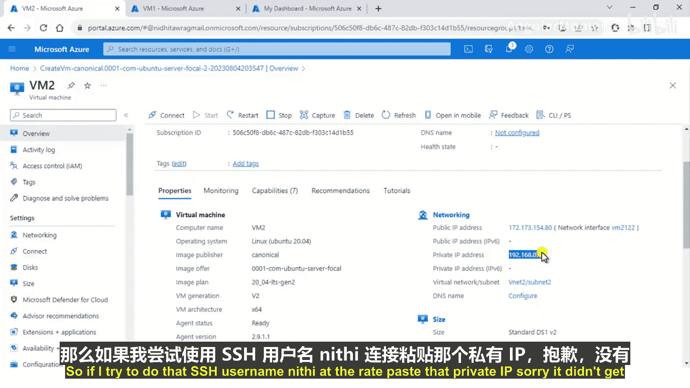

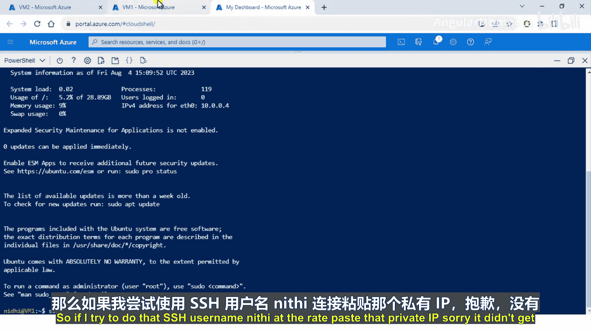

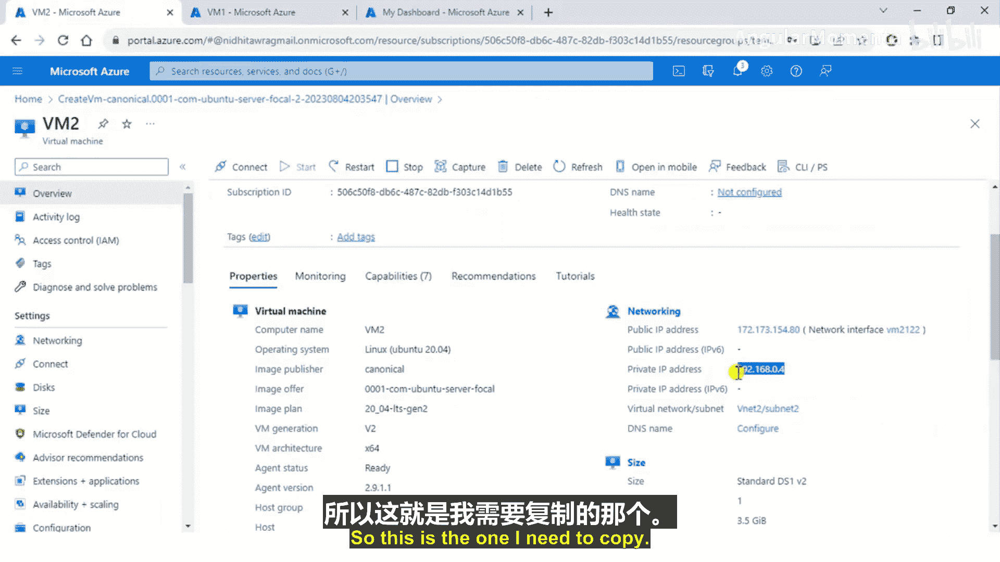

---

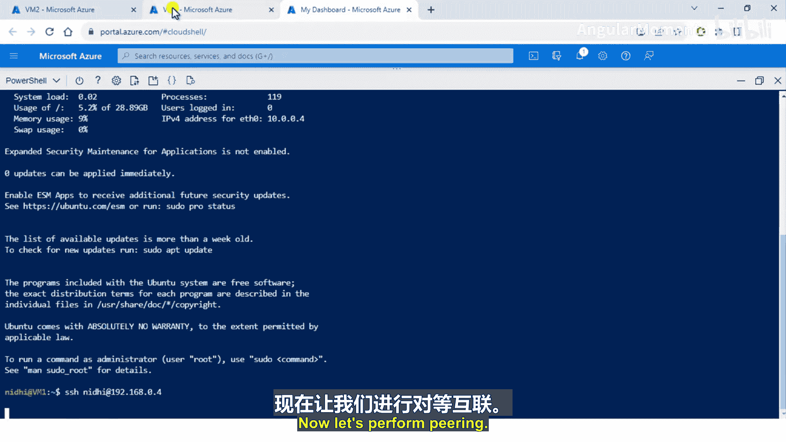

## 对等连接演示 🖥️

理论部分已经介绍完毕，现在让我们通过实际操作来巩固所学知识。以下是创建并配置VNet对等连接的步骤概要。

我们将创建两个虚拟网络`VNet1`和`VNet2`，并在其中各创建一台虚拟机。在对等连接建立前后，测试它们之间通过私有IP的连通性。

**准备工作**：
*   两个虚拟网络的IP地址范围**不能重叠**。
*   规划示例地址空间：
    *   `VNet1`: `10.0.0.0/16`
        *   子网 `Subnet1`: `10.0.0.0/24`
        *   虚拟机 `VM1` (IP自动分配)
    *   `VNet2`: `192.168.0.0/16`
        *   子网 `Subnet2`: `192.168.0.0/24`
        *   虚拟机 `VM2` (IP自动分配)

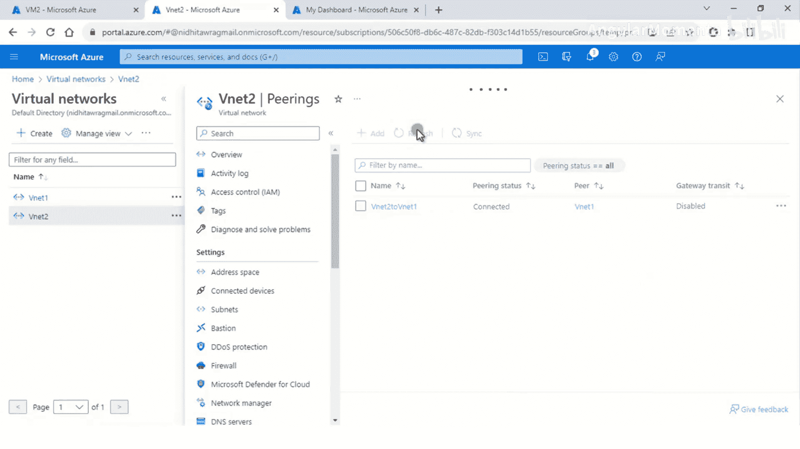

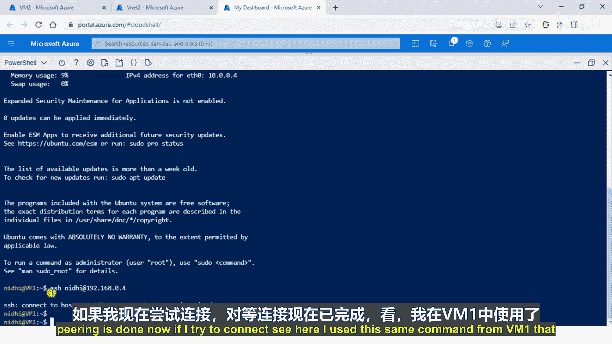

**操作步骤**：
1.  **创建资源**：在Azure门户中，分别创建`VM1`（在`VNet1`/`Subnet1`中）和`VM2`（在`VNet2`/`Subnet2`中）。
2.  **测试初始连通性**：在`VM1`中尝试通过SSH连接`VM2`的私有IP地址（例如 `ssh user@192.168.0.4`）。此时连接会失败，因为网络未对等。
3.  **配置对等连接**：
    *   导航到`VNet1`的资源页面。
    *   在“设置”下选择“对等”。
    *   点击“+ 添加”。
    *   配置从`VNet1`到`VNet2`的对等链接（系统通常会同时自动创建反向链接）。
    *   确保“允许虚拟网络访问”设置为“启用”。
4.  **测试对等后连通性**：再次从`VM1`尝试SSH连接`VM2`的私有IP地址。此时连接应该成功，证明对等连接已生效，流量通过Azure私有骨干网传输。

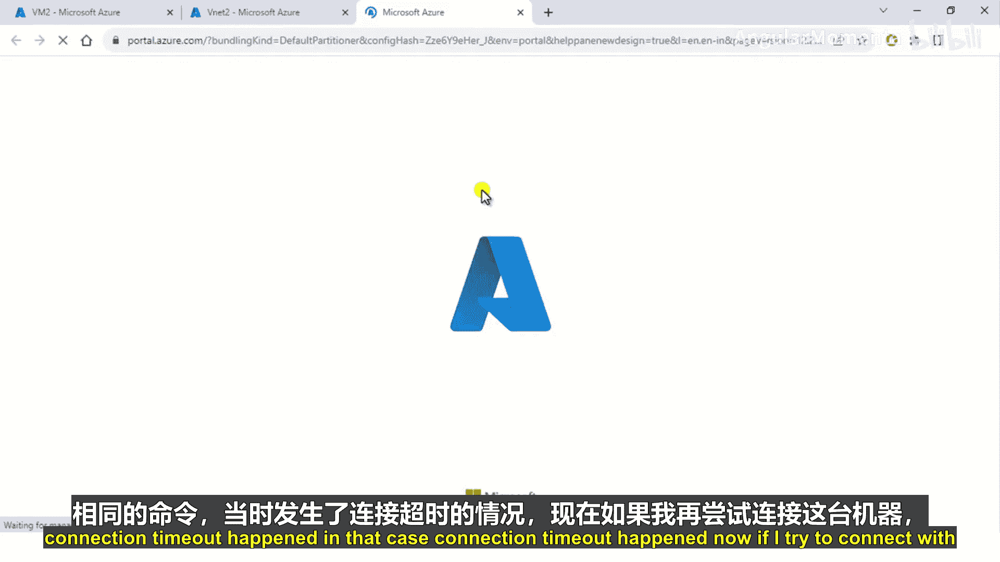

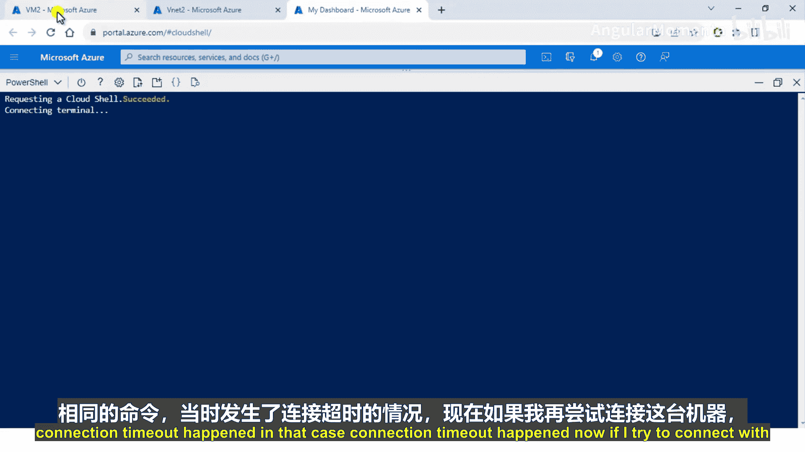

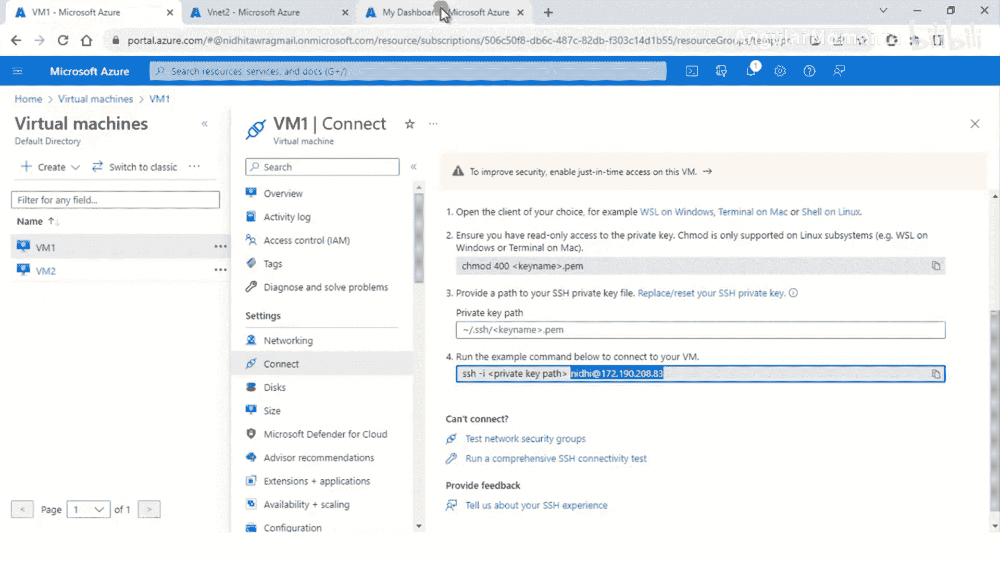

---

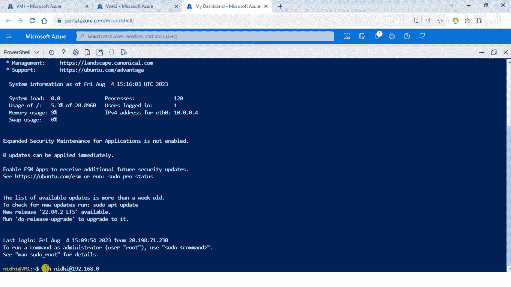

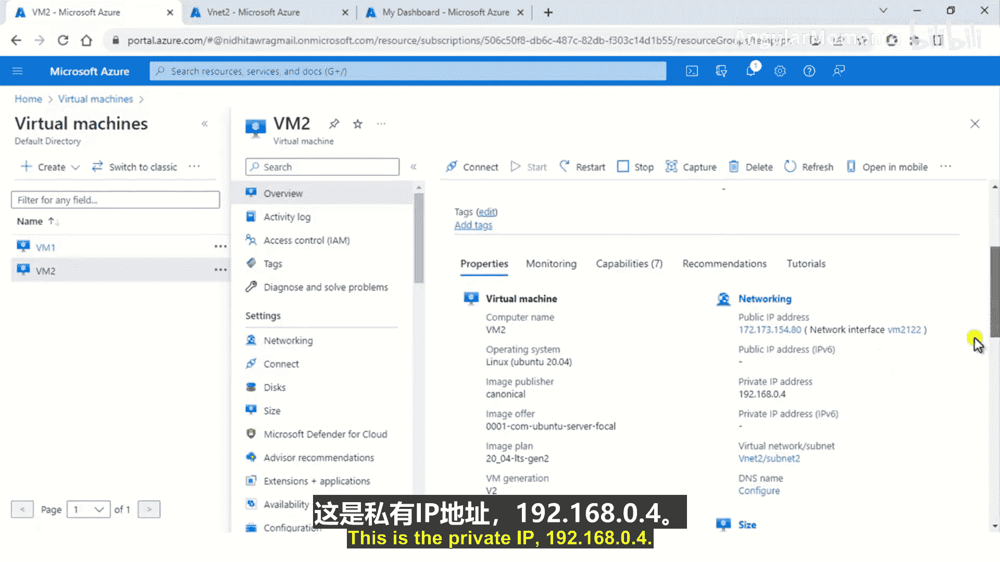

## 总结 📚

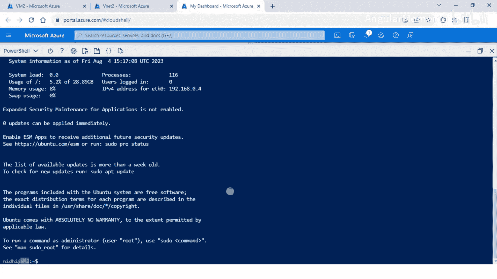

本节课中我们一起学习了Azure虚拟网络对等连接。我们从如何连接不同网络的需求出发，首先了解了VNet对等连接的基本概念和重要性。接着，我们探讨了其两种类型：区域对等和全局对等。然后，我们深入学习了两个高级功能：**网关传输**允许对等网络共享VPN网关以访问外部资源；**服务链**则利用用户定义路由实现对流量的精细控制，常用于中心-辐射型网络架构。最后，通过一个动手演示，我们完整实践了创建虚拟网络、配置对等连接并验证连通性的全过程。

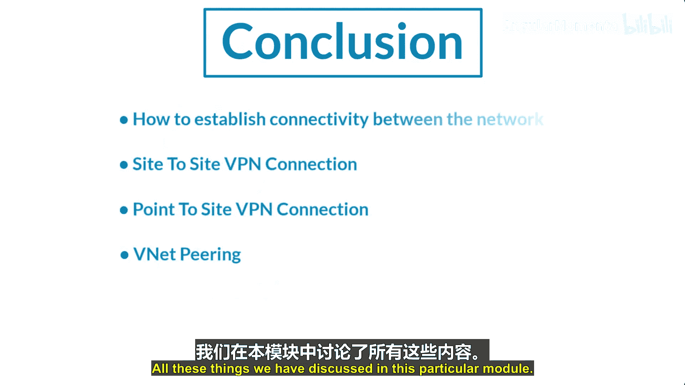

掌握VNet对等连接，是设计高效、灵活且安全的Azure网络架构的关键一步。