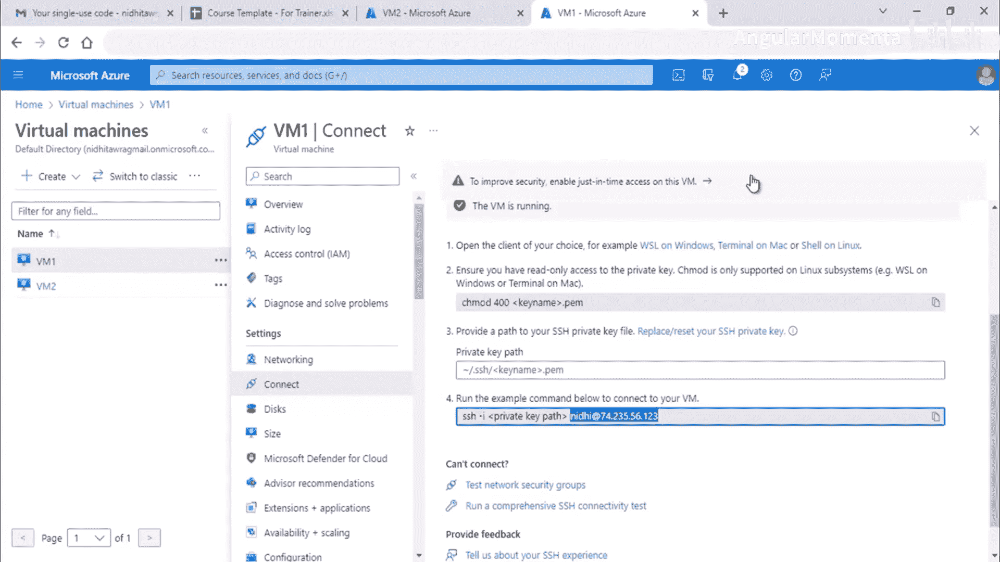
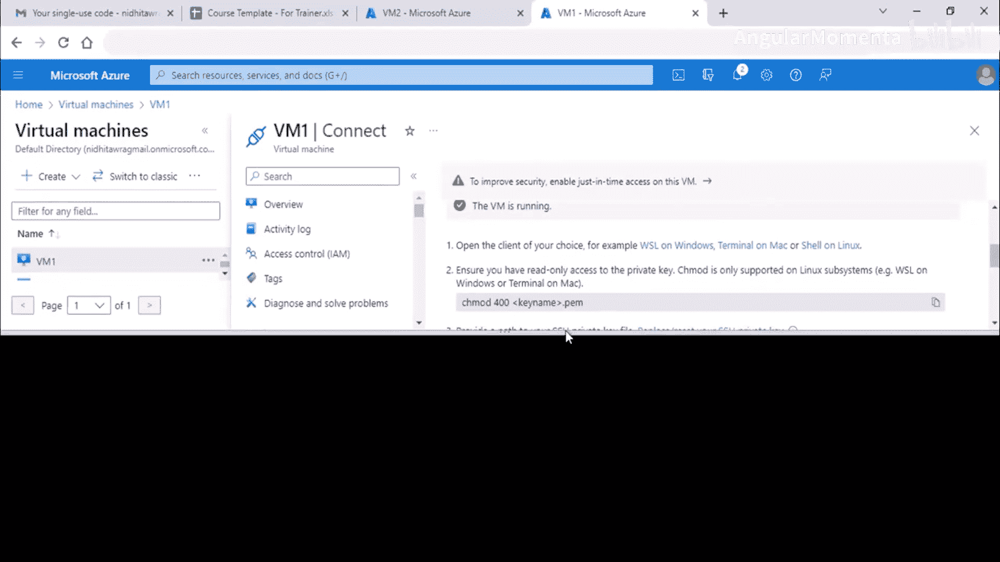
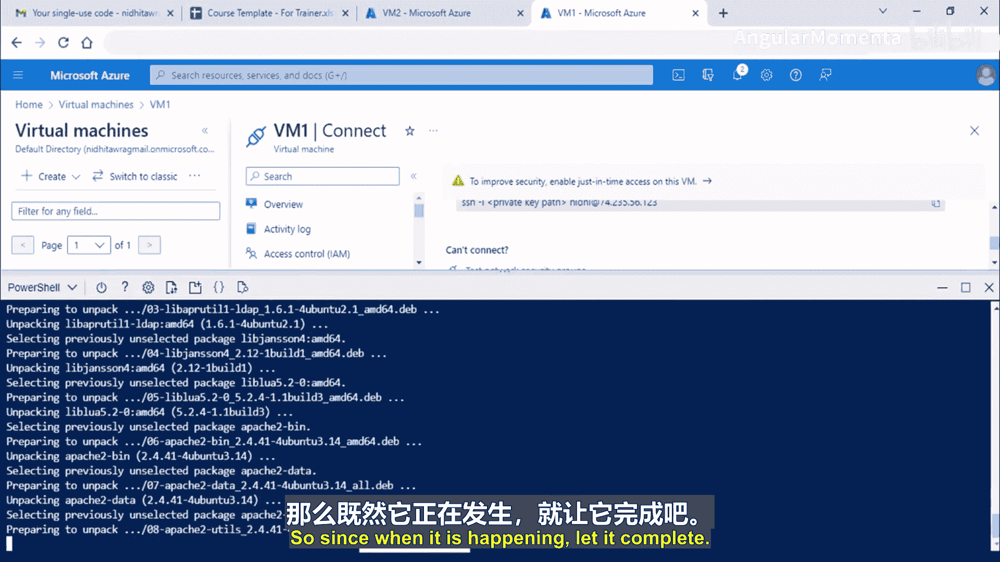
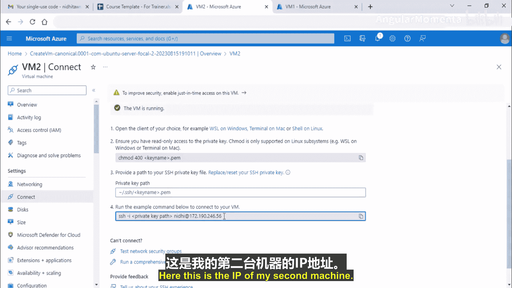
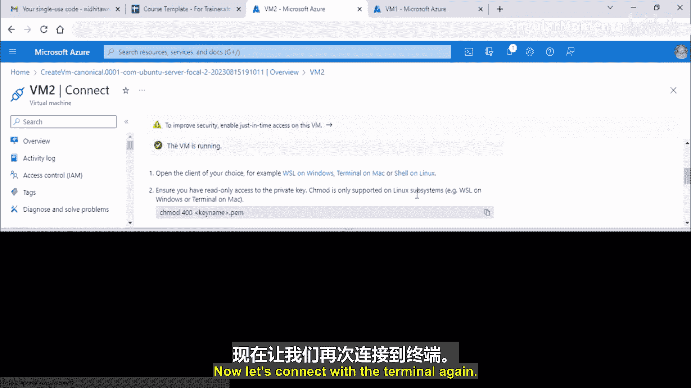
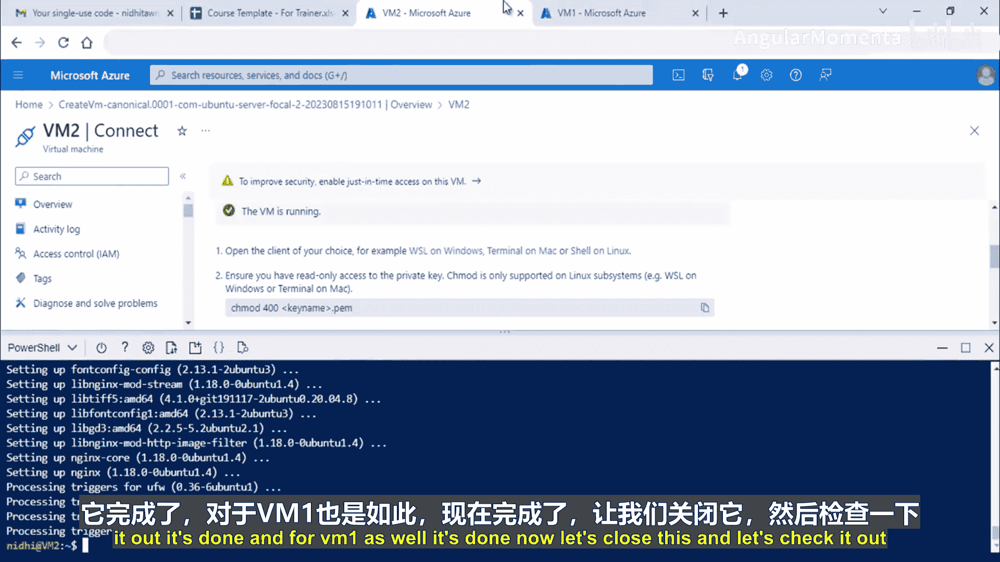
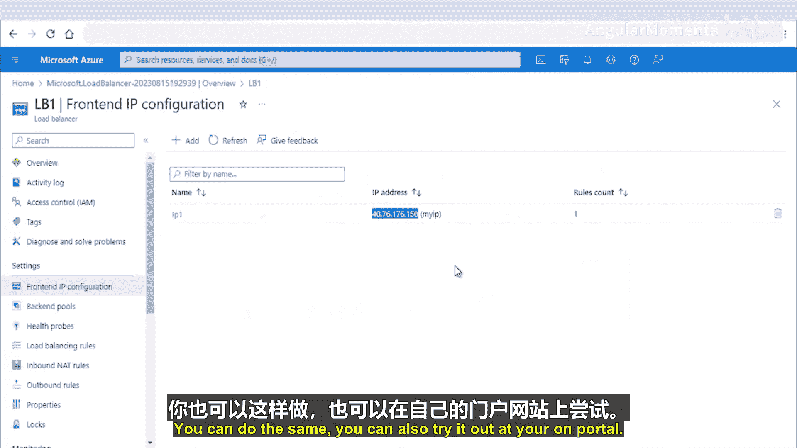

# 007：Azure负载均衡入门 🚀

在本节课中，我们将要学习Azure负载均衡的核心概念、不同类型以及如何配置一个基本的负载均衡器。负载均衡是构建高可用、可扩展应用程序的关键服务。

## 什么是负载均衡？ ⚖️

上一节我们介绍了课程概述，本节中我们来看看负载均衡的基本概念。

负载均衡的作用是将工作负载分配到多个虚拟机上。它通过将流量分发到后端服务器池中的健康实例，来提高应用程序的可用性和资源利用率。

例如，假设有两个虚拟机（VM1和VM2），一个应用程序运行在这两个虚拟机上。当用户访问网站 `www.abc.com` 时，流量不会直接到达虚拟机，而是首先经过负载均衡器。负载均衡器根据预设的规则（如协议、端口）将流量分发到合适的虚拟机，并检查该虚拟机是否健康。

**核心功能**：
*   流量根据规则进行分发。
*   通过分担工作负载提高可用性。
*   优化资源使用，最大化吞吐量。

## 负载均衡器的分类 📊

了解了基本概念后，我们来看看负载均衡器有哪些不同的分类方式。

负载均衡器主要可以从两个维度进行分类：作用范围和协议类型。

以下是基于作用范围的分类：

*   **全局负载均衡**：将工作负载分发到位于不同区域、甚至混合云（本地和云端）的后端服务。此服务将最终用户流量路由到最近、可用的后端。
*   **区域负载均衡**：在同一个区域的虚拟网络内，跨虚拟机分发流量。这些虚拟机可以位于可用性区域中，但都在同一区域内。

以下是基于协议类型的分类：

*   **HTTP/S负载均衡**：基于OSI模型第7层（应用层）工作，专门用于处理HTTP或HTTPS流量，适用于Web应用程序。
*   **非HTTP/S负载均衡**：可以处理非HTTP流量（如TCP、UDP），推荐用于非Web工作负载。

## Azure中的负载均衡选项 🛠️

上一节我们介绍了负载均衡的分类，本节中我们来看看Azure平台提供的具体负载均衡服务。

Azure提供了多种负载均衡解决方案，每种适用于不同的场景。

以下是主要的Azure负载均衡选项：

*   **Azure负载均衡器**：这是一个高性能、超低延迟的第4层（传输层）负载均衡服务。它用于所有UDP和TCP协议的入站流量，每秒可处理数百万请求，并确保解决方案的高可用性。
*   **Azure流量管理器**：这是一个基于DNS的流量负载均衡器。它使您能够将流量最优地分发到全球Azure区域的服务，同样提供高可用性。
*   **Azure应用程序网关**：提供应用程序交付控制器，具备第7层负载均衡能力。您还可以用它来优化Web应用程序性能。
*   **Azure Front Door**：这是一个应用程序交付网络，为Web应用程序提供全球负载均衡和站点加速服务，同样使用第7层。

## 深入理解Azure负载均衡器 🔍

在众多选项中，Azure负载均衡器是最基础且核心的服务。本节我们将详细探讨它。

Azure负载均衡器在OSI第4层运行，将入站流量分发到后端池实例。后端池由虚拟机组成。它使用健康探测来持续检查后端机器的健康状况，只有健康的实例才会接收流量。

其工作流程如下：用户流量首先到达负载均衡器的前端公共IP。负载均衡器根据配置的规则（基于端口和IP），将流量分发到后端池中的虚拟机。

### Azure负载均衡器的类型

Azure负载均衡器主要有三种类型。

以下是三种类型的具体说明：

*   **公共负载均衡器**：为虚拟网络内的虚拟机提供出站连接。它拥有一个面向公网的前端公共IP，流量首先到达此IP，然后根据规则进行负载均衡。
*   **内部负载均衡器**：仅在前端需要私有IP时使用。它用于在虚拟网络内部（不暴露给公网）分发流量。例如，让一组虚拟机通过负载均衡器访问后端的数据库实例。
*   **网关负载均衡器**：用于需要高性能和高可用性的场景，特别是与第三方网络虚拟设备（如防火墙、入侵检测系统）集成时。它可以透明地插入这些设备，便于部署、扩展和管理。

### 关键概念：规则与会话持久性

负载均衡器通过规则来定义流量如何分发。规则将前端IP和端口组合映射到后端池和端口组合。

默认情况下，来自同一客户端的连续请求可能由后端池中任何健康的虚拟机处理（`None`模式）。如果希望特定客户端的所有请求都由同一台虚拟机处理，可以启用**会话持久性**。例如，客户端X的首次请求由VM1处理，启用会话持久性后，其后续请求也将由VM1处理。可以根据客户端IP或协议来设置此行为。

## 负载均衡器SKU对比 📈

Azure负载均衡器提供不同的SKU（服务等级），适用于不同场景。本节我们比较标准版和基础版。

标准版负载均衡器适用于需要高性能和超低延迟的网络层流量分发。基础版负载均衡器适用于不需要高可用性或冗余的小型应用程序。

以下是标准版与基础版的主要区别：

*   **后端池端点**：标准版支持任何虚拟机或虚拟机规模集。基础版仅支持单个可用性集或虚拟机规模集中的虚拟机。
*   **健康探测协议**：标准版支持TCP、HTTP、HTTPS。基础版仅支持TCP和HTTP。
*   **其他特性**：标准版功能更全面，支持可用性区域、出站规则等。建议查阅官方文档获取完整对比信息。

## 实践：创建并配置Azure负载均衡器 🧪

理论部分已经介绍完毕，现在让我们通过一个动手实验来巩固所学知识。本节我们将一步步创建一个标准SKU的公共负载均衡器。

### 实验架构与准备

我们将创建以下资源：
1.  一个虚拟网络（VNet1）及其子网。
2.  两台虚拟机（VM1和VM2），分别安装Apache和Nginx。
3.  一个标准SKU的公共负载均衡器。

**准备工作**：
1.  创建虚拟网络、子网和两台虚拟机（过程在之前的虚拟网络课程中已涵盖）。
2.  在VM1上安装Apache：`sudo apt-get install apache2`
3.  在VM2上安装Nginx：`sudo apt-get install nginx`
4.  移除两台虚拟机上的公共IP地址，因为我们将通过负载均衡器的公共IP来访问服务。

### 创建负载均衡器

现在，我们在Azure门户中创建负载均衡器。

以下是创建负载均衡器的关键步骤：

1.  **基本信息**：选择资源组、区域，命名为“LB1”，SKU选择“标准”，类型选择“公共”。
2.  **前端IP配置**：添加一个前端IP配置（例如“IP1”），并关联一个新的标准SKU、静态、区域冗余的公共IP地址。
3.  **后端池**：创建一个后端池（例如“MyPool”），选择之前创建的虚拟网络，并将VM1和VM2的IP配置添加到池中。
4.  **负载均衡规则**：创建一条规则（例如“rule1”）。
    *   前端IP选择刚创建的“IP1”。
    *   后端池选择“MyPool”。
    *   协议选择“TCP”，端口设为“80”（因为Web服务使用HTTP）。
    *   需要创建一个**健康探测**：命名为“myHealthProbe”，协议“TCP”，端口“80”，间隔5秒。如果5秒内无响应，则标记实例不健康。
    *   会话持久性暂时保持默认（None）。
5.  完成其他设置（如入站NAT规则、出站规则可暂不配置），然后创建负载均衡器。

### 验证结果

创建完成后，在负载均衡器的概览页面找到其前端公共IP地址。在浏览器中访问此IP地址。

首次访问，你可能会看到来自VM2（Nginx）的默认页面。刷新几次页面，你可能会看到页面切换为VM1（Apache）的默认页面。这表明负载均衡器正在根据规则（这里是轮询或最少连接数等默认算法）将你的请求分发到后端两台健康的虚拟机上。

## 总结 🎯

本节课中我们一起学习了Azure负载均衡的核心知识。我们首先了解了负载均衡的基本概念和作用。然后，探讨了Azure负载均衡器的不同类型：公共、内部和网关负载均衡器，以及它们各自的应用场景。我们还比较了标准版和基础版SKU的区别。最后，通过一个完整的动手实验，我们创建了一个标准SKU的公共负载均衡器，将流量分发到两台运行不同Web服务器的虚拟机上，并验证了其工作效果。掌握负载均衡是设计高可用性Azure架构的重要一步。