# 008：Azure应用程序网关


## 概述
在本节课中，我们将要学习Azure应用程序网关。它是一种工作在OSI第7层的Web流量负载均衡器，用于管理流向Web应用程序的流量。我们将了解其工作原理、核心功能、路由选项以及如何通过一个简单的演示来配置它。

---

## 什么是Azure应用程序网关？
Azure应用程序网关是一个Web流量负载均衡器，它使你能够管理流向Web应用程序的流量。它工作在OSI模型的第7层（应用层）。

其工作原理与标准的Azure负载均衡器类似，但它支持一些额外的功能。我们可以通过一个简单的架构图来理解。

```
[浏览器] --> [应用程序网关前端IP] --> [HTTP/HTTPS监听器] --> [规则] --> [HTTP设置] --> [后端池]
```

与Azure负载均衡器不同，应用程序网关的后端池不仅支持虚拟机（VMs），还支持虚拟机规模集（VM Scale Sets）以及本地（On-premises）服务器。

---

## 应用程序网关的路由选项
上一节我们介绍了应用程序网关的基本架构，本节中我们来看看它支持的路由选项。除了基本的流量分发，它还支持**基于路径的路由**和**多站点路由**。

### 基于路径的路由
基于路径的路由允许根据URL路径将流量导向不同的后端服务器池。

以下是其工作原理的示例：
假设我们有两个后端池：一个用于处理图片（`image-server-pool`），另一个用于处理视频（`video-server-pool`）。

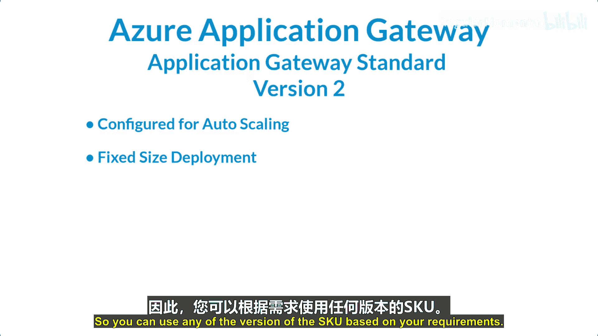

*   当用户访问 `abc.com/images` 时，流量会被路由到 `image-server-pool`。
*   当用户访问 `abc.com/videos` 时，流量则会被路由到 `video-server-pool`。


### 多站点路由
多站点路由允许根据访问的域名（主机头）将流量导向不同的后端池。

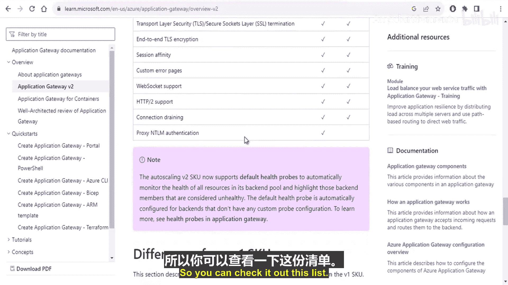


以下是其工作原理的示例：
假设应用程序网关需要处理两个网站：`abc.com` 和 `xyz.com`。

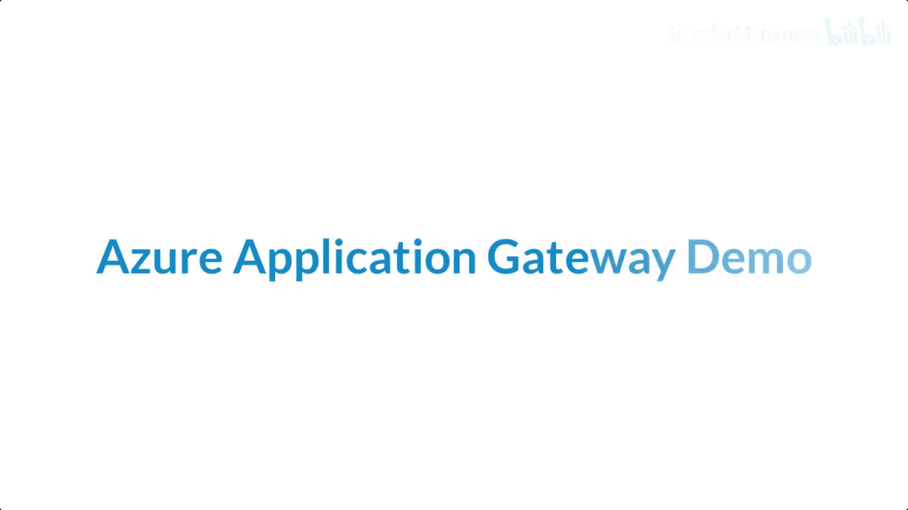

*   访问 `abc.com` 的请求会被路由到为 `abc.com` 配置的后端池。
*   访问 `xyz.com` 的请求则会被路由到为 `xyz.com` 配置的后端池。

此外，应用程序网关还提供一个可选功能：**Web应用程序防火墙（WAF）**。启用WAF后，它可以保护你的Web应用免受SQL注入等基于Web的威胁。

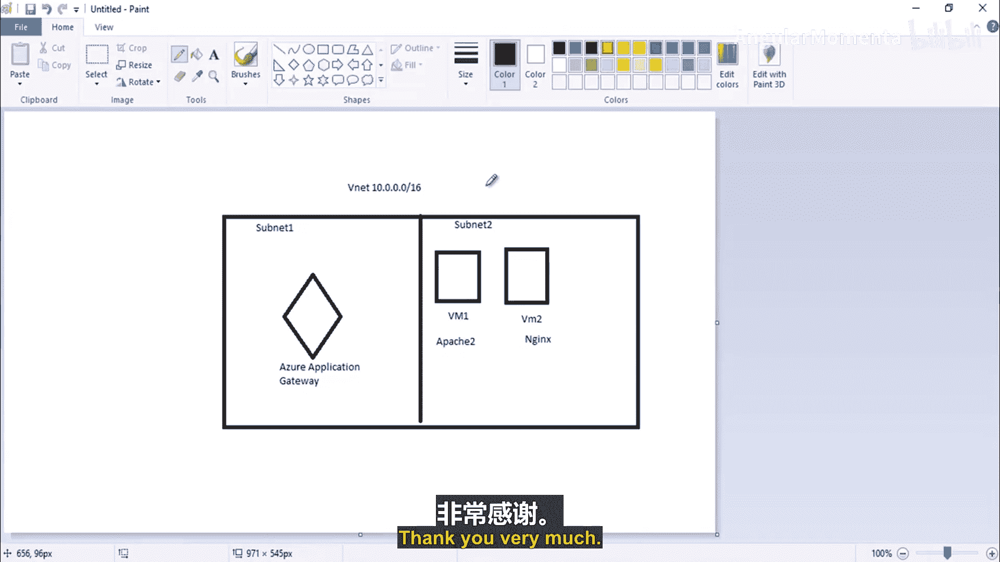

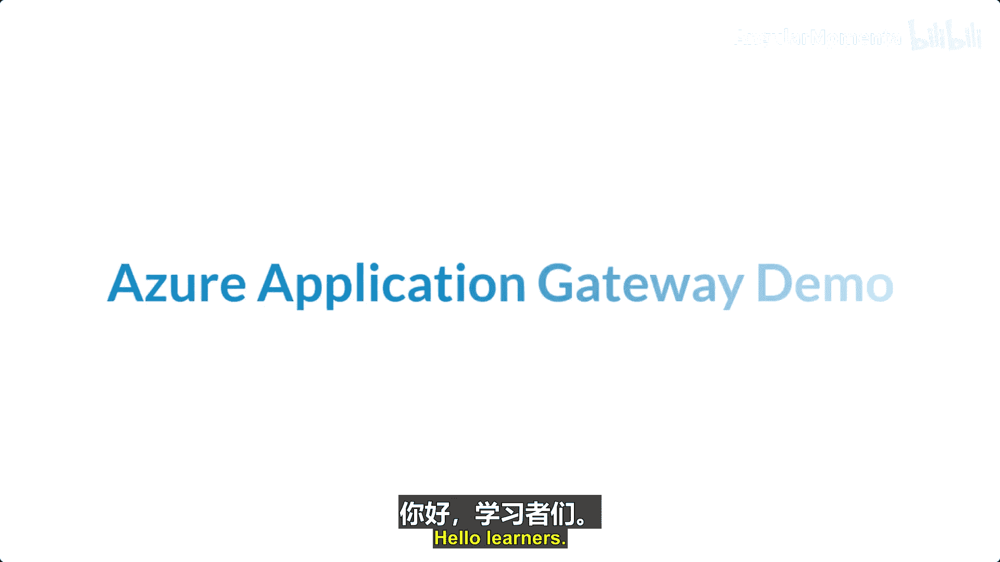

---

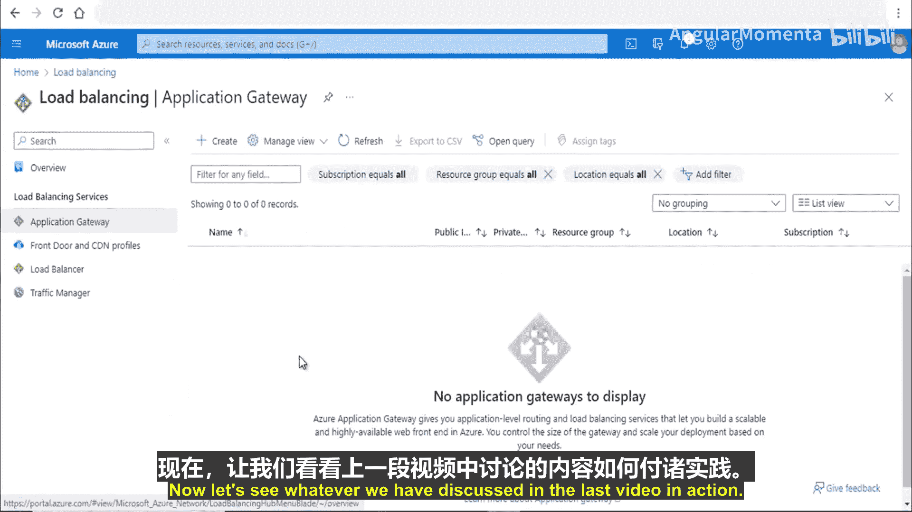

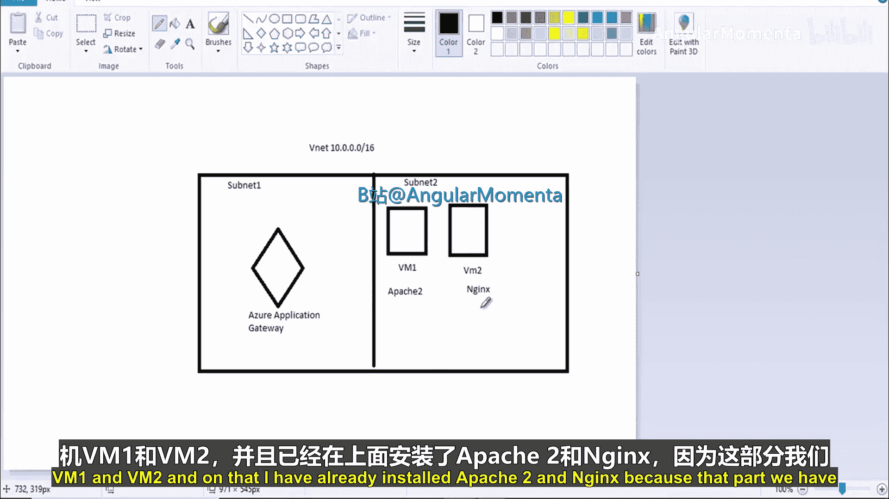

## 应用程序网关的SKU
Azure应用程序网关主要有两个SKU版本：**v1** 和 **v2**。

*   **v1（标准版）**：提供三种固定规模：小型、中型和大型。
    *   小型适用于开发和测试场景。
    *   各规模的具体性能指标（如吞吐量）不同。
*   **v2**：支持**自动缩放**功能，可以根据流量模式动态调整容量。如果你需要固定规模的部署，也可以选择v2。

你可以根据需求选择适合的SKU版本。v2版本在定价上包含固定费用和容量单位费用两部分。

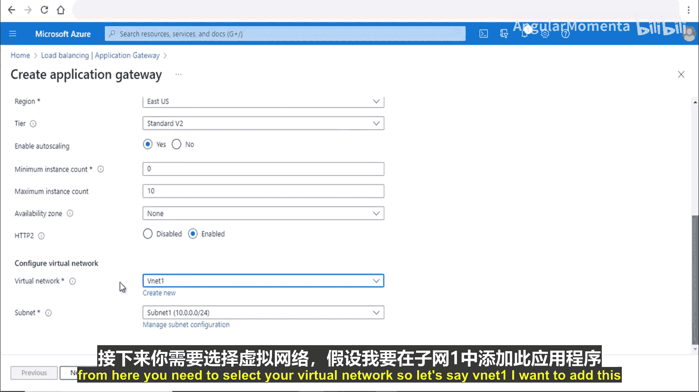

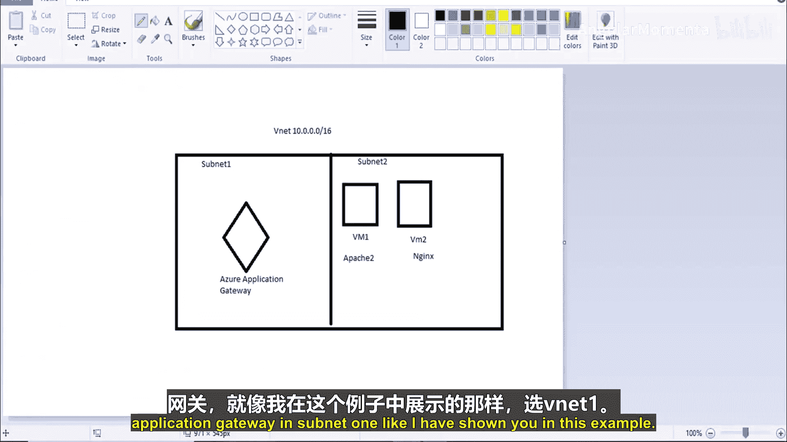

以下是v1与v2的主要功能对比：
*   **自动缩放**：仅v2支持。
*   **区域冗余**：仅v2支持。
*   **静态VIP**：仅v2支持。
*   **Kubernetes集成**：仅v2支持。
*   **基于URL和多站点托管**：v1和v2均支持。

---

## 演示：创建和配置应用程序网关
在理论部分，我们介绍了应用程序网关的概念和功能。现在，让我们通过一个实际操作演示来巩固理解。

### 演示环境规划
我们将创建一个包含以下组件的测试环境：
1.  一个虚拟网络（VNet），地址空间为 `10.0.0.0/16`。
2.  两个子网：
    *   **子网1**：用于放置应用程序网关（前端子网）。
    *   **子网2**：用于放置后端虚拟机（后端子网）。
3.  在子网2中创建两台虚拟机：`VM1` 和 `VM2`。
    *   在 `VM1` 上安装 **Apache** Web服务器。
    *   在 `VM2` 上安装 **Nginx** Web服务器。
4.  在子网1中创建并配置一个应用程序网关，将流量负载均衡到 `VM1` 和 `VM2`。

### 配置步骤
以下是创建应用程序网关的核心步骤摘要：

1.  **基本信息**：在Azure门户中创建应用程序网关，选择资源组、区域，并选择 **v2** SKU以启用自动缩放。
2.  **网络配置**：选择之前创建的虚拟网络，并将网关部署在 **子网1** 中。
3.  **前端IP**：配置一个新的**公共IP地址**作为应用程序网关的入口点。
4.  **后端池**：添加一个后端池（例如 `my-pool`），并将 `VM1` 和 `VM2` 作为目标成员加入。
5.  **路由规则**：
    *   添加一个监听器（例如 `my-listener`），配置为监听 **HTTP（端口80）** 协议。
    *   将监听器关联到之前创建的 `my-pool` 后端池。
    *   可以配置高级选项，如**基于Cookie的会话亲和性**（将用户会话保持在同一台后端服务器）。

完成配置并部署后，你可以通过访问应用程序网关的公共IP地址来测试负载均衡效果。刷新浏览器页面，应该会交替看到来自Apache和Nginx的默认页面，这证明负载均衡正在正常工作。

---

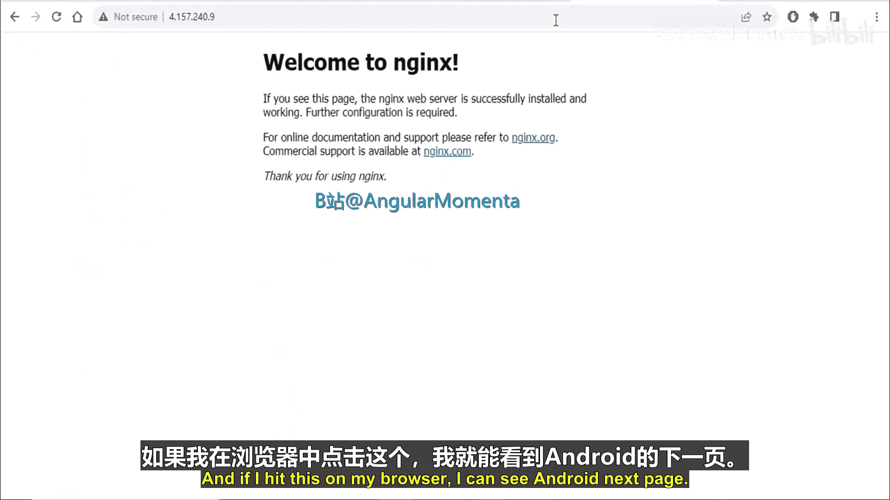

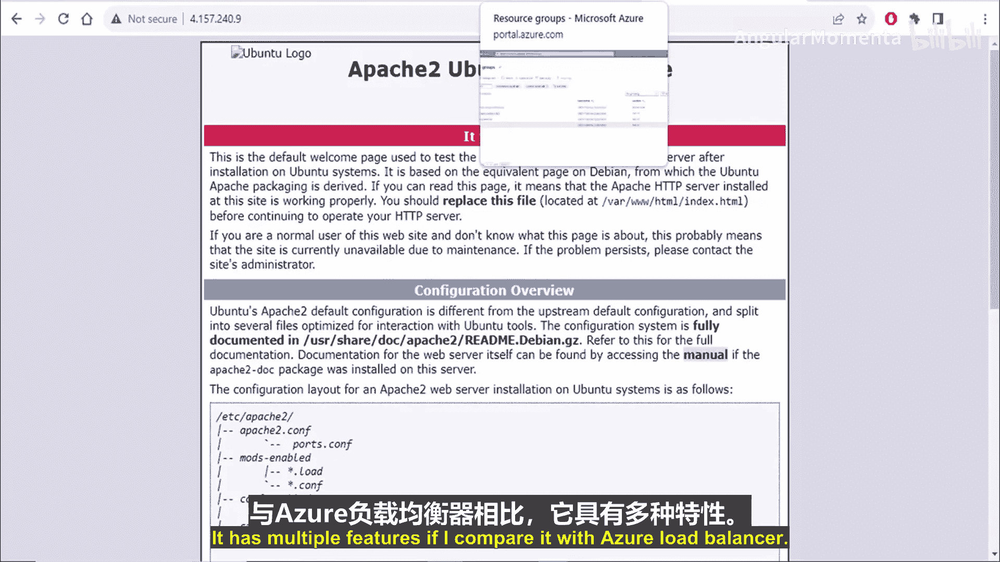

## 总结
本节课中我们一起学习了Azure应用程序网关。我们了解到它是一个第7层负载均衡器，专为管理Web流量而设计。核心知识点包括其基于路径和多站点的路由能力、v1和v2 SKU的区别（特别是v2的自动缩放功能），以及可选的Web应用程序防火墙（WAF）保护。最后，我们通过一个动手演示，展示了如何创建应用程序网关并将其配置为对运行不同Web服务器的后端虚拟机进行负载均衡。与基本的Azure负载均衡器相比，应用程序网关为Web应用程序提供了更丰富、更智能的流量管理功能。