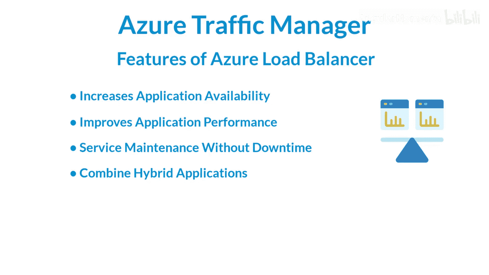
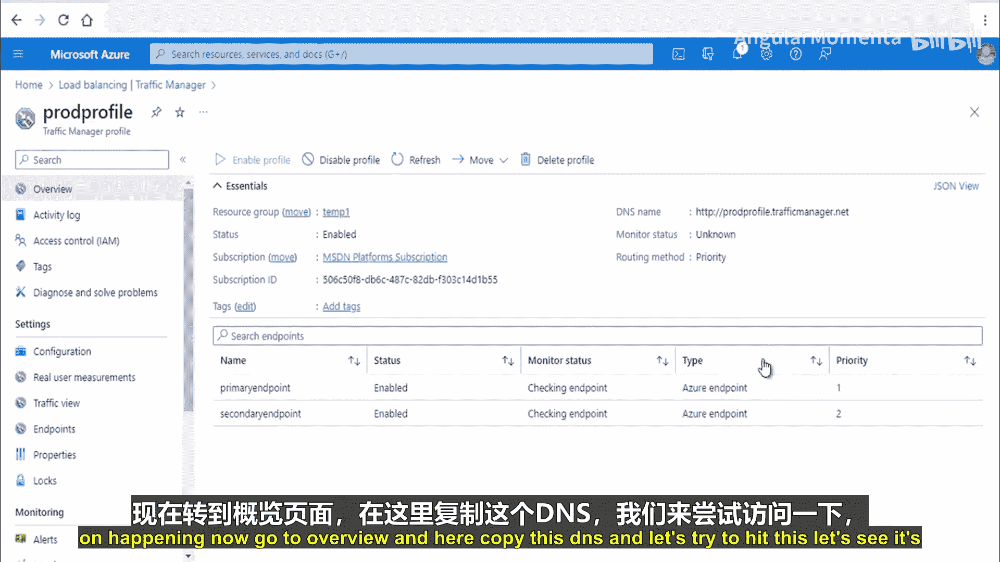

# 009：Azure流量管理器

## 概述

在本节课中，我们将要学习Azure流量管理器。它是一种基于DNS的流量负载均衡器，能够将流量分发到全球的公共应用程序端点，并提供高可用性和快速响应。我们将了解其工作原理、核心功能、不同的流量路由方法，并通过一个简单的演示来加深理解。

---

## Azure流量管理器简介

Azure流量管理器是一个基于DNS的流量负载均衡器。它允许你将流量分发到全球Azure区域的面向公众的应用程序。流量管理器还为你的公共端点提供高可用性和快速响应能力。

流量管理器使用DNS，根据流量路由方法将客户端请求定向到适当的服务端点。我们将在后续幻灯片中讨论流量路由方法。它使用一种路由方法来将流量分发到公共端点。

此外，它提供健康监控功能，会持续检查每个端点的健康状况，从而监控你的机器健康状态。端点可以是托管在Azure内部或外部的面向互联网的服务，也支持混合场景。

---

## Azure流量管理器的功能

以下是Azure流量管理器的一些核心功能：

1.  **提高应用程序可用性**：流量管理器为关键应用程序提供高可用性。它通过持续监控端点并提供自动故障转移来实现这一点。当某个端点宕机时，它会将流量重定向到可用的端点。
2.  **提升应用程序性能**：Azure允许你在全球各地的数据中心运行云服务和网站。流量管理器可以通过将流量定向到延迟最低的端点来提升性能。
3.  **无停机服务维护**：你可以在不造成停机的情况下对应用程序进行计划内维护。因为在进行维护时，流量管理器可以将你的流量定向到其他端点。
4.  **支持混合应用程序**：流量管理器也支持外部非Azure端点。你可以在混合场景中使用它。

---

## 流量管理器工作原理

上一节我们介绍了流量管理器的功能，本节中我们来看看它是如何工作的。我们将借助一个来自微软官方文档的例子进行说明。

假设一个客户端（浏览器）想要访问页面 `partners.contoso.com/login.aspx`。以下是详细步骤：

1.  客户端向其配置的递归DNS服务发送DNS查询，以解析名称 `partners.contoso.com`。
2.  递归DNS服务查找 `contoso.com` 的名称服务器，并收到一个指向 `contoso.trafficmanager.net` 的CNAME记录。
3.  递归DNS服务接着查找 `trafficmanager.net` 域的名称服务器（由Azure流量管理器服务提供），并向其发送对 `contoso.trafficmanager.net` 的请求。
4.  **Azure流量管理器** 根据两个因素决定返回哪个端点：
    *   每个端点的当前健康状态（通过健康检查）。
    *   配置的**流量路由方法**（如优先级、权重等）。
5.  流量管理器将选定的端点（例如 `contoso.cloudapp.net`）作为另一个DNS CNAME记录返回给递归DNS服务。
6.  递归DNS服务查找 `cloudapp.net` 的名称服务器，获取 `contoso.cloudapp.net` 的IP地址。
7.  递归DNS服务整合结果，向客户端返回一个包含最终IP地址的DNS响应。
8.  客户端收到DNS结果，**直接连接**到该应用程序服务端点（例如Web应用），而不是通过流量管理器。

**核心概念**：流量管理器在DNS层面进行流量分发，客户端最终直接与后端服务通信。

---

## 流量路由方法

我们已经了解了流量管理器如何通过DNS工作，本节中我们来看看它决定流量去向的核心机制——流量路由方法。主要有四种方法：

1.  **优先级路由**
    *   **描述**：你可以为端点设置优先级。流量默认总是被导向优先级最高的可用端点。
    *   **工作方式**：如果优先级为1的端点健康检查失败（降级或宕机），流量会自动故障转移到列表中下一个优先级（如优先级2）的健康端点。
    *   **适用场景**：为主站点配置主动-被动故障转移。

2.  **加权路由**
    *   **描述**：你可以为每个端点分配一个权重值。
    *   **工作方式**：流量按照分配给每个端点的权重比例进行分发。例如，端点A权重50，端点B权重50，则各接收50%的流量。如果某个端点宕机，其权重将按比例分配给其他健康端点。
    *   **公式**：`端点接收流量比例 = (端点权重) / (所有健康端点权重之和)`
    *   **适用场景**：进行A/B测试，或将部分流量逐步导向新部署。

3.  **性能路由**
    *   **描述**：将流量路由到对用户而言网络延迟最低的位置。
    *   **工作方式**：流量管理器维护一个网络延迟表。当收到DNS查询时，它会判断请求来源，并返回延迟最低的可用端点的地址。如果该端点不可用，则返回下一个延迟最低的端点。
    *   **适用场景**：为全球用户提供最佳访问体验的应用程序。

4.  **地理路由**
    *   **描述**：根据用户请求的源地理区域（国家/地区）将流量定向到特定端点。
    *   **工作方式**：你可以配置规则，例如“来自德国的所有用户访问端点1（位于欧洲）”。你还可以配置嵌套配置文件，例如将墨西哥和亚洲的流量合并处理，或设置一个“世界其他地区”的默认端点。
    *   **适用场景**：需要满足数据本地化法规、提供本地化内容或限制服务访问区域的场景。

---

## 演示：创建和配置流量管理器

前面的章节介绍了理论，现在让我们通过一个动手演示来巩固所学。我们将创建两个Web应用和一个流量管理器配置文件，并配置优先级路由。

### 步骤1：创建Web应用

首先，我们在两个不同的Azure区域创建两个Web应用作为端点。

*   **Web应用1 (East US)**:
    *   资源组：`temp1`
    *   名称：`prod123`
    *   运行时栈：Docker容器 (Linux)
    *   区域：**美国东部**

*   **Web应用2 (West US)**:
    *   资源组：`temp2`
    *   名称：`prod456`
    *   运行时栈：Docker容器 (Linux)
    *   区域：**美国西部**

创建完成后，访问它们的默认URL（如 `prod123.azurewebsites.net`）会显示一个默认的Azure应用服务页面。

### 步骤2：创建流量管理器配置文件

1.  在Azure门户中，搜索并进入“流量管理器配置文件”。
2.  点击“创建”。
3.  配置基本信息：
    *   名称：例如 `myTrafficProfile`
    *   路由方法：选择 **优先级**
    *   资源组：可以选择 `temp1` 或新建一个，这仅决定配置文件本身的存储位置，与端点无关。
4.  点击“创建”。部署需要一些时间。

### 步骤3：添加并配置端点

配置文件创建完成后，我们需要将两个Web应用添加为端点。

1.  在流量管理器配置文件的“设置”下，点击“端点”。
2.  点击“添加”。
    *   **第一个端点 (主要)**:
        *   类型：Azure端点
        *   名称：`primary`
        *   目标资源类型：应用服务
        *   目标资源：选择 `prod123` (位于美国东部的Web应用)
        *   优先级：`1` (最高)
        *   保持“启用”状态。
    *   **第二个端点 (次要)**:
        *   类型：Azure端点
        *   名称：`secondary`
        *   目标资源类型：应用服务
        *   目标资源：选择 `prod456` (位于美国西部的Web应用)
        *   优先级：`2`
        *   保持“启用”状态。

添加后，流量管理器会开始监控这两个端点的健康状态。

### 步骤4：测试流量管理器

1.  在流量管理器配置文件的“概述”页面，复制“DNS名称”（例如 `myTrafficProfile.trafficmanager.net`）。
2.  在浏览器中访问此DNS名称。
3.  **预期结果**：由于我们配置了优先级路由，且 `primary` 端点（优先级1）是健康的，所有流量都应被导向 `prod123.azurewebsites.net`，你会看到其默认页面。
4.  **测试故障转移**：
    *   返回到流量管理器配置文件的“端点”设置。
    *   将 `primary` 端点的状态设置为 **“已禁用”** 并保存。这模拟了该端点故障。
    *   再次访问流量管理器的DNS名称。
    *   **预期结果**：现在流量应被自动重定向到 `secondary` 端点（优先级2），即 `prod456.azurewebsites.net`，显示其默认页面。这验证了优先级路由和故障转移功能正常工作。

---

## 总结

本节课中我们一起学习了Azure流量管理器。我们了解到它是一个基于DNS的全局负载均衡服务，通过智能路由方法（优先级、权重、性能、地理）将用户流量分发到最合适的应用程序端点。其核心价值在于提升应用程序的可用性、性能，并支持无缝的维护操作和混合架构。通过动手演示，我们实践了如何创建流量管理器配置文件、添加端点以及测试基于优先级的故障转移流程。