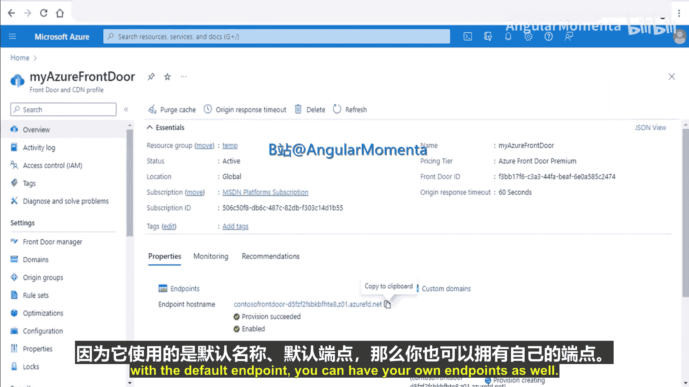
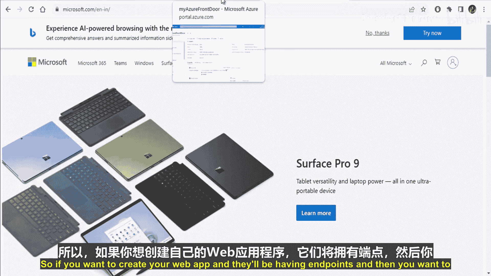
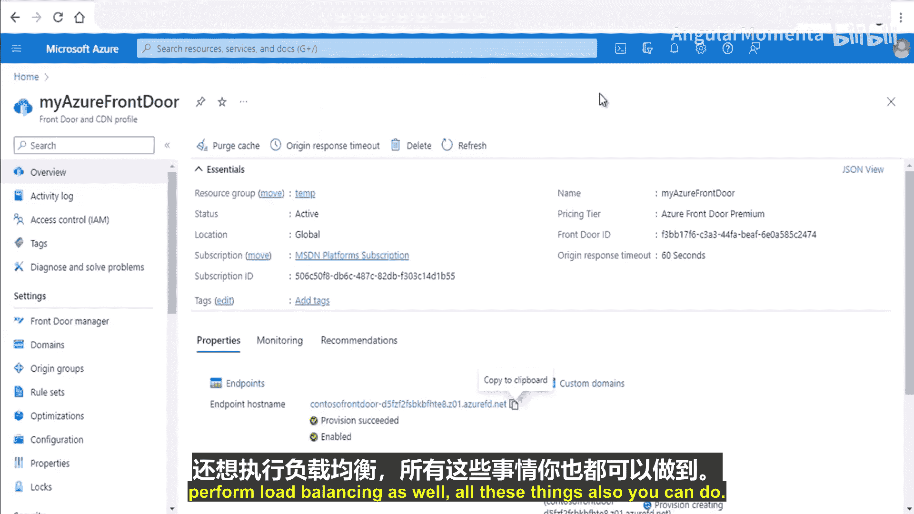
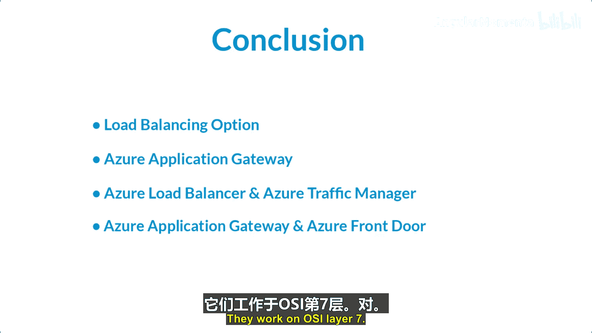

# 010：Azure Front Door 与 CDN

在本节课中，我们将学习Azure Front Door和Azure内容分发网络（CDN）的核心概念、工作原理以及如何创建它们。这两项服务旨在优化全球用户对应用程序和内容的访问速度与可靠性。

## 什么是内容分发网络（CDN）？

上一节我们介绍了负载均衡器，本节中我们来看看另一种提升应用性能的服务：内容分发网络。

内容分发网络是一个分布在全球各地的服务器网络，能够高效地向用户交付网络内容。CDN将缓存内容存储在其位于“接入点”位置的服务器上，这些位置靠近最终用户，旨在最小化延迟。

其工作原理可以概括为：用户首次请求内容时，请求会被路由到最近的边缘服务器。如果内容未缓存，边缘服务器会从源服务器获取内容并缓存下来。此后，同一区域的其他用户再请求相同内容时，就可以直接从本地边缘服务器获取，无需再访问遥远的源服务器，从而显著提升访问速度并降低源服务器负载。

以下是CDN工作原理的简化图示：

```
用户请求 -> 最近边缘服务器 -> [检查缓存]
    | (缓存未命中)
    V
源服务器 -> 返回内容并缓存在边缘服务器 -> 返回给用户
    ^
    | (后续请求，缓存命中)
用户请求 -> 最近边缘服务器 -> 直接返回缓存内容
```

## Azure Front Door：现代化的云CDN

Azure Front Door是一个现代化的云内容分发网络，它在全球范围内为用户和应用程序（包括静态和动态Web内容）提供快速、可靠且安全的访问。它利用微软的全球边缘网络，拥有数百个全球和本地的接入点（即边缘位置）。

使用Azure Front Door的主要优势包括：
*   **全球分发与扩展**：利用微软网络，通过全球118个以上边缘位置进行内容分发。
*   **支持现代应用与架构**：可使用自定义域名，并在全球范围内进行负载均衡和流量路由。
*   **简单且经济高效**：提供简化的配置和管理体验。








Azure Front Door的工作流程如下：
1.  选择并连接到最近的Azure Front Door边缘位置。
2.  匹配Front Door配置文件并建立TLS连接。
3.  （可选）检查Web应用程序防火墙规则。
4.  匹配路由规则并选择后端池。
5.  评估路由规则，返回缓存内容或从后端池中选择源服务器。
6.  将请求转发到源服务器。

## 创建Azure Front Door配置文件

以下是创建Azure Front Door配置文件的步骤：

1.  在Azure门户中搜索并进入“Front Door和CDN配置文件”。
2.  点击“创建”，选择“Azure Front Door”。
3.  可以选择“快速创建”（使用默认设置）或“自定义创建”。本教程使用“快速创建”。
4.  选择订阅、创建或选择资源组、选择区域。
5.  为配置文件命名（例如 `my-frontdoor`）。
6.  配置端点名称（需全局唯一，例如 `contoso`）。
7.  选择源类型并配置源地址。
8.  查看配置并点击“创建”。部署完成后，即可通过提供的端点主机名访问服务。

## Azure CDN

Azure CDN为开发人员提供了一个全球解决方案，通过缓存静态内容来快速向用户交付高带宽内容。数据被缓存在全球各地的物理节点上。

使用Azure CDN的好处包括：
*   **更好的性能和用户体验**：减少加载内容所需的往返次数。
*   **强大的扩展能力**：可处理瞬时高负载（如产品发布活动）。
*   **分发用户请求**：直接从边缘服务器提供内容，减少回源流量。

## 创建Azure CDN配置文件和端点

以下是创建Azure CDN配置文件和端点的步骤：

1.  在Azure门户中搜索并进入“CDN配置文件”。
2.  点击“创建”，选择“Azure CDN Standard from Microsoft”。
3.  选择或创建新的资源组，为配置文件命名（例如 `my-cdn-profile`），选择定价层和区域。
4.  创建配置文件后，在其中“创建端点”。
5.  为端点命名（例如 `my-endpoint`），选择源类型（如存储帐户、Web应用等）。
6.  配置源主机名和路径。
7.  创建端点后，可以通过 `端点主机名/容器名/文件名` 的格式访问缓存内容。首次访问可能较慢，内容被缓存后，后续访问速度将大幅提升。

## 总结

本节课中我们一起学习了Azure中的内容分发与加速服务。

我们首先了解了内容分发网络的基本概念及其通过边缘缓存提升性能的原理。接着，深入探讨了Azure Front Door，它是一个功能强大的全球性CDN和应用程序加速服务，支持高级路由、负载均衡和安全功能。然后，我们介绍了Azure CDN，这是一个专注于静态内容高速分发的服务。最后，我们通过实际操作演示了如何在Azure门户中创建Front Door配置文件和CDN端点。



这些服务是构建高性能、高可用性全球应用程序的关键组件，能够确保世界各地的用户都能获得快速、安全的访问体验。