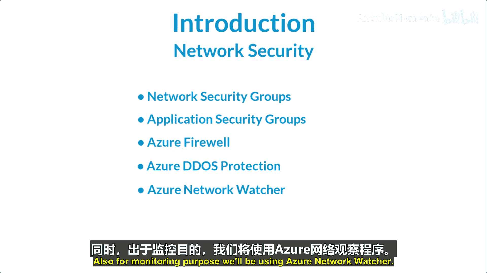
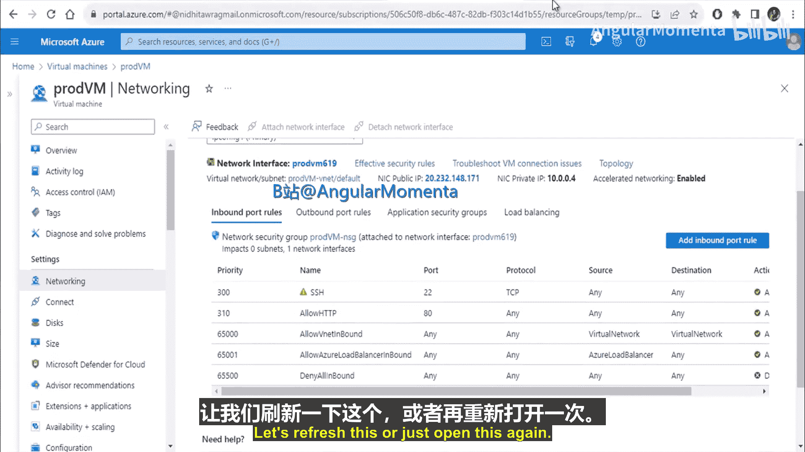
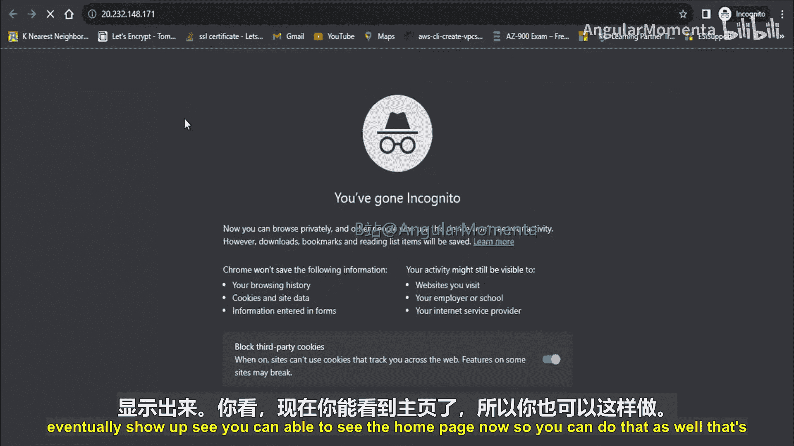
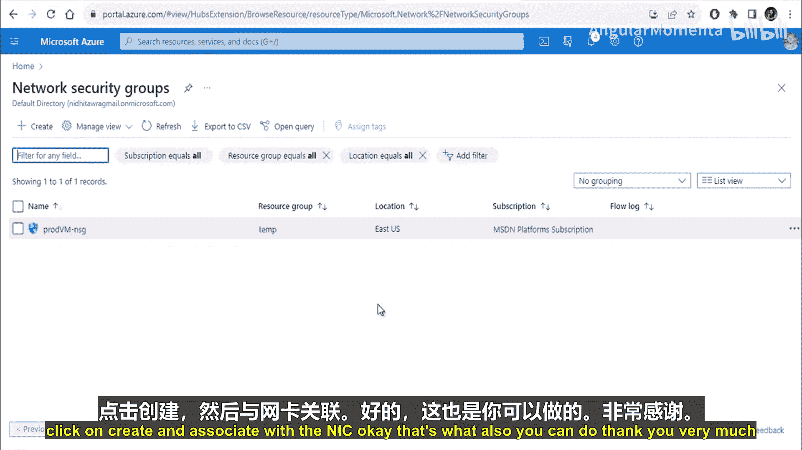

# 011：Azure中的网络安全与监控

## 📖 概述
在本模块中，我们将学习Azure中的网络安全与监控。网络安全是通过对网络流量应用控制，保护资源免受未经授权访问或攻击的过程。它只允许合法的流量请求。我们将探讨提供网络安全的Azure资源，以及如何监控和管理网络基础设施。

---




## 🔒 网络安全组（NSG）

上一节我们介绍了网络安全与监控的基本概念，本节中我们来看看网络安全组。

网络安全组用于限制网络流量。你可以使用网络安全组来允许或阻止特定流量。网络安全组可以关联到子网级别或网络接口级别，也支持多重关联。其基本目的是管理你希望允许或拒绝的网络流量。

### 网络安全组规则
流量基于特定规则被允许或阻止。默认情况下，当你创建虚拟机时，一个默认的网络安全组会附加到虚拟机的网络接口卡上。

以下是默认的入站安全规则：
*   **规则 65000**：允许虚拟网络内任何端口、任何协议的入站流量。这意味着虚拟网络内的机器可以相互通信。
*   **规则 65001**：允许来自Azure负载均衡器、任何协议、到任何目的地的流量。
*   **规则 65500**：拒绝除上述两条规则外的所有入站流量。

以下是默认的出站安全规则：
*   **规则 65000**：允许虚拟网络内任何端口、任何协议的出站流量。
*   **规则 65001**：允许到互联网的任何端口、任何协议的出站流量。
*   **规则 65500**：拒绝除上述两条规则外的所有出站流量。

需要注意的是，这些默认规则无法被删除。

### 覆盖默认规则
如果你需要允许特定端口和协议，可以通过创建优先级更高的规则来覆盖默认规则。规则优先级由数字表示，数字越小，优先级越高。

例如，默认规则`65500`拒绝了所有非指定的入站流量。如果你想允许远程桌面协议端口`3389`的入站流量，可以创建一个优先级数字小于`65500`的新规则（例如`1000`）。这样，当流量到达时，系统会优先匹配这条新规则，从而允许`3389`端口的流量。

### NSG有效安全规则
网络安全组规则可以应用在子网级别，也可以应用在虚拟机的网络接口级别。为了允许特定流量到达目标，必须在所有关联的网络安全组（无论是子网级还是网络接口级）中都配置允许规则。如果任一级别的规则拒绝了该流量，则流量将被阻止。

**公式表示：**
`最终允许 = (子网NSG规则允许) AND (网络接口NSG规则允许)`

---

## 🛡️ 应用程序安全组（ASG）

上一节我们介绍了网络安全组，本节中我们来看看应用程序安全组。

通常，部署虚拟机并附加网络安全组时，会将网络安全组应用到子网级别或网络接口卡级别。如果应用到子网级别，规则将适用于该子网内的所有网络接口卡或虚拟机。

应用程序安全组在网络安全组内部使用。它的用途是，当你希望对一组特定的虚拟机应用特定的安全规则，同时保持默认组规则不变时，可以使用应用程序安全组来简化管理。

### 应用示例
假设一个虚拟网络中有四台虚拟机：`VM1`、`VM2`（Web服务器）、`VM3`（应用逻辑服务器）、`VM4`（数据库服务器）。一个网络安全组`NSG1`关联到整个子网。

**目标：**
1.  只允许互联网对`VM1`和`VM2`（Web服务器）的HTTP（端口80）访问。
2.  默认允许虚拟网络内通信，但需要阻止除`VM3`外所有虚拟机对`VM4`（数据库）的访问。
3.  只允许`VM3`（应用逻辑服务器）通过特定端口（如1433）访问`VM4`（数据库）。

**实现：**
以下是使用应用程序安全组在`NSG1`中配置的规则：

1.  **允许Web流量**：
    *   **优先级**: 100
    *   **源**: 互联网
    *   **目标**: `ASG-Web` (一个包含`VM1`和`VM2`网络接口的应用程序安全组)
    *   **端口**: 80
    *   **操作**: 允许

2.  **阻止对数据库的通用访问**：
    *   **优先级**: 200
    *   **源**: 虚拟网络
    *   **目标**: `ASG-DB` (一个包含`VM4`网络接口的应用程序安全组)
    *   **操作**: 拒绝

3.  **允许应用服务器访问数据库**：
    *   **优先级**: 300
    *   **源**: `ASG-Logic` (一个包含`VM3`网络接口的应用程序安全组)
    *   **目标**: `ASG-DB`
    *   **端口**: 1433
    *   **操作**: 允许

通过这种方式，你可以轻松管理针对不同角色虚拟机组的精细访问控制，而无需修改每个虚拟机的网络接口规则。

---

## 🖥️ 实战演示：NSG规则配置

现在，让我们通过实际操作来看看网络安全组的使用。

### 创建虚拟机并查看默认规则
首先，我们创建一个虚拟机。在创建过程中，选择允许特定端口（例如SSH的22端口）。创建完成后，系统会自动生成一个关联的默认网络安全组。

查看该网络安全组的入站规则，你会看到之前讨论的默认规则（65000， 65001， 65500），以及一条为SSH添加的允许规则（端口22）。

### 测试默认规则
在虚拟机上安装Apache Web服务器（监听80端口）。尝试通过浏览器访问虚拟机的公共IP地址。此时访问会失败，因为默认规则`65500`拒绝了所有非指定的入站流量，而80端口不在允许之列。

### 添加规则以允许Web流量
为了允许HTTP流量，我们需要在网络安全组中添加一条新的入站规则。

**操作步骤如下：**
1.  导航到虚拟机的网络安全组。
2.  选择“入站安全规则”。
3.  点击“添加”。
4.  配置新规则：
    *   **源**: 可以是“任何”，或你的特定IP地址以增强安全。
    *   **源端口范围**: `*`
    *   **目标**: “任何”
    *   **目标端口范围**: `80`
    *   **协议**: `TCP`
    *   **操作**: `允许`
    *   **优先级**: 输入一个小于`65500`的数字，例如`310`。
    *   **名称**: 例如 `Allow-HTTP`

保存规则后，稍等片刻让规则生效。再次通过浏览器访问虚拟机的公共IP地址，此时你应该能够看到Apache的默认主页。

### 管理网络安全组
你可以在Azure门户中查看和管理网络安全组，包括其关联的子网和网络接口。你也可以创建新的网络安全组并关联到现有资源。

**代码示例（添加入站规则的Azure CLI命令概念）：**
```bash
# 这是一个概念性示例，展示添加规则的思想
az network nsg rule create \
  --nsg-name MyNSG \
  --name AllowHTTP \
  --priority 310 \
  --direction Inbound \
  --access Allow \
  --protocol Tcp \
  --destination-port-ranges 80
```

---

## 📝 总结
在本节课中，我们一起学习了Azure网络安全与监控的核心组件。

我们首先了解了**网络安全组**，它是用于过滤虚拟网络流量的基础防火墙，通过入站和出站规则控制访问。我们学习了默认规则、优先级机制以及如何通过创建更高优先级的规则来覆盖默认行为。





接着，我们探讨了**应用程序安全组**，它允许你将虚拟机分组，并在网络安全组规则中将这些组作为源或目标，从而实现对特定应用层（如Web层、数据库层）的精细化访问控制，极大简化了安全管理。

最后，通过一个实战演示，我们观察了默认NSG规则的行为，并亲手添加了一条新的入站规则以允许Web流量，验证了NSG规则配置的实际效果。



通过掌握这些工具，你可以有效地保护Azure中的网络资源，并实施符合需求的访问策略。