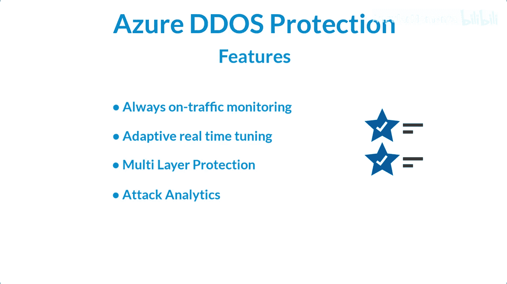
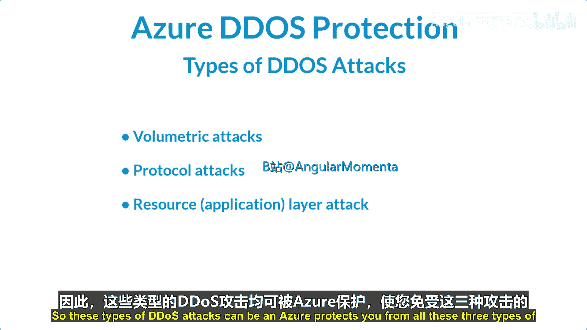
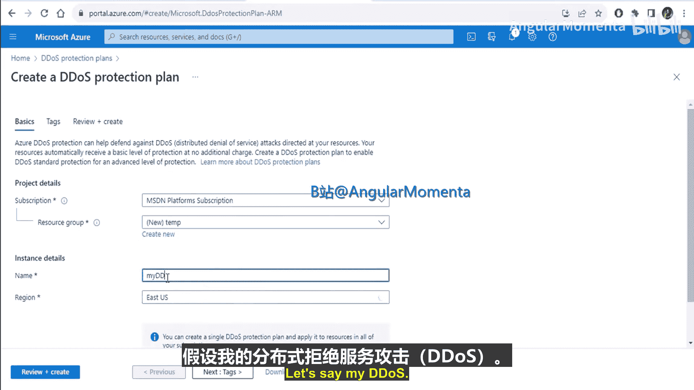
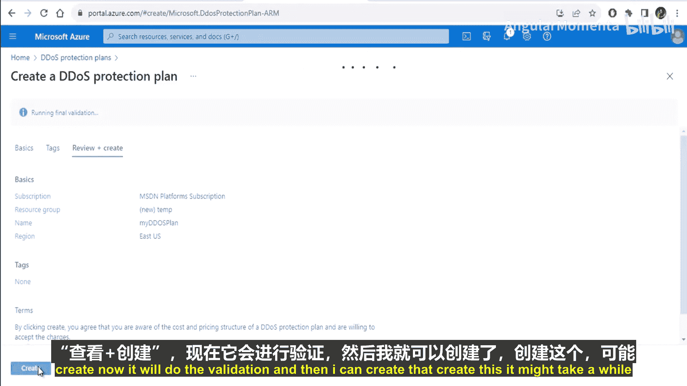
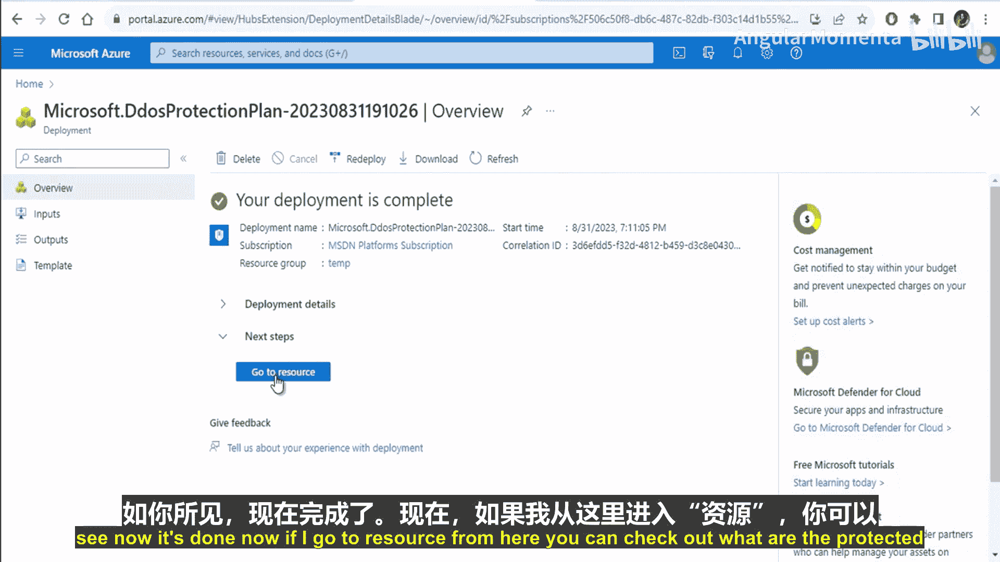
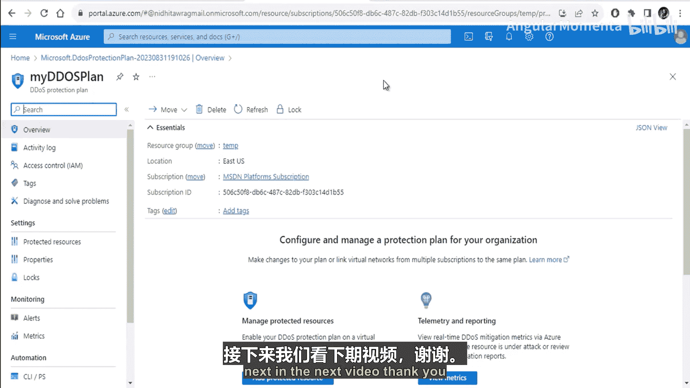
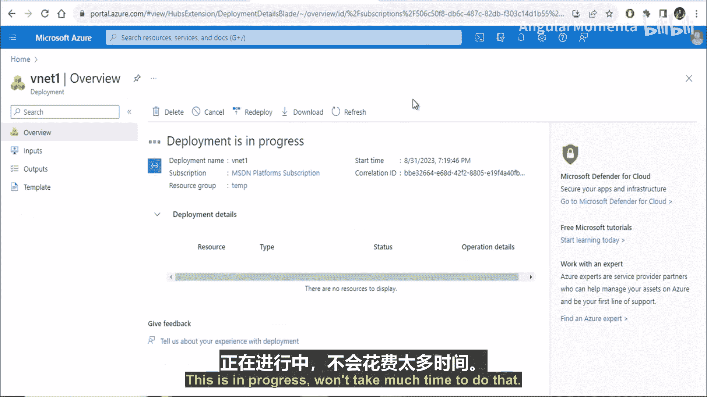
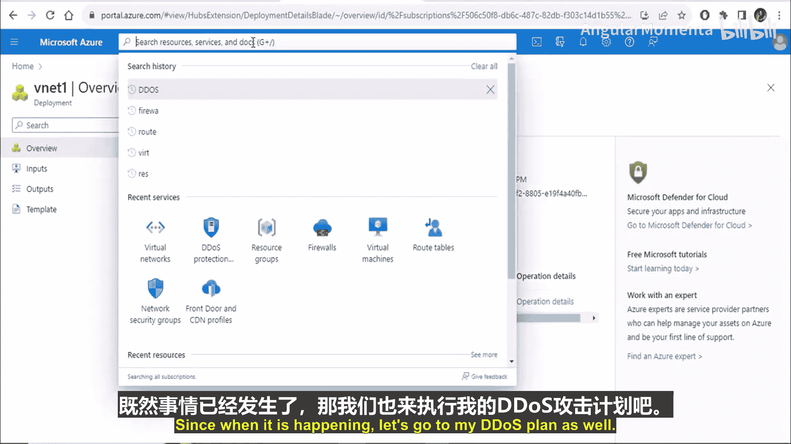
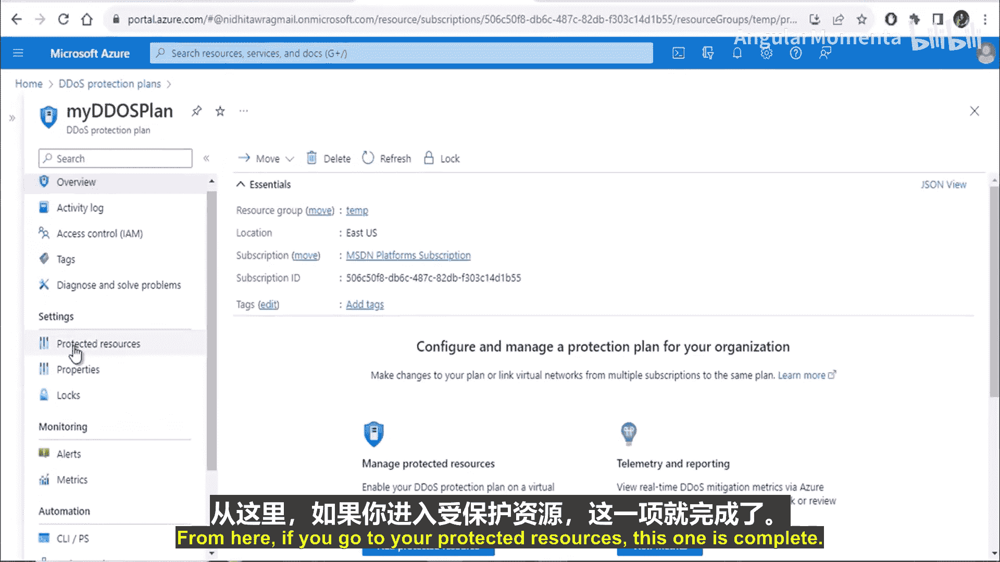
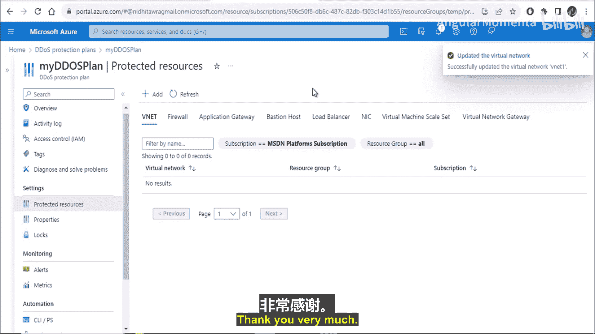

# 013：Azure DDoS防护 🛡️

在本节课中，我们将学习Azure分布式拒绝服务防护。我们将了解什么是DDoS攻击，Azure DDoS防护的功能，以及如何在虚拟网络中启用和配置该服务。

## 什么是拒绝服务攻击？

首先，我们需要理解什么是拒绝服务攻击。拒绝服务攻击是指意图阻止用户访问服务或系统的攻击。

**拒绝服务攻击**通常有一个单一的发起源。

## 什么是分布式拒绝服务攻击？

上一节我们介绍了拒绝服务攻击，本节中我们来看看它的分布式形式。分布式拒绝服务攻击是一种从多个位置、不同网络和系统发起的攻击。

**分布式拒绝服务攻击**的流量来源是分布式的。

Azure分布式拒绝服务防护可以保护您免受此类攻击。它结合了应用程序设计的最佳实践，并提供增强的DDoS缓解功能来防御分布式拒绝服务攻击。该服务会自动调整，以帮助保护虚拟网络内的特定Azure资源。

## Azure DDoS防护的功能

了解了基本概念后，我们来看看Azure DDoS防护提供了哪些核心功能。

以下是Azure DDoS防护的主要功能：

*   **始终在线的流量监控**：您的应用程序流量模式会每周7天、每天24小时被监控，以寻找任何攻击迹象。
*   **自适应实时调整**：该服务会根据您服务的流量模式自动进行调整。
*   **多层保护**：它提供第3层、第4层和第7层的防护。
*   **攻击分析**：该服务提供攻击分析报告。

## DDoS攻击的类型

Azure DDoS防护功能强大，那么它能防御哪些类型的攻击呢？以下是三种主要的分布式拒绝服务攻击类型：

1.  **容量耗尽型攻击**：这类攻击用大量看似合法的流量淹没网络层。它们包括UDP洪水攻击、放大攻击和其他欺骗性数据包洪水攻击。
2.  **协议攻击**：这类攻击通过利用第3层和第4层协议栈中的弱点，使目标无法访问。例如SYN洪水攻击、反射攻击和其他协议攻击。
3.  **资源（或应用）层攻击**：这类攻击针对Web应用程序数据包，旨在中断主机之间的数据传输。例如HTTP协议违规、SQL注入、跨站脚本等攻击。

Azure DDoS防护可以保护您免受所有这三种类型的攻击。

## 如何启用DDoS防护计划

在了解了攻击类型后，本节我们将实际操作，学习如何为虚拟网络启用DDoS防护。

首先，在Azure门户中搜索“DDoS防护”。
点击“创建DDoS防护计划”。
选择所需的订阅。
创建一个资源组，例如命名为 `temp`。
为计划命名，例如 `myDDoSPlan`。
选择区域，例如“美国东部”。
浏览标签页，然后点击“查看 + 创建”。
Azure将进行验证，然后您可以点击“创建”。
创建过程可能需要一些时间来完成。

创建完成后，您可以转到该资源。在这里，您可以查看受保护的资源、日志等信息。

## 将DDoS防护计划关联到虚拟网络

上一节我们创建了DDoS防护计划，本节中我们来看看如何将其添加到虚拟网络。

首先，创建一个虚拟网络。
点击“创建虚拟网络”。
选择相同的资源组。
为其命名，例如 `vnet1`。
在此处，您可以直接选择防火墙和DDoS防护计划。您可以通过勾选复选框来启用“Azure DDoS防护网络保护”。
我们暂时不从这里选择，以便展示另一种方法。
使用默认的IP地址空间和子网设置，然后点击“创建”。
验证通过后，创建虚拟网络。这可能需要一点时间。

在创建虚拟网络的同时，我们可以转到之前创建的DDoS防护计划。
在计划中，找到“受保护的资源”部分。
点击“添加”。
您的虚拟网络 `vnet1` 应该会显示在列表中，选择并添加它。

通过这种方式，您就可以使用DDoS防护计划来保护虚拟网络内的资源了。

## 总结

本节课中我们一起学习了Azure DDoS防护。我们了解了拒绝服务攻击与分布式拒绝服务攻击的区别，探讨了Azure DDoS防护的核心功能，识别了三种主要的DDoS攻击类型，并逐步实践了如何创建DDoS防护计划并将其关联到虚拟网络，以实现对Azure资源的保护。