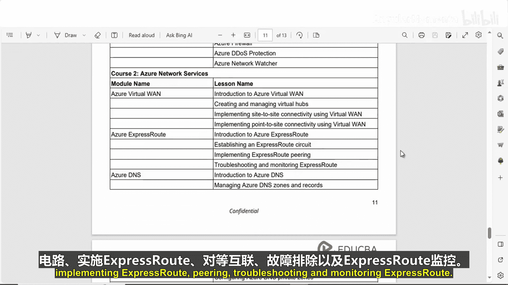
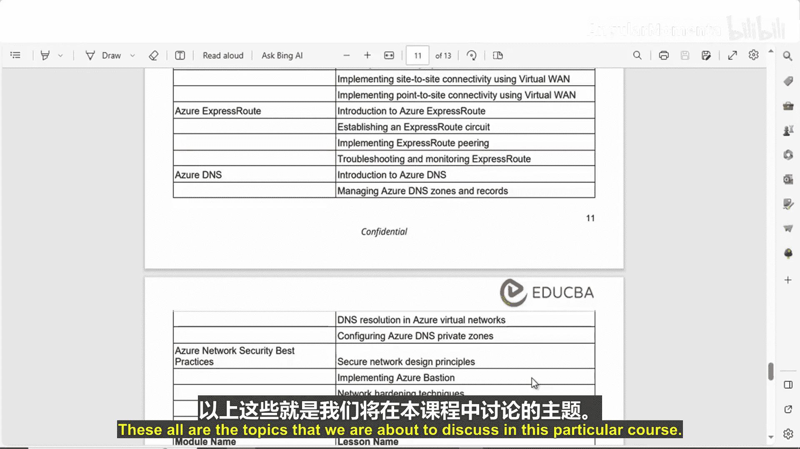
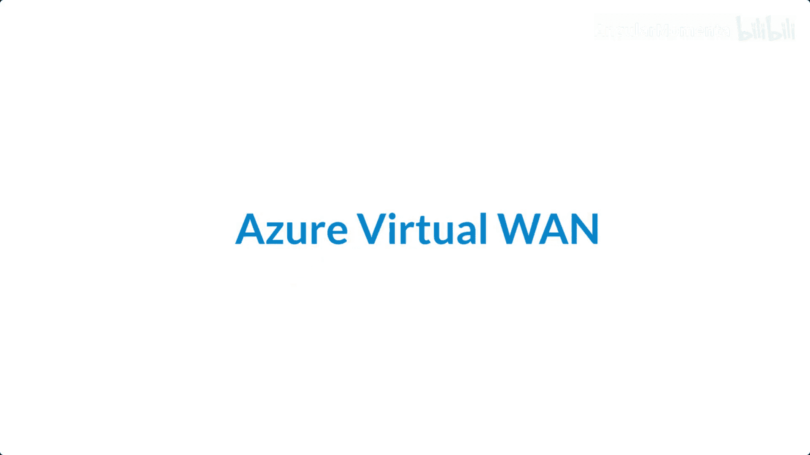
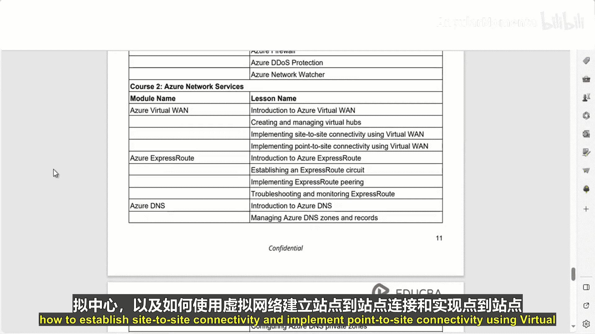
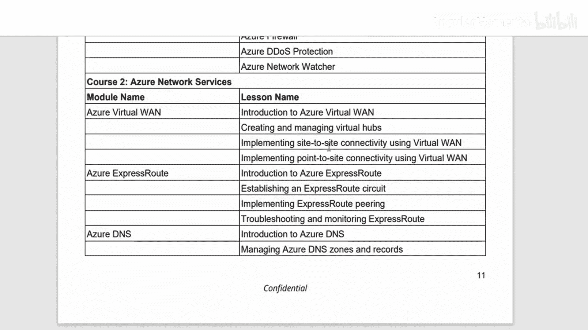
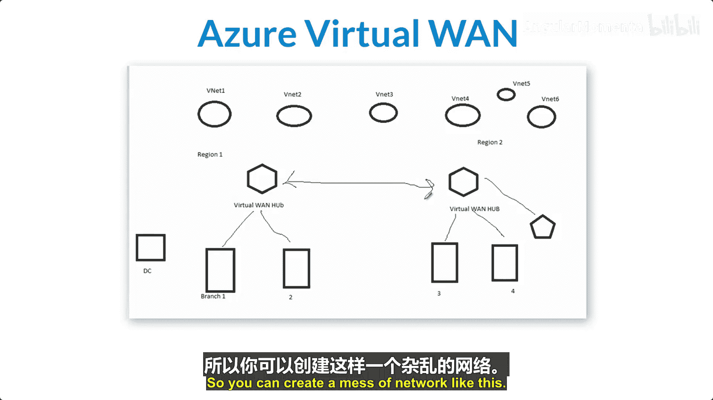
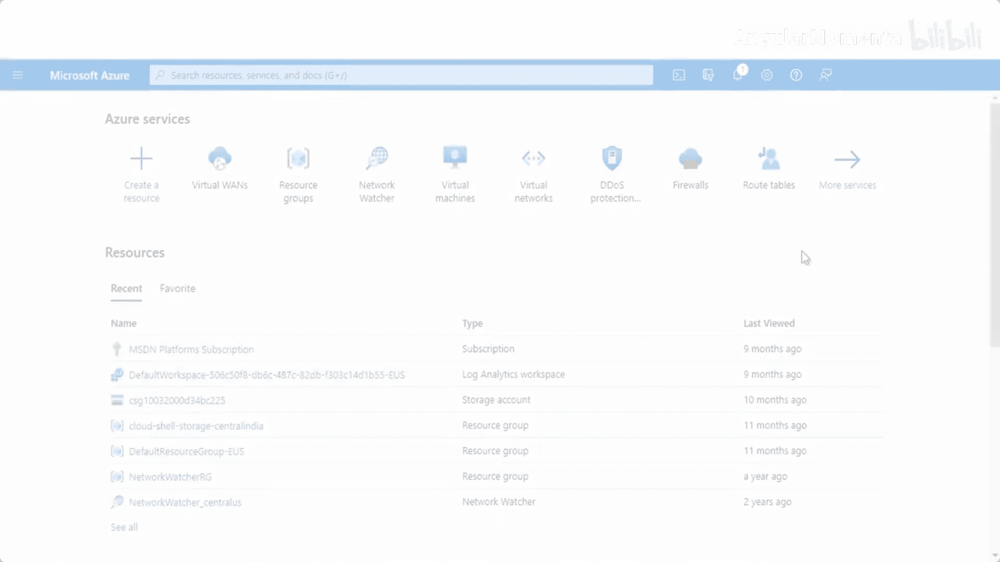
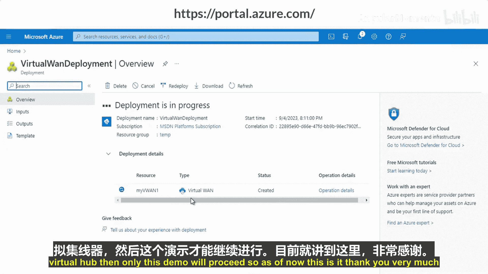

# 001：课程介绍


在本课程中，我们将学习Azure网络服务。Azure提供了一系列网络功能，用于连接和管理云资源。这些服务超越了基础的虚拟网络，提供了多种连接选项、流量监控与管理工具、负载均衡以及安全的用户连接保障。

## Azure网络服务：01-01：课程内容概述

上一节我们介绍了课程的整体目标，本节中我们来看看本课程将具体涵盖哪些核心服务。

以下是本课程将要讨论的主要服务：



*   **Azure虚拟广域网**：我们将学习虚拟广域网简介、如何创建和管理虚拟中心、使用虚拟广域网建立站点到站点连接以及点到站点连接。
*   **Azure ExpressRoute**：我们将学习ExpressRoute简介、如何建立ExpressRoute线路、对ExpressRoute进行故障排除和监控。
*   **Azure DNS**：我们将学习Azure DNS简介、如何管理Azure DNS区域和记录、在Azure虚拟网络中进行DNS解析，以及如何配置Azure DNS私有区域。
*   **Azure网络安全最佳实践**：我们将学习如何创建安全的网络设计原则、实施Azure虚拟网络强化技术，并了解Azure私有链接。

此外，课程中将包含相关的操作演示。

本节课中我们一起学习了本课程将要涵盖的四大核心Azure网络服务：虚拟广域网、ExpressRoute、DNS和网络安全最佳实践，为后续的深入学习奠定了基础。

---




## Azure网络服务：01-02：Azure虚拟广域网简介



在概述了课程内容后，本节我们将深入第一个核心服务：Azure虚拟广域网。

Azure虚拟广域网是一项网络服务，它将多种网络、安全和路由功能整合在一起，提供一个统一的操作界面。

在本模块中，我们将讨论Azure虚拟广域网及其在连接和管理大规模网络方面的优势。我们还将学习如何部署和管理虚拟中心、如何建立站点到站点连接，以及如何使用虚拟广域网实现点到站点连接。



以下是本模块的具体主题：




*   Azure虚拟广域网简介
*   创建和管理虚拟中心
*   使用虚拟广域网建立站点到站点连接
*   使用虚拟广域网实现点到站点连接

本节课中我们一起学习了Azure虚拟广域网的定义及其在本课程模块中的学习要点。

---

## Azure虚拟广域网：02-01：核心概念与架构

上一节我们介绍了虚拟广域网模块的学习目标，本节中我们来看看它的核心概念与架构设计。

Azure虚拟广域网是一项网络服务，它将多种网络、安全和路由功能整合在一起，提供一个统一的操作界面。

您可以通过Azure门户开始使用Azure虚拟广域网。其架构本质上是**中心辐射型架构**，为分支机构提供了内置的扩展性和性能。这里的“分支机构”可以指您的VPN、点到站点连接、ExpressRoute线路以及您的虚拟网络。

您可以通过此架构启用**全局传输网络**。云托管的网络中心使得分布在不同类型辐射网络和不同Azure区域中的端点之间能够实现传输连接。每个Azure区域都可以作为一个中心，您可以选择连接到这些中心。在标准版虚拟广域网中，所有中心通过全网状结构相互连接，这使得用户能够轻松利用微软骨干网实现任意两点间的连接。

关于虚拟广域网的SKU，主要有两种类型：**基本版**和**标准版**。

*   **基本版**仅支持站点到站点VPN。
*   **标准版**支持ExpressRoute、VPN、点到站点连接、中心到中心连接、VNet到VNet传输、Azure防火墙等更多功能。

此外需要注意，虚拟网络网关VPN最多仅支持30条隧道。如果您需要大规模VPN连接，则应使用虚拟广域网。每个区域的虚拟中心可以支持总计20 Gbps的聚合带宽。

让我们通过一个示例来理解架构。假设您有多个虚拟网络（例如VNet1到VNet6），分布在两个区域（Region1和Region2）。每个区域有一个虚拟广域网中心（VWAN-Hub）。您还可以有多个分支机构（Branch1到Branch4）和一个数据中心（DC）。这些组件可以通过站点到站点VPN、点到站点VPN相互连接，并且区域间的中心也可以互联，从而形成一个复杂的网状网络。

本节课中我们一起学习了Azure虚拟广域网的中心辐射型架构、两种SKU的区别，以及它如何构建大规模连接网络。

---

## Azure虚拟广域网：02-02：创建虚拟广域网




上一节我们了解了虚拟广域网的理论架构，本节中我们来看看如何实际操作，创建第一个虚拟广域网实例。



我们将演示如何在Azure门户中创建虚拟广域网。

1.  导航到“虚拟广域网”服务。
2.  点击“创建”。
3.  选择您的订阅和资源组。您可以创建新的资源组。
4.  选择您希望部署的区域。
5.  为实例命名，例如 `MyVirtualWAN1`。
6.  在“类型”中选择“标准”或“基本”。由于基本版仅支持站点到站点VPN，此处我们选择“标准”。
7.  点击“查看 + 创建”，等待验证通过。
8.  点击“创建”以部署资源。

以下是一个简化的创建命令示例（概念性代码）：
```azurecli
# 这是一个概念性操作步骤，实际创建通常在门户完成
az network vwan create --name MyVirtualWAN1 --resource-group MyResourceGroup --location eastus --type Standard
```

这样便完成了虚拟广域网的创建。在后续视频中，我们将首先讨论虚拟中心，然后创建虚拟中心，最后将您的虚拟中心连接到虚拟网络。



本节课中我们一起完成了在Azure门户中创建虚拟广域网实例的步骤，为后续配置虚拟中心和连接网络做好了准备。