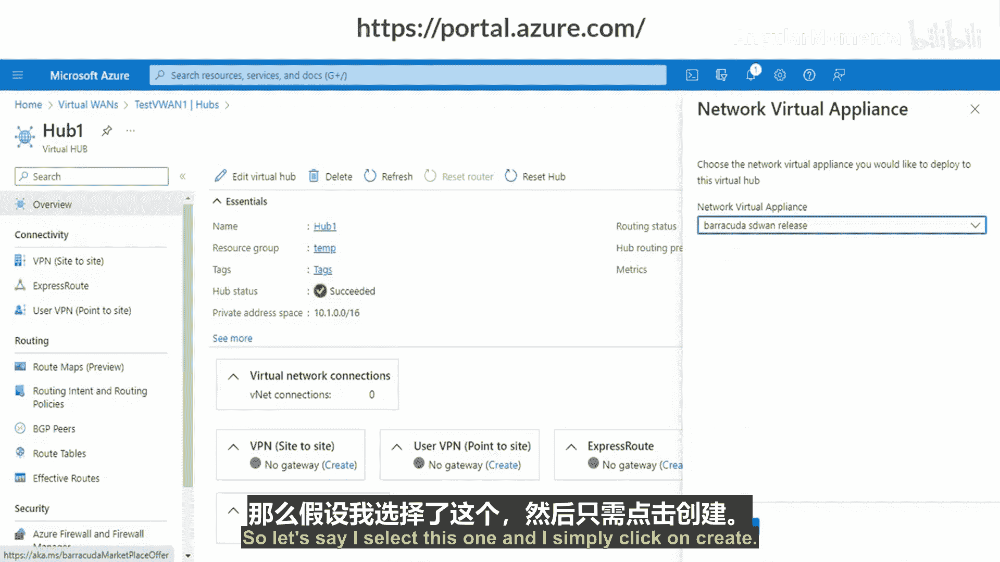
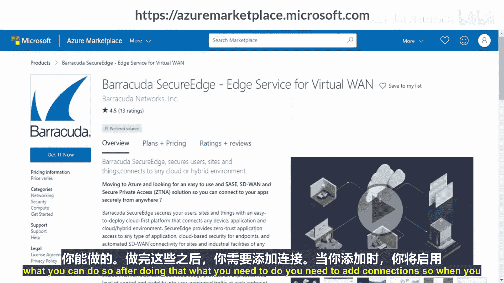
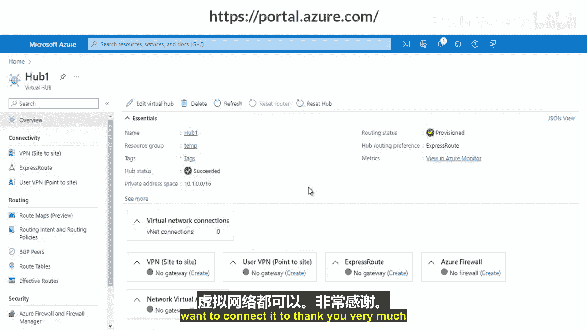

# 002：Azure虚拟中心

## 概述

在本节课中，我们将要学习Azure虚拟中心。我们将了解它的定义、核心功能、路由机制，并通过演示学习如何创建和配置一个虚拟中心。

---

## 什么是Azure虚拟中心？🤔

Azure虚拟中心是一个由微软管理的虚拟网络，它能够实现与其他资源的连接。

在上一节关于虚拟广域网（vWAN）的视频中，我们了解到，当从虚拟广域网创建虚拟中心时，在Azure门户中，虚拟中心的路由器和网关会作为其组件被自动创建。我们将在演示中看到这一点。目前，我们已了解如何创建虚拟广域网，之后我将创建一个虚拟中心，以便你理解其过程。

虚拟中心是Azure中的一个虚拟网络，它充当连接到本地网络的中心枢纽。在之前的图表中展示的“中心辐射型”技术里，虚拟网络连接就扮演着中心枢纽的角色。这就是Azure虚拟中心。

---

## 虚拟中心路由 🧭

上一节我们介绍了虚拟中心的基本概念，本节中我们来看看其核心的路由功能。虚拟中心路由主要涉及三个部分：中心路由表、连接和关联。

以下是这三个核心概念的详细说明：

*   **中心路由表**：一个虚拟中心路由表可以包含一条或多条路由。你可以向路由表中添加多条路由。路由表可以包含名称、标签、目标类型、目标前缀列表、下一跳信息等不同属性。其核心作用是定义数据包的转发路径。
*   **连接**：连接是具有路由配置的资源管理器资源。主要有四种类型：
    1.  **VPN连接**：将VPN站点连接到虚拟中心VPN网关。
    2.  **ExpressRoute连接**：将ExpressRoute线路连接到虚拟中心ExpressRoute网关。（如果你还不了解ExpressRoute，不用担心，我们后续会详细讨论。）
    3.  **点到站点配置连接**：将用户VPN连接到虚拟中心用户VPN。
    4.  **中心虚拟网络连接**：将你的虚拟网络连接到虚拟中心。
*   **关联**：每个连接都会与一个路由表相关联。将连接关联到路由表，允许流量被发送到该路由表中路由所指示的目标地址。这就是关联的作用。

---

## 如何创建虚拟中心？🛠️

在虚拟广域网视频中，我们看到了如何创建虚拟广域网。现在，让我们看看如何在其基础上创建虚拟中心。

首先，你需要创建一个虚拟广域网。请遵循上一视频的步骤。创建后，在虚拟广域网资源页面，你可以看到“连接性”选项。这里提供了多种连接选项，如中心、VPN站点、用户VPN配置、ExpressRoute线路、虚拟网络连接等，你可以根据需要创建。

以下是创建虚拟中心的步骤：

1.  在虚拟广域网资源的“连接性”部分，点击“中心”。
2.  点击“+新建中心”开始创建。由于创建过程大约需要30分钟，本演示中已预先创建好一个。
3.  在创建页面，你需要输入：
    *   **名称**：为你的虚拟中心命名。
    *   **专用地址空间**：例如 `10.1.0.0/16`。
    *   **中心容量**：选择路由基础架构单元的数量（例如2个），这决定了支持的吞吐量（如3 Gbps）。请根据需求选择。
    *   **路由偏好**：可以选择VPN或ExpressRoute等。
4.  配置完成后，点击“创建”。其他设置（如站点到站点VPN、点到站点VPN）可以保持默认或后续配置。

创建完成后，你可以在中心列表中找到它（例如 `hub1`）。进入该中心，你可以配置各种功能，例如：
*   站点到站点VPN
*   点到站点VPN
*   ExpressRoute
*   Azure防火墙或网络虚拟设备（NVA）

例如，如果你想添加一个网络虚拟设备，可以从可用列表中选择一个，然后点击“创建”。

配置完成后，你需要添加连接。在连接配置中，你可以启用“虚拟网络连接”，并选择你想要连接到此中心的特定虚拟网络。

---

## 总结

本节课中，我们一起学习了Azure虚拟中心。我们首先明确了虚拟中心作为中心连接枢纽的定义和作用。接着，我们深入探讨了其路由机制，包括**中心路由表**、**连接**（VPN、ExpressRoute、点到站点、虚拟网络）和**关联**。最后，我们通过步骤演示了如何在虚拟广域网中创建和配置一个虚拟中心，并为其添加网络连接。掌握虚拟中心是构建高效、可扩展的Azure混合网络架构的关键一步。