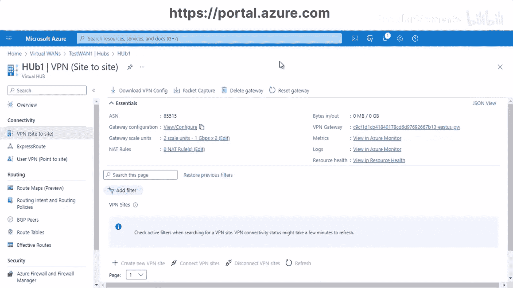

# 003：站点间广域网连接演示 第1部分

在本节课中，我们将学习如何使用Azure虚拟广域网（Virtual WAN）创建站点到站点（Site-to-Site）的连接。我们将通过实际操作演示，了解创建虚拟网络、虚拟中心、配置VPN网关以及建立连接的关键步骤。

## 概述与准备工作

上一节我们介绍了Azure虚拟广域网的基本概念，本节中我们来看看如何具体配置一个站点到站点的连接。

首先，我们需要规划并创建几个核心组件。以下是本次演示的架构图，它清晰地展示了我们将要构建的连接关系：

根据规划，我们将创建以下资源：
*   **虚拟网络（VNet）**：代表Azure侧的本地网络，地址空间为 `10.0.0.0/16`。
*   **子网（Subnet）**：位于上述虚拟网络内，地址空间为 `10.0.0.0/24`。
*   **虚拟广域网（Virtual WAN）**：作为连接的中心枢纽。
*   **虚拟中心（Virtual Hub）**：部署在虚拟广域网内，是具体处理流量的节点。
*   **本地站点（On-premises Site）**：代表用户数据中心的配置。

## 创建虚拟网络与子网

首先，我们需要创建一个虚拟网络。此步骤与课程1中的操作类似，因此不再重复演示具体点击过程。

我们创建的虚拟网络配置如下：
*   **名称**: `VNet1`
*   **地址空间**: `10.0.0.0/16`

在该虚拟网络内，我们创建一个子网：
*   **子网地址范围**: `10.0.0.0/24`

## 创建虚拟广域网与虚拟中心

接下来，我们创建虚拟广域网资源。在Azure门户中，搜索并创建“虚拟WAN”资源。

以下是创建虚拟广域网时的关键设置：
*   **资源组**: 选择与虚拟网络相同的资源组（例如 `Test-RG`）。
*   **名称**: 例如 `TestWAN`。
*   **类型**: 选择“标准”类型。

创建好虚拟广域网后，下一步是在其中创建一个虚拟中心。进入已创建的虚拟广域网资源，在“中心”部分点击“新建中心”。

以下是配置虚拟中心的核心参数：
*   **区域**: 选择部署区域。
*   **名称**: 例如 `hub1`。
*   **中心专用地址空间**: 输入 `10.0.1.0/24`。此地址空间不能与已有的虚拟网络或本地网络重叠。
*   **虚拟中心容量**: 选择2个路由单位。
*   **路由首选项**: 本例中选择“仅ExpressRoute”。

配置完成后，点击“创建”。部署虚拟中心可能需要几分钟时间。

## 配置站点到站点VPN网关

虚拟中心创建成功后，我们需要在其中启用并配置站点到站点VPN网关功能。

进入虚拟中心，找到“连接”部分下的“VPN（站点到站点）”设置。点击以创建新的VPN配置。

以下是配置VPN网关的步骤：
1.  **网关规模单位**：这决定了VPN网关的容量和可用性。例如，选择“2个规模单位”意味着部署了两个实例以实现高可用性，总计提供约1 Gbps的聚合带宽。
    *   **公式**: `1个规模单位 ≈ 500 Mbps`
2.  **路由首选项**：选择“Microsoft网络”以通过微软骨干网进行优化路由。
3.  **自治系统编号（ASN）**：这是分配给VPN网关的一个唯一标识号，用于BGP路由。可以保留默认值或自定义。

配置完成后保存设置。此操作将部署VPN网关实例。

## 创建并连接本地站点

VPN网关就绪后，我们需要定义一个代表本地数据中心的“站点”。

在虚拟中心的“VPN（站点到站点）”设置中，点击“创建新VPN站点”。

以下是定义站点所需的详细信息：
*   **站点名称**：例如 `Site1`。
*   **设备供应商**：例如 `Cisco`。
*   **专用地址空间**：输入本地数据中心的地址范围，例如 `10.0.2.0/24`。**重要提示**：此地址空间不能与Azure虚拟网络或中心地址空间重叠。
*   **链接**：至少需要配置一个链接。
    *   **链接名称**：例如 `MyLink1`。
    *   **链接速度**：例如 `50` Mbps。
    *   **提供商名称**：例如 `AT&T`。

填写完毕后，点击“创建”。站点创建完成后，状态为“未连接”。

接下来，我们需要将这个站点连接到虚拟中心。在站点列表中，找到刚创建的 `Site1`，点击“连接到中心”。

在连接配置中，可以设置高级选项：
*   **协议**：选择IKEv1或IKEv2。
*   **连接模式**：
    *   `Default`：双方均可发起连接。
    *   `Responder only`：仅本地VPN设备发起连接。
    *   `Initiator only`：仅Azure VPN网关发起连接。
*   **启用自定义流量选择器**：可根据需要配置。

使用默认设置，点击“连接”。连接成功后，站点状态将变为“已连接”。

## 将虚拟网络连接到中心

现在，我们需要将Azure侧的虚拟网络（VNet1）也连接到虚拟中心，以实现三方的互通。

进入虚拟中心，在“连接”部分找到“虚拟网络连接”，然后点击“添加连接”。

以下是连接配置：
*   **连接名称**：例如 `VNet-to-Hub`。
*   **中心**：已自动选择当前中心。
*   **虚拟网络**：从下拉列表中选择之前创建的 `VNet1`。
*   **路由配置**：可以选择关联的路由表，并设置是否传播路由。本例中使用默认值。

点击“创建”以建立连接。成功后，虚拟网络、虚拟中心和本地站点之间就建立了完整的连接路径。

## 下载配置与查看网关设置

连接建立后，为了在本地VPN设备上进行配置，需要从Azure下载VPN配置文件。

在虚拟中心的“VPN（站点到站点）”设置中，点击“下载VPN配置”。系统会生成一个XML配置文件，其中包含了连接所需的所有参数，如：
*   虚拟中心的公共IP地址。
*   预共享密钥（如果未自定义，则由Azure生成）。
*   BGP对等体IP地址等。

您需要根据此配置文件，在本地VPN设备（如Cisco路由器）上完成相应配置。

此外，您可以随时查看和修改VPN网关的设置。在“VPN（站点到站点）”的网关配置视图中，可以查看：
*   自治系统编号（ASN）。
*   公共和私有IP地址。
*   如果需要，可以在此编辑网关规模单位等设置（请注意，更改可能需要30分钟生效）。

## 总结

本节课中我们一起学习了在Azure虚拟广域网中配置站点到站点VPN连接的第一部分。我们完成了以下核心操作：
1.  创建了虚拟网络和子网作为Azure侧资源。
2.  创建了虚拟广域网和虚拟中心作为连接枢纽。
3.  在虚拟中心内配置并部署了站点到站点VPN网关。
4.  定义了一个代表本地数据中心的VPN站点，并将其连接到虚拟中心。
5.  将Azure虚拟网络也连接到虚拟中心，形成了完整的网络拓扑。
6.  学习了如何下载VPN配置以便在本地设备上完成设置。

至此，Azure侧的配置已基本完成。在下一部分，我们将重点关注如何利用下载的配置文件在本地VPN设备上进行配置，并最终测试站点到站点的连通性。