# 004：点对站连接 🔗

在本节课中，我们将学习如何在Azure中创建点对站VPN连接。点对站连接允许单个客户端计算机安全地连接到Azure虚拟网络。

---

## 创建虚拟机

首先，我们需要创建一个虚拟机作为演示环境。

以下是创建虚拟机的步骤：

1.  在Azure门户中，选择订阅和资源组。
2.  为虚拟机命名，例如 `ABC`。
3.  选择区域，例如 `美国东部`。
4.  选择Windows Server镜像。
5.  设置管理员用户名和密码。
6.  在“网络”选项卡中，选择一个现有的虚拟网络。
7.  保持其他设置（如磁盘、管理、监视）为默认值，然后创建虚拟机。

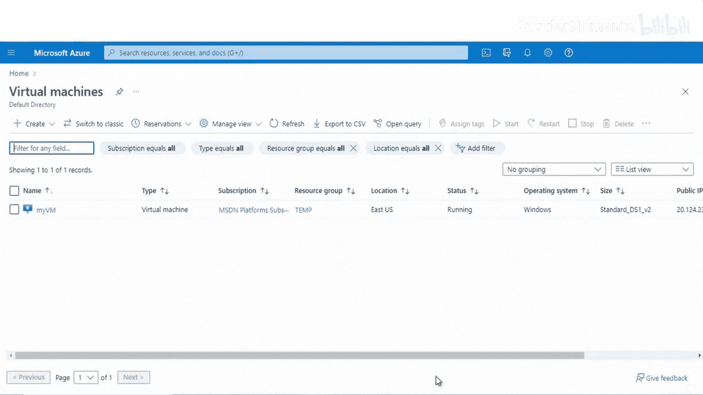

创建完成后，我们还需要配置虚拟网络。虚拟网络的地址空间为 `10.0.0.0/16`，其中包含一个子网 `10.0.2.0/24`。


---

## 连接到虚拟机并配置IIS

上一节我们创建了虚拟机，本节中我们来看看如何连接到它并进行基本配置。

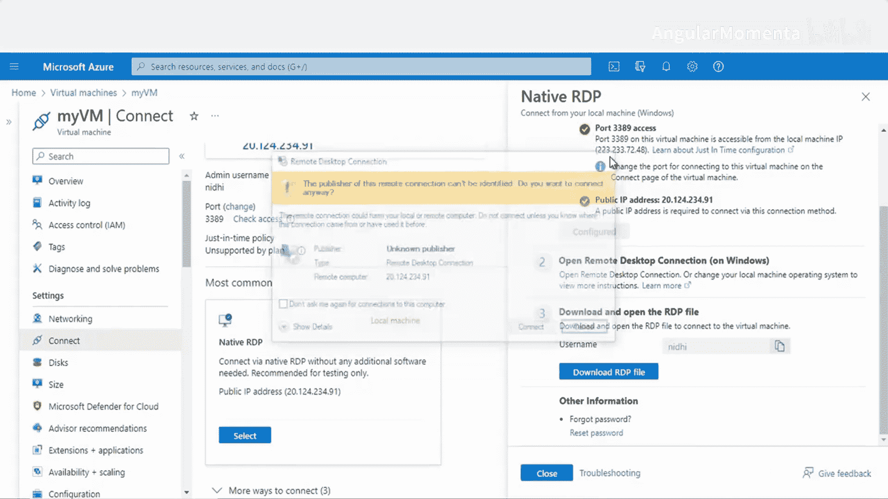

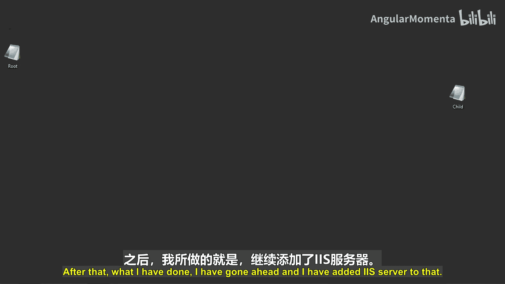

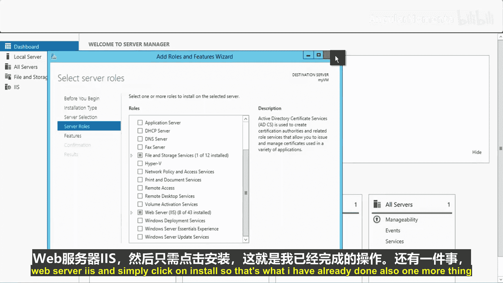

使用远程桌面协议连接到虚拟机：

1.  在Azure门户中，转到虚拟机的“概述”页面。
2.  点击“连接”按钮，选择“RDP”。
3.  下载RDP文件并使用管理员凭据登录。

连接成功后，在虚拟机上安装IIS服务器：

1.  打开“服务器管理器”。
2.  点击“添加角色和功能”。
3.  在“服务器角色”中，勾选“Web服务器(IIS)”。
4.  点击“安装”。

为了测试，我们修改了IIS的默认网页。文件路径为 `C:\inetpub\wwwroot`，我们将 `iisstart.htm` 文件的内容更改为“Welcome to EducBA Nty class”。

现在，使用虚拟机的公共IP地址访问该网页，应能看到修改后的欢迎信息。

---

## 创建虚拟广域网网关

接下来，我们需要创建虚拟广域网网关，这是点对站连接的核心组件。

以下是创建虚拟广域网网关的步骤：

1.  在Azure门户中，搜索并选择“虚拟WAN”。
2.  点击“创建”，选择相同的资源组。
3.  为虚拟WAN命名，例如 `ABC`。
4.  创建虚拟WAN。

创建虚拟WAN后，需要在其内部创建一个虚拟中心。

以下是创建虚拟中心的步骤：

1.  在虚拟WAN资源中，转到“中心”部分，点击“+新建中心”。
2.  为虚拟中心命名，例如 `hub1`。
3.  设置中心地址空间，例如 `10.0.1.0/16`。
4.  在“点对站”配置部分，选择“是”以启用。
5.  在“网关规模单位”中，选择 `1`。
6.  暂时不配置点对站设置，先创建中心。

---

## 配置虚拟网络连接和用户VPN

现在，我们需要将之前创建的虚拟网络连接到这个虚拟中心。

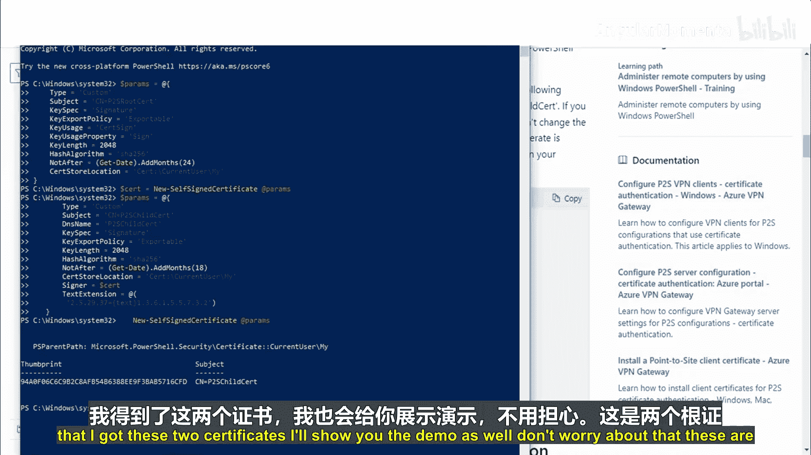

以下是创建虚拟网络连接的步骤：

1.  在虚拟中心内，转到“连接”部分，点击“+添加连接”。
2.  为连接命名，例如 `p2s`。
3.  选择目标虚拟网络（之前创建的 `VNet1`）。
4.  关联路由表选择“默认”，然后创建连接。

点对站连接需要用户VPN配置，其中包含身份验证信息。

以下是创建用户VPN配置的步骤：

1.  在虚拟WAN资源中，转到“用户VPN配置”部分，点击“创建”。
2.  为配置命名。
3.  “隧道类型”选择 `IKEv2`。
4.  “身份验证类型”选择 `Azure证书`。
5.  需要提供根证书和客户端证书的公钥数据。

---

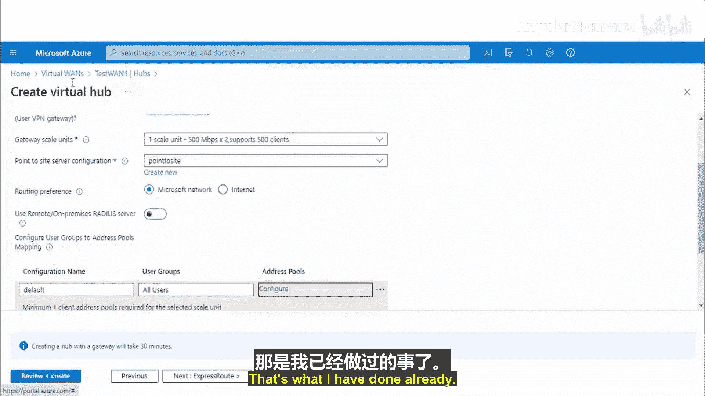


## 生成并配置证书

点对站连接使用证书进行身份验证。我们需要生成根证书和客户端证书。

使用PowerShell生成证书：

```powershell
# 生成自签名根证书
New-SelfSignedCertificate -Type Custom -KeySpec Signature -Subject "CN=P2SRootCert" -KeyExportPolicy Exportable -HashAlgorithm sha256 -KeyLength 2048 -CertStoreLocation "Cert:\CurrentUser\My" -KeyUsageProperty Sign -KeyUsage CertSign

# 从根证书生成客户端证书
New-SelfSignedCertificate -Type Custom -DnsName P2SChildCert -KeySpec Signature -Subject "CN=P2SChildCert" -KeyExportPolicy Exportable -HashAlgorithm sha256 -KeyLength 2048 -CertStoreLocation "Cert:\CurrentUser\My" -Signer "Cert:\CurrentUser\My\<上一步生成的根证书指纹>" -TextExtension @("2.5.29.37={text}1.3.6.1.5.5.7.3.2")
```

生成证书后，需要导出其公钥数据：

1.  打开“运行”对话框，输入 `certmgr.msc`，打开证书管理器。
2.  找到生成的根证书（`P2SRootCert`）和客户端证书（`P2SChildCert`）。
3.  右键点击每个证书，选择“所有任务” -> “导出”。
4.  在导出向导中，选择“不，不导出私钥”，格式选择“Base-64 编码 X.509 (.CER)”。
5.  将证书保存到本地。
6.  用记事本打开导出的 `.cer` 文件，复制其全部内容。

回到Azure门户的用户VPN配置创建页面：

1.  将复制的根证书内容粘贴到“根证书”字段。
2.  将复制的客户端证书内容粘贴到“客户端证书”字段。
3.  完成配置创建。

---

## 完成点对站网关配置并测试连接

现在，我们需要在虚拟中心内完成点对站网关的具体配置。

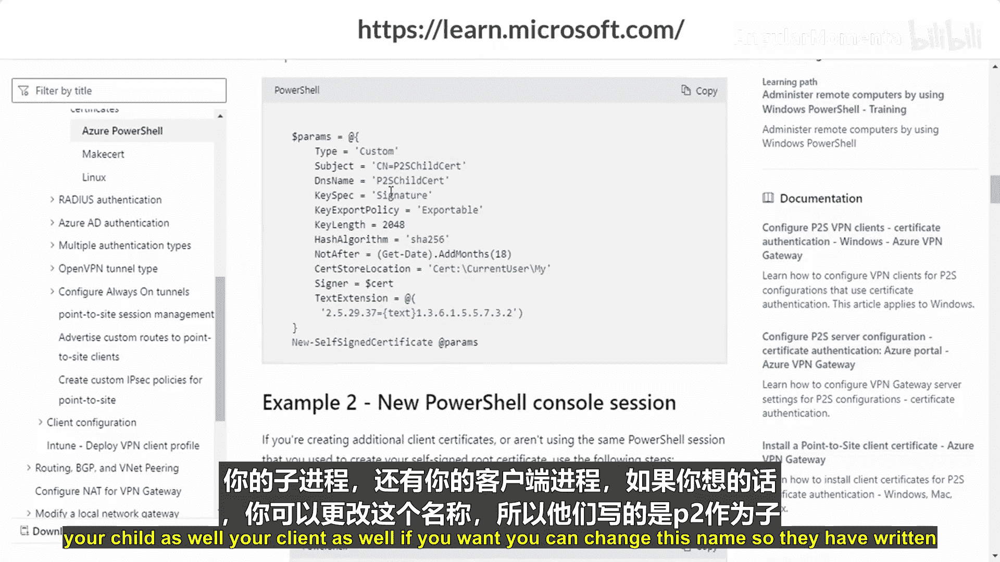

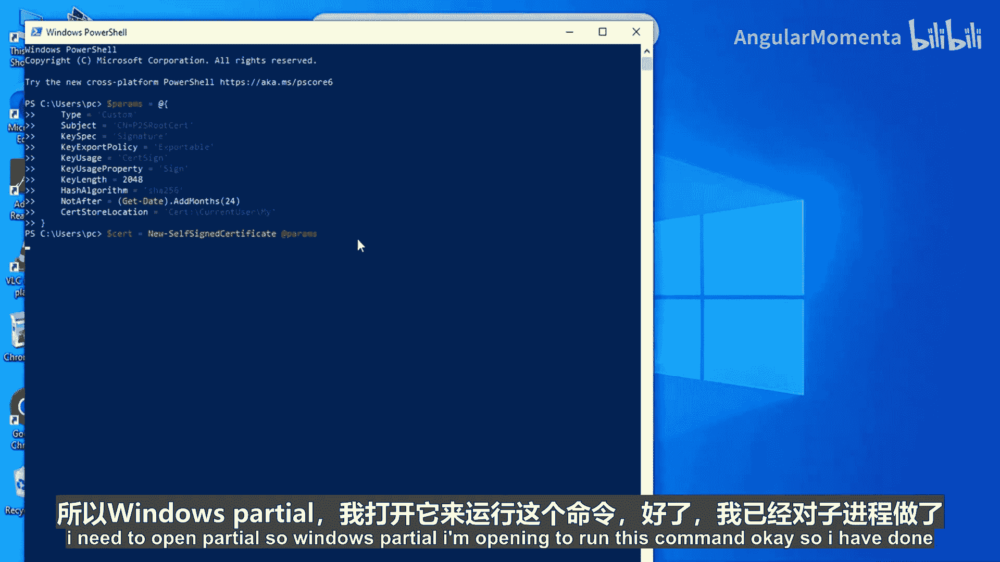

以下是配置步骤：

1.  导航到已创建的虚拟中心 `hub1`。
2.  转到“点对站配置”部分。
3.  在“网关规模单位”中，选择 `1`。
4.  在“点对站配置”下拉列表中，选择上一步创建的用户VPN配置。
5.  配置“地址池”，这是分配给VPN客户端的IP地址范围，例如 `192.168.0.0/24`。
6.  保存配置。此过程可能需要30分钟来完成部署。

配置完成后，进行连接测试。首先，移除测试虚拟机的公共IP地址，以强制通过VPN访问：

1.  在虚拟机资源中，转到“网络” -> “网络接口” -> “IP配置”。
2.  点击主IP配置，将“公共IP地址”设置为“取消关联”并保存。

现在，从本地计算机连接到点对站VPN：

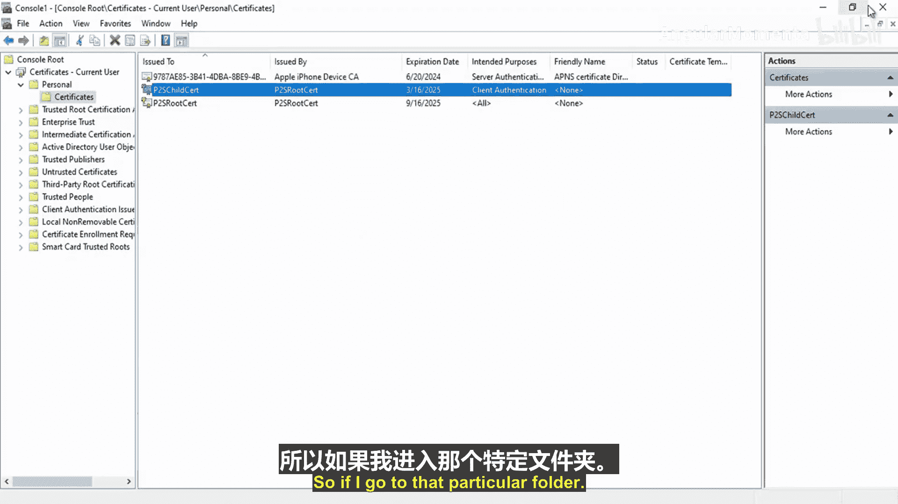

1.  在虚拟WAN的“用户VPN配置”页面，找到已创建的配置。
2.  点击“下载用户VPN配置”。选择身份验证类型为“Azure证书”，生成并下载配置文件。
3.  下载的压缩包中包含Windows客户端的安装程序（`Amd64` 文件夹下的 `VpnClientSetupAmd64.exe`）。运行此程序以安装VPN客户端。
4.  安装后，在Windows设置中打开“VPN”设置，可以看到一个名为 `TestWAN` 的点对站连接。
5.  点击“连接”。

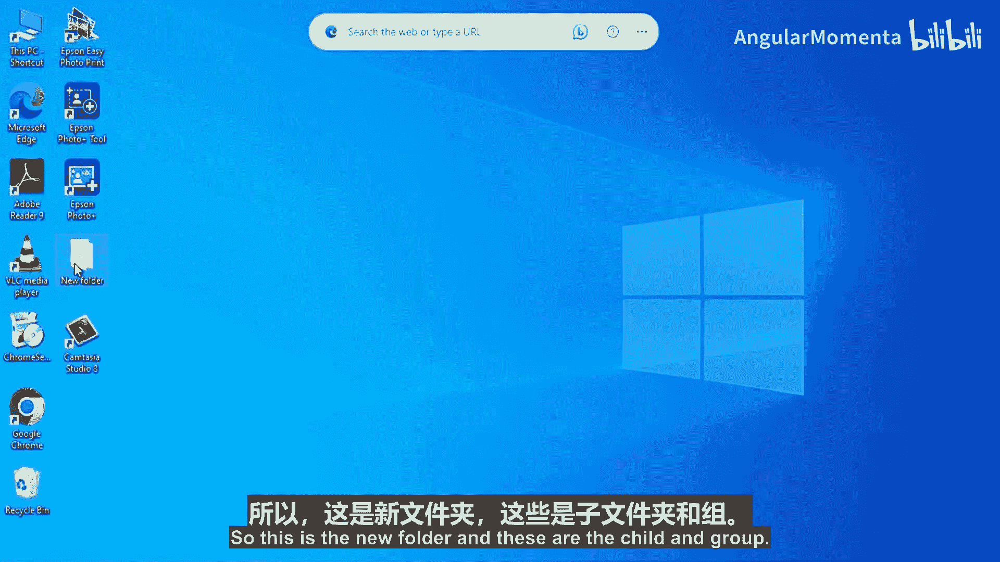

连接成功后，即使虚拟机没有公共IP，我们也可以使用其私有IP地址（例如 `10.0.2.5`）在浏览器中访问，并看到IIS服务器上“Welcome to EducBA Nty class”的页面。这证明点对站VPN连接已成功建立。

---

## 总结

本节课中我们一起学习了如何在Azure中建立点对站VPN连接。我们逐步完成了以下核心任务：

1.  **准备环境**：创建了Windows虚拟机并配置了IIS服务器。
2.  **搭建骨干**：创建了虚拟WAN和虚拟中心。
3.  **建立连接**：将虚拟网络连接到虚拟中心，并创建了用户VPN配置。
4.  **配置安全**：生成并配置了用于身份验证的证书。
5.  **最终部署**：在虚拟中心内完成了点对站网关的配置。
6.  **测试验证**：从本地客户端成功连接到VPN，并通过私有IP访问了Azure中的资源。

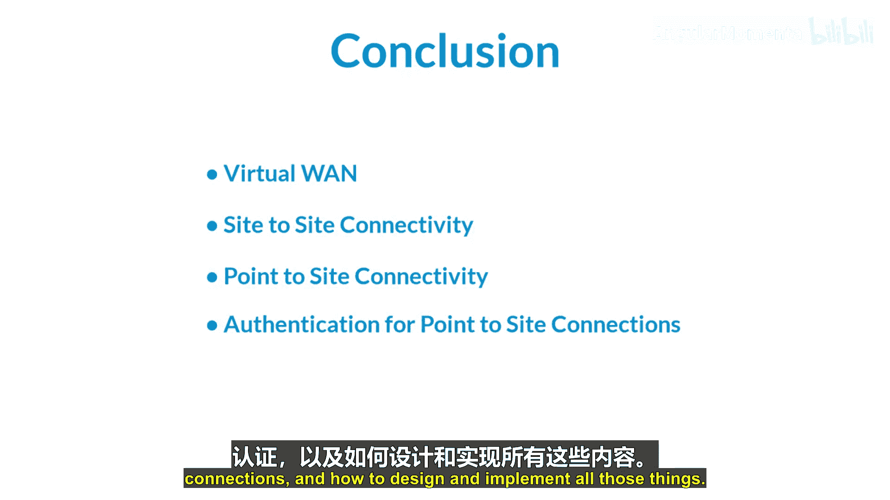

通过点对站连接，可以实现远程用户安全、灵活地接入Azure虚拟网络，是混合网络架构中的重要组成部分。