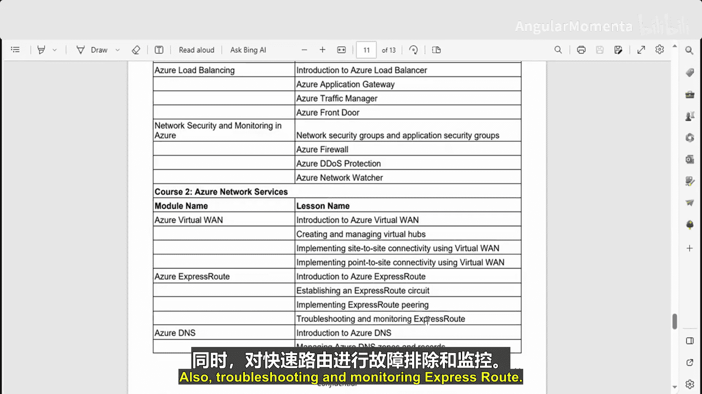
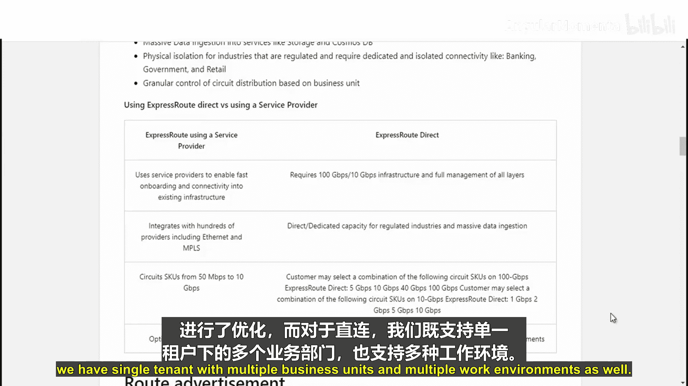

# 005：Azure ExpressRoute 🚀

在本模块中，我们将学习 Azure ExpressRoute。ExpressRoute 是一项服务，用于在 Azure 数据中心与您本地或托管环境中的基础设施之间建立私有连接。

我们将探讨如何利用 Azure ExpressRoute 在本地网络与 Azure 之间建立私有、专用的连接。我们还将学习如何规划、配置和排查 ExpressRoute 线路问题，以及如何实施 ExpressRoute 对等互连以优化网络性能。

以下是本模块将涵盖的主题：
*   ExpressRoute 简介
*   建立 ExpressRoute 线路
*   实施 ExpressRoute 对等互连
*   ExpressRoute 的故障排除与监控

---

## 什么是 Azure ExpressRoute？🔗

现在，让我们首先理解什么是 Azure ExpressRoute。

Azure ExpressRoute 用于在 Azure 数据中心与您本地环境的基础设施之间创建私有连接。ExpressRoute 连接不经过公共互联网，与典型的互联网连接相比，它提供了更高的可靠性、更快的速度和更低的延迟。

本质上，Microsoft 拥有自己的专线或租用线路，您的流量将仅通过这些私有线路传输，而不会进入公共互联网，这就是使用 Azure ExpressRoute 的优势。

Azure ExpressRoute 提供第 3 层连接，通过连接提供商在您的本地网络与 Microsoft 云之间建立连接。您的连接选项可以是：
*   点对点以太网连接
*   任意对任意网络
*   通过互联网交换中心建立的虚拟交叉连接

此外，每个对等互连位置都内置了冗余以实现高可用性，并且您可以从任何地理位置访问 Microsoft 云服务。

---

## ExpressRoute 连接模型 🧩

上一节我们介绍了 ExpressRoute 的基本概念，本节中我们来看看其两种主要的连接模型。

Azure ExpressRoute 主要有两种连接模型：**服务提供商模型**和**直接模型**。

*   **服务提供商模型**：您可以通过云交换中心或托管设施连接到 Microsoft Azure。在此模型下，您可以建立：
    *   到 ExpressRoute 的点对点以太网连接。
    *   任意对任意连接（例如，您的广域网直接连接到 Microsoft Azure）。
*   **直接模型**：您通过 ExpressRoute 站点，建立到 Microsoft Azure 的 ExpressRoute 直接连接。

---

## ExpressRoute 的用例 💡

了解了连接模型后，接下来我们看看 ExpressRoute 的一些典型应用场景。

首先，它提供到 Azure 服务的**更快、更可靠的连接**。公共互联网依赖于许多环境因素，而使用 ExpressRoute，您可以在 Azure 数据中心与本地基础设施之间建立私有连接，从而获得更快、更可靠的连接。

第二个用例是**存储、备份和恢复**。备份和恢复对于企业的业务连续性以及从服务中断中恢复至关重要。ExpressRoute 提供高达 200 Gbps 带宽的快速可靠 Azure 连接，这使其非常适合定期数据迁移、复制等场景。

此外，它还能**扩展您的数据中心能力**。ExpressRoute 可用于连接现有数据中心并为其增加计算和存储容量。它提供可预测、可靠且高吞吐量的连接，使企业能够构建横跨本地基础设施和 Azure 的应用程序，而无需牺牲隐私或性能。

---

## 服务提供商模型与直接模型对比 ⚖️

在之前的视频中，我们讨论了 ExpressRoute 直接模型和使用服务提供商模型。现在让我们看看两者之间的一些区别。

以下是两种模型的主要对比：

*   **使用服务提供商的 ExpressRoute**：
    *   利用服务提供商实现快速接入并连接到现有基础设施。
    *   可与包括互联网交换中心在内的数百家提供商集成。
    *   支持的 SKU 带宽范围从 50 Mbps 到 10 Gbps。
    *   主要针对单租户场景进行优化。
*   **ExpressRoute Direct**：
    *   需要 100 Gbps 或 1 Gbps 基础设施，并需管理所有层级。
    *   为受监管行业和海量数据场景提供直接或专用容量。
    *   提供不同的带宽选项，如 5 Gbps、10 Gbps、40 Gbps 等。客户还可以组合多个线路（例如，10 Gbps ExpressRoute Direct 线路与 1 Gbps、2 Gbps、5 Gbps、10 Gbps 线路组合）。
    *   支持单租户、多业务单元以及多核心租户场景。

---

## 总结 📝

在本节课中，我们一起学习了 Azure ExpressRoute 的核心知识。我们了解了 ExpressRoute 是一种建立 Azure 与本地环境之间私有连接的服务，它不经过公共互联网，从而提供更优的性能和可靠性。

我们探讨了其两种主要的连接模型：服务提供商模型和直接模型，并分析了它们各自的适用场景与特点。此外，我们还列举了 ExpressRoute 在实现高速可靠连接、数据备份恢复以及扩展数据中心能力等方面的关键用例。

通过本模块的学习，您应该对 Azure ExpressRoute 的基本概念、价值和应用有了初步的认识，为后续深入学习其配置与管理打下了基础。