# 006：建立ExpressRoute线路 第1部分

在本节课中，我们将学习如何在Azure门户中创建ExpressRoute线路。ExpressRoute是一种服务，允许你在本地网络与Microsoft云之间建立私有连接。我们将逐步完成创建过程，并了解关键配置选项。

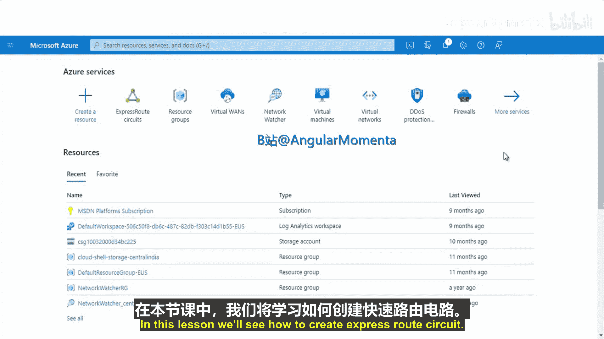

## 访问门户并开始创建

首先，直接访问你的Azure门户，并在搜索栏中输入“ExpressRoute线路”。

点击“创建ExpressRoute线路”按钮以开始创建过程。

## 配置基本信息

以下是创建ExpressRoute线路时需要配置的基本信息。

*   **订阅**：选择你的Azure订阅。
*   **资源组**：选择或创建一个新的资源组来管理此线路。例如，可以创建一个名为“test-ER-circuit-rg”的新资源组。
*   **区域**：选择线路的部署区域。
*   **名称**：为线路指定一个名称，例如“testERcircuit”。

## 配置连接类型与提供商

上一节我们配置了基本信息，本节中我们来看看连接类型和提供商的选择。

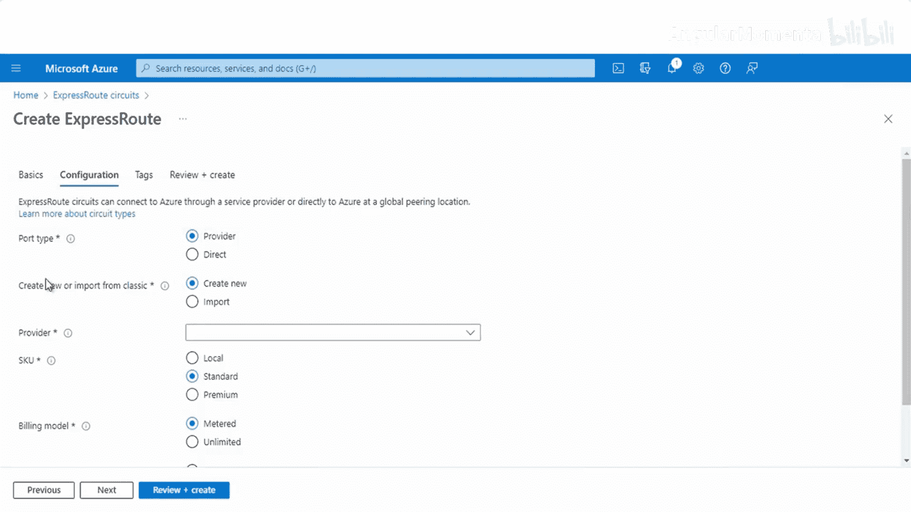

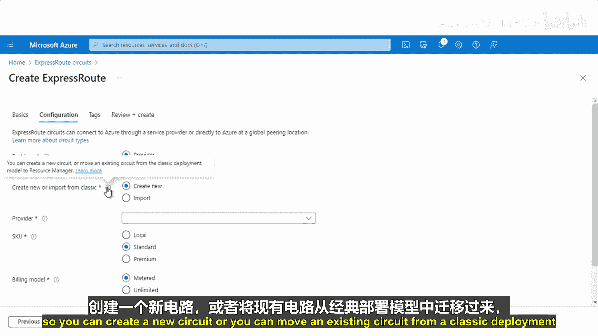

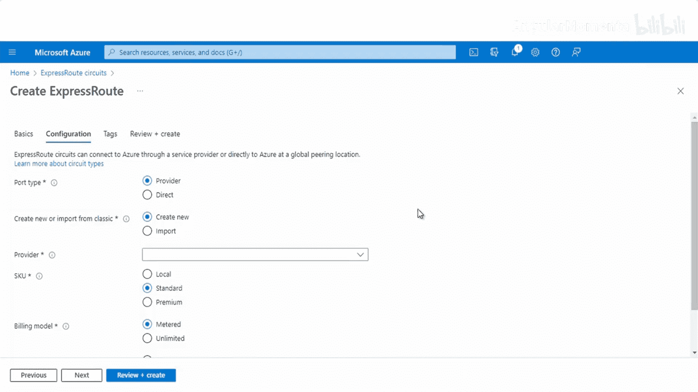

在“配置”部分，有两种连接类型可供选择：**提供商** 和 **直接**。

*   如果你需要通过服务提供商来访问Microsoft网络，请选择 **提供商**。
*   如果你拥有ExpressRoute直接资源，则可以选择 **直接**。

本教程将选择“提供商”类型。此外，你可以选择创建新线路，或从经典部署模型迁移现有线路。我们选择“新建”。

接下来，从列表中选择一个服务提供商（例如Equinix）和对应的对等互连位置（例如Seattle）。

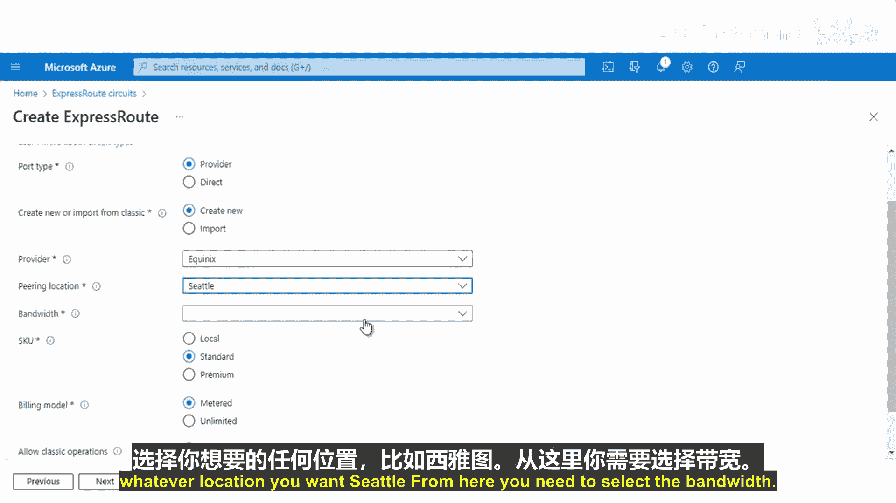

## 选择带宽与SKU

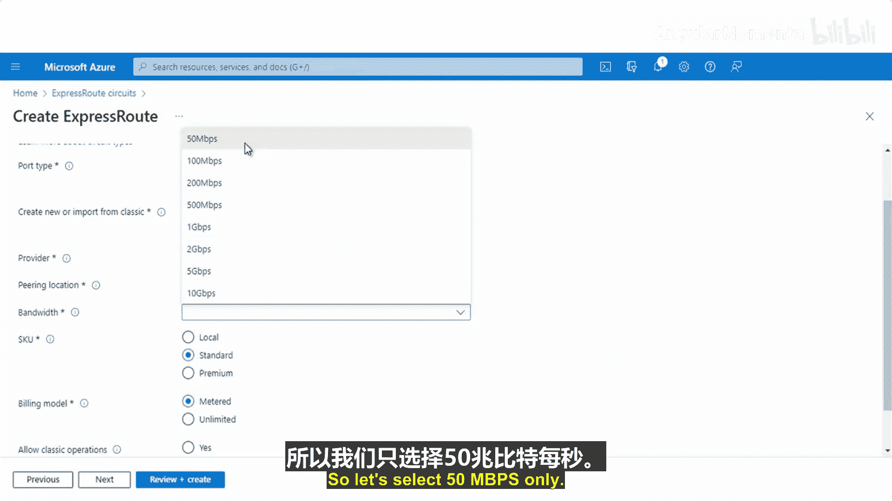

选择了提供商后，我们需要确定线路的容量和层级。

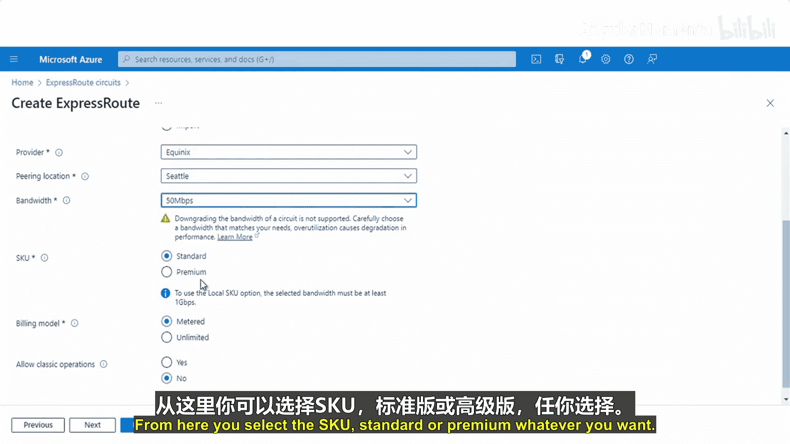

*   **带宽**：从下拉列表中选择所需的带宽，例如50 Mbps或100 Mbps。我们选择50 Mbps。
*   **SKU**：选择线路的层级，可以是**标准**或**高级**。我们选择“高级”SKU。

## 设置计费模型

配置好性能参数后，我们来设置计费方式。

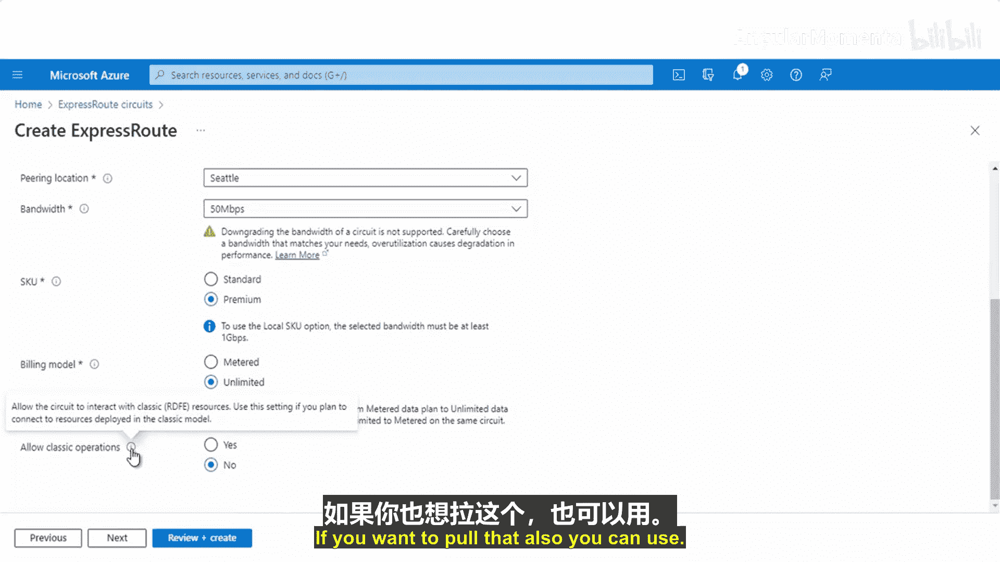

在“计费模型”部分，有以下选项：

*   **无限数据**：入站数据传输免费，出站数据传输按固定月费提供无限流量。
*   **计量数据**：出站数据传输按使用量计费。

我们选择“无限数据”模型。此外，如果需要，可以勾选“允许经典操作”选项。

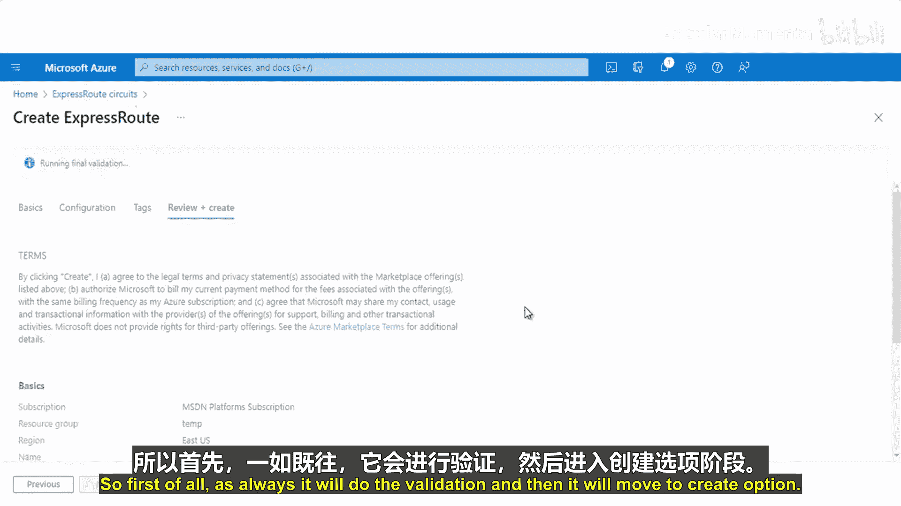

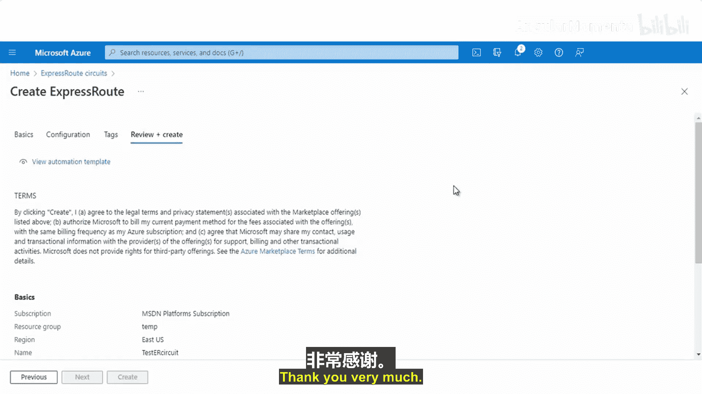

## 审阅并创建线路

完成所有配置后，点击“下一步：审阅 + 创建”。

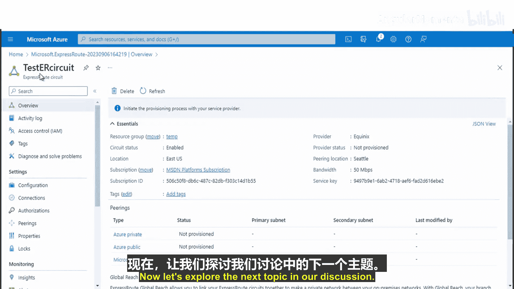

Azure会首先验证所有配置。验证通过后，点击“创建”按钮。线路的创建需要一些时间来完成。

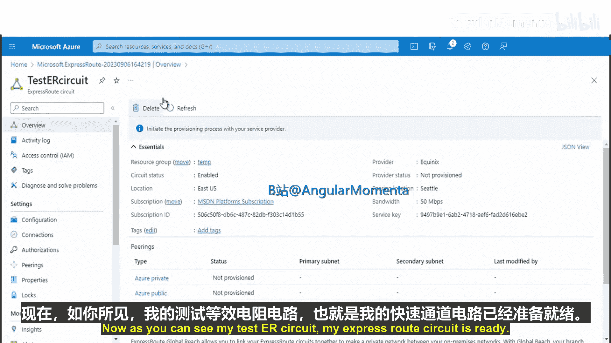

## 查看已创建的线路属性

现在，我们的ExpressRoute线路已经创建完成。让我们查看一下它的属性。

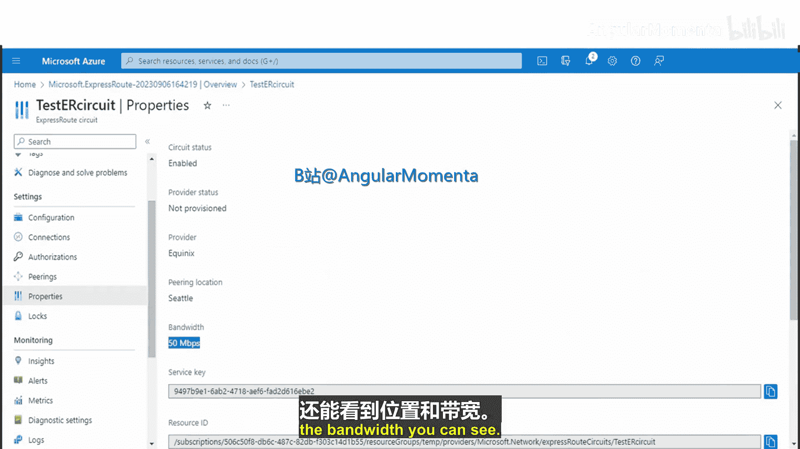

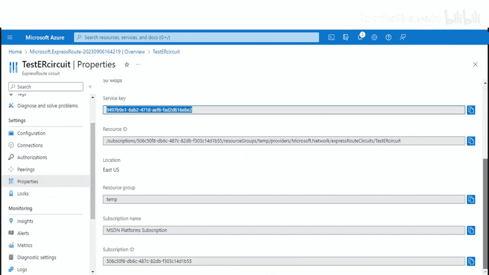

在资源列表中点击你创建的线路（例如“testERcircuit”），然后进入“属性”部分。在这里，你可以看到：

*   **状态**：显示为“已启用”。
*   **位置**：显示你选择的对等互连位置。
*   **带宽**：显示你选择的带宽值。
*   **服务密钥**：这是线路的唯一标识符，在配置提供商端连接时需要用到。

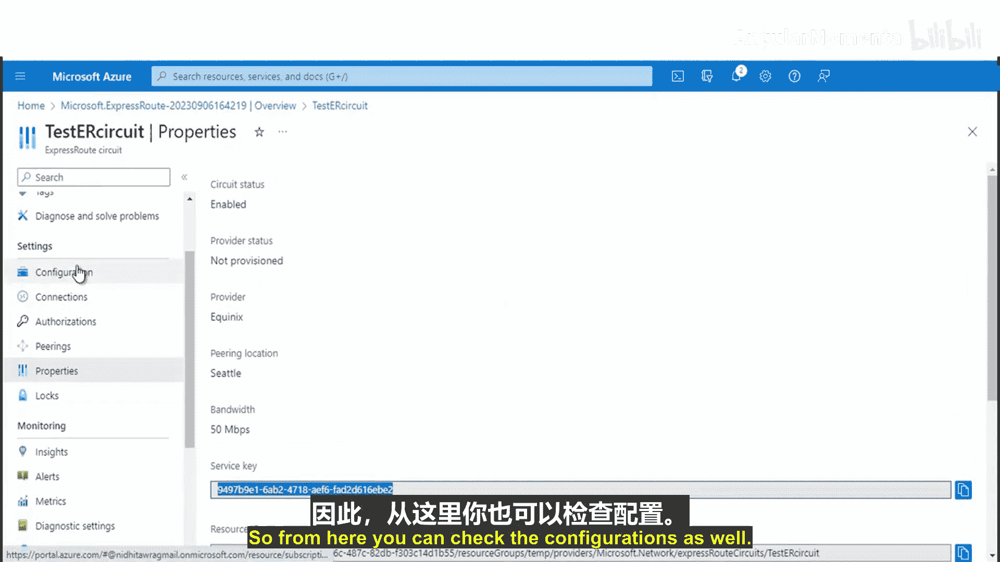

你还可以在“配置”部分查看或修改SKU等设置，并在“连接”部分管理与此线路关联的虚拟网络连接。

## 总结

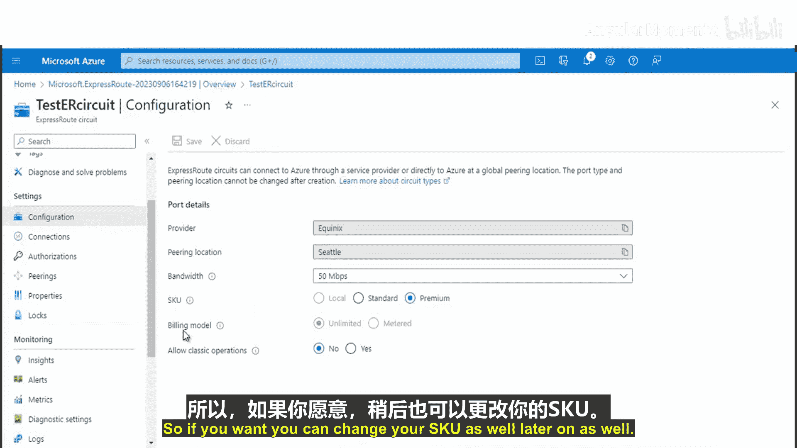

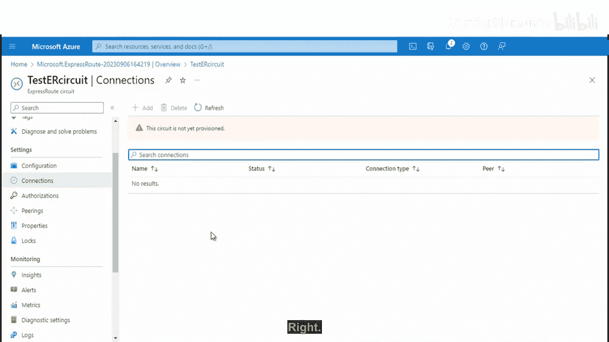

本节课中，我们一起学习了在Azure门户中创建ExpressRoute线路的完整步骤。我们了解了如何配置基本信息、选择连接类型和提供商、设置带宽与SKU、选择计费模型，并最终创建和查看了线路的属性。这是建立从本地网络到Azure私有连接的第一步。